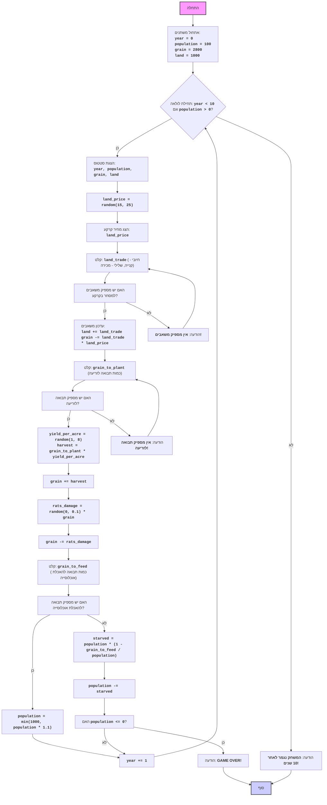

## ניתוח קוד המשחק "חמורבי"

### 1. <algorithm>

**תיאור האלגוריתם:**
הקוד מיישם משחק טקסטואלי בשם "חמורבי", בו השחקן מנהל עיר קדומה. המשחק מתנהל במשך 10 שנים או עד שהאוכלוסייה מתה מרעב. השחקן מקבל החלטות בנוגע לרכישה/מכירה של קרקע, זריעת תבואה והאכלת האוכלוסייה.

**תרשים זרימה:**

1.  **אתחול משתנים:**
    *   `year = 0` (שנה נוכחית)
    *   `population = 100` (אוכלוסייה התחלתית)
    *   `grain = 2800` (כמות התבואה ההתחלתית)
    *   `land = 1000` (כמות הקרקע ההתחלתית)
    *   דוגמא: `year` = 0, `population` = 100, `grain` = 2800, `land` = 1000.

2.  **לולאת משחק ראשית:**
    *   הלולאה נמשכת כל עוד `year < 10` וגם `population > 0`.
    *   דוגמא: כל עוד השנה היא מתחת 10 והאוכלוסייה גדולה מ-0.

3.  **הצגת סטטוס המשחק:**
    *   הדפסה של השנה, האוכלוסייה, כמות התבואה וכמות הקרקע.
    *   דוגמא: "שנה 1, אוכלוסייה: 100, תבואה: 2800, קרקע: 1000".

4.  **חישוב מחיר הקרקע:**
    *   מחיר הקרקע נקבע באקראי בין 15 ל-25 יחידות תבואה לאקר.
    *   דוגמא: `land_price` = 20.

5.  **קלט למסחר בקרקע:**
    *   המשתמש מתבקש להזין כמה קרקע הוא רוצה לקנות (+) או למכור (-).
    *   דוגמא: המשתמש מזין 100 (קנייה של 100 אקר), או -50 (מכירה של 50 אקר).

6.  **בדיקת מספיקות משאבים לרכישת/מכירת קרקע:**
    *   אם קונים קרקע, נבדק אם יש מספיק תבואה.
    *   אם מוכרים קרקע, נבדק אם יש מספיק קרקע.
    *   אם אין מספיק משאבים, מבקשים קלט חדש מהמשתמש.
    *   דוגמא: אם המשתמש רוצה לקנות 100 אקר במחיר 20, נבדק אם יש לפחות 2000 תבואה.

7.  **עדכון קרקע ותבואה:**
    *   `land` += `land_trade` (כמות הקרקע משתנה).
    *   `grain` -= `land_trade` * `land_price` (כמות התבואה משתנה).
    *   דוגמא: אם המשתמש קנה 100 אקר קרקע במחיר 20, אז `land` = 1100 ו-`grain` = 800.

8.  **קלט לזריעת תבואה:**
    *   המשתמש מתבקש להזין כמה תבואה הוא רוצה לזרוע.
    *   דוגמא: המשתמש מזין 500.

9.  **בדיקת מספיקות תבואה לזריעה:**
    *   נבדק אם יש מספיק תבואה לזריעה.
    *   אם אין מספיק תבואה, מבקשים קלט חדש מהמשתמש.

10. **חישוב יבול:**
    *   יבול ליחידת קרקע נקבע באקראי בין 1 ל-8 יחידות.
    *   דוגמא: `yield_per_acre` = 5.
    *   `harvest` = `grain_to_plant` * `yield_per_acre` (היבול הכולל).

11. **עדכון כמות תבואה:**
    *   `grain` += `harvest` (כמות התבואה גדלה).

12. **חישוב נזק ממכרסמים:**
    *   נזק ממכרסמים מחושב כ-0 עד 10% מהתבואה הכוללת באקראי.
    *   דוגמא: `rats_damage` = 100.

13. **עדכון כמות תבואה:**
    *   `grain` -= `rats_damage` (כמות התבואה פוחתת).

14. **קלט להאכלת האוכלוסייה:**
    *   המשתמש מתבקש להזין כמה תבואה הוא רוצה לתת לאוכלוסייה.
    *   דוגמא: המשתמש מזין 300.

15. **בדיקת מספיקות תבואה להאכלת האוכלוסייה:**
    *   אם יש מספיק תבואה, האוכלוסייה גדלה ב-10%, אבל לא יותר מ-1000.
    *   אם אין מספיק תבואה, חלק מהאוכלוסייה מת מרעב.
    *   דוגמא: אם האוכלוסייה היא 100 ויש מספיק תבואה, היא תגדל ל-110.

16. **עדכון אוכלוסייה ותבואה:**
    *   אם היה מספיק אוכל, האוכלוסייה גדלה, וכמות התבואה פוחתת בהתאם.
    *   אם לא היה מספיק אוכל, האוכלוסייה מצטמצמת, וכמות התבואה פוחתת בהתאם.

17. **בדיקת אוכלוסייה:**
    *   אם האוכלוסייה שווה ל-0, המשחק נגמר.
    *    דוגמא: אם `population` == 0 - המשחק נגמר בהפסד.

18. **עדכון שנה:**
    *   `year` += 1 (השנה גדלה ב-1).

19. **בדיקת סיום המשחק:**
    *   אם השנה היא 10, המשחק נגמר בניצחון.

### 2. <mermaid>

**ניתוח תלויות:**

התרשים `mermaid` אינו כולל תלויות חיצוניות, משום שהוא מתאר את לוגיקת הזרימה של הקוד עצמו, ללא תלות בספריות חיצוניות.

**הסבר שמות משתנים:**
*   **`Start`**: נקודת ההתחלה של המשחק.
*   **`InitializeVariables`**: אתחול של משתנים התחלתיים.
*   **`LoopStart`**: תחילת הלולאה הראשית של המשחק (כל עוד לא עברו 10 שנים והאוכלוסיה גדולה מ0).
*   **`DisplayStatus`**: הצגת הנתונים הנוכחיים של המשחק.
*   **`CalculateLandPrice`**: חישוב מחיר הקרקע באקראי.
*   **`DisplayLandPrice`**: הצגת מחיר הקרקע.
*   **`InputLandTrade`**: קליטת קלט מהמשתמש לגבי קנייה/מכירה של קרקע.
*   **`CheckLandTrade`**: בדיקה אם יש מספיק משאבים למסחר בקרקע.
*   **`UpdateLandAndGrain`**: עדכון כמויות הקרקע והתבואה לאחר מסחר בקרקע.
*   **`InputGrainToPlant`**: קליטת קלט מהמשתמש לגבי כמות התבואה לזריעה.
*    **`CheckGrainToPlant`**: בדיקה האם יש מספיק תבואה לזריעה.
*   **`CalculateHarvest`**: חישוב יבול התבואה.
*   **`UpdateGrainWithHarvest`**: עדכון כמות התבואה לאחר הקציר.
*   **`CalculateRatsDamage`**: חישוב הנזק מהחולדות.
*   **`UpdateGrainWithRats`**: עדכון כמות התבואה לאחר הנזק מהחולדות.
*   **`InputGrainToFeed`**: קליטת קלט מהמשתמש לגבי כמות התבואה להאכלת האוכלוסייה.
*   **`CheckGrainToFeed`**: בדיקה האם יש מספיק תבואה להאכלת האוכלוסייה.
*   **`UpdatePopulation`**: עדכון כמות האוכלוסייה לאחר האכלה תקינה.
*   **`IncreaseYear`**: הגדלת שנת המשחק.
*   **`CalculateStarvation`**: חישוב מספר האנשים שמתו מרעב עקב חוסר תבואה.
*   **`UpdatePopulationWithStarvation`**: עדכון כמות האוכלוסייה לאחר המוות מרעב.
*   **`CheckPopulation`**: בדיקה האם כמות האוכלוסייה היא 0 או פחות.
*   **`OutputGameOver`**: הדפסת הודעת סיום משחק בעקבות מוות כל האוכלוסייה.
*   **`OutputErrorLand`**: הדפסת הודעת שגיאה בעקבות חוסר משאבים למסחר בקרקע.
*   **`OutputErrorPlant`**: הדפסת הודעת שגיאה בעקבות חוסר תבואה לזריעה.
*   **`OutputGameEnd`**: הדפסת הודעה בעקבות סיום המשחק עקב הגעת שנה 10.
*   **`End`**: נקודת הסיום של המשחק.

### 3. <explanation>

**ייבוא (Imports):**

*   `import random`: מייבא את המודול `random` המשמש ליצירת מספרים אקראיים עבור קביעת מחיר הקרקע, היבול, נזק ממכרסמים וכו'.

**משתנים (Variables):**

*   `year` (`int`):  מייצג את השנה הנוכחית במשחק, מתחיל מ-0 וגדל בכל שנה.
*   `population` (`int`):  מייצג את מספר האנשים בעיר, מתחיל ב-100.
*   `grain` (`int`):  מייצג את כמות התבואה (בבושלים), מתחיל ב-2800.
*   `land` (`int`):  מייצג את כמות הקרקע (באיקרים), מתחיל ב-1000.
*   `land_price` (`int`):  מייצג את מחיר הקרקע, משתנה בין 15 ל-25 בכל שנה באופן אקראי.
*   `land_trade` (`int`):  מייצג את כמות הקרקע שהשחקן רוצה לקנות או למכור. ערך חיובי לקניה ושלילי למכירה.
*   `grain_to_plant` (`int`):  מייצג את כמות התבואה שהשחקן רוצה לזרוע.
*   `yield_per_acre` (`int`):  מייצג את כמות התבואה שהתקבלה מכל אקר, משתנה בין 1 ל-8 באופן אקראי.
*   `harvest` (`int`):  מייצג את סך היבול שהתקבל לאחר הזריעה.
*   `rats_damage` (`int`):  מייצג את כמות התבואה שאבדה בגלל חולדות, בין 0 ל-10% מהתבואה הקיימת.
*   `grain_to_feed` (`int`):  מייצג את כמות התבואה שהשחקן רוצה להשתמש בה להאכלת האוכלוסייה.
*   `starved` (`int`): מייצג את מספר האנשים שמתו מרעב.

**פונקציות (Functions):**

*   `random.randint(a, b)`: מחזירה מספר אקראי שלם בין `a` ל-`b` (כולל).
*   `random.random()`: מחזירה מספר אקראי בין 0 ל-1 (לא כולל 1).
*   `input(prompt)`: מחזירה את הקלט שהזין המשתמש כטקסט.
*   `int(x)`: ממירה את `x` למספר שלם.
*   `min(x, y)`: מחזירה את המספר הקטן ביותר בין `x` ל-`y`.

**בעיות אפשריות ושיפורים:**

*   **ממשק משתמש:** המשחק משתמש בקלט טקסטואלי פשוט. ניתן לשפר את חווית המשתמש על ידי שימוש בממשק משתמש גרפי.
*   **איזון משחק:** ניתן לאזן טוב יותר את המשחק על ידי שינוי הערכים האקראיים והקבועים כך שהמשחק יהיה יותר מאתגר ומעניין.
*   **תנאי ניצחון נוספים:** ניתן להוסיף תנאי ניצחון נוספים מלבד ההגעה לשנה ה-10, כמו למשל הגעה לאוכלוסייה של 1000 אנשים.
*   **יותר אירועים אקראיים:** ניתן להוסיף אירועים נוספים המשפיעים על המשחק, כמו מלחמה, מגפה, או אסונות טבע.

**שרשרת קשרים עם חלקים אחרים בפרויקט:**
במקרה הנוכחי, הקוד עומד בפני עצמו ואינו מקיים קשר ישיר עם חלקים אחרים בפרויקט, מלבד השימוש בספריות סטנדרטיות של פייתון כמו `random`. אם הקוד היה חלק ממערכת גדולה יותר, היו נדרשים מנגנונים לתקשורת בין קבצים או מודולים שונים.