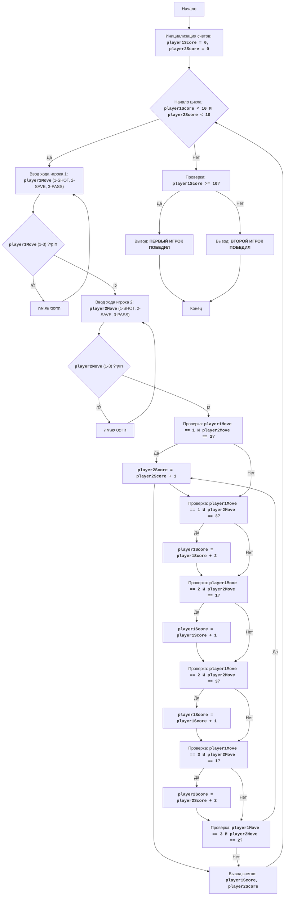

## <algorithm>

הקוד מדמה משחק הוקי בין שני שחקנים, כאשר כל שחקן מבצע מהלך בכל סיבוב. המשחק ממשיך עד שאחד השחקנים צובר 10 נקודות.

**תרשים זרימה של הקוד:**

1.  **התחלה:**
    *   מאתחלים את סכום הנקודות של כל שחקן ל-0: `player1Score = 0`, `player2Score = 0`.
    *   *דוגמה*: בהתחלה, שני השחקנים עם 0 נקודות.

2.  **לולאת משחק (while):**
    *   הלולאה ממשיכה כל עוד סכום הנקודות של שחקן 1 קטן מ-10 וסכום הנקודות של שחקן 2 קטן מ-10.
        *   *דוגמה*: הלולאה תמשיך אם `player1Score = 5` וגם `player2Score = 7`.

3.  **קלט משחקן 1:**
    *   מבקשים מהשחקן הראשון להזין מהלך (1=זריקה, 2=הגנה, 3=מסירה).
    *   קולטים את הקלט לתוך המשתנה `player1Move`.
        *   *דוגמה*: שחקן 1 מזין `2`.
    *   בודקים אם הקלט חוקי (1, 2 או 3). אם לא, מדפיסים הודעת שגיאה וממשיכים לסיבוב הבא.
        *   *דוגמה*: שחקן 1 מזין `5`, הודעת שגיאה תוצג והסיבוב יתחיל מחדש.
    *   במקרה של קלט לא חוקי (למשל, מחרוזת), לוכדים את השגיאה ומדפיסים הודעת שגיאה.
        *   *דוגמה*: שחקן 1 מזין `test`, הודעת שגיאה תוצג והסיבוב יתחיל מחדש.

4.  **קלט משחקן 2:**
    *   מבקשים מהשחקן השני להזין מהלך (1=זריקה, 2=הגנה, 3=מסירה).
    *   קולטים את הקלט לתוך המשתנה `player2Move`.
        *   *דוגמה*: שחקן 2 מזין `1`.
    *   בודקים אם הקלט חוקי (1, 2 או 3). אם לא, מדפיסים הודעת שגיאה וממשיכים לסיבוב הבא.
        *   *דוגמה*: שחקן 2 מזין `0`, הודעת שגיאה תוצג והסיבוב יתחיל מחדש.
    *   במקרה של קלט לא חוקי (למשל, מחרוזת), לוכדים את השגיאה ומדפיסים הודעת שגיאה.
        *   *דוגמה*: שחקן 2 מזין `abc`, הודעת שגיאה תוצג והסיבוב יתחיל מחדש.

5.  **בדיקת מהלכים וניקוד:**
    *   בודקים את שילוב המהלכים של שני השחקנים ומעדכנים את הניקוד בהתאם:
        *   `player1Move == 1 and player2Move == 2`: אם שחקן 1 זורק ושחקן 2 מגן, שחקן 2 מקבל נקודה אחת.
            *   *דוגמה*: שחקן 1 זרק (1), שחקן 2 הגן (2), `player2Score` יגדל ב-1.
        *   `player1Move == 1 and player2Move == 3`: אם שחקן 1 זורק ושחקן 2 מוסר, שחקן 1 מקבל שתי נקודות.
            *   *דוגמה*: שחקן 1 זרק (1), שחקן 2 מסר (3), `player1Score` יגדל ב-2.
        *   `player1Move == 2 and player2Move == 1`: אם שחקן 1 מגן ושחקן 2 זורק, שחקן 1 מקבל נקודה אחת.
            *   *דוגמה*: שחקן 1 הגן (2), שחקן 2 זרק (1), `player1Score` יגדל ב-1.
        *   `player1Move == 2 and player2Move == 3`: אם שחקן 1 מגן ושחקן 2 מוסר, שחקן 1 מקבל נקודה אחת.
            *   *דוגמה*: שחקן 1 הגן (2), שחקן 2 מסר (3), `player1Score` יגדל ב-1.
        *   `player1Move == 3 and player2Move == 1`: אם שחקן 1 מוסר ושחקן 2 זורק, שחקן 2 מקבל שתי נקודות.
            *   *דוגמה*: שחקן 1 מסר (3), שחקן 2 זרק (1), `player2Score` יגדל ב-2.
        *   `player1Move == 3 and player2Move == 2`: אם שחקן 1 מוסר ושחקן 2 מגן, שחקן 2 מקבל נקודה אחת.
            *   *דוגמה*: שחקן 1 מסר (3), שחקן 2 הגן (2), `player2Score` יגדל ב-1.
        *   בכל שאר המקרים (אותם מהלכים), לא מקבלים נקודות.

6.  **הצגת תוצאות:**
    *   מדפיסים את הניקוד הנוכחי של שני השחקנים.
        *   *דוגמה*: `Счет: Игрок 1 - 7, Игрок 2 - 5`.

7.  **סיום הלולאה:**
    *   חוזרים ללולאת המשחק עד שאחד השחקנים מגיע ל-10 נקודות או יותר.

8.  **הכרזת מנצח:**
    *   בודקים אם `player1Score` גדול או שווה ל-10.
        *   אם כן, מדפיסים ש"השחקן הראשון ניצח".
    *   אחרת, מדפיסים ש"השחקן השני ניצח".
        *   *דוגמה*: אם `player1Score=10`, מדפיסים "ПЕРВЫЙ ИГРОК ПОБЕДИЛ".

## <mermaid>

**ניתוח התלויות:**

אין תלויות מיובאות (imports) בקוד זה, מכיוון שהוא משתמש בפונקציות בסיסיות של פייתון (כגון `print` ו-`input`) ואינו מסתמך על ספריות חיצוניות או מודולים אחרים מהפרויקט.

**הסבר על תרשים Mermaid:**

*   **Start**: תחילת התוכנית.
*   **InitializeScores**: אתחול המשתנים `player1Score` ו-`player2Score` ל-0.
*   **GameLoopStart**: התחלת הלולאה הראשית של המשחק, כל עוד שני השחקנים לא הגיעו ל-10 נקודות.
*    **Player1Input**: קבלת קלט מהמשתמש הראשון (מהלך).
*    **Player1InputValid**: בדיקה שהקלט תקין (1-3).
*   **Player1InputError**: הדפסת הודעת שגיאה אם הקלט מהמשתמש הראשון לא תקין.
*    **Player2Input**: קבלת קלט מהמשתמש השני (מהלך).
*     **Player2InputValid**: בדיקה שהקלט תקין (1-3).
*   **Player2InputError**: הדפסת הודעת שגיאה אם הקלט מהמשתמש השני לא תקין.
*   **CheckMoves1-CheckMoves6**: סדרת בדיקות של שילובי המהלכים השונים של שני השחקנים לצורך חישוב הניקוד.
*   **Player1ScoreInc1_1, Player1ScoreInc1_2, Player1ScoreInc2, Player2ScoreInc1, Player2ScoreInc2**: פעולות להגדלת הניקוד של שחקן 1 או שחקן 2 בהתאם לבדיקות.
*   **OutputScores**: הדפסת הניקוד הנוכחי של שני השחקנים.
*   **CheckWinner**: בדיקה אם הניקוד של שחקן 1 גדול או שווה ל-10, כדי להכריז על המנצח.
*   **OutputWinner1, OutputWinner2**: הדפסת הודעת הניצחון של השחקן המתאים.
*   **End**: סיום התוכנית.

## <explanation>

**ייבואים (Imports):**

*   אין ייבואים בקוד זה. הקוד מסתמך על פונקציות בסיסיות של פייתון.

**מחלקות (Classes):**

*   אין מחלקות בקוד זה. הקוד פועל בצורה פרוצדורלית.

**פונקציות (Functions):**

*   אין פונקציות המוגדרות באופן מפורש בקוד זה. השימוש היחידי בפונקציות הוא לפונקציות מובנות של פייתון (`input`, `print`, `int`).
    *   `input()`: פונקציה מובנית בפייתון הקולטת קלט מהמשתמש ומחזירה מחרוזת.
    *   `print()`: פונקציה מובנית בפייתון המדפיסה פלט למסך.
    *   `int()`: פונקציה מובנית בפייתון הממירה מחרוזת למספר שלם.

**משתנים (Variables):**

*   `player1Score`: משתנה מסוג `int` המייצג את הניקוד של שחקן 1. מאותחל ל-0 בתחילת המשחק, וגדל בהתאם למהלכים במהלך המשחק.
*   `player2Score`: משתנה מסוג `int` המייצג את הניקוד של שחקן 2. מאותחל ל-0 בתחילת המשחק, וגדל בהתאם למהלכים במהלך המשחק.
*   `player1Move`: משתנה מסוג `int` המייצג את המהלך שהזין שחקן 1 (1, 2 או 3). משתנה זה מתעדכן בכל סיבוב.
*   `player2Move`: משתנה מסוג `int` המייצג את המהלך שהזין שחקן 2 (1, 2 או 3). משתנה זה מתעדכן בכל סיבוב.

**הסברים מפורטים:**

1.  **אתחול המשחק:**
    *   המשתנים `player1Score` ו- `player2Score` מאותחלים ל-0, מה שמייצג את תחילת המשחק כאשר שני השחקנים לא צברו נקודות.

2.  **לולאת המשחק (while):**
    *   הלולאה הראשית של המשחק ממשיכה כל עוד שני השחקנים לא הגיעו ל-10 נקודות.

3.  **קליטת קלט משחקנים:**
    *   בכל סיבוב, הקוד מבקש משני השחקנים להזין מהלך (1, 2 או 3).
    *   הקלט נקלט באמצעות הפונקציה `input` ומאוחסן במשתנים `player1Move` ו- `player2Move` בהתאמה.
    *  הקוד כולל טיפול בשגיאות קלט. אם השחקן מכניס ערך שאינו מספר או שהוא לא בין 1-3, מוצגת הודעה מתאימה והקוד עובר לסיבוב הבא מבלי לנסות לעבד את הקלט הלא תקין.

4.  **חישוב ניקוד:**
    *   אחרי קבלת המהלכים, הקוד משווה את המהלכים של שני השחקנים ובהתאם למערכת החוקים של המשחק, מעדכן את הניקוד של השחקן הרלוונטי.

5.  **הצגת תוצאות:**
    *   הקוד מדפיס את הניקוד הנוכחי של שני השחקנים.

6.  **הכרזת מנצח:**
    *   אחרי שהלולאה נגמרת (כאשר אחד השחקנים הגיע ל-10 נקודות או יותר), הקוד בודק מי מהשחקנים הגיע ראשון ל-10 נקודות ומכריז עליו כמנצח.

**בעיות אפשריות ושיפורים:**

*   **אימות קלט:** למרות שיש טיפול בשגיאות מסוימות (כמו קלט שאינו מספר שלם או קלט שאינו בטווח 1-3), ניתן להוסיף טיפול מקיף יותר לשגיאות קלט.
*   **מודולריות:** ניתן לפצל את הקוד לפונקציות קטנות יותר כדי לשפר את קריאות הקוד. לדוגמה, ניתן ליצור פונקציה נפרדת לחישוב הניקוד לפי המהלכים.
*   **ממשק משתמש:** הממשק הנוכחי הוא מאוד בסיסי. ניתן לשפר את חוויית המשתמש על ידי שימוש בספרייה גרפית או טקסטואלית מתקדמת יותר.
*   **הרחבה:** ניתן להוסיף תכונות נוספות למשחק, כגון מספר סיבובים מוגדר מראש, או אפשרות לשחקנים לבחור שמות.

**שרשרת קשרים עם חלקים אחרים בפרויקט:**

*   הקוד הנוכחי הוא עצמאי ואינו תלוי בחלקים אחרים בפרויקט, אך ניתן לשלב אותו כמודול בתוך מערכת משחקים גדולה יותר.

בסיכום, הקוד הנוכחי מספק משחק הוקי בסיסי עם שני שחקנים, עם לוגיקה ברורה לניקוד וטיפול שגיאות ראשוני.