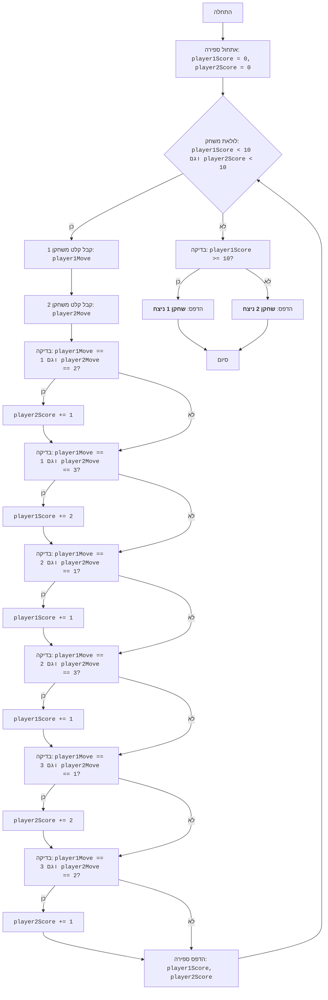

## <algorithm>

1. **התחלה:**
   - התחל את התוכנית.
   - דוגמה: התחלת ביצוע קובץ `hockey.py`.

2. **אתחול משתנים:**
   - אתחל את משתני הספירה של שני השחקנים ל-0.
   - `player1Score = 0`, `player2Score = 0`.

3. **לולאה ראשית (משחק):**
    - כל עוד הספירה של שני השחקנים קטנה מ-10:
        - בקש משחקן 1 להזין מהלך (1 - זריקה, 2 - הגנה, 3 - מסירה).
          - דוגמה: אם השחקן יזין `2` (הגנה).
        - בקש משחקן 2 להזין מהלך (1 - זריקה, 2 - הגנה, 3 - מסירה).
          - דוגמה: אם השחקן יזין `1` (זריקה).
        - בדוק את תנאי הזכייה:
            - אם שחקן 1 זורק ושחקן 2 מגן, העלה את הספירה של שחקן 2 ב-1.
              - לדוגמה: `player1Move == 1` וגם `player2Move == 2` ואז `player2Score += 1`
            - אם שחקן 1 זורק ושחקן 2 מוסר, העלה את הספירה של שחקן 1 ב-2.
              - לדוגמה: `player1Move == 1` וגם `player2Move == 3` ואז `player1Score += 2`
            - אם שחקן 1 מגן ושחקן 2 זורק, העלה את הספירה של שחקן 1 ב-1.
              - לדוגמה: `player1Move == 2` וגם `player2Move == 1` ואז `player1Score += 1`
            - אם שחקן 1 מגן ושחקן 2 מוסר, העלה את הספירה של שחקן 1 ב-1.
             - לדוגמה: `player1Move == 2` וגם `player2Move == 3` ואז `player1Score += 1`
            - אם שחקן 1 מוסר ושחקן 2 זורק, העלה את הספירה של שחקן 2 ב-2.
              - לדוגמה: `player1Move == 3` וגם `player2Move == 1` ואז `player2Score += 2`
            - אם שחקן 1 מוסר ושחקן 2 מגן, העלה את הספירה של שחקן 2 ב-1.
              - לדוגמה: `player1Move == 3` וגם `player2Move == 2` ואז `player2Score += 1`
        - הדפס את הספירות הנוכחיות.
        - חזרה לתחילת הלולאה.
        - דוגמה: `player1Score = 3` וגם `player2Score = 7`.

4. **בדיקת מנצח:**
    - אם הספירה של שחקן 1 גדולה או שווה ל-10:
        - הדפס: "שחקן 1 ניצח".
        - דוגמה: `player1Score == 10`
    - אחרת:
        - הדפס: "שחקן 2 ניצח".
        - דוגמה: `player2Score == 10`

5. **סיום:**
   - סיום התוכנית.

## <mermaid>

**תלות מיובאת:**
   - אין תלויות מיובאות בקוד הזה. הוא משתמש בפונקציות מובנות של פייתון כמו `input` ו-`print`, וכן בבדיקות תנאי ובפעולות חשבוניות.

## <explanation>

**ייבוא (Imports):**
   - אין ייבוא בקוד הזה. הקוד משתמש רק בפונקציות מובנות של פייתון.

**מחלקות (Classes):**
   - אין מחלקות בקוד הזה. הקוד בנוי כולו על פונקציות ומשתנים בלבד.

**פונקציות (Functions):**
   - אין פונקציות מוגדרות בקוד הזה. הקוד משתמש בפונקציות מובנות של פייתון:
     - `input(prompt)`: מקבלת קלט מהמשתמש.
       - פרמטר: `prompt` - מחרוזת המציגה הודעה למשתמש.
       - ערך מוחזר: מחרוזת שהמשתמש הזין.
       - דוגמה: `player1Move = int(input("הזן את המהלך שלך: "))` מקבלת קלט מהמשתמש, ממירה אותו למספר שלם ומאחסנת אותו ב`player1Move`.
     - `int(value)`: ממירה ערך למספר שלם.
       - פרמטר: `value` - הערך שיש להמיר.
       - ערך מוחזר: הערך כמספר שלם.
       - דוגמה: `int("5")` מחזיר את המספר 5.
      - `print(*objects, sep=' ', end='\n', file=sys.stdout, flush=False)`: מדפיסה פלט למסוף.
        - פרמטרים:
            - `objects`: אובייקטים להדפסה.
            - `sep`: מפריד בין אובייקטים (ברירת מחדל: רווח).
            - `end`: מחרוזת להוספה בסוף (ברירת מחדל: שורה חדשה).
        - דוגמה: `print(f"הספירה: שחקן 1 - {player1Score}, שחקן 2 - {player2Score}")` מדפיסה מחרוזת מעוצבת עם ספירות השחקנים.

**משתנים (Variables):**
   - `player1Score`: סוג: `int`. מאחסן את הספירה של שחקן 1.
   - `player2Score`: סוג: `int`. מאחסן את הספירה של שחקן 2.
   - `player1Move`: סוג: `int`. מאחסן את המהלך של שחקן 1 (1, 2 או 3).
   - `player2Move`: סוג: `int`. מאחסן את המהלך של שחקן 2 (1, 2 או 3).

**בעיות אפשריות או תחומי שיפור:**
   - הקוד לא מטפל בקלט לא חוקי בצורה טובה. למשל, אם המשתמש יזין אות ולא מספר שלם, התוכנית תתרסק.
   - ניתן לשפר את הקוד על ידי שימוש בפונקציות כדי להפריד חלקים שונים של הקוד.
   - ניתן להוסיף תגובה למקרה בו שני השחקנים בוחרים את אותו המהלך.
   - ניתן לשפר את הממשק המשתמש ולהוסיף יותר משוב למשתמש.

**שרשרת קשרים עם חלקים אחרים בפרויקט:**
   - הקוד הזה הוא משחק עצמאי ואין לו תלות בחלקים אחרים בפרויקט.