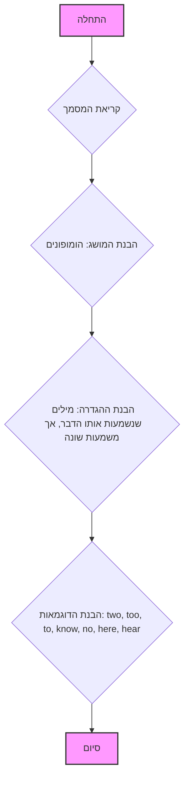

## ניתוח קוד: הומופונים (HOMOPHONES)

### 1. <algorithm>

הקוד שסופק אינו קוד תכנותי, אלא מסמך הסבר בפורמט Markdown המתאר את המושג "הומופונים" (Homophones). הומופונים הם מילים שנשמעות אותו הדבר אך בעלות משמעויות שונות ולרוב גם איות שונה. הקוד מספק הגדרה, הסבר ודוגמאות למילים הומופוניות בשפה האנגלית.

**תרשים זרימה של תהליך ההבנה של הקוד:**


**דוגמאות:**

*   **התחלה:** תחילת הקריאה של המסמך.
*   **קריאת המסמך:** קריאת הטקסט בפורמט Markdown.
*   **הבנת המושג:** הבנת הכוונה של המושג "הומופונים".
*   **הבנת ההגדרה:** הבנת המאפיינים של הומופונים (צליל זהה, משמעות שונה).
*   **הבנת הדוגמאות:** עיבוד הדוגמאות שסופקו להמחשה.
*   **סיום:** סיום קריאה והבנה של המסמך.

### 2. <mermaid>

```mermaid
flowchart TD
    Start[התחלה] --> ReadDoc[קריאת המסמך];
    ReadDoc --> UnderstandConcept[הבנת המושג "הומופונים"];
    UnderstandConcept --> UnderstandDefinition[הבנת ההגדרה: צליל זהה, משמעות שונה];
    UnderstandDefinition --> UnderstandExamples[הבנת דוגמאות: two, too, to, know, no, here, hear];
    UnderstandExamples --> End[סיום];

    style Start fill:#f9f,stroke:#333,stroke-width:2px
    style End fill:#f9f,stroke:#333,stroke-width:2px
```

**ניתוח התלויות (אין תלויות import):**

אין תלויות ייבוא בקוד זה מכיוון שהוא אינו קוד תכנותי אלא מסמך הסבר.

### 3. <explanation>

**הסברים מפורטים:**

*   **ייבואים (Imports):** אין ייבוא מכיוון שזהו מסמך הסבר ולא קוד פייתון.
*   **מחלקות (Classes):** אין מחלקות במסמך זה.
*   **פונקציות (Functions):** אין פונקציות במסמך זה.
*   **משתנים (Variables):** אין משתנים מוגדרים באופן מפורש, אך הטקסט משתמש במילים וביטויים לתיאור המושג הומופונים.

    *   `**Омофоны**` (הומופונים): שם המושג.
    *   `two, too, to`, `know, no`, `here, hear`: דוגמאות למילים הומופוניות.

**בעיות אפשריות או תחומים לשיפור:**

*   **הקשר לשאר הפרויקט:** הקוד הזה הוא קובץ הסבר ולא קוד פונקציונלי, כך שאין לו קשר ישיר לחלקים אחרים בפרויקט. הוא משמש כחומר עזר להבנת המושג "הומופונים" במשחק או פעילות מסוימת.
*   **פירוט נוסף:** ניתן להוסיף דוגמאות רבות יותר ואולי להוסיף הסבר על המקורות ההיסטוריים של מילים הומופוניות, או להציג טבלה מסודרת שלהן.
*   **תרגום לשפות נוספות:** ניתן לתרגם את ההסבר לשפות אחרות.

**שרשרת קשרים עם חלקים אחרים בפרויקט:**

הקובץ הזה יכול להיות מקושר לקבצים אחרים בפרויקט (למשל, קבצי קוד של משחק), שבהם משתמשים בהומופונים כחלק מאתגר או חידה. לדוגמה:

*   קובץ קוד של משחק שמשתמש בהומופונים כחלק מחידה לשונית.
*   קובץ נתונים שמכיל רשימה של הומופונים שמשמשים במשחק.

בגדול, הקובץ הזה מספק רק הסבר תיאורטי ולא מהווה חלק אינטגרלי בפונקציונליות של הפרויקט.