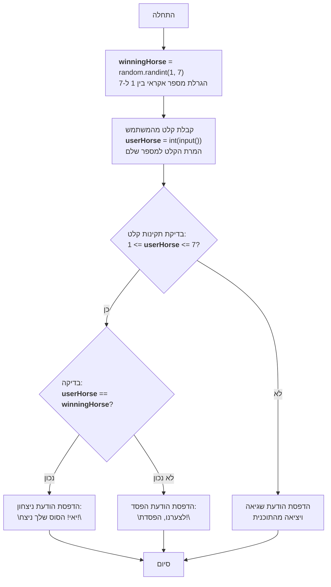

## ניתוח קוד: משחק סוסים

### <algorithm>

1.  **אתחול משתנה `winningHorse`**:
    *   הפונקציה `random.randint(1, 7)` מגרילה מספר שלם אקראי בין 1 ל-7 (כולל) ומאחסנת אותו במשתנה `winningHorse`.
    *   דוגמה: `winningHorse = 3`.

2.  **קבלת קלט מהמשתמש**:
    *   הפונקציה `input` מציגה למשתמש הודעה "בחר מספר סוס מ-1 עד 7: " ומקבלת קלט מהמשתמש.
    *   הקלט מומר למספר שלם באמצעות `int()` ומאוחסן במשתנה `userHorse`.
    *   אם המשתמש לא מכניס מספר שלם, מופעלת חריגה `ValueError` והתוכנית יוצאת עם הודעת שגיאה.
        *   דוגמה לקלט תקין: המשתמש מקליד "5", `userHorse` הופך ל-5.
        *   דוגמה לקלט לא תקין: המשתמש מקליד "hello", התוכנית יוצאת.
    *   אם הקלט הוא מספר, מתבצעת בדיקה האם הוא בין 1 ל-7. אם לא, התוכנית יוצאת עם הודעה.

3.  **בדיקת ניצחון**:
    *   בודקים האם `userHorse` שווה ל- `winningHorse`.
        *   אם שווה, מדפיסים "יאי! הסוס שלך ניצח!"
        *   אם לא שווה, מדפיסים "לצערנו, הפסדת!"
    *   דוגמה: אם `userHorse = 3` ו-`winningHorse = 3`, התוכנית תדפיס "יאי! הסוס שלך ניצח!". אם `userHorse = 2` ו-`winningHorse = 3`, התוכנית תדפיס "לצערנו, הפסדת!".

4. **סיום המשחק**:
    * התוכנית מסיימת את ריצתה.

### <mermaid>

**הסבר על התלויות:**

*   `random`: המודול random הוא חלק מספריית הסטנדרט של פייתון. משמש ליצירת מספרים אקראיים, במקרה הזה, להגרלת הסוס המנצח. אין לו תלות בחבילות אחרות בפרויקט הנוכחי.

### <explanation>

**ייבוא מודולים:**

*   `import random`: מייבא את מודול random, המאפשר ליצור מספרים אקראיים. משמש להגרלת מספר הסוס המנצח.

**משתנים:**

*   `winningHorse`: משתנה מסוג `int` (מספר שלם), המאחסן את מספר הסוס המנצח שנוצר באופן אקראי על ידי הפונקציה `random.randint()`.
*   `userHorse`: משתנה מסוג `int`, המאחסן את מספר הסוס שהמשתמש בחר לאחר שהומר למספר שלם ע"י הפונקציה `int()`.

**פונקציות:**

*   `random.randint(a, b)`: פונקציה מהמודול `random`, מחזירה מספר שלם אקראי בין a ל-b (כולל). כאן, מחזירה מספר בין 1 ל-7 עבור הסוס המנצח.
    *   דוגמאות: `random.randint(1, 7)` יכול להחזיר 1, 2, 3, 4, 5, 6 או 7.
*   `input(prompt)`: פונקציה מובנית של פייתון, מציגה הודעה למשתמש ומחזירה את הקלט שלו כמחרוזת. כאן, משמשת לקבלת בחירת הסוס של המשתמש.
*   `int(x)`: פונקציה מובנית של פייתון, ממירה את x למספר שלם. כאן, משמשת להמרת קלט המשתמש למספר שלם.
*   `print(message)`: פונקציה מובנית של פייתון, מדפיסה הודעה למסוף. כאן, משמשת להצגת הודעות ניצחון/הפסד, והודעות שגיאה.
*   `exit()`: פונקציה מובנית של פייתון, מסיימת את התוכנית באופן מיידי. כאן, משמשת לסיום התוכנית במקרה של קלט שגוי.

**מבנה לוגי:**

1.  התוכנית מתחילה ביצירת מספר סוס מנצח אקראי.
2.  לאחר מכן, היא מבקשת מהמשתמש לבחור סוס.
3.  התוכנית בודקת האם הבחירה של המשתמש תואמת למספר הסוס המנצח.
4.  אם כן, היא מודיעה למשתמש על ניצחון, אחרת מודיעה לו על הפסד.

**בעיות אפשריות ותחומים לשיפור:**

*   **טיפול שגיאות**: הקוד מטפל בשגיאות מסוג `ValueError` בעת המרת קלט המשתמש למספר שלם, אך ניתן להרחיב את טיפול השגיאות כדי לטפל במקרים אחרים (לדוגמה, קלט ריק).
*   **קריאות קוד**: ניתן להוסיף הערות מפורטות יותר בקוד בכדי להפוך אותו לקריא יותר.
*   **משחקיות**: המשחק מאוד פשוט וניתן להרחיב אותו עם אפשרויות נוספות כמו מספר סיבובים או הימורים.

**קשר לחלקים אחרים בפרויקט:**

*   אין קשר ישיר עם חלקים אחרים בפרויקט, מכיוון שמדובר במשחק עצמאי. עם זאת, ניתן לשלב משחק זה בתוך ממשק משתמש רחב יותר.

בסיכום, הקוד יוצר משחק פשוט של הימורי סוסים, בו המשתמש בוחר סוס ומקבל הודעת ניצחון/הפסד בהתאם להגרלה אקראית. הקוד מטפל בשגיאות קלט בסיסיות וניתן לשיפור מבחינת טיפול שגיאות, קריאות ומשחקיות.