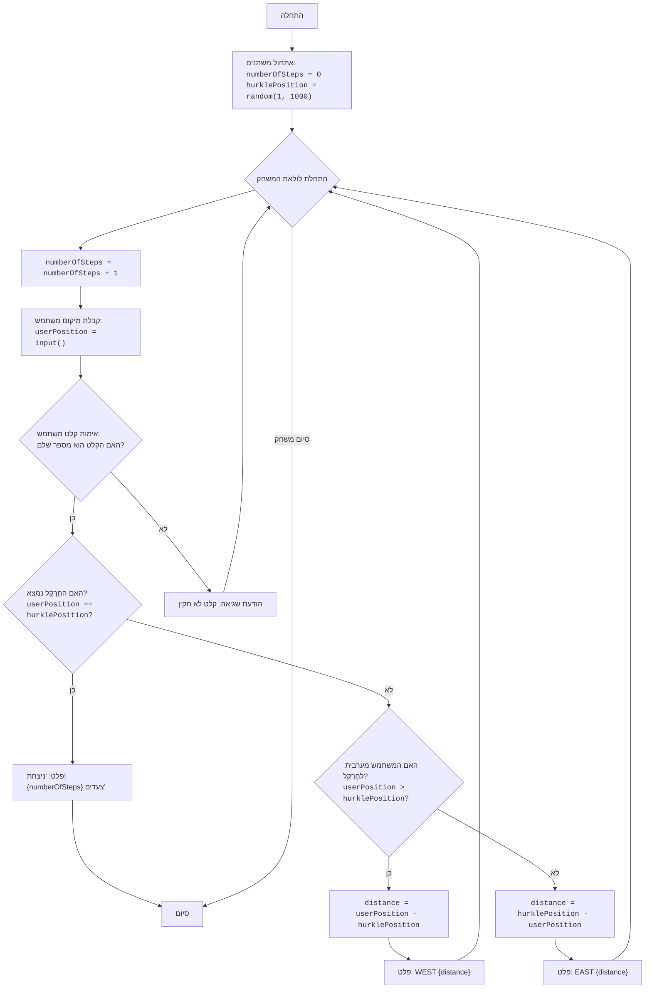

## ניתוח קוד: משחק "חֶרְקֶל"

### <algorithm>
1.  **אתחול**:
    *   `numberOfSteps` = 0 (מונה הצעדים מתחיל מ-0).
    *   `hurklePosition` = מספר אקראי בין 1 ל-1000 (מיקום החֶרְקֶל נקבע אקראית).
    
    *דוגמה*: `numberOfSteps` = 0, `hurklePosition` = 357
2.  **לולאה ראשית (while True)**: המשחק נמשך עד שהחֶרְקֶל נמצא.
    1.  **הגדלת מונה צעדים**:
        *   `numberOfSteps` = `numberOfSteps` + 1
        *דוגמה*: אם `numberOfSteps` היה 2, יהפוך ל-3.
    2.  **קלט משתמש**:
        *   משתמש מתבקש להזין מיקום (בין 1 ל-1000).
        *   `userPosition` = קלט המשתמש, לאחר המרה למספר שלם.
        * דוגמה: משתמש מזין 400, אז `userPosition` = 400.
        *   אם הקלט אינו מספר שלם, תוצג הודעת שגיאה והלולאה תמשיך לסיבוב הבא.
    3.  **בדיקה אם החֶרְקֶל נמצא**:
        *   אם `userPosition` == `hurklePosition`:
            *   הודעת ניצחון עם מספר הצעדים.
            *   הלולאה מסתיימת (break).
            *   *דוגמה*: אם `userPosition` = 357 ו-`hurklePosition` = 357, תוצג הודעת ניצחון.
    4.  **בדיקה והדפסה של כיוון ומרחק (אם החֶרְקֶל לא נמצא)**:
        *   אם `userPosition` < `hurklePosition`:
            *   `distance` = `hurklePosition` - `userPosition`.
            *   הדפס: "EAST {distance}"
            *   *דוגמה*: אם `userPosition` = 200 ו-`hurklePosition` = 357, אז `distance` = 157, והתוכנית תדפיס "EAST 157".
        *   אחרת (אם `userPosition` > `hurklePosition`):
            *   `distance` = `userPosition` - `hurklePosition`.
            *   הדפס: "WEST {distance}".
            *   *דוגמה*: אם `userPosition` = 500 ו-`hurklePosition` = 357, אז `distance` = 143, והתוכנית תדפיס "WEST 143".
3.  **סיום**: המשחק מסתיים כאשר החֶרְקֶל נמצא.

### <mermaid>

### <explanation>
**ייבואים (Imports):**
*   `import random`: מודול זה מספק פונקציות ליצירת מספרים אקראיים. הוא משמש ליצירת מיקום אקראי עבור החֶרְקֶל בתחילת המשחק.

**משתנים (Variables):**
*   `numberOfSteps` (int): מונה את מספר הצעדים שהשחקן מבצע, מתחיל מ-0.
*   `hurklePosition` (int): מיקום החֶרְקֶל שנקבע באופן אקראי בתחילת המשחק.
*   `userPosition` (int): המיקום שהמשתמש מזין, המשמש לבדיקה מול מיקום החֶרְקֶל.
*   `distance` (int): המרחק בין מיקום המשתמש למיקום החֶרְקֶל, מחושב בכל סיבוב.

**פונקציות (Functions):**
*   `random.randint(1, 1000)`: פונקציה ממודול `random` שמחזירה מספר שלם אקראי בין 1 ל-1000 (כולל).

**מבנה הקוד:**
1.  **אתחול:**
    *   המשתנה `numberOfSteps` מקבל ערך 0, ו`hurklePosition` מקבל מספר אקראי בין 1 ל-1000.
2.  **לולאת משחק (while True):**
    *   **מונה צעדים**: `numberOfSteps` גדל ב-1 בכל סיבוב.
    *   **קלט משתמש:**
         *   התוכנית מבקשת מהמשתמש להזין מיקום (מספר שלם).
         *   נעשה שימוש בבלוק `try...except` על מנת לטפל בשגיאות במקרה שהמשתמש מזין קלט לא תקין (שאינו מספר שלם).
    *   **בדיקה אם נמצא:** אם `userPosition` שווה ל-`hurklePosition`, מוצגת הודעת ניצחון עם מספר הצעדים והמשחק מסתיים.
    *   **פלט כיוון ומרחק:**
         *   אם `userPosition` קטן מ-`hurklePosition`, מוצגת הודעה "EAST {distance}" כאשר `distance` הוא המרחק בין המיקומים.
         *   אחרת (אם `userPosition` גדול מ-`hurklePosition`), מוצגת הודעה "WEST {distance}" כאשר `distance` הוא המרחק בין המיקומים.

**בעיות ושיפורים אפשריים:**
*   **אימות קלט**: הקוד מטפל בשגיאות קלט לא תקינות באמצעות `try...except`, אך לא בודק אם הקלט הוא בטווח 1-1000. מומלץ להוסיף בדיקה כזו כדי להבטיח שהקלט תקין.
*   **הודעות למשתמש**: ההודעות יכולות להיות יותר ידידותיות למשתמש, כמו למשל לתת רמזים למשתמש להתקרב ליעד לאחר כמה ניסיונות.
*   **מבנה קוד**: ניתן לפצל את הקוד לפונקציות קטנות יותר לצורך קריאות ושימוש חוזר בקוד, כמו פונקציה לקבלת קלט, פונקציה לחישוב המרחק וכו'.
*  **אופטימיזציה:** במידה והמשחק יתפתח אפשר ליצור אלגוריתם חיפוש יותר יעיל, כמו חיפוש בינארי אם תחום החיפוש יהיה מסודר בצורה מסוימת.

**שרשרת קשרים:**
*   הקוד עומד בפני עצמו ואינו תלוי בחלקים אחרים בפרויקט. עם זאת, ניתן לשלב אותו כחלק ממערכת משחקים גדולה יותר, כאשר כל משחק מתנהל בנפרד ומשתמש במודולים דומים.