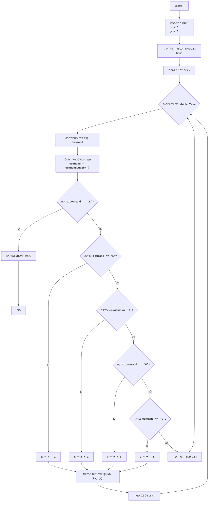

## ניתוח קוד:

### <algorithm>

1.  **התחל**:
    -   הגדר משתנה `x` ל-0.
    -   הגדר משתנה `y` ל-0.
    -   הצג את ההודעה "הקואורדינטות ההתחלתיות: (0, 0)".
    -   המתן 0.5 שניות.
        
        *דוגמה: `x = 0`, `y = 0`, הפלט יהיה "הקואורדינטות ההתחלתיות: (0, 0)"*
2.  **לולאה ראשית**:
    -   התחל לולאה אינסופית (`while True`).
    -   קבל קלט מהמשתמש: "הזן פקודה (L/R/U/D או E כדי לצאת): ".
        
        *דוגמה: המשתמש מזין "l", `command` = "L"*
    -   המר את הקלט לאותיות גדולות (`.upper()`).
        
        *דוגמה: אם המשתמש הזין "l", הקלט יהיה "L".*
    -   בדוק אם הקלט שווה ל-"E".
        -   אם כן, הצג "המשחק הסתיים." וצא מהלולאה (`break`).
        
         *דוגמה: אם `command` = "E", התוכנית תציג "המשחק הסתיים" ותצא מהלולאה.*
    -   אם הקלט שווה ל-"L":
        -   הפחת 1 מערך המשתנה `x` (`x -= 1`).
    
        *דוגמה: אם `x` הוא 0, לאחר הפחתה `x` יהיה -1.*
    -   אחרת, אם הקלט שווה ל-"R":
        -   הגדל את ערך המשתנה `x` ב-1 (`x += 1`).
        
        *דוגמה: אם `x` הוא 0, לאחר הוספה `x` יהיה 1.*
    -  אחרת, אם הקלט שווה ל-"U":
        -   הגדל את ערך המשתנה `y` ב-1 (`y += 1`).
        
        *דוגמה: אם `y` הוא 0, לאחר הוספה `y` יהיה 1.*
    -   אחרת, אם הקלט שווה ל-"D":
        -   הפחת 1 מערך המשתנה `y` (`y -= 1`).
        
        *דוגמה: אם `y` הוא 0, לאחר הפחתה `y` יהיה -1.*
    -   אחרת:
        -   הצג הודעה "פקודה לא חוקית. בבקשה, השתמש ב-L, R, U, D או E." והמשך לסיבוב הבא של הלולאה (`continue`).
        
        *דוגמה: אם המשתמש מזין "A", התוכנית תציג הודעה "פקודה לא חוקית..." ותחזור ללולאה הראשית.*
    -   הצג את ערכי הקואורדינטות הנוכחיים: "הקואורדינטות הנוכחיות: (x, y)".
        
        *דוגמה: אם `x` הוא 1 ו-`y` הוא -1, הפלט יהיה "הקואורדינטות הנוכחיות: (1, -1)".*
    -  המתן 0.5 שניות.
    -   חזור לראש הלולאה.
3.  **סוף**:
    -   התוכנית מסיימת כאשר הלולאה מופסקת ע"י הפקודה "E".

### <mermaid>

**הסבר תרשים Mermaid:**

*   **Start**: מציין את תחילת התוכנית.
*   **InitializeVariables**: אתחול המשתנים `x` ו-`y` ל-0, המייצגים את הקואורדינטות ההתחלתיות של הנקודה.
*   **OutputInitialCoordinates**: פלט הקואורדינטות ההתחלתיות (0, 0) למשתמש.
*   **Delay1**: עיכוב קצר של 0.5 שניות.
*   **LoopStart**: תחילת לולאה אינסופית, שבה המשחק פועל עד שהמשתמש בוחר לסיים.
*   **InputCommand**: קבלת קלט מהמשתמש, המייצג את הפקודה לשינוי מיקום הנקודה.
*   **ToUpper**: המרת הקלט לאותיות גדולות כדי להפוך את הפקודות ללא רגישות לאותיות קטנות או גדולות.
*   **CheckCommandE**: בדיקה האם הפקודה היא "E", כלומר, האם המשתמש בחר לסיים את המשחק.
*   **OutputEndMessage**: אם הפקודה היא "E", מציג הודעה שהמשחק הסתיים.
*  **End**: סוף התוכנית
*   **CheckCommandL**: אם הפקודה היא "L", כלומר, המשתמש בחר להזיז את הנקודה שמאלה.
*   **MoveLeft**: עדכון קואורדינטת `x` על ידי הפחתה של 1 (הזזה שמאלה).
*   **CheckCommandR**: אם הפקודה היא "R", כלומר, המשתמש בחר להזיז את הנקודה ימינה.
*   **MoveRight**: עדכון קואורדינטת `x` על ידי הוספה של 1 (הזזה ימינה).
*   **CheckCommandU**: אם הפקודה היא "U", כלומר, המשתמש בחר להזיז את הנקודה למעלה.
*   **MoveUp**: עדכון קואורדינטת `y` על ידי הוספה של 1 (הזזה למעלה).
*    **CheckCommandD**: אם הפקודה היא "D", כלומר, המשתמש בחר להזיז את הנקודה למטה.
*   **MoveDown**: עדכון קואורדינטת `y` על ידי הפחתה של 1 (הזזה למטה).
*   **OutputCurrentCoordinates**: הצגת הקואורדינטות הנוכחיות של הנקודה.
*   **Delay2**: עיכוב קצר של 0.5 שניות.
*   **OutputInvalidCommand**: כאשר הפקודה שהוזנה אינה אחת מהפקודות הנדרשות (L, R, U, D, E).

### <explanation>

*   **ייבוא (Imports):**
    *   `import time`: מודול זה משמש לניהול זמנים וליישום השהיות קצרות בתוכנית באמצעות הפונקציה `time.sleep()`. ההשהיה מאפשרת למשתמש לראות את הקואורדינטות המוצגות בצורה ברורה יותר.

*   **משתנים (Variables):**
    *   `x`: משתנה מסוג `int` המייצג את הקואורדינטה האופקית (X) של הנקודה.
    *   `y`: משתנה מסוג `int` המייצג את הקואורדינטה האנכית (Y) של הנקודה.
    *  `command`: משתנה מסוג `str` המכיל את הפקודה שהמשתמש הזין.

*   **פונקציות (Functions):**
    *   `input(prompt)`: פונקציה מובנית ב-Python המקבלת קלט מהמשתמש.
    *   `print(message)`: פונקציה מובנית ב-Python המציגה הודעה למסוף.
    *  `str.upper()`: מתודה של מחלקת `str` שממירה מחרוזת לאותיות גדולות.
    *  `time.sleep(seconds)`: פונקציה מתוך מודול `time` שמאפשרת השהיית התוכנית למשך מספר שניות.

*   **הסבר מפורט:**

    הקוד מייצג משחק פשוט בו המשתמש מזיז נקודה על ידי הזנת פקודות. התוכנית מאתחלת את מיקום הנקודה ב-(0, 0) ומקבלת מהמשתמש פקודות להזזת הנקודה שמאלה, ימינה, למעלה או למטה. כל פקודה מעדכנת את הקואורדינטות של הנקודה, והתוכנית מציגה את הקואורדינטות החדשות למשתמש. התוכנית ממשיכה לפעול עד שהמשתמש מזין את הפקודה "E", ואז היא מסיימת את פעולתה.

*   **בעיות אפשריות ותחומים לשיפור:**
    *   **טיפול בקלט שגוי**:  התוכנית מטפלת רק במקרים שבהם הקלט אינו אחת מהפקודות המוכרות (L, R, U, D, E) על ידי הצגת הודעת שגיאה. אפשר להרחיב את הטיפול בשגיאות על ידי בדיקה האם הקלט ריק או האם הוא מכיל תווים לא חוקיים.
    *   **ממשק משתמש (UI) בסיסי**: ממשק המשתמש הוא טקסטואלי בלבד, וניתן לשפר אותו בעתיד באמצעות שימוש בספריות UI גרפיות.
    *   **היסטוריה של תנועות**: התוכנית לא שומרת את ההיסטוריה של תנועות הנקודה. ניתן להוסיף אפשרות לשמור את ההיסטוריה ולהציג אותה למשתמש.
    *   **גבולות מגרש המשחקים**: כרגע, אין מגבלה על מיקום הנקודה, והיא יכולה לנוע לכל הכיוונים. אפשר להוסיף מגבלות על גודל המגרש ולהגביל את תנועת הנקודה בתוכו.
    *   **יעילות קוד**: הקוד יחסית פשוט, אך ניתן לעשות שימוש ב-dict או ב-enum לצורך קיצור הקוד ושיפור הקריאות.
*   **שרשרת קשרים עם חלקים אחרים בפרויקט:**
    *   הקוד הנוכחי פועל באופן עצמאי ואין לו תלות ישירה בחלקים אחרים בפרויקט.
    *   אפשר לשקול הוספת תמיכה בספריות משחקים או UI אחרות כדי לשפר את חוויית המשתמש.