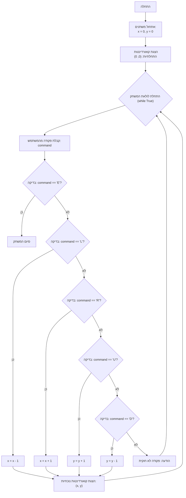

## <algorithm>
הקוד מדמה משחק טקסטואלי שבו נקודה נעה על מישור דו-ממדי. תהליך העבודה של הקוד מתואר כך:

1. **אתחול משתנים:**
   - משתנה `x` (ייצוג קואורדינטת ה-X) מאותחל ל-0.
   - משתנה `y` (ייצוג קואורדינטת ה-Y) מאותחל ל-0.
   *דוגמה:* `x = 0`, `y = 0`

2. **הצגת קואורדינטות התחלתיות:**
   - הקואורדינטות ההתחלתיות (0, 0) מוצגות למשתמש.
   *דוגמה:* הפלט יהיה "Начальные координаты: (0, 0)"

3. **לולאת משחק ראשית:**
   - הלולאה `while True:` מתחילה, ורצה עד שהמשתמש יבחר לצאת.
   
4. **קבלת פקודה מהמשתמש:**
   - המערכת מבקשת מהמשתמש להזין פקודה (L, R, U, D או E).
   - הקלט המשתמש מומר לאותיות גדולות כדי להקל על ההשוואה.
   *דוגמה:* המשתמש מזין 'l' או 'L', הקוד מקבל 'L'.

5. **בדיקת פקודת יציאה:**
   - אם הפקודה היא "E", המשחק מסתיים.
   *דוגמה:* אם המשתמש מזין "E", המשחק מסתיים והלולאה נשברת.
   
6. **בדיקה וביצוע תנועה:**
   - אם הפקודה היא "L", הקואורדינטה x מופחתת ב-1 (תזוזה שמאלה).
   *דוגמה:* אם `x` הוא 2 והמשתמש מזין "L", `x` יהפוך ל-1.
   - אם הפקודה היא "R", הקואורדינטה x מוגדלת ב-1 (תזוזה ימינה).
   *דוגמה:* אם `x` הוא 2 והמשתמש מזין "R", `x` יהפוך ל-3.
   - אם הפקודה היא "U", הקואורדינטה y מוגדלת ב-1 (תזוזה למעלה).
   *דוגמה:* אם `y` הוא 2 והמשתמש מזין "U", `y` יהפוך ל-3.
   - אם הפקודה היא "D", הקואורדינטה y מופחתת ב-1 (תזוזה למטה).
   *דוגמה:* אם `y` הוא 2 והמשתמש מזין "D", `y` יהפוך ל-1.

7. **טיפול בפקודה לא חוקית:**
   - אם הפקודה אינה L, R, U, D או E, תוצג הודעת שגיאה.
   *דוגמה:* אם המשתמש מזין "X", תופיע הודעת שגיאה.

8. **הצגת קואורדינטות נוכחיות:**
   - הקואורדינטות הנוכחיות (x, y) מוצגות למשתמש.
   *דוגמה:* הפלט יהיה "Текущие координаты: (2, 3)"

9. **חזרה ללולאה:**
   - התוכנית חוזרת לשלב 3 כדי לקבל פקודה נוספת, או עד שהמשתמש בוחר לסיים את המשחק.

## <mermaid>

**הסבר:**
- **Start:** מציין את תחילת התוכנית.
- **InitializeVariables:** מאתחל את המשתנים `x` ו-`y` ל-0.
- **OutputInitialCoordinates:** מדפיס את הקואורדינטות ההתחלתיות (0,0).
- **GameLoopStart:** מסמן את תחילת הלולאה האינסופית שמאפשרת את המשחק.
- **GetCommand:** קולט קלט מהמשתמש.
- **CheckExitCommand:** בודק האם הקלט הוא הפקודה לסיום המשחק ('E').
- **End:** מסמן את סיום התוכנית.
- **CheckMoveLeft:** בודק אם הקלט הוא פקודת תזוזה שמאלה ('L').
- **MoveLeft:** מבצע את הפקודה ומעדכן את `x` בהתאם.
- **CheckMoveRight:** בודק אם הקלט הוא פקודת תזוזה ימינה ('R').
- **MoveRight:** מבצע את הפקודה ומעדכן את `x` בהתאם.
- **CheckMoveUp:** בודק אם הקלט הוא פקודת תזוזה למעלה ('U').
- **MoveUp:** מבצע את הפקודה ומעדכן את `y` בהתאם.
- **CheckMoveDown:** בודק אם הקלט הוא פקודת תזוזה למטה ('D').
- **MoveDown:** מבצע את הפקודה ומעדכן את `y` בהתאם.
- **InvalidCommandMessage:** מדפיס הודעת שגיאה אם הפקודה לא מזוהה.
- **OutputCurrentCoordinates:** מדפיס את הקואורדינטות הנוכחיות.

**אין תלויות מיובאות** בקוד הזה, כך שאין צורך בשרטוט נוסף עבור `header.py`.

## <explanation>

**ייבואים (Imports):**
- `import time`: מודול זה משמש כדי להוסיף השהיות קצרות בפלט, מה שמשפר את חוויית המשתמש. הוא לא קשור ישירות למודולים אחרים בתוך `src.`.

**משתנים (Variables):**
- `x`: משתנה מסוג `int` המייצג את קואורדינטת ה-X של הנקודה. מאותחל ל-0.
- `y`: משתנה מסוג `int` המייצג את קואורדינטת ה-Y של הנקודה. מאותחל ל-0.
- `command`: משתנה מסוג `str` המאחסן את הפקודה שהמשתמש הכניס.

**פונקציות (Functions):**
- אין פונקציות מוגדרות במפורש. הקוד כתוב בסגנון פרוצדורלי.

**הסברים מפורטים:**
- הקוד מממש משחק טקסטואלי פשוט שבו המשתמש מזיז נקודה על מישור דו-ממדי באמצעות פקודות טקסטואליות.
- התוכנית מתחילה באתחול של הקואורדינטות x ו-y ל-0.
- לולאה אינסופית (`while True`) מתחילה, ומאפשרת למשתמש להזיז את הנקודה ולהמשיך לשחק עד שהמשתמש מזין 'E'.
- פקודת `input` קולטת קלט מהמשתמש, ופונקציית ה-`upper()` ממירה את הקלט לאותיות גדולות כדי להקל על ההשוואה.
- משפטי `if`, `elif` ו-`else` משמשים לבדיקת פקודות (L, R, U, D, E) ולעדכון הקואורדינטות בהתאם.
- אם המשתמש מזין פקודה לא חוקית, מוצגת הודעת שגיאה.
- לאחר כל תנועה, מוצגות הקואורדינטות הנוכחיות של הנקודה למשתמש.
- `time.sleep(0.5)` מוסיף השהייה קצרה של חצי שניה, ומשפר את הקריאות של המשחק.

**בעיות אפשריות ושיפורים:**
- **אימות קלט:** הקוד לא בודק שהקלט הוא באמת תווים לגיטימיים, במקרה של הזנת קלט לא מסוג מחרוזת התוכנית עלולה ליפול. אפשר להוסיף בדיקת סוג קלט לפני המשך התוכנית.
- **שימוש בפונקציות:** הקוד יכול להשתפר על ידי פיצול הלוגיקה לפונקציות קטנות יותר. לדוגמה, פונקציה לטיפול בתנועה ופונקציה להצגת הקואורדינטות.
- **ממשק משתמש:** הממשק מאוד בסיסי, אפשר להוסיף משוב נוסף למשתמש, כמו הצגת המיקום הקודם של הנקודה.
- **מנגנון סיום אלטרנטיבי:** כרגע יש רק אופציה אחת לסיים את המשחק (הזנת 'E'), ניתן להוסיף אפשרויות נוספות, כמו הגעה ליעד מסויים או הגבלת כמות הצעדים.

**שרשרת קשרים:**
- לקוד הזה אין תלות ישירה בחלקים אחרים בפרויקט, למעט המודול `time`.
- הקוד עומד בפני עצמו, ומדגים יישום של משחק טקסטואלי פשוט.