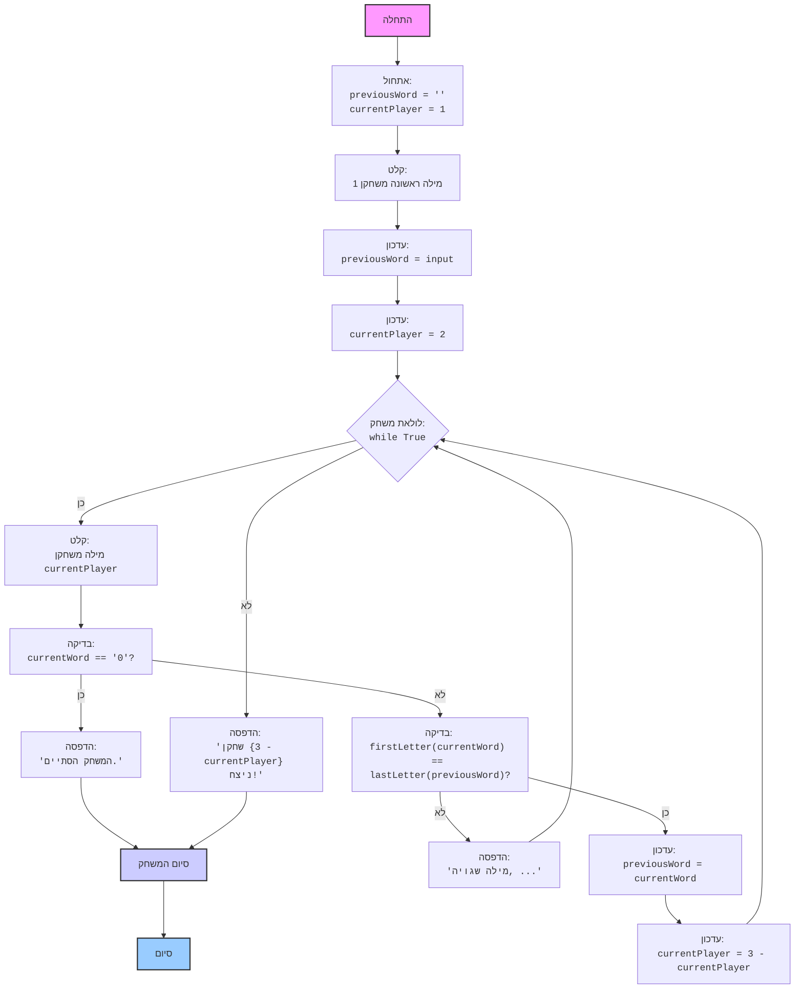

# ניתוח קוד: משחק המלך (King)

## 1. <algorithm>

### תרשים זרימה שלב אחר שלב:

1.  **אתחול:**
    -   אתחול משתנה `previousWord` למחרוזת ריקה.
    -   אתחול משתנה `currentPlayer` ל-1 (שחקן 1 מתחיל).

    *דוגמה:*
    ```python
    previousWord = ""
    currentPlayer = 1
    ```

2.  **קבלת מילה ראשונה:**
    -   בקשת קלט מהמשתמש (שחקן 1) למילה הראשונה.
    -   הסרת רווחים מיותרים מהמילה (לדוגמה, `"  מילה  "` הופך ל-`"מילה"`).
    -   עדכון `previousWord` במילה שהתקבלה.
    -   שינוי `currentPlayer` ל-2 (מעבר לשחקן 2).
    
    *דוגמה:*
    ```
    קלט: "שלום  "
    previousWord = "שלום"
    currentPlayer = 2
    ```

3.  **לולאת משחק:**
    -   הלולאה נמשכת עד שאחד השחקנים מזין "0".
    
4.  **קבלת מילה מהשחקן הנוכחי:**
    -   בקשת קלט מהמשתמש הנוכחי.
    -   הסרת רווחים מיותרים מהמילה.

    *דוגמה:*
    ```
    קלט משחקן 2: "מחר "
    currentWord = "מחר"
    ```
    
5.  **בדיקת סיום המשחק:**
    -  בדיקה האם המילה שהוזנה היא "0".
    -   אם כן, הדפסת הודעת סיום והפסקת הלולאה.

    *דוגמה:*
    ```
    currentWord == "0"
    הדפסה: "המשחק הסתיים."
    יציאה מהלולאה
    ```

6.  **בדיקת תקינות המילה:**
     -  בדיקה האם `previousWord` אינו ריק.
    -   בדיקה האם האות הראשונה של המילה הנוכחית אינה זהה לאות האחרונה של המילה הקודמת (לא תלוי רישיות).
    -   אם לא תקין, הדפסת הודעת שגיאה וחזרה לתחילת הלולאה.

    *דוגמה:*
    ```
    previousWord = "שלום"
    currentWord = "מחר"
    "ש" != "מ"
    הדפסה: "מילה שגויה, האות הראשונה צריכה להיות זהה לאחרונה במילה הקודמת."
    חזרה ללולאה
    ```

7.  **עדכון למשחק הבא:**
    -   עדכון `previousWord` במילה הנוכחית.
    -   שינוי תור השחקן (משחקן 1 לשחקן 2 או להפך).

     *דוגמה:*
     ```
    previousWord = "מחר"
    currentPlayer = 1
    ```

8.  **הכרזת מנצח:**
    -   הדפסת הודעה המציינת את השחקן שניצח (השחקן שהיה קודם).

     *דוגמה:*
     ```
    הדפסה: "שחקן 1 ניצח!"
    ```

### זרימת נתונים:

-   המשתנה `previousWord` עובר בין השחקנים כאשר כל שחקן מזין מילה.
-   המשתנה `currentPlayer` משמש לקבוע מי השחקן הנוכחי ומשתנה בסוף כל תור תקין.
-   הקלט מהמשתמש משפיע על זרימת הלולאה ועל מהלך המשחק.

## 2. <mermaid>



**הסבר התלויות המיובאות (אין ייבוא):**

אין ייבוא של ספריות או מודולים בקוד הנוכחי. לכן, אין תלות חיצונית. הקוד כולו מסתמך על פונקציות מובנות של Python כמו `input()`, `print()`, `lower()` ופעולות בסיסיות על מחרוזות.

## 3. <explanation>

### ייבוא (Imports):

-   אין ייבוא בקוד זה.

### משתנים (Variables):

-   `previousWord`:
    -   סוג: מחרוזת (`str`).
    -   שימוש: מאחסן את המילה האחרונה שהוזנה על ידי שחקן.
    -   האתחול הראשוני הוא מחרוזת ריקה `""`.
-   `currentPlayer`:
    -   סוג: מספר שלם (`int`).
    -   שימוש: מאחסן את מספר השחקן הנוכחי (1 או 2).
    -   האתחול הראשוני הוא `1` (שחקן 1 מתחיל).
-   `currentWord`:
    -   סוג: מחרוזת (`str`).
    -   שימוש: מאחסן את המילה שהוזנה על ידי השחקן הנוכחי בתור הנוכחי.
    -   משמש זמנית בתוך הלולאה.

### פונקציות (Functions):

-   `input(prompt)`:
    -   פרמטרים: `prompt` (מחרוזת) - ההודעה שמוצגת למשתמש.
    -   ערך מוחזר: מחרוזת (`str`) - קלט המשתמש.
    -   מטרה: קבלת קלט מהמשתמש.
    -   דוגמה: `input("הכנס מילה:")`
-   `print(message)`:
    -   פרמטרים: `message` (כל סוג נתונים שניתן לייצג כמחרוזת).
    -   ערך מוחזר: אין (None).
    -   מטרה: הדפסת פלט למסך.
    -   דוגמה: `print("המשחק הסתיים!")`
-   `.strip()`:
    -   פרמטרים: אין
    -   ערך מוחזר: מחרוזת (`str`).
    -   מטרה: הסרת רווחים לבנים מהתחלה ומהסוף של המחרוזת.
    -   דוגמה:  `"   שלום   ".strip()` יחזיר `"שלום"`
-   `.lower()`:
    -   פרמטרים: אין
    -   ערך מוחזר: מחרוזת (`str`).
    -   מטרה: המרת כל האותיות במחרוזת לאותיות קטנות.
    -   דוגמה: `"ShALoM".lower()` יחזיר `"shalom"`

### מחלקות (Classes):

-   אין מחלקות בקוד זה.

### הסברים נוספים:

1.  **לולאה אין-סופית (`while True`)**: הקוד משתמש בלולאה אין-סופית שפועלת עד שהשחקן מזין `'0'`, ואז הלולאה נשברת עם `break`.
2.  **בדיקת תקינות האות הראשונה**: הקוד משתמש בשיטת `.lower()` כדי להפוך את האותיות לקטנות, מה שמאפשר לבצע השוואה לא תלוית רישיות. זה מונע מצב בו המשחק לא ימשיך בגלל הבדלים בין אותיות גדולות וקטנות.
3.  **החלפת תור השחקנים**: הקוד משתמש בטריק מתמטי `currentPlayer = 3 - currentPlayer` כדי להחליף בין שחקן 1 לשחקן 2. זה חוסך שימוש בתנאי מורכב יותר.

### בעיות אפשריות או תחומים לשיפור:

1.  **בדיקת קלט:** הקוד בודק רק אם המילה הראשונה זהה לאחרונה. ניתן להוסיף בדיקה שמוודאת שהקלט הוא מילה חוקית (לדוגמא, שאינו מכיל מספרים או סימנים מיוחדים).
2.  **מניעת חזרות:** אין בקוד מנגנון למניעת שימוש חוזר במילים. ניתן להוסיף רשימה של מילים ששומשו ולבדוק אם המילה הנוכחית כבר קיימת.
3.  **טיפול בשגיאות:** הקוד מטפל רק בשגיאות של אות ראשונה. ניתן להוסיף טיפול בשגיאות נוספות, כמו קלט ריק.
4.  **ממשק משתמש:** ממשק המשתמש מאוד בסיסי. ניתן להוסיף הודעות ידידותיות יותר למשתמש ולהבהיר טוב יותר את חוקי המשחק.

### שרשרת קשרים עם חלקים אחרים בפרויקט:

-   אין קשרים ישירים לחלקים אחרים בפרויקט. הקוד עצמאי ופועל כמשחק עצמאי.

זהו ניתוח מקיף של הקוד, כולל הסבר על תהליך העבודה, תרשים הזרימה, ופירוט של כל המרכיבים.