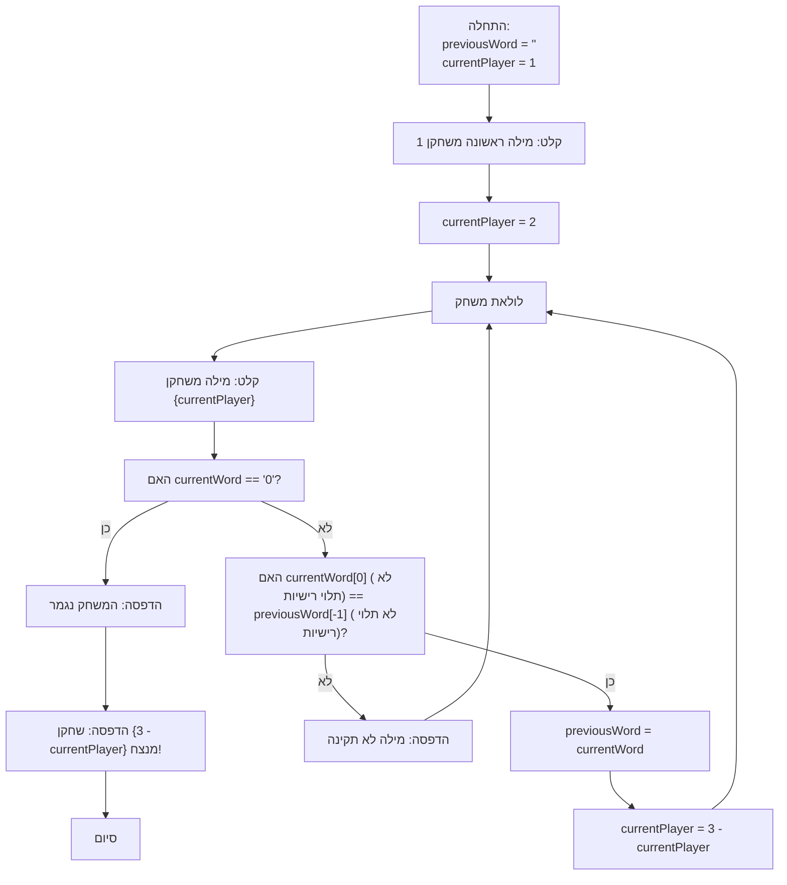

## <algorithm>

1. **התחלה**:
   - משתנים `previousWord` מאותחל למחרוזת ריקה, `currentPlayer` מאותחל ל-1.
   
   *דוגמה:* `previousWord = ""` , `currentPlayer = 1`

2. **קבלת מילה ראשונה**:
   - המשתמש (שחקן 1) מתבקש להזין מילה ראשונה.
   - המילה שנקלטה (לאחר הסרת רווחים מובילים ונגררים) מאוחסנת בתוך `previousWord`.
   - `currentPlayer` משתנה ל-2.
     
   *דוגמה:* אם שחקן 1 הזין "apple", אז `previousWord = "apple"` ו-`currentPlayer = 2`
  
3. **לולאת משחק**:
   - לולאה אינסופית מתחילה.

4. **קבלת מילה מהשחקן הנוכחי**:
   - השחקן הנוכחי (שחקן 2 בהתחלה) מתבקש להזין מילה.
   - המילה שנקלטה (לאחר הסרת רווחים מובילים ונגררים) מאוחסנת בתוך `currentWord`.
      
   *דוגמה:* אם שחקן 2 הזין "egg", אז `currentWord = "egg"`

5. **בדיקת סיום משחק**:
   - נבדק האם `currentWord` שווה ל-"0".
   - אם כן, הודעה "המשחק נגמר" מודפסת, והלולאה מסתיימת.
     
   *דוגמה:* אם `currentWord` הוא "0", אז הלולאה נשברת.

6. **בדיקת תקינות המילה**:
   - אם `previousWord` לא ריק, נבדק האם האות הראשונה של `currentWord` (לא תלוי רישיות) שונה מהאות האחרונה של `previousWord` (לא תלוי רישיות).
   - אם התנאי מתקיים, הודעת שגיאה מודפסת, והלולאה ממשיכה לאיטרציה הבאה.

   *דוגמה:* אם `previousWord` הוא "apple" ו-`currentWord` הוא "ball", ההודעה "מילה לא נכונה" מודפסת, והלולאה ממשיכה. אם `currentWord` הוא "egg", הבדיקה תעבור.

7. **עדכון מילה קודמת ושינוי שחקן**:
   -  `previousWord` מעודכן להיות `currentWord`.
   - `currentPlayer` משנה לשחקן השני (אם היה 1, הופך ל-2, ואם היה 2, הופך ל-1).

    *דוגמה:* אם `previousWord` היה "apple" ו-`currentWord` הוא "egg", אז `previousWord` הופך ל-"egg", ו-`currentPlayer` הופך ל-1.

8. **חזרה ללולאת המשחק**: הלולאה חוזרת לשלב 4.

9. **סיום משחק והכרזת מנצח**:
    - לאחר שהלולאה מסתיימת (השחקן הזין "0"), מודפסת הודעת ניצחון עבור השחקן שלא הזין "0".

   *דוגמה:* אם `currentPlayer` הוא 1 כש-"0" הוזן, אז שחקן 2 מנצח.
    
## <mermaid>

## <explanation>

**ייבואים (Imports):**

* אין ייבוא של חבילות חיצוניות או מודולים אחרים בתוך הפרויקט.

**משתנים (Variables):**

*   `previousWord`: מחרוזת (string), המאחסנת את המילה הקודמת שהוזנה על ידי השחקנים. היא מתחילה כמחרוזת ריקה.
*   `currentPlayer`: מספר שלם (int), המציין את מספר השחקן הנוכחי (1 או 2). הוא מתחיל ב-1.
*   `currentWord`: מחרוזת (string), המאחסנת את המילה הנוכחית שהוזנה על ידי השחקן.

**פונקציות (Functions):**

*   אין פונקציות שמוגדרות בתוך הקוד, אבל נעשה שימוש בפונקציות מובנות של פייתון כמו `input()`, `print()`, `strip()` ו-`lower()`.

**הסברים מפורטים:**

1.  **אתחול משתנים**:
    *   `previousWord` מאותחל למחרוזת ריקה כדי להתחיל את המשחק.
    *   `currentPlayer` מאותחל ל-1 כדי לציין ששחקן 1 מתחיל.
    
2.  **קליטת מילה ראשונה:**
    *   הפונקציה `input()` מציגה הודעה לשחקן 1 ומאפשרת לו להזין מילה.
    *   הפונקציה `strip()` מסירה רווחים מיותרים (רווחים לפני ואחרי המילה).
    *   `currentPlayer` מעודכן ל-2, כדי ששחקן 2 יהיה השחקן הבא.

3.  **לולאת משחק:**
    *   הלולאה `while True:` רצה עד שהמשחק מסתיים.
    *   בתוך הלולאה, השחקן הנוכחי מתבקש להזין מילה.
    *   **בדיקת סיום:** אם המילה היא "0", המשחק מסתיים והלולאה נשברת.
    *   **בדיקת תקינות המילה:** נבדקת התאמה בין האות הראשונה של המילה הנוכחית לאות האחרונה של המילה הקודמת (ללא תלות ברישיות). אם אין התאמה, הודעת שגיאה מודפסת והלולאה ממשיכה לאיטרציה הבאה.
    *   **עדכון נתונים:** אם המילה תקינה, המילה הקודמת מתעדכנת, והשחקן הנוכחי משתנה.

4. **הכרזת מנצח:**
    * לאחר סיום הלולאה, מודפסת הודעה המכריזה על מנצח.

**בעיות אפשריות ושיפורים:**
*   **טיפול בשגיאות קלט**: הקוד לא מטפל במקרים שבהם השחקן מכניס קלט שאינו מילה או קלט ריק (בלי רווחים בלבד).
*   **הודעות שגיאה:** ניתן לשפר את הודעות השגיאה שמוצגות לשחקן.
*  **תיעוד**: חסר תיעוד בסיסי של הקוד למטרות הבנה ותחזוקה.

**שרשרת קשרים:**
*   הקוד עצמאי ואינו תלוי בחלקים אחרים בפרויקט. זהו משחק עצמאי ללא תלות במודולים חיצוניים או חבילות אחרות.

**סיכום:**
הקוד מיישם משחק מילים פשוט שבו שחקנים מתחלפים, וכל שחקן צריך להכניס מילה שהאות הראשונה שלה תואמת לאות האחרונה של המילה שהוזנה קודם לכן. המשחק מסתיים כאשר אחד השחקנים מזין '0'. הקוד ממומש בצורה ברורה עם לולאה אחת, ומשתמש בצורה טובה במשתנים לשמירת מצב המשחק. עם זאת, קיימים מקומות לשיפור, בעיקר בתחום הטיפול בשגיאות והודעות השגיאה.