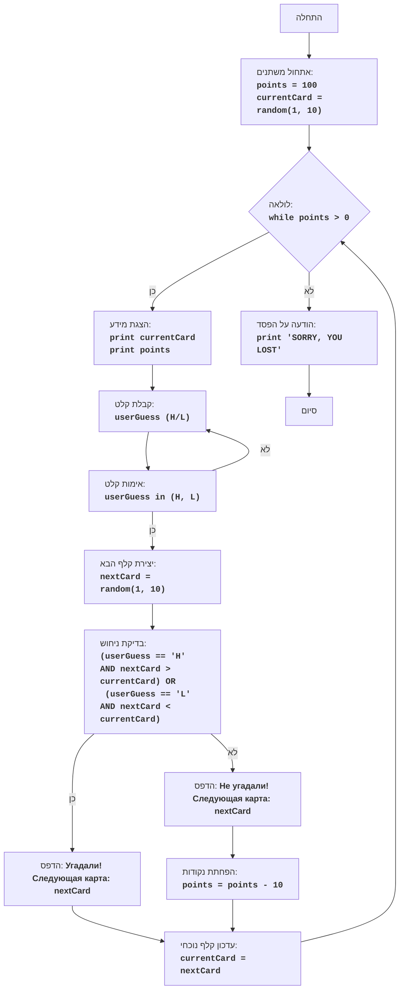

# ניתוח קוד: משחק "ACE"

## 1. <algorithm>

**תיאור אלגוריתם:**

1. **אתחול משתנים:**
    *   `points` מקבל ערך התחלתי של 100 (מספר הנקודות של השחקן).
    *   `currentCard` מקבל ערך אקראי בין 1 ל-10 (הקלף הנוכחי).
    *   _דוגמה:_ `points = 100`, `currentCard = 7`.
2. **לולאה ראשית (כל עוד `points` > 0):**
    *   **הצגת מידע:**
        *   הדפסת הקלף הנוכחי (`currentCard`).
        *   הדפסת מספר הנקודות הנוכחי (`points`).
        *   _דוגמה:_ `Текущая карта: 7`, `Ваши очки: 100`.
    *   **קבלת ניחוש מהמשתמש:**
        *   קבלת קלט מהמשתמש האם הקלף הבא יהיה גבוה יותר (`H`) או נמוך יותר (`L`).
        *   _דוגמה:_ `userGuess = "H"`.
        *   **אימות קלט:**
          *   לולאה מוודאת שהקלט הוא "H" או "L" ואם לא, מבקשת מהמשתמש להזין שוב.
    *   **יצירת קלף הבא:**
        *   יצירת קלף אקראי חדש בין 1 ל-10 (`nextCard`).
        *   _דוגמה:_ `nextCard = 3`.
    *   **בדיקת הניחוש:**
        *   אם המשתמש ניחש נכון (בחר `H` ו`nextCard` > `currentCard` או בחר `L` ו`nextCard` < `currentCard`) - לא קורה דבר, המשחק ממשיך.
        *   _דוגמה:_ אם `userGuess = "L"` וגם `nextCard = 3` < `currentCard = 7`,  לא משנים נקודות, עוברים לקלף הבא.
        *   אם המשתמש ניחש לא נכון:
            *   הפחתת 10 נקודות מ`points`.
            *   _דוגמה:_ אם `userGuess = "H"` וגם `nextCard = 3` לא גדול מ- `currentCard = 7`, אז `points = 90`.
    *   **עדכון הקלף הנוכחי:**
        *   `currentCard` מקבל את הערך של `nextCard`.
        *    _דוגמה:_ `currentCard = 3`.
3. **סיום המשחק:**
    *   כאשר `points` מגיע ל-0, הלולאה מסתיימת.
    *   הדפסת הודעת "SORRY, YOU LOST".

## 2. <mermaid>

**הסבר על התלויות:**

*   הקוד משתמש במודול `random` כדי ליצור מספרים אקראיים, מה שהופך את המשחק לבלתי צפוי.
*   אין תלויות אחרות מהקובץ `header.py`, לכן, התרשים הנוסף לא רלוונטי.

## 3. <explanation>

**ייבוא (Imports):**

*   `import random`: ייבוא מודול `random` לצורך יצירת מספרים אקראיים. המודול הזה מספק פונקציות כמו `randint` המשמשות להגרלת ערכי הקלפים.

**משתנים (Variables):**

*   `points`: משתנה מסוג שלם (integer) המייצג את מספר הנקודות של השחקן, ערכו ההתחלתי 100.
*   `currentCard`: משתנה מסוג שלם (integer) המייצג את הקלף הנוכחי, ערכו מאותחל על ידי פונקציה אקראית בין 1 ל-10.
*   `userGuess`: משתנה מסוג מחרוזת (string) המכיל את הניחוש של המשתמש: "H" (גבוה) או "L" (נמוך), לאחר המרה לאותיות גדולות.
*   `nextCard`: משתנה מסוג שלם (integer) המייצג את הקלף הבא שנוצר באופן אקראי.

**פונקציות (Functions):**

*   `random.randint(a, b)`: פונקציה מהמודול `random` המקבלת שני מספרים שלמים `a` ו-`b` ומחזירה מספר שלם אקראי בין `a` ל-`b`, כולל.

**הסבר מפורט:**

*   הקוד מממש משחק ניחושים פשוט שבו השחקן צריך לנחש האם הקלף הבא יהיה גבוה או נמוך מהקלף הנוכחי.
*   המשחק מתחיל עם 100 נקודות, ומפחית 10 נקודות בכל פעם שהמשתמש טועה.
*   הלולאה `while points > 0:` ממשיכה עד שנקודות השחקן מגיעות ל-0.
*   הקוד מבקש מהמשתמש קלט ומאמת את התקינות שלו על ידי לולאה נוספת, כדי להבטיח שהקלט יהיה "H" או "L".
*   הקוד משתמש בפונקציה `random.randint(1, 10)` כדי ליצור קלפים אקראיים (מספרים בין 1 ל-10).
*   הלוגיקה של הניחוש נבדקת בתנאי `if` מורכב, שקובע האם השחקן צדק או טעה בניחושו.

**בעיות אפשריות או תחומים לשיפור:**

*   **ממשק משתמש:** המשחק משתמש בממשק טקסטואלי פשוט. ניתן לשפר אותו באמצעות ממשק משתמש גרפי (GUI).
*   **משחק אינטראקטיבי:** המשחק פשוט מאוד וחוזר על אותה פעולה. ניתן להוסיף מורכבות כמו בחירת מספר הסיבובים, או סוגי קלפים שונים.
*   **טיפול בקלט שגוי:** למרות שישנה לולאה לאימות קלט, אפשר להוסיף טיפול חריגות (try-except) כדי למנוע קריסה של התוכנית במקרה של קלט שגוי אחר.

**שרשרת קשרים עם חלקים אחרים בפרויקט:**

*   לפי המיקום של הקובץ `hypotez/src/endpoints/ai_games/101_basic_computer_games/ru/GAMES/LETTER/letter.py`, ניתן להבין כי הקובץ הוא חלק מתוך פרויקט של משחקי בינה מלאכותית בסיסיים, ספציפית בשפה הרוסית ובתיקייה של משחק הניחושים באותיות.
*   אין תלות ישירה בחלקים אחרים של הפרויקט בתוך הקוד הנוכחי, אבל זהו חלק מתוך סדרה של משחקים, כך שאפשר לצפות לתלות עקיפה (למשל, קוד משותף להצגת משחקים או ניהול משתמשים).