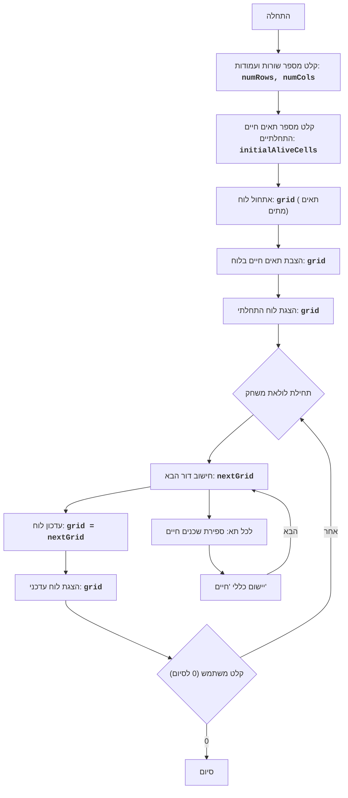

## <algorithm>

1. **התחלה:**
   - התוכנית מתחילה את פעולתה.

2. **קלט מימדי לוח:**
   - המשתמש מתבקש להזין את מספר השורות (`numRows`) ואת מספר העמודות (`numCols`) של לוח המשחק.
   - דוגמה: `numRows = 5`, `numCols = 7`

3. **קלט מספר תאים חיים:**
   - המשתמש מתבקש להזין את מספר התאים החיים ההתחלתיים (`initialAliveCells`).
   - דוגמה: `initialAliveCells = 10`

4. **אתחול לוח משחק:**
   - נוצר לוח משחק (`grid`) כרשימה דו-ממדית, שבה כל תא מאותחל למצב "מת" (רווח).
   - דוגמה: אם `numRows = 3`, `numCols = 3` אז הלוח יאותחל כך:
     ```
     [
      [' ', ' ', ' '],
      [' ', ' ', ' '],
      [' ', ' ', ' ']
     ]
     ```

5. **הצבת תאים חיים:**
   - התוכנית בוחרת באופן אקראי מיקומים בלוח ומשנה את מצב התאים ל"חי" (כוכבית) עד שמספר התאים החיים שווה ל-`initialAliveCells`.
   - דוגמה: ייתכן ש-10 התאים החיים ימוקמו באופן אקראי בלוח.

6. **הצגת לוח התחלתי:**
   - הלוח ההתחלתי עם התאים החיים מודפס למסך.

7. **לולאת משחק:**
   - מתחילה לולאה אינסופית שתמשיך עד שהמשתמש יזין "0".

8. **חישוב הדור הבא:**
   - נוצר לוח חדש (`nextGrid`) על ידי העתקת הלוח הנוכחי (`grid`).

9. **מעבר על כל תא:**
   - התוכנית עוברת על כל תא בלוח הנוכחי (`grid`).

10. **ספירת שכנים חיים:**
    - עבור כל תא, התוכנית סופרת את מספר השכנים החיים שלו. השכנים נחשבים לתאים שנמצאים לידו - למעלה, למטה, ימינה, שמאלה ובאלכסונים.
    - דוגמה: אם לתא מסוים יש 3 שכנים חיים, הערך יהיה 3.

11. **יישום כללי המשחק:**
    - התוכנית מחילה את כללי המשחק של "חיים" על כל תא בלוח, וקובעת את מצב התא בלוח החדש (`nextGrid`).
      - אם תא חי עם 2 או 3 שכנים חיים נשאר חי.
      - אם תא חי עם פחות מ-2 שכנים חיים מת.
      - אם תא חי עם יותר מ-3 שכנים חיים מת.
      - אם תא מת עם 3 שכנים חיים הופך לחי.

12. **עדכון לוח המשחק:**
    - הלוח הנוכחי (`grid`) מוחלף בלוח החדש (`nextGrid`).

13. **הצגת לוח עדכני:**
    - הלוח המעודכן מודפס למסך.

14. **קלט משתמש להמשך:**
    - המשתמש מתבקש להזין קלט:
      - אם הקלט הוא "0", הלולאה מסתיימת והתוכנית מסתיימת.
      - אחרת, הלולאה ממשיכה לשלב 8.

15. **סיום:**
    - התוכנית מסיימת את פעולתה.

## <mermaid>



## <explanation>

**ייבואים (Imports):**

- אין ייבוא ספציפי בקוד זה. הקוד פועל עצמאית ללא תלות בספריות חיצוניות או מודולים אחרים בפרויקט.

**משתנים (Variables):**
- `numRows` (מספר שורות): משתנה מסוג שלם המייצג את מספר השורות בלוח המשחק.
- `numCols` (מספר עמודות): משתנה מסוג שלם המייצג את מספר העמודות בלוח המשחק.
- `initialAliveCells` (מספר תאים חיים התחלתיים): משתנה מסוג שלם המייצג את מספר התאים החיים ההתחלתיים שיוצבו בלוח.
- `grid` (לוח המשחק): משתנה מסוג רשימה דו-ממדית של מחרוזות, המייצג את מצב הלוח בכל רגע נתון. כל תא יכול להיות או ' ' (מת) או '*' (חי).
- `nextGrid` (לוח הדור הבא): משתנה מסוג רשימה דו-ממדית של מחרוזות, המייצג את מצב הלוח בדור הבא.
- `row`, `col` (קואורדינטות של תא): משתנים מסוג שלם המשמשים לגישה לתאים ספציפיים בלוח המשחק.
- `neighbors` (מספר שכנים חיים): משתנה מסוג שלם המייצג את מספר השכנים החיים של תא נתון.

**פונקציות (Functions):**
- אין פונקציות מוגדרות בקוד זה. כל הלוגיקה מבוצעת ישירות בתוך הלולאה הראשית.

**הסברים מפורטים:**

1. **קלט והגדרות ראשוניות:**
   - הקוד מתחיל בקבלת מספר השורות והעמודות מן המשתמש, מה שקובע את גודל לוח המשחק. בנוסף, מתבקש המשתמש להזין את מספר התאים החיים ההתחלתיים, ומשתנים אלו מאוחסנים לשימוש בשלבים הבאים של הקוד.
2. **אתחול הלוח:**
   - הלוח מאותחל כרשימה דו-ממדית של תאים, שכולם מאותחלים למצב "מת" (רווח). לאחר מכן, מבוצעת הצבת מספר התאים החיים באופן אקראי בלוח.
3. **לולאת המשחק:**
   - הלולאה האינסופית מבצעת חישוב של הדור הבא של הלוח. בכל איטרציה של הלולאה, הקוד עובר על כל תא בלוח הנוכחי וסופר את מספר השכנים החיים שלו. לאחר מכן, הוא מחיל את כללי המשחק של "חיים" כדי לקבוע את מצבו של התא בדור הבא. לאחר מכן, הלוח המעודכן מוצג למשתמש, ומבקשים מהמשתמש להזין קלט להמשך.
4. **ספירת שכנים וכללי משחק:**
  - לכל תא, נספרים השכנים החיים שלו. לאחר מכן, מיושמים הכללים של משחק "חיים" כדי לקבוע אם תא חי ימשיך לחיות, ימות או שתא מת יהפוך לחי. החישוב מבוסס על מספר השכנים החיים של התא.
5.  **קלט משתמש וסיום:**
   - התוכנית מסתיימת רק אם המשתמש מזין "0", אחרת, התוכנית ממשיכה את סימולציית המשחק.

**בעיות אפשריות או תחומים לשיפור:**

1.  **העדר פונקציות:**  הקוד כולו נמצא בתוך לולאה אחת גדולה, דבר המקשה על הקריאות והתחזוקה. פיצול הקוד לפונקציות קטנות, לדוגמה, פונקציה לספירת שכנים ופונקציה לעדכון הלוח, ישפרו את קריאות הקוד.
2.  **לוגיקה קשיחה:**  הקוד משתמש בערכים קשיחים, כגון תאים חיים המסומנים ב"*". יש לשקול שימוש בקבועים כדי להגדיר אותם.
3.  **אופטימיזציה:** סימולציית המשחק יכולה להיות איטית עבור לוחות גדולים. יש לשקול שימוש בטכניקות אופטימיזציה, כמו שימוש במערכים במקום ברשימות דו-ממדיות.
4.  **בדיקות קלט:**  הקוד לא כולל בדיקות קלט על המספרים שמוזנים על ידי המשתמש (כגון גודל הלוח או מספר התאים החיים). יש להוסיף בדיקות קלט כדי למנוע שגיאות בזמן ריצה.
5.  **אפשרויות מתקדמות:** הקוד יכול לכלול אפשרויות מתקדמות יותר כמו, בחירה של צורות התחלתיות, שליטה בקצב ההתקדמות, אפשרות שמירת מצב המשחק.

**שרשרת קשרים עם חלקים אחרים בפרויקט:**

- אין קשרים ספציפיים לחלקים אחרים בפרויקט בגלל שזה משחק עצמאי, אם זאת, ניתן להרחיב ולשלב אותו עם מערכת ניהול משחקים, שיעקוב אחר התקדמות, סטטיסטיקה ועוד.