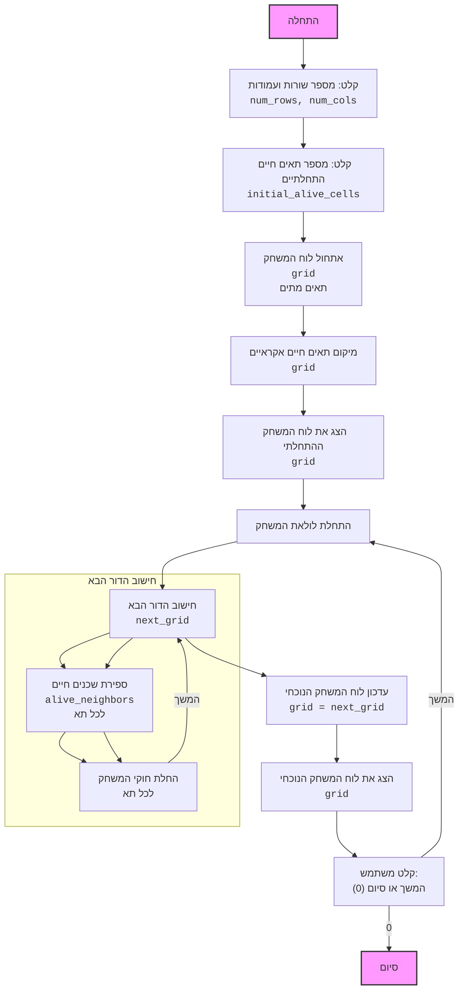

## <algorithm>

1.  **קבלת קלט משתמש**:
    *   התוכנית מתחילה בבקשת קלט מהמשתמש לגבי מספר השורות והעמודות של לוח המשחק.
    *   לדוגמה, המשתמש מזין `5` עבור שורות ו-`7` עבור עמודות.
    *   התוכנית גם מבקשת מהמשתמש את מספר התאים החיים ההתחלתיים.
    *   לדוגמה, המשתמש מזין `10` כתאים חיים התחלתיים.

2.  **אתחול לוח המשחק**:
    *   פונקציה `initialize_grid(num_rows, num_cols)` יוצרת לוח משחק (grid) מלא בתאים מתים ( ' ' ).
    *   לדוגמה, עבור `num_rows=5` ו- `num_cols=7`, נוצר לוח 5x7, כאשר כל תא הוא ' '.
    *   הפלט הוא רשימה דו-ממדית (list of lists) המייצגת את הלוח.

3.  **מיקום תאים חיים התחלתיים**:
    *   פונקציה `place_alive_cells(grid, initial_alive_cells)` ממקמת את מספר התאים החיים שהוגדר על ידי המשתמש באופן אקראי על גבי הלוח.
    *   לדוגמה, אם `initial_alive_cells` הוא `10`, 10 תאים אקראיים בלוח ישנו את ערכם ל-* (תא חי).
    *   הפונקציה מוודאת שלא ימוקמו תאים חיים על גבי תאים חיים קיימים.

4.  **הצגת לוח המשחק ההתחלתי**:
    *   פונקציה `display_grid(grid)` מציגה את מצב הלוח ההתחלתי על המסך, כל שורה מודפסת בשורה נפרדת.
    *   לדוגמה, הפלט יציג את הלוח עם מיקום אקראי של תאים חיים.

5.  **לולאת משחק**:
    *   מתחיל מחזור אינסופי (while True) שממשיך עד שהמשתמש יחליט לסיים.

6.  **חישוב הדור הבא**:
    *   פונקציה `compute_next_generation(grid)` מחשבת את מצב הלוח בדור הבא על סמך הכללים של משחק החיים.
    *   פונקציה זו יוצרת עותק של הלוח הנוכחי (copy.deepcopy), ומכונה `next_grid`.
    *   פונקציה זו סורקת כל תא בלוח.
        *   פונקציה `count_alive_neighbors(grid, row, col)` סופרת את מספר השכנים החיים של כל תא.
        *   אם תא חי, הוא נשאר חי אם יש לו 2 או 3 שכנים חיים, אחרת הוא מת.
        *   אם תא מת, הוא נולד (הופך לחי) אם יש לו בדיוק 3 שכנים חיים.
    *   הפלט הוא הלוח של הדור הבא.

7.  **עדכון הלוח הנוכחי**:
    *   הלוח הנוכחי מוחלף בלוח של הדור הבא `grid = next_grid`.

8.  **הצגת הלוח המעודכן**:
    *   פונקציה `display_grid(grid)` מציגה את מצב הלוח המעודכן על המסך.

9.  **קלט משתמש להמשך המשחק**:
    *   התוכנית מבקשת מהמשתמש להזין קלט כדי להמשיך או לסיים את המשחק.
    *   אם המשתמש מזין '0', הלולאה נשברת והמשחק מסתיים, אחרת המשחק ממשיך.

## <mermaid>

## <explanation>

**ייבוא (Imports)**:

*   `import random`: משמש ליצירת מספרים אקראיים, בעיקר למיקום התאים החיים הראשוניים על לוח המשחק.
*   `import copy`: משמש ליצירת עותק עמוק (deep copy) של רשימה, במקרה זה, של לוח המשחק, כדי להבטיח שינויים בדור החדש לא ישפיעו על הדור הנוכחי במהלך החישוב.

**פונקציות (Functions)**:

1.  `initialize_grid(num_rows, num_cols)`:
    *   **פרמטרים**: `num_rows` (מספר שורות, int), `num_cols` (מספר עמודות, int).
    *   **ערך מוחזר**: `grid` (רשימה של רשימות, list of lists), המייצג את לוח המשחק, מלא בתאים מתים (" ").
    *   **מטרה**: יוצרת ומאחלת לוח משחק ריק (תאים מתים) בגודל שהוגדר על ידי המשתמש.

2.  `place_alive_cells(grid, initial_alive_cells)`:
    *   **פרמטרים**: `grid` (לוח המשחק, list of lists), `initial_alive_cells` (מספר תאים חיים התחלתיים, int).
    *   **ערך מוחזר**: None (שינוי ישיר ב-grid).
    *   **מטרה**: ממקמת את מספר התאים החיים ההתחלתיים שצוין על ידי המשתמש באופן אקראי על גבי הלוח.

3.  `display_grid(grid)`:
    *   **פרמטרים**: `grid` (לוח המשחק, list of lists).
    *   **ערך מוחזר**: None (פלט למסך).
    *   **מטרה**: מציגה את לוח המשחק על המסך באופן ברור, שורה אחר שורה.

4.  `count_alive_neighbors(grid, row, col)`:
    *   **פרמטרים**: `grid` (לוח המשחק, list of lists), `row` (מספר השורה של תא, int), `col` (מספר העמודה של תא, int).
    *   **ערך מוחזר**: `alive_neighbors` (מספר שכנים חיים, int).
    *   **מטרה**: סופרת את מספר השכנים החיים של תא מסוים בלוח. בודקת שכנים סביב התא, כולל אלכסוניים.

5.  `compute_next_generation(grid)`:
    *   **פרמטרים**: `grid` (לוח המשחק הנוכחי, list of lists).
    *   **ערך מוחזר**: `next_grid` (לוח המשחק של הדור הבא, list of lists).
    *   **מטרה**: מחשבת את מצב הלוח בדור הבא על סמך חוקי המשחק "החיים":
        *   תא חי עם פחות מ-2 שכנים חיים מת.
        *   תא חי עם 2 או 3 שכנים חיים נשאר חי.
        *   תא חי עם יותר מ-3 שכנים חיים מת.
        *   תא מת עם בדיוק 3 שכנים חיים נולד (הופך לחי).

**משתנים (Variables)**:

*   `num_rows`: (int) מספר השורות בלוח המשחק, נקלט מהמשתמש.
*   `num_cols`: (int) מספר העמודות בלוח המשחק, נקלט מהמשתמש.
*   `initial_alive_cells`: (int) מספר התאים החיים ההתחלתיים, נקלט מהמשתמש.
*   `grid`: (list of lists) מייצג את לוח המשחק, משתנה בכל דור.
*   `next_grid`: (list of lists) מייצג את לוח המשחק של הדור הבא, מחושב על בסיס `grid`.
*   `alive_neighbors`: (int) מספר השכנים החיים של תא מסוים, מחושב בתוך הפונקציה `count_alive_neighbors`.
*   `row`, `col`: (int) משמשים באינדקסים של השורות והעמודות בתוך ה-`grid` (בלולאות).
*   `user_input`: (str) משמש לאחסון קלט המשתמש להמשך או סיום המשחק.

**בעיות אפשריות ותחומים לשיפור**:

*   **קלט משתמש**: הקוד לא מבצע בדיקת תקינות על הקלט של המשתמש.
    *   המשתמש יכול להזין ערכים שליליים או שאינם מספרים, שיגרמו לשגיאות.
    *   צריך להוסיף בדיקות קלט כדי לוודא שהקלט תקין לפני השימוש בו.
*   **ביצועים**: לוח המשחק יכול להיות איטי יותר ככל שהגודל שלו גדל, במיוחד בפונקציה `compute_next_generation`.
    *   ניתן לשפר את הביצועים על ידי שימוש באלגוריתמים יעילים יותר או בספריות מתמטיות שונות.
*   **ממשק משתמש**: המשחק משתמש בפלט טקסטואלי בלבד.
    *   אפשר לשפר את חוויית המשתמש על ידי שימוש בממשק גרפי (GUI) או בייצוג ויזואלי טוב יותר של המשחק.

**שרשרת קשרים עם חלקים אחרים בפרויקט**:

*   במקרה הנוכחי, אין קשרים ישירים עם חלקים אחרים בפרויקט, מכיוון שזה קובץ יחיד ועומד בפני עצמו.
*   אם הפרויקט היה גדול יותר, ייתכן שהיה צורך ליצור מחלקות נפרדות לניהול לוח המשחק, חוקי המשחק וכו'.
*   אפשר היה ליצור מחלקה האחראית לגרפיקה ולתצוגה, ולחבר אותה אל לוגיקת המשחק.