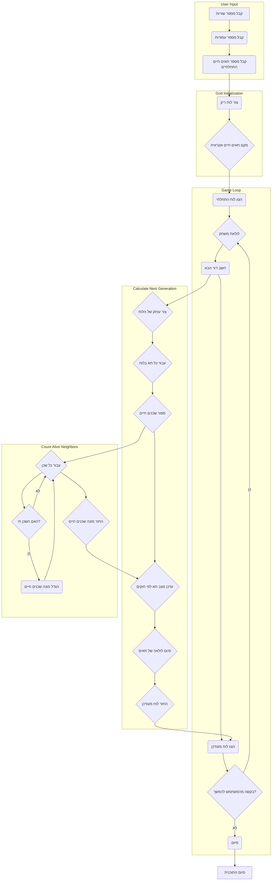

## <algorithm>

1. **קבלת גודל הלוח וספירת תאים חיים מהמשתמש:**
    - המשתמש מתבקש להזין את מספר השורות והעמודות עבור לוח המשחק.
    - לדוגמה, אם המשתמש מזין 5 שורות ו-7 עמודות, הלוח יהיה בגודל 5x7.
    - המשתמש מתבקש להזין את מספר התאים החיים ההתחלתיים.
    - לדוגמה, אם המשתמש מזין 10 תאים חיים, יהיו 10 תאים חיים בהתחלה.

2. **אתחול הלוח:**
    - לוח משחק נוצר עם תאים מתים (`' '`).
    - לדוגמה, לוח בגודל 3x3 יאותחל כך:
      ```
      [[' ', ' ', ' '],
       [' ', ' ', ' '],
       [' ', ' ', ' ']]
      ```

3. **הצבת תאים חיים באופן אקראי:**
    - התאים החיים (`'*'`) ממוקמים באופן אקראי בלוח.
    - לדוגמה, אם צריך למקם 3 תאים חיים, ייתכן שהם ימוקמו כך:
      ```
      [[' ', '*', ' '],
       [' ', ' ', '*'],
       ['*', ' ', ' ']]
      ```

4. **הצגת הלוח ההתחלתי:**
    - הלוח ההתחלתי מוצג למשתמש.
    - לדוגמה, הלוח מהשלב הקודם יוצג כך:
    ```
    *   
      *  
     *  
    ```

5. **לולאה ראשית של המשחק:**
    - המשחק נכנס ללולאה אינסופית, הממשיכה עד שהמשתמש בוחר לסיים.

6. **חישוב הדור הבא:**
    - הדור הבא של תאי המשחק מחושב על בסיס חוקי המשחק:
        - נוצר עותק של הלוח הנוכחי.
        - עבור כל תא בלוח, נספרים מספר השכנים החיים.
        - בהתאם למספר השכנים, מצבו של התא בדור הבא נקבע:
            - תא חי עם 2 או 3 שכנים חיים נשאר חי.
            - תא חי עם פחות מ-2 שכנים חיים מת.
            - תא חי עם יותר מ-3 שכנים חיים מת.
            - תא מת עם בדיוק 3 שכנים חיים הופך לחי.
    - לדוגמה, אם לוח מסוים נראה כך:
      ```
       [[' ', '*', ' '],
        ['*', '*', '*'],
        [' ', '*', ' ']]
      ```
    -  אז לוח הבא יהיה ככה :
      ```
      [['*', '*', '*'],
        ['*', ' ', '*'],
        ['*', '*', '*']]
      ```

7. **הצגת הלוח המעודכן:**
    - הלוח לאחר הדור הבא מוצג למשתמש.
    - לדוגמה, הלוח מהשלב הקודם יוצג כך:
       ```
    * * *
    *   *
    * * *
       ```
8. **בקשה ממשתמש להמשך או סיום:**
    - המשתמש מתבקש ללחוץ אנטר כדי להמשיך או להזין "0" כדי לסיים.

9. **סיום המשחק:**
    - אם המשתמש הזין "0", הלולאה מסתיימת והמשחק נגמר.

## <mermaid>



## <explanation>

**ייבואים (Imports):**

-   `import random`: משמש ליצירת מספרים אקראיים לצורך מיקום תאים חיים בלוח באופן אקראי. הוא אינו קשור ישירות לחבילות `src.` אחרות.
-   `import copy`: מספק פונקציות ליצירת עותקים עמוקים של אובייקטים, במקרה הזה לוחות המשחק. זה מאפשר למנוע שינוי של הלוח המקורי בזמן חישוב הדור הבא. גם מודול זה לא קשור לתיקיית `src.`.

**פונקציות (Functions):**

1.  **`initialize_grid(num_rows, num_cols)`:**
    -   **פרמטרים:**
        -   `num_rows` (int): מספר השורות בלוח.
        -   `num_cols` (int): מספר העמודות בלוח.
    -   **ערך מוחזר:**
        -   `grid` (list of lists): לוח משחק שמאותחל עם תאים מתים (' ').
    -   **מטרה:** יוצרת לוח דו-ממדי (רשימה של רשימות) בגודל הרצוי, עם כל התאים מוגדרים כמתים בתור התחלה.
    -   **דוגמה לשימוש:** `grid = initialize_grid(5, 5)` יוצר לוח 5x5.

2.  **`place_alive_cells(grid, initial_alive_cells)`:**
    -   **פרמטרים:**
        -   `grid` (list of lists): לוח המשחק.
        -   `initial_alive_cells` (int): מספר התאים החיים ההתחלתיים.
    -   **ערך מוחזר:** אין (הפונקציה משנה את הלוח ישירות).
    -   **מטרה:** ממקמת תאים חיים ('*') באופן אקראי על גבי הלוח, בהתאם למספר התאים החיים שצוין.
    -   **דוגמה לשימוש:** `place_alive_cells(grid, 10)` ממקמת 10 תאים חיים באופן אקראי על הלוח.

3.  **`display_grid(grid)`:**
    -   **פרמטרים:**
        -   `grid` (list of lists): לוח המשחק.
    -   **ערך מוחזר:** אין (הפונקציה מדפיסה לפלט).
    -   **מטרה:** מציגה את לוח המשחק למסך.
    -   **דוגמה לשימוש:** `display_grid(grid)` מציגה את הלוח.

4.  **`count_alive_neighbors(grid, row, col)`:**
    -   **פרמטרים:**
        -   `grid` (list of lists): לוח המשחק.
        -   `row` (int): אינדקס השורה של התא.
        -   `col` (int): אינדקס העמודה של התא.
    -   **ערך מוחזר:**
        -   `alive_neighbors` (int): מספר השכנים החיים של התא.
    -   **מטרה:** מחשבת כמה שכנים חיים יש לתא מסוים בלוח, כולל שכנים באלכסון.
    -   **דוגמה לשימוש:** `count_alive_neighbors(grid, 2, 2)` מחזירה את מספר השכנים החיים של התא בשורה 2 עמודה 2.

5.  **`compute_next_generation(grid)`:**
    -   **פרמטרים:**
        -   `grid` (list of lists): לוח המשחק הנוכחי.
    -   **ערך מוחזר:**
        -   `next_grid` (list of lists): לוח המשחק של הדור הבא.
    -   **מטרה:** מחשבת את הדור הבא של המשחק לפי חוקי המשחק:
        -   תא חי עם 2 או 3 שכנים חיים נשאר חי.
        -   תא חי עם פחות מ-2 שכנים חיים מת.
        -   תא חי עם יותר מ-3 שכנים חיים מת.
        -   תא מת עם בדיוק 3 שכנים חיים הופך לחי.
    -   **דוגמה לשימוש:** `next_grid = compute_next_generation(grid)` מחשב את הדור הבא של הלוח.

**משתנים (Variables):**

-   `num_rows` (int): מספר השורות בלוח שהמשתמש קבע.
-   `num_cols` (int): מספר העמודות בלוח שהמשתמש קבע.
-   `initial_alive_cells` (int): מספר התאים החיים ההתחלתיים שהמשתמש קבע.
-   `grid` (list of lists): לוח המשחק הנוכחי.
-   `next_grid` (list of lists): לוח המשחק של הדור הבא.
-   `row` (int): אינדקס השורה.
-   `col` (int): אינדקס העמודה.
-   `user_input` (str): קלט מהמשתמש.

**בעיות אפשריות או תחומים לשיפור:**

1.  **קלט משתמש:** אין בדיקה לקלט משתמש. למשל, יכולים להכניס מספר שלילי או אותיות, דבר שיגרום לשגיאה. מומלץ להוסיף טיפול בשגיאות ובדיקות קלט.
2.  **גודל הלוח:** יכולים להגדיר לוחות מאוד גדולים, דבר שייקח הרבה זמן חישוב, במיוחד אם יש הרבה תאים חיים. אפשר להוסיף הגבלה לגודל הלוח.
3.  **יציבות:** אין בדיקה אם המשחק נכנס למצב יציב, ואז אין שינויים יותר. אפשר להוסיף בדיקה כזו ולסיים את המשחק אם אין שינוי.

**שרשרת קשרים עם חלקים אחרים בפרויקט:**

-   אין קשר ישיר עם חלקים אחרים בפרויקט מכיוון שהקוד עצמאי ואינו משתמש במודולים נוספים מתוך הפרויקט. הקוד לא קשור לתיקיית `src.`.