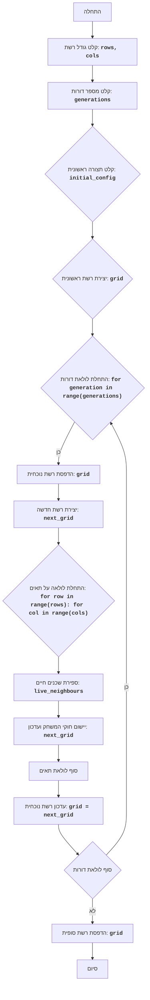

## ניתוח קוד: משחק החיים (LIFE)

### 1. <algorithm>

הקוד מיישם את משחק החיים של קונוויי, סימולציה של אוטומט סלולרי שבו התאים חיים או מתים בהתאם למצב של השכנים שלהם. הנה תרשים זרימה שלבי:

1. **קלט גודל רשת:**
   - המשתמש מתבקש להזין את מספר השורות והעמודות עבור לוח המשחק.
   - לדוגמה: `rows = 5`, `cols = 10`.

2. **קלט מספר דורות:**
   - המשתמש מתבקש להזין את מספר הדורות לסימולציה.
   - לדוגמה: `generations = 20`.

3. **קלט תצורה ראשונית (אופציונלי):**
   - המשתמש יכול להזין תצורה ראשונית של תאים חיים ומתים.
   - אם לא מסופק, הרשת מאוכלסת באופן אקראי.
   - לדוגמה:
     ```
     initial_config = [
       "          ",
       "  *    *  ",
       "   ***   ",
       "  *    *  ",
       "          "
     ]
     ```

4. **יצירת רשת ראשונית:**
   - אם סופקה תצורה ראשונית, הרשת מאותחלת לפי הקלט.
   - אחרת, הרשת מאותחלת באופן אקראי עם תאים חיים או מתים.
   - לדוגמה: רשת של 5x10 שורות ועמודות עם תאים חיים `*` או מתים ` `

5. **לולאה ראשית (דורות):**
   - לולאה שחוזרת על עצמה עבור כל דור בסימולציה.
   - `for generation in range(generations):`

6. **הדפסת הרשת הנוכחית:**
   - מדפיס את מצב הרשת הנוכחי למסך.
   - הדפסת הרשת הנוכחית לדוגמה:
     ```
     ..........
     ..*....*..
     ...***...
     ..*....*..
     ..........
     ```

7. **יצירת רשת חדשה (דור הבא):**
   - יוצר רשת חדשה בגודל זהה לרשת הנוכחית.

8. **לולאה על תאים:**
   - עבור כל תא ברשת:
     - `for row in range(rows): for col in range(cols):`

9. **ספירת שכנים חיים:**
   - סופר את מספר השכנים החיים מסביב לתא הנוכחי.
   - שכנים מוגדרים ככל התאים הסמוכים (8 תאים בסך הכל).

10. **יישום חוקי המשחק:**
    - בהתאם למספר השכנים החיים של התא הנוכחי:
    - אם תא חי:
      - אם יש פחות מ-2 שכנים חיים, התא מת (מבודד).
      - אם יש 2 או 3 שכנים חיים, התא נשאר חי.
      - אם יש יותר מ-3 שכנים חיים, התא מת (צפיפות).
    - אם תא מת:
      - אם יש בדיוק 3 שכנים חיים, התא מתעורר לחיים.
    - מצב התא החדש נשמר ברשת החדשה.

11. **סוף לולאת תאים:**
    - חוזר על שלבים 8-10 עבור כל התאים ברשת.

12. **עדכון הרשת הנוכחית:**
    - מחליף את הרשת הנוכחית ברשת החדשה (דור הבא).
    - `grid = next_grid`

13. **סוף לולאת דורות:**
    - חוזר על שלבים 6-12 עבור כל הדורות.

14. **הדפסת הרשת הסופית:**
    - מדפיס את מצב הרשת הסופי לאחר השלמת כל הדורות.

### 2. <mermaid>


 
אין תלויות מיובאות בקוד זה, לכן אין צורך בניתוח תלויות.

### 3. <explanation>

-   **ייבואים (Imports):**
     -   אין ייבואים בקוד הזה.
-   **משתנים (Variables):**
     -   `rows`: מספר השורות של הרשת. מסוג `int`.
     -   `cols`: מספר העמודות של הרשת. מסוג `int`.
     -   `generations`: מספר הדורות לסימולציה. מסוג `int`.
     -   `initial_config`: תצורה ראשונית של תאים חיים/מתים (אופציונלי), מסוג `list` של `strings`.
     -   `grid`: רשימה דו-ממדית (רשימה של רשימות) המייצגת את המצב הנוכחי של הרשת, כל תא הוא `*` או ` `.
     -   `next_grid`: רשימה דו-ממדית (רשימה של רשימות) המייצגת את המצב הבא של הרשת, כל תא הוא `*` או ` `.
     -   `generation`: מונה איטרציה של לולאת הדורות, מסוג `int`.
     -   `row`, `col`: מונה איטרציה של לולאות התאים, מסוג `int`.
     -   `live_neighbours`: מספר השכנים החיים של תא מסוים, מסוג `int`.
-   **פונקציות (Functions):**
     -   אין פונקציות מוגדרות בקוד זה, כל הלוגיקה ממומשת בתוך הלולאות.
-   **הסברים נוספים:**
     -   הקוד מתחיל בקבלת קלט מהמשתמש לגבי גודל הרשת ומספר הדורות.
     -   לאחר מכן, הוא יוצר את הרשת הראשונית, בין אם על ידי קריאת קלט מהמשתמש או על ידי יצירה אקראית.
     -   הלולאה הראשית (דורות) עוברת על כל דור, מדפיסה את מצב הרשת הנוכחי ויוצרת את הדור הבא לפי חוקי המשחק.
     -   הקוד משתמש בלולאות מקוננות כדי לעבור על כל תא ברשת, לספור את מספר השכנים החיים ולהחיל את חוקי המשחק כדי לקבוע את מצב התא בדור הבא.
     -   הקוד משתמש ברשימות דו-ממדיות כדי לייצג את הרשת, שבה כל תא יכול להיות חי (`*`) או מת (` `).
-   **בעיות אפשריות ותחומים לשיפור:**
    - אין בדיקות קלט משמעותיות, כך שקלט שגוי עלול לגרום לקריסה.
    - קשה לקרוא את הקוד מכיוון שהוא לא מאורגן בתוך פונקציות.
    - אפשר להוסיף פונקציות ספציפיות לחישוב שכנים וליישום חוקי המשחק.
    - אפשר לשפר את ממשק המשתמש (UI), למשל על ידי שימוש בספריית גרפיקה.

**שרשרת קשרים עם חלקים אחרים בפרויקט:**

- הקוד הזה עומד בפני עצמו ואינו תלוי בחלקים אחרים של הפרויקט. עם זאת, הוא יכול להיות משולב במערכת רחבה יותר של משחקי AI, כאשר הוא משמש כמשחק נפרד.
- הקוד לא משתמש ישירות בספריית `src`, אבל הוא עשוי להיות ממוקם בתוך מבנה תיקיות המכיל חלקים אחרים של הפרויקט.