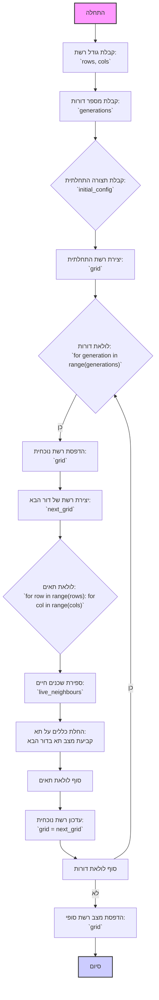

## ניתוח קוד: משחק החיים (Game of Life)

### 1. <algorithm>

**תרשים זרימה צעד-אחר-צעד:**

1. **התחלה:** התוכנית מתחילה בנקודת כניסה.
    - דוגמה: `if __name__ == "__main__": play_game_of_life()`

2. **קבלת גודל הרשת:** המשתמש מתבקש להכניס את מספר השורות והעמודות של הרשת.
    - דוגמה:
        - פלט למשתמש: "הזן מספר שורות: "
        - קלט מהמשתמש: 5
        - פלט למשתמש: "הזן מספר עמודות: "
        - קלט מהמשתמש: 10

3. **קבלת מספר דורות:** המשתמש מתבקש להכניס את מספר הדורות לסימולציה.
    - דוגמה:
        - פלט למשתמש: "הזן מספר דורות: "
        - קלט מהמשתמש: 20

4. **קבלת תצורה התחלתית:** המשתמש מתבקש לבחור האם להשתמש בתצורה התחלתית רנדומלית או להזין תצורה משלו.
    - דוגמה:
        - פלט למשתמש: "להשתמש בתצורה התחלתית רנדומלית (y/n)? "
        - קלט מהמשתמש: n
        - פלט למשתמש: "הזן תצורה התחלתית, באמצעות '*' עבור תאים חיים ו- ' ' עבור תאים מתים"
        - פלט למשתמש: "הזן כל שורה בנפרד:"
        - קלט מהמשתמש: "**   *****"
        - קלט מהמשתמש: "  * *   * "
        - ...

5. **יצירת רשת:** נוצרת רשת (grid) בהתאם לגודל שהוגדר ולתצורה ההתחלתית.
    - דוגמה:  אם תצורה התחלתית הוגדרה, הרשת תהיה בהתאם; אם לא, הרשת תמולא באופן רנדומלי עם תאים חיים ומתים.

6. **לולאת דורות:** התוכנית נכנסת ללולאה שחוזרת על עצמה עבור כל דור.
    - דוגמה: `for generation in range(generations):`

7. **הדפסת הרשת הנוכחית:** הרשת הנוכחית (grid) מודפסת למסך.
    - דוגמה:
        ```
        **   *****
          * *   *
        * * *    *
        ```

8. **יצירת רשת של הדור הבא:** נוצרת רשת חדשה (next_grid) עבור הדור הבא, תוך שימוש בכללי המשחק.
    - דוגמה:  פונקציית `next_generation` רצה על כל תא ברשת ומפעילה את הכללים כדי לקבוע אם התא יהיה חי או מת בדור הבא.

9. **לולאת תאים:** עוברים על כל התאים ברשת (כל שורה וכל עמודה).
   - דוגמה: `for row in range(rows): for col in range(cols):`

10. **ספירת שכנים חיים:** עבור כל תא, סופרים את מספר השכנים החיים.
     - דוגמה: אם תא נמצא ב-(2, 3), סופרים את השכנים החיים מסביבו.
   
11. **החלת הכללים:** הכללים של משחק החיים מיושמים על כל תא כדי לקבוע את מצבו בדור הבא.
    - דוגמה: אם תא חי ויש לו 2 או 3 שכנים חיים, הוא נשאר חי; אם תא מת ויש לו 3 שכנים חיים, הוא הופך לחי.

12. **עדכון הרשת הנוכחית:** הרשת הנוכחית (grid) מתעדכנת לרשת של הדור הבא (next_grid).
    - דוגמה: `grid = next_grid`

13. **המשך לולאת דורות:** אם ישנם עוד דורות, התהליך חוזר לשלב 7.

14. **סיום הסימולציה:** כאשר כל הדורות הסתיימו, התוכנית מדפיסה הודעה שהסימולציה הסתיימה ומדפיסה את מצב הרשת הסופי.
    - דוגמה:
        - פלט למשתמש: "סימולציה הושלמה"
        - פלט למשתמש: "מצב שדה סופי:"
        - פלט: הרשת הסופית.
        
15. **סיום:** התוכנית מסתיימת.

**זרימת נתונים:**

- המשתמש מספק נתונים (גודל רשת, מספר דורות, תצורה התחלתית).
- פונקציות (כגון `get_grid_size`, `get_generations`, `get_initial_config`, `create_grid`) מעבדות את הנתונים ומחזירות אותם.
- פונקציות (כגון `next_generation`, `count_live_neighbours`, `apply_rules`) מעבדות את הרשת ומעדכנות אותה.
- פונקציות (כגון `print_grid`) מדפיסות את הרשת.
- הערך של `grid` עובר עדכון בין דורות.

### 2. <mermaid>



**ניתוח תלויות:**

אין תלויות מיובאות נוספות מלבד `random` ו-`time`.

- `random`: משמש ליצירת תצורה התחלתית רנדומלית של הרשת, עם תאים חיים ומתים.
- `time`: משמש ליצירת השהיה קצרה בין הדורות כדי שהסימולציה תהיה ניתנת לצפייה.

### 3. <explanation>

**ייבואים (Imports):**

- `import random`: מאפשר ליצור מספרים אקראיים, המשמשים להחלטה האם תא יהיה חי או מת בתצורה התחלתית רנדומלית. אין לו קשר ישיר לחבילות אחרות בתוך `src.`, אך הוא סטנדרטי בסיטואציות אלו.
- `import time`: מאפשר להשהות את ביצוע התוכנית למשך זמן מסוים, המשמש כדי לאפשר למשתמש לראות כל דור בסימולציה לפני המעבר לדבר הבא. כמו `random`, זהו מודול סטנדרטי.

**פונקציות (Functions):**

- `get_grid_size()`:
    - פרמטרים: אין.
    - ערך מוחזר: טופל של מספר שורות ועמודות (rows, cols) כאינטג'ר.
    - מטרה: לקבל מהמשתמש את גודל הרשת, תוך בדיקה שהקלט הוא תקין (מספרים שלמים חיוביים).
    - דוגמה לשימוש: `rows, cols = get_grid_size()`

- `get_generations()`:
    - פרמטרים: אין.
    - ערך מוחזר: מספר הדורות כאינטג'ר.
    - מטרה: לקבל מהמשתמש את מספר הדורות לסימולציה, תוך בדיקה שהקלט הוא תקין (מספר שלם חיובי).
    - דוגמה לשימוש: `generations = get_generations()`

- `get_initial_config(rows, cols)`:
    - פרמטרים: מספר שורות (rows) ומספר עמודות (cols).
    - ערך מוחזר: רשימה של מחרוזות, המייצגות את השורות של תצורת הרשת ההתחלתית.
    - מטרה: לקבל מהמשתמש תצורה התחלתית, או להגריל אחת רנדומלית.
    - דוגמה לשימוש: `initial_config = get_initial_config(rows, cols)`

- `create_grid(rows, cols, initial_config=None)`:
    - פרמטרים: מספר שורות (rows), מספר עמודות (cols) ותצורה התחלתית אופציונלית (initial_config).
    - ערך מוחזר: רשימה של רשימות (grid), המייצגת את הרשת.
    - מטרה: ליצור את הרשת הראשונית על סמך גודל ותצורה נתונה, או ליצור רשת אקראית אם לא סופקה תצורה.
    - דוגמה לשימוש: `grid = create_grid(rows, cols, initial_config)`

- `print_grid(grid)`:
    - פרמטרים: רשימת רשימות (grid), המייצגת את הרשת.
    - ערך מוחזר: אין.
    - מטרה: להדפיס את הרשת למסך.
    - דוגמה לשימוש: `print_grid(grid)`

- `count_live_neighbours(grid, row, col)`:
    - פרמטרים: רשימת רשימות (grid), מספר שורה (row), ומספר עמודה (col).
    - ערך מוחזר: מספר השכנים החיים כאינטג'ר.
    - מטרה: לספור את מספר השכנים החיים של תא נתון ברשת.
    - דוגמה לשימוש: `live_neighbours = count_live_neighbours(grid, row, col)`

- `apply_rules(grid, row, col)`:
    - פרמטרים: רשימת רשימות (grid), מספר שורה (row), ומספר עמודה (col).
    - ערך מוחזר: מצב התא בדור הבא ('*' או ' ').
    - מטרה: ליישם את כללי המשחק על התא הנתון, ולהחזיר את המצב החדש שלו.
    - דוגמה לשימוש: `next_state = apply_rules(grid, row, col)`

- `next_generation(grid)`:
    - פרמטרים: רשימת רשימות (grid), המייצגת את הרשת.
    - ערך מוחזר: רשימת רשימות (new_grid), המייצגת את הדור הבא.
    - מטרה: ליצור רשת חדשה המייצגת את הדור הבא על ידי יישום הכללים על כל תא בדור הנוכחי.
    - דוגמה לשימוש: `new_grid = next_generation(grid)`

- `play_game_of_life()`:
    - פרמטרים: אין.
    - ערך מוחזר: אין.
    - מטרה: לנהל את כל מהלך המשחק, מקבלת הקלט ועד להדפסת הרשת הסופית.
    - דוגמה לשימוש: `play_game_of_life()`

**משתנים (Variables):**

- `rows`, `cols`: מספר השורות והעמודות של הרשת. סוג: אינטג'ר.
- `generations`: מספר הדורות לסימולציה. סוג: אינטג'ר.
- `initial_config`: תצורה התחלתית של הרשת. סוג: רשימה של מחרוזות.
- `grid`: רשימה של רשימות המייצגת את הרשת. סוג: רשימה של רשימות (כל איבר הוא מחרוזת).
- `live_neighbours`: מספר השכנים החיים של תא. סוג: אינטג'ר.
- `new_grid`: רשימה של רשימות המייצגת את הרשת בדור הבא. סוג: רשימה של רשימות (כל איבר הוא מחרוזת).
- `generation`: משתנה הלולאה של הדור הנוכחי. סוג: אינטג'ר.
- `row`, `col`: משתני הלולאה של התא הנוכחי. סוג: אינטג'ר.

**בעיות אפשריות ותחומים לשיפור:**

- **בדיקת קלט:** למרות שיש בדיקות קלט בסיסיות, ניתן להוסיף בדיקות קלט יותר מקיפות, כמו למשל לוודא שמספר התאים בשורות מתאים למספר העמודות שהוגדר.
- **ממשק משתמש:** הממשק כרגע טקסטואלי. ניתן ליצור ממשק גרפי כדי לשפר את חוויית המשתמש.
- **אופטימיזציה:** ניתן לייעל את הקוד באמצעות אלגוריתמים יותר יעילים לחישוב הדור הבא, במיוחד עבור רשתות גדולות.
- **שמירת מצבים:** אפשר להוסיף אפשרות לשמור את מצבי הרשת השונים כדי לנתח את ההתפתחות.

**שרשרת קשרים עם חלקים אחרים בפרויקט:**

אין ישירות קשר ישיר עם חלקים אחרים בתוך הפרויקט `src`, מכיוון שקוד זה עומד בפני עצמו ומכיל את כל הלוגיקה הדרושה להפעלתו. עם זאת, ניתן להשתמש בו כחלק מסימולציות מורכבות יותר, שבהן הרשת יכולה להיות חלק מסביבה גדולה יותר.