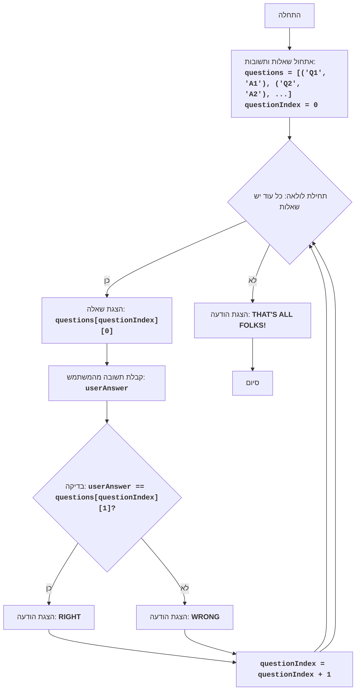

## הוראה:

נתח את הקוד שסופק בפירוט והסבר את הפונקציונליות שלו. התשובה צריכה לכלול שלושה חלקים:

1.  **<algorithm>**:
    תאר את תהליך העבודה של הקוד בתרשים זרימה צעד-אחר-צעד.
    *   הוסף דוגמאות לכל בלוק לוגי.
    *   הצג את הזרימה של נתונים בין פונקציות, מחלקות או שיטות.

2.  **<mermaid>**:
    כתוב את קוד התרשים בפורמט `mermaid`.
    *   נתח והסבר את כל התלויות המיובאות ביצירת התרשים.
    **חשוב!**: ודא שכל שמות המשתנים בתרשים `mermaid` הם בעלי משמעות ותיאור. שמות כמו `A`, `B`, `C` אסורים!

    **בנוסף**:
    אם הקוד כולל את השורה `import header`, הוסף תרשים זרימה בפורמט `mermaid` המתאר את `header.py`:
    ```mermaid
    flowchart TD
        Start --> Header[<code>header.py</code><br> קביעת שורש הפרויקט]

        Header --> import[ייבוא הגדרות גלובליות: <br><code>from src import gs</code>]
    ```

3.  **<explanation>**:
    ספק הסברים מפורטים:
    *   **ייבואים (Imports)**: המטרה שלהם והקשר שלהם עם חבילות `src.` אחרות.
    *   **מחלקות (Classes)**: התפקיד שלהן, המאפיינים, השיטות והאינטראקציה עם חלקים אחרים בפרויקט.
    *   **פונקציות (Functions)**: הפרמטרים, הערכים המוחזרים, המטרה ודוגמאות לשימוש.
    *   **משתנים (Variables)**: הסוג והשימוש שלהם.
    *   ציין בעיות אפשריות או תחומים לשיפור.

בנוסף, צור שרשרת קשרים עם חלקים אחרים בפרויקט (אם רלוונטי).

הדבר מבטיח ניתוח מקיף ומובנה של הקוד.
## פורמט התשובה: `.md` (markdown)
**סוף ההוראה**
<br>

## <algorithm>

1.  **אתחול שאלות ותשובות:**
    *   נוצר מבנה נתונים (לדוגמה, רשימה של טאפלים) המאחסן שאלות ותשובות מתאימות.
    *   דוגמה: `questions = [('מהי בירת צרפת?', 'פריז'), ('מהו המספר פאי?', '3.14')]`
    *   מוגדר משתנה `questionIndex` עם ערך התחלתי של 0, כדי לעקוב אחר השאלה הנוכחית.

2.  **לולאה ראשית (כל עוד יש שאלות):**
    *   הלולאה תרוץ כל עוד `questionIndex` קטן מאורך רשימת השאלות.
    *   דוגמה: אם `questions` מכיל 2 שאלות, הלולאה תרוץ 2 פעמים (עד ש-`questionIndex` יהיה שווה ל-2).

3.  **הצגת שאלה:**
    *   השאלה הנוכחית נשלפת מתוך רשימת השאלות באמצעות `questionIndex`.
    *   דוגמה: אם `questionIndex` הוא 0, תוצג השאלה הראשונה ברשימה (`questions[0][0]`, כלומר 'מהי בירת צרפת?').

4.  **קבלת תשובה מהמשתמש:**
    *   המשתמש מתבקש להזין תשובה, אשר נשמרת במשתנה `userAnswer`.
    *   דוגמה: המשתמש מקליד "פריז" וזה נשמר ב-`userAnswer`.

5.  **בדיקת תשובה:**
    *   התשובה שהזין המשתמש `userAnswer` מושווית לתשובה הנכונה, שנשלפה גם היא מרשימת השאלות באמצעות `questionIndex`.
    *   דוגמה: אם `userAnswer` הוא "פריז" והתשובה הנכונה היא גם "פריז", התשובה נכונה.

6.  **פלט בהתאם לתשובה:**
    *   אם התשובה נכונה, מוצגת ההודעה "RIGHT".
    *   אם התשובה לא נכונה, מוצגת ההודעה "WRONG".

7.  **קידום אינדקס:**
    *   הערך של `questionIndex` גדל ב-1, כך שבאיטרציה הבאה של הלולאה תוצג השאלה הבאה.

8.  **סיום המשחק:**
    *   לאחר שכל השאלות הוצגו, הלולאה מסתיימת.
    *   מוצגת ההודעה "THAT'S ALL FOLKS!".

## <mermaid>



**הסבר התלויות:**

*   אין תלויות מיובאות בקוד הזה. הוא מבוסס על לוגיקה פשוטה של זרימת נתונים והשוואה.
*   המשתנים בשרטוט Mermaid הם בעלי משמעות ומתארים את הפעולה שהם מייצגים.

## <explanation>

*   **ייבואים (Imports):**
    *   אין ייבואות בקוד זה. הוא עצמאי ואינו מסתמך על מודולים חיצוניים.

*   **מחלקות (Classes):**
    *   אין מחלקות בקוד זה. מדובר בקוד פרוצדורלי פשוט.

*   **פונקציות (Functions):**
    *   אין פונקציות בקוד זה. כל הלוגיקה ממוקמת בתוך התהליך הראשי.

*   **משתנים (Variables):**
    *   `questions`: רשימה של טאפלים, כאשר כל טאפל מכיל שאלה (מחרוזת) ותשובה (מחרוזת).
        *   דוגמה: `questions = [('מהי בירת ישראל?', 'ירושלים'), ('מי המציא את הטלפון?', 'אלכסנדר גרהם בל')]`
    *   `questionIndex`: משתנה מספרי שלם המשמש כאינדקס לגישה לשאלות ברשימת `questions`.
    *   `userAnswer`: משתנה מסוג מחרוזת המאחסן את התשובה שהזין המשתמש.

*   **הסברים מפורטים:**
    *   הקוד מיישם משחק טריוויה פשוט, שבו המחשב שואל שאלות והמשתמש עונה.
    *   השאלות והתשובות מאוחסנות ברשימה `questions`, מה שמקל על הוספה או שינוי של שאלות.
    *   המשחק מתנהל בלולאה, כאשר כל איטרציה מייצגת שאלה אחת.
    *   הקוד מציג משוב מיידי למשתמש על ידי הדפסת "RIGHT" או "WRONG" בהתאם לתשובה.
    *   הקוד מסתיים בהודעה "THAT'S ALL FOLKS!" לאחר שכל השאלות הוצגו.

*   **בעיות אפשריות ותחומים לשיפור:**
    *   **אימות קלט:** אין אימות קלט של התשובות, מה שעלול להוביל לתוצאות בלתי צפויות אם המשתמש יזין קלט לא תקין (לדוגמה, תשובה ריקה).
    *   **טיפול באותיות גדולות/קטנות:** ההשוואה בין תשובות היא רגישה לאותיות, כלומר "פריז" שונה מ"פריז". יש לשקול טיפול באותיות גדולות/קטנות, או להשוות את התשובות לאחר שהן הומרו לאותיות קטנות.
    *   **ממשק משתמש:** הממשק מאוד בסיסי, ניתן לשפר אותו על ידי הוספת עיצוב או תפריטים.
    *   **ניקוד:** אין ניקוד למשתמש. ניתן להוסיף ניקוד ולחשב את התוצאה הסופית.
    *   **אפשרות בחירה:** כרגע כל השאלות מופיעות ברצף קבוע, אפשר להוסיף אפשרות לבחור שאלות מקטגוריות שונות, או שאלות רנדומליות.

*   **שרשרת קשרים:**
    *   קוד זה עומד בפני עצמו ואינו קשור ישירות לחלקים אחרים בפרויקט, אלא אם כן משתמשים בו כחלק מאיזשהו משחק או מערכת גדולה יותר.