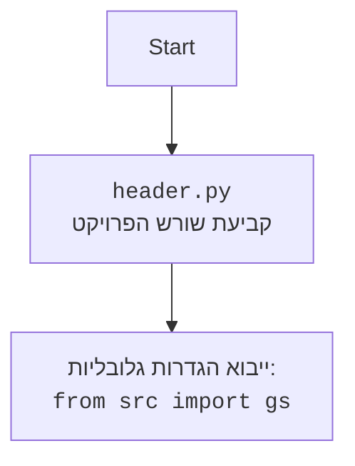

## <algorithm>

1. **התחלה:**
   - המשחק מתחיל עם הגדרת משתנה `isGameOver` כ-`False`.
   - דוגמה: `isGameOver = False`

2. **לולאת משחק:**
   - הלולאה מתחילה ורצה כל עוד `isGameOver` הוא `False`.
   - דוגמה: `while not isGameOver:`

3. **יצירת מספרים רנדומליים:**
   - נוצרים שני מספרים שלמים רנדומליים בין 1 ל-10.
   - דוגמה: `number1 = 5`, `number2 = 3`

4. **בחירת פעולה רנדומלית:**
   - נבחרת פעולה מתמטית רנדומלית מתוך רשימת הפעולות: "+", "-", "*", "/".
   - דוגמה: `operation = "*"`.

5. **יצירת ביטוי מתמטי:**
   - נוצר ביטוי מתמטי כמחרוזת המורכבת מהמספרים והפעולה שנבחרו.
   - דוגמה: `expression = "5 * 3"`

6. **הצגת הביטוי למשתמש:**
   - הביטוי המתמטי מוצג למשתמש.
   - דוגמה: "Решите: 5 * 3 = ?"

7. **קבלת תשובה מהמשתמש:**
   - התשובה מהמשתמש נקלטת כקלט וממירה למספר עשרוני.
   - דוגמה: `userAnswer = 15.0`.

8. **חישוב התוצאה הנכונה:**
   - התוצאה הנכונה של הביטוי המתמטי מחושבת באמצעות הפונקציה `eval()`.
   - דוגמה: `correctResult = 15`

9. **בדיקת תשובת המשתמש:**
   - התשובה שהזין המשתמש נבדקת האם היא שווה לתוצאה הנכונה.
   - אם התשובה נכונה:
     - מוצגת הודעה "CORRECT".
     - `isGameOver` מוגדר כ-`True` כדי לסיים את הלולאה.
   - אם התשובה אינה נכונה:
     - מוצגת הודעה "INCORRECT. TRY AGAIN.".

10. **סוף לולאת המשחק:**
    - אם `isGameOver` מוגדר כ-`True`, הלולאה מסתיימת.

11. **סוף:**
    - המשחק מסתיים.

## <mermaid>
```mermaid
flowchart TD
    Start["התחלה"] --> InitializeVariables["<p align='left'><code><b>isGameOver = False</b></code></p>"]
    InitializeVariables --> LoopStart{"<code><b>while not isGameOver:</b></code>"}
    LoopStart -- "True" --> GenerateNumbers["<p align='left'><code><b>number1 = random.randint(1, 10)</b></code><br><code><b>number2 = random.randint(1, 10)</b></code></p>"]
    GenerateNumbers --> SelectOperation["<p align='left'><code><b>operations = [\"+\", \"-\", \"*\", \"/\"]</b></code><br><code><b>operation = random.choice(operations)</b></code></p>"]
    SelectOperation --> CreateExpression["<p align='left'><code><b>expression = f\"{number1} {operation} {number2}\"</b></code></p>"]
    CreateExpression --> OutputExpression["<code><b>print(f\"Решите: {expression} = ?\")</b></code>"]
    OutputExpression --> InputAnswer["<p align='left'><code><b>userAnswer = float(input(\"Ваш ответ: \"))</b></code></p>"]
    InputAnswer --> CalculateResult["<p align='left'><code><b>correctResult = eval(expression)</b></code></p>"]
    CalculateResult --> CheckAnswer{"<code><b>userAnswer == correctResult</b></code>?"}
    CheckAnswer -- "True" --> OutputCorrect["<code><b>print(\"CORRECT\")</b></code>"]
    OutputCorrect --> SetGameOver["<code><b>isGameOver = True</b></code>"]
    SetGameOver --> LoopEnd
    CheckAnswer -- "False" --> OutputIncorrect["<code><b>print(\"INCORRECT. TRY AGAIN.\")</b></code>"]
    OutputIncorrect --> LoopStart
    LoopStart -- "False" --> LoopEnd["סיום הלולאה"]
    LoopEnd --> End["סיום"]
```


## <explanation>

**ייבואים (Imports):**

- `import random`: מייבא את מודול `random` של פייתון, המספק פונקציות ליצירת מספרים אקראיים וביצוע בחירות אקראיות מתוך רשימה. מודול זה משמש במשחק כדי ליצור מספרים רנדומליים ופעולות מתמטיות שונות. אין תלות ישירה בין מודול זה לבין חבילות אחרות בתוך `src`.

**משתנים (Variables):**

- `isGameOver`: משתנה בוליאני (`bool`) ששומר האם המשחק הסתיים. ערכו ההתחלתי הוא `False`, ומשתנה ל-`True` כאשר המשתמש מנצח.
- `number1`, `number2`: שני משתנים מסוג מספר שלם (`int`) השומרים את המספרים הרנדומליים שנוצרים בכל סיבוב של המשחק. הם מקבלים ערכים בין 1 ל-10.
- `operations`: משתנה מסוג רשימה (`list`) השומר את הפעולות המתמטיות האפשריות: "+", "-", "*", "/".
- `operation`: משתנה מסוג מחרוזת (`str`) השומר את הפעולה המתמטית שנבחרה רנדומלית מתוך `operations`.
- `expression`: משתנה מסוג מחרוזת (`str`) השומר את הביטוי המתמטי שנוצר, המורכב מ-`number1`, `operation`, ו-`number2`.
- `userAnswer`: משתנה מסוג מספר עשרוני (`float`) השומר את התשובה שהזין המשתמש.
- `correctResult`: משתנה מסוג מספר עשרוני (`float`) השומר את התוצאה הנכונה של הביטוי המתמטי שחושב באמצעות `eval()`.

**פונקציות (Functions):**

- אין פונקציות מוגדרות מחוץ ללולאה הראשית, אך נעשה שימוש בפונקציות מובנות של פייתון:
    - `random.randint(a, b)`: מחזיר מספר שלם רנדומלי בין `a` ל-`b`.
    - `random.choice(seq)`: בוחר באופן רנדומלי איבר מתוך רצף (`seq`).
    - `input(prompt)`: מציג הודעה (`prompt`) למשתמש ומחזיר את הקלט שלו כמחרוזת.
    - `float(x)`: ממיר את הערך `x` למספר עשרוני.
    - `print(...)`: מדפיס מידע לקונסולה.
    - `eval(expression)`: מעריך ביטוי מתמטי הנתון כמחרוזת ומחזיר את התוצאה.
    - `try...except`: מטפל בשגיאות אפשריות במהלך קליטת הקלט מהמשתמש (ValueError) ובזמן החישוב(ZeroDivisionError).

**בעיות אפשריות ותחומים לשיפור:**

1. **שימוש ב-`eval()`:** הפונקציה `eval()` יכולה להיות מסוכנת אם הקלט של המשתמש אינו מבוקר כראוי, מכיוון שמשתמש יכול להזין קוד פייתון זדוני. ניתן להחליף את `eval()` בפתרון בטוח יותר לחישוב ביטויים מתמטיים (למשל, שימוש בספרייה חיצונית או כתיבת פונקציית ניתוח משלכם).
2. **קלט משתמש:** למרות שיש טיפול בשגיאת `ValueError` עבור קלט שאינו מספר, עדיין יש לאמת את הקלט כדי להבטיח שהוא בפורמט תקין, למשל, למנוע הכנסה של תוים מיוחדים.
3. **טיפול בשגיאת חלוקה באפס**: ניתן לשפר את הטיפול בשגיאה ולתת למשתמש אפשרות לנסות שוב במקום להפסיק את הסיבוב.
4. **הודעות למשתמש:** ההודעות למשתמש יכולות להיות יותר אינפורמטיביות ומוכוונות למשתמש (למשל, להראות למשתמש את התוצאה הנכונה לאחר טעות).
5. **גמישות המשחק:** ניתן לשפר את המשחק ע"י הוספת אפשרויות נוספות כגון: רמות קושי, סוגי פעולות נוספות או מספר שאלות בכל סיבוב.

**קשר עם חלקים אחרים בפרויקט:**
קוד זה הוא משחק בפני עצמו ואין לו תלות ישירה בקודים אחרים בתוך הפרויקט, אולם, הוא יכול להיות חלק מחבילת משחקים של הפרויקט ולהשתמש במודולים נוספים לצורך ניהול המשחק. לדוגמא:
- מודולים ליצירת ממשק משתמש.
- מודולים לניהול ההתקדמות של משתמש.
- מודולים לשמירת נתונים.