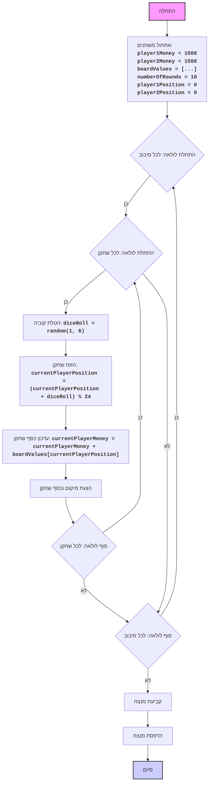

## ניתוח קוד: משחק מונופול פשוט

### 1. <algorithm>
הקוד מדמה משחק "מונופול" פשוט בין שני שחקנים. הנה תרשים זרימה של הקוד:

1.  **התחלה**:
    *   הגדרת משתנים גלובליים: סכום התחלתי לכל שחקן (`player1Money`, `player2Money` שניהם 1500), ערכי המשבצות בלוח (`boardValues`), מספר סיבובים (`numberOfRounds` שווה 10), מיקום התחלתי לכל שחקן (`player1Position`, `player2Position` שניהם 0).

    *   דוגמה: `player1Money = 1500`, `boardValues = [-200, 100, -100, ...]`, `numberOfRounds = 10`.
2.  **לולאת סיבובים**:
    *   מתחילה לולאה עבור כל סיבוב (`roundNumber` מ-1 עד `numberOfRounds`).

    *   דוגמה: סיבוב 1, סיבוב 2, ..., סיבוב 10.
3.  **לולאת שחקנים**:
    *   בתוך כל סיבוב, מתחילה לולאה עבור כל שחקן (שחקן 1 ושחקן 2).
    *   דוגמה: עבור סיבוב 1, קודם שחקן 1 ואז שחקן 2.
4.  **הטלת קוביה**:
    *   כל שחקן מטיל קוביה וזוכה במספר אקראי בין 1 ל-6.
    *   דוגמה: `diceRoll = 4`.
5.  **תנועת שחקן**:
    *   מיקום השחקן מעודכן על בסיס הטלת הקוביה (מוסיפים את תוצאת הקוביה למיקום הנוכחי ומבצעים מודולו 24 כדי לשמור על הלוח מעגלי).
    *   דוגמה: אם `player1Position` הוא 3 ו-`diceRoll` הוא 4, אז `player1Position` הופך ל-(3 + 4) % 24 = 7.
6.  **עדכון כסף**:
    *   כמות הכסף של השחקן משתנה לפי הערך של המשבצת הנוכחית בלוח.
    *   דוגמה: אם `boardValues[7]` הוא -150, ו-`player1Money` הוא 1500, אז `player1Money` הופך ל-1500 + (-150) = 1350.
7.  **הצגת סטטוס**:
    *   המיקום הנוכחי של השחקן וכמות הכסף שלו מודפסים.
8.  **סיום סיבוב**:
    *   הלולאה עוברת לשחקן הבא. לאחר ששני השחקנים סיימו את תורם, הלולאה עוברת לסיבוב הבא.
9.  **סיום המשחק**:
    *   אחרי כל הסיבובים, המשחק נגמר.
10. **קביעת מנצח**:
    *   הקוד משווה את כמות הכסף של השחקנים ומדפיס את המנצח (או שוויון).

    *   דוגמה: אם `player1Money = 2500` ו-`player2Money = 2000`, שחקן 1 מנצח.
### 2. <mermaid>

הקוד אינו משתמש בשורה `import header`, לכן אין צורך בתרשים זרימה עבור `header.py`.
### 3. <explanation>
*   **ייבואים (Imports)**:
    *   `import random`: משמש ליצירת מספרים אקראיים עבור הטלת הקוביה.

*   **משתנים (Variables)**:
    *   `player1Money`, `player2Money`:  מספרים שלמים המייצגים את כמות הכסף של כל שחקן. הם מאותחלים ל-1500.
    *   `boardValues`:  רשימה של מספרים שלמים המייצגים את הערך (הכנסה או הוצאה) של כל משבצת בלוח.
    *   `numberOfRounds`:  מספר שלם המייצג את כמות הסיבובים במשחק, מאותחל ל-10.
    *   `player1Position`, `player2Position`: מספרי שלמים המייצגים את מיקום כל שחקן על הלוח, מאותחלים ל-0.
    *   `roundNumber`: משתנה הלולאה עבור לולאת הסיבובים.
    *   `player`: משתנה הלולאה עבור לולאת השחקנים.
    *   `diceRoll`: משתנה המכיל את תוצאת הטלת הקוביה (מספר אקראי בין 1 ל-6).
    *   `currentPosition`: משתנה המכיל את מיקום השחקן הנוכחי.
    *   `currentMoney`: משתנה המכיל את סכום הכסף של השחקן הנוכחי.

*   **לולאות (Loops)**:
    *   הלולאה הראשונה `for roundNumber in range(1, numberOfRounds + 1):` עוברת על כל סיבוב במשחק.
    *   הלולאה השנייה `for player in range(1, 3):` עוברת על כל שחקן בכל סיבוב.

*   **פונקציות (Functions)**:
    *   `random.randint(1, 6)`: פונקציה מספריית `random` שמחזירה מספר שלם אקראי בין 1 ל-6, המשמשת לדימוי הטלת קוביה.

*   **הסברים נוספים**:
    *   הקוד משתמש באופרטור המודולו `%` כדי לשמור על מיקום השחקן בתוך גבולות הלוח (24 משבצות).
    *   הקוד משתמש ב-`f-strings` להדפסת פלט מעוצב לקונסולה.
    *   הקוד משתמש ב-`if-elif-else` כדי לקבוע את המנצח.

*   **בעיות אפשריות ותחומים לשיפור**:
    *   המשחק פשוט מאוד ואינו מכיל הרבה מאפיינים של מונופול (קנייה, מכירה, נכסים, וכו').
    *   המשחק אינו ידידותי למשתמש ואין לו ממשק גרפי.
    *   אפשר לשפר את הקוד על ידי הוספת קלאסים לייצוג השחקנים והמשבצות.
    *   אפשר להוסיף רמת קושי על ידי שינוי ערכי הלוח, כמות השחקנים או כמות הסיבובים.

*   **שרשרת קשרים עם חלקים אחרים בפרויקט**:
    *   הקוד עצמאי ואינו תלוי בחלקים אחרים בפרויקט. עם זאת, ניתן להשתמש בו כמודול או כחלק ממערכת משחקים גדולה יותר. לדוגמה, ניתן להוסיף ממשק משתמש גרפי.