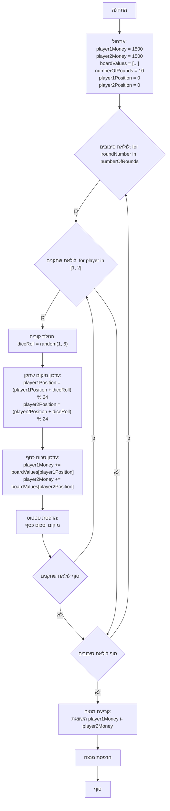

## ניתוח קוד: משחק מונופול פשוט

### 1. <algorithm>

הקוד מדמה משחק מונופול פשוט בין שני שחקנים. הנה תיאור של תהליך העבודה צעד אחר צעד:

1.  **אתחול משחק:**
    *   הגדרת הסכום ההתחלתי לשני השחקנים (`player1Money`, `player2Money`) ל-1500.
    *   יצירת רשימה `boardValues` המייצגת את הערכים של 24 המשבצות בלוח המשחק. ערכים חיוביים מייצגים רווח, שליליים הפסד.
    *   הגדרת מספר הסיבובים (`numberOfRounds`) ל-10.
    *   אתחול מיקום השחקנים בלוח (`player1Position`, `player2Position`) ל-0.

2.  **לולאת סיבובים:**
    *   לולאה חיצונית רצה על מספר הסיבובים שנקבעו (`numberOfRounds`).
        *   הדפסת מספר הסיבוב הנוכחי.

3.  **לולאת שחקנים:**
    *   לולאה פנימית רצה על כל שחקן (שחקן 1 ושחקן 2).
        *   הדפסת תור השחקן הנוכחי.
        *   **הטלת קוביה:**
            *   יצירת מספר אקראי בין 1 ל-6 באמצעות `random.randint(1, 6)`, שיהווה את תוצאת הטלת הקוביה (`diceRoll`).
            *   הדפסת תוצאת הטלת הקוביה.
        *   **עדכון מיקום שחקן:**
            *   אם השחקן הנוכחי הוא שחקן 1:
                *   חישוב המיקום החדש של שחקן 1 בלוח המשחק. המיקום החדש מחושב על ידי הוספת תוצאת הטלת הקוביה למיקום הנוכחי ושימוש בפעולת מודולו `% 24` כדי להבטיח שהמיקום יהיה בטווח של 0 עד 23.
                *   עדכון סכום הכסף של שחקן 1 על ידי הוספת הערך של המשבצת הנוכחית מהרשימה `boardValues`.
                *   שמירת סכום הכסף הנוכחי למשתנה `currentMoney`.
            *   אם השחקן הנוכחי הוא שחקן 2:
                 *   חישוב המיקום החדש של שחקן 2 בלוח המשחק. המיקום החדש מחושב על ידי הוספת תוצאת הטלת הקוביה למיקום הנוכחי ושימוש בפעולת מודולו `% 24` כדי להבטיח שהמיקום יהיה בטווח של 0 עד 23.
                *   עדכון סכום הכסף של שחקן 2 על ידי הוספת הערך של המשבצת הנוכחית מהרשימה `boardValues`.
                *  שמירת סכום הכסף הנוכחי למשתנה `currentMoney`.

        *   **הדפסת סטטוס:**
             *   הדפסת מיקום השחקן הנוכחי וסכום הכסף שלו.

4.  **הכרזת מנצח:**
    *   לאחר סיום כל הסיבובים, הדפסת הודעה על סיום המשחק.
    *   השוואת סכומי הכסף של שני השחקנים:
        *   אם סכום הכסף של שחקן 1 גדול משל שחקן 2, הדפסה שהשחקן הראשון ניצח.
        *   אם סכום הכסף של שחקן 2 גדול משל שחקן 1, הדפסה שהשחקן השני ניצח.
        *   אם הסכומים שווים, הדפסה שהמשחק הסתיים בתיקו.

**זרימת נתונים:**

*   הערכים ההתחלתיים של השחקנים, רשימת הערכים של לוח המשחק, ומספר הסיבובים מאוחללים בתחילת הקוד.
*   ערך הקוביה מחושב באופן רנדומלי בכל תור של כל שחקן ומשפיע על מיקומו.
*   המיקום של השחקן משפיע על סכום הכסף שלו בהתאם לערך המשבצת.
*   סכום הכסף של השחקנים משמש לקביעת המנצח בסוף המשחק.

### 2. <mermaid>

**הסבר התלויות:**

*   **`random`**: המודול `random` מיובא לצורך הפקת מספר אקראי לדימוי הטלת קוביה. הפונקציה `random.randint(1, 6)` משמשת להפקת מספר אקראי בין 1 ל-6.

### 3. <explanation>

**ייבוא:**

*   `import random`: ייבוא המודול random המאפשר יצירת מספרים אקראיים, המשמשים לדימוי הטלת קוביה.

**משתנים:**

*   `player1Money`, `player2Money`: משתנים מספריים המייצגים את סכום הכסף של כל שחקן.
*   `boardValues`: רשימה של מספרים שלמים המייצגת את ערכי המשבצות בלוח המשחק.
*   `numberOfRounds`: משתנה שלם המגדיר את מספר הסיבובים במשחק.
*   `player1Position`, `player2Position`: משתנים שלמים המייצגים את המיקום של כל שחקן בלוח המשחק.
*   `diceRoll`: משתנה שלם המייצג את תוצאת הטלת הקוביה.
*   `roundNumber`: משתנה שלם המייצג את מספר הסיבוב הנוכחי.
*   `player`: משתנה שלם המייצג את מספר השחקן הנוכחי.
*   `currentPosition`: משתנה שלם המייצג את המיקום הנוכחי של השחקן.
*   `currentMoney`: משתנה שלם המייצג את סכום הכסף הנוכחי של השחקן.

**לולאות:**

*   **לולאת סיבובים**: לולאת `for` העוברת על כל הסיבובים של המשחק, ומדפיסה את מספר הסיבוב הנוכחי.
*   **לולאת שחקנים**: לולאת `for` פנימית העוברת על כל שחקן בכל סיבוב.

**קוד לוגי:**

*   **הטלת קוביה:** `random.randint(1, 6)` יוצרת מספר אקראי בין 1 ל-6.
*   **עדכון מיקום שחקן:** מיקום השחקן מעודכן על ידי הוספת תוצאת הקוביה למיקום הנוכחי, ושימוש באופרטור מודולו `% 24` כדי לשמור על המיקום בתוך גבולות לוח המשחק.
*   **עדכון כסף שחקן:** סכום הכסף של השחקן מעודכן על ידי הוספת ערך המשבצת אליו הוא הגיע.
*   **הדפסת סטטוס:** מיקום השחקן הנוכחי וסכום כספו מודפסים.
*   **הכרזת מנצח:** בסוף המשחק, הקוד קובע את המנצח על פי סכום הכסף הגבוה ביותר או מכריז על תיקו.

**בעיות אפשריות ושיפורים:**

*   **חוסר במודולריות:** כל הלוגיקה של המשחק נמצאת בקובץ אחד, מה שמקשה על תחזוקה והרחבה של הקוד. ניתן לפצל את הקוד לפונקציות או מחלקות לשיפור המבנה.
*   **קוד קריא פחות:** ניתן להשתמש בשמות משתנים יותר ברורים (כמו `playerOneMoney` במקום `player1Money`).
*   **חוסר במימוש חוקים נוספים:** הקוד הוא גרסה מאוד בסיסית של המשחק, וניתן להוסיף חוקים נוספים של המשחק המקורי.
*   **חוסר טיפול במצבי קצה:** אין טיפול במצבים בהם סכום הכסף של שחקן כלשהו יורד לאפס או מתחת לאפס.

**שרשרת קשרים עם חלקים אחרים בפרויקט:**
* אין תלות ישירה בקוד זה בחלקים אחרים בפרויקט `hypotez/src/`. הקוד עומד בפני עצמו.