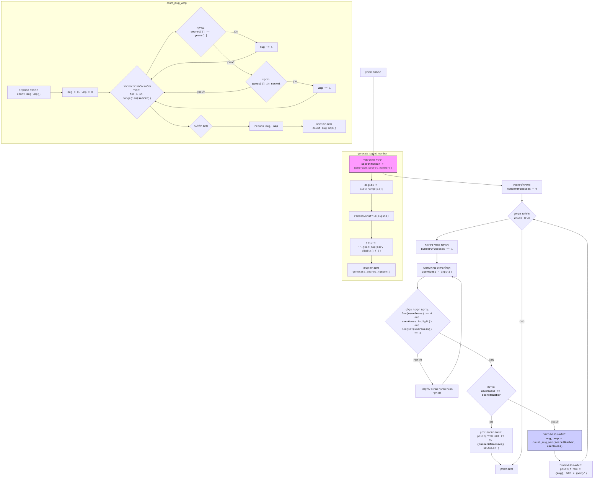

## <algorithm>

1.  **אתחול המשחק:**
    *   הפונקציה `generate_secret_number` יוצרת מספר סודי בן 4 ספרות שונות באופן רנדומלי. לדוגמה, המספר יכול להיות "1234".
    *   המשתנה `number_of_guesses` מאותחל ל-0.

2.  **לולאת משחק:**
    *   הלולאה מתחילה ורצה עד שהמשתמש מנחש נכון את המספר.
    *   בכל איטרציה של הלולאה:
        *   `number_of_guesses` גדל ב-1.
        *   המשתמש מתבקש להזין ניחוש בן 4 ספרות שונות.
        *   אם הקלט לא תקין (לא 4 ספרות, מכיל תוים שאינם ספרות, או לא כל הספרות שונות) מוצגת הודעת שגיאה והמשתמש מתבקש להזין קלט מחדש. לדוגמה, אם המשתמש מזין "123" או "1123" תוצג הודעת שגיאה.
        *   אם הניחוש שווה למספר הסודי, מוצגת הודעת ניצחון, וסיום המשחק. לדוגמה, אם הניחוש הוא "1234" והמספר הסודי הוא "1234" המשחק מסתיים.
        *   אחרת, הפונקציה `count_mug_wmp` מופעלת כדי לחשב את ה-MUG וה-WMP:
            *   הפונקציה מקבלת את המספר הסודי ואת הניחוש.
            *   עוברת על הספרות אחת אחת.
            *   `MUG`: אם ספרה בניחוש תואמת את הספרה במספר הסודי באותו המיקום, ה-MUG גדל. לדוגמה, עבור מספר סודי "1234" וניחוש "1256" ה-MUG יהיה 2.
            *   `WMP`: אם ספרה בניחוש נמצאת במספר הסודי אבל לא באותו המיקום, ה-WMP גדל. לדוגמה, עבור מספר סודי "1234" וניחוש "4356" ה-WMP יהיה 2.
            *   הפונקציה מחזירה את ערכי ה-MUG וה-WMP.
        *   ערכי ה-MUG וה-WMP מוצגים למשתמש.
        *   הלולאה חוזרת על עצמה עד שהמשתמש מנצח.

## <mermaid>



## <explanation>

**ייבואים (Imports)**:

*   `import random`: מייבא את מודול `random` של פייתון, אשר מספק פונקציות ליצירת מספרים רנדומליים. במקרה זה, המודול משמש ליצירת מספר סודי בן 4 ספרות שונות.

**פונקציות (Functions)**:

1.  `generate_secret_number()`:
    *   **פרמטרים**: אין.
    *   **ערך מוחזר**: מחזירה מחרוזת (string) המכילה מספר בן 4 ספרות שונות באופן רנדומלי. לדוגמה: "1234", "9876", "0523".
    *   **מטרה**: לייצר מספר סודי רנדומלי עם ספרות ייחודיות, המשמש כמספר המטרה של המשחק.
    *   **דוגמה לשימוש**:
        ```python
        secret_number = generate_secret_number()
        print(secret_number) # פלט אפשרי: 4821
        ```
2.  `count_mug_wmp(secret, guess)`:
    *   **פרמטרים**:
        *   `secret` (str): המספר הסודי.
        *   `guess` (str): הניחוש של השחקן.
    *   **ערך מוחזר**: מחזירה tuple המכיל שני מספרים שלמים: מספר ה-MUG (ספרות במקום הנכון) ומספר ה-WMP (ספרות נכונות, אך לא במקום הנכון). לדוגמה: (1, 2), (0, 4).
    *   **מטרה**: לחשב את מספר הספרות שנמצאות במקום הנכון (MUG) ובמספר הספרות שנמצאות במספר הסודי אך לא במקום הנכון (WMP) על פי הניחוש של השחקן.
    *   **דוגמה לשימוש**:
        ```python
        mug, wmp = count_mug_wmp("1234", "1425")
        print(f"MUG = {mug}, WMP = {wmp}") # פלט: MUG = 1, WMP = 2
        ```

**משתנים (Variables)**:

*   `secret_number` (str): משתנה המכיל את המספר הסודי שנוצר על ידי הפונקציה `generate_secret_number()`.
*   `number_of_guesses` (int): משתנה המכיל את מספר הניסיונות שהמשתמש ביצע. מאותחל ל-0 וגדל ב-1 בכל ניסיון.
*   `user_guess` (str): משתנה המכיל את הקלט של המשתמש, שהוא ניחוש בן 4 ספרות.
*   `mug` (int): משתנה המכיל את מספר ה-MUG שחושב על ידי הפונקציה `count_mug_wmp()`.
*   `wmp` (int): משתנה המכיל את מספר ה-WMP שחושב על ידי הפונקציה `count_mug_wmp()`.

**שרשרת קשרים**:
*   הקוד לא כולל קשרים ישירים עם חלקים אחרים בפרויקט מלבד המודול `random`.
*   אבל ניתן להרחיב את השימוש בפונקציות אלו בחלקים אחרים של הפרוייקט.

**בעיות אפשריות ותחומים לשיפור**:

*   **אימות קלט**: הקוד מבצע בדיקה בסיסית על הקלט של המשתמש. ניתן להוסיף בדיקות נוספות כדי למנוע קריסות או התנהגות לא צפויה, כמו בדיקה שהקלט הוא רק מספרים או האם הקלט אכן מכיל ספרות ייחודיות.
*   **ממשק משתמש**: ניתן לשפר את ממשק המשתמש עם הודעות ברורות יותר, כמו למשל, מתן הוראות ראשוניות למשחק.
*   **גמישות**: ניתן להפוך את המשחק ליותר גמיש על ידי מתן אפשרות למשתמש לקבוע את אורך המספר הסודי או אפשרות לשנות את כללי המשחק.
*   **יצירת מודול**: ניתן ליצור מודול נפרד מהפונקציות `generate_secret_number` ו-`count_mug_wmp` ולאחר מכן לייבא את המודול לשימוש חוזר.