## ניתוח קוד

### <algorithm>
1. **`calculate_frequency(note_number, concert_a_freq=440.0)`**:
    -   מקבלת את מספר הנוטה (`note_number`) ביחס ל-A4 (שערכו 0), ואת תדר הייחוס של A4 (`concert_a_freq`).
    -   מחשבת את תדר הנוטה על ידי הנוסחה `concert_a_freq * 2^(note_number / 12)`.
    -   מחזירה את תדר הנוטה בהרץ.
    -   *דוגמה*: עבור `note_number = 0` (A4), התוצאה תהיה 440.0 Hz. עבור `note_number = 12` (A5), התוצאה תהיה 880.0 Hz.

2.  **`calculate_interval_ratio(note1_number, note2_number)`**:
     - מקבלת את מספרי שתי הנוטות (`note1_number`, `note2_number`).
     - מחשבת את התדר של כל נוטה באמצעות הפונקציה `calculate_frequency`.
     - מחשבת את היחס בין התדרים.
     - ממירה את היחס לשבר מצומצם באמצעות `Fraction` ומגבילה את המכנה ל-100.
     - מחזירה את היחס כשבר מצומצם בפורמט מחרוזת.
     - *דוגמה*: עבור `note1_number = 0` (A4) ו-`note2_number = 7` (E5), מחזירה את היחס "3/2".

3.  **`calculate_tempo_duration(bpm, beat_length, beats)`**:
     - מקבלת את קצב הפעימות לדקה (`bpm`), את משך פעימה אחת בשניות (`beat_length`), ואת מספר הפעימות (`beats`).
     - מחשבת את משך הזמן הכולל של הקטע המוזיקלי על ידי הכפלת משך הפעימה במספר הפעימות.
     - מחזירה את המשך הכולל בשניות.
     - *דוגמה*: עבור `bpm=120`, `beat_length = 0.5`, `beats=16`, מחזירה 8 שניות.

4. **`calculate_note_duration(tempo, note_value)`**:
    -   מקבלת את הקצב (`tempo`) בפעימות לדקה ואת משך הנוטה (`note_value`) ביחס לנוטה שלמה (1.0).
    -   מחשבת את משך הפעימה בודדת בשניות (`60 / tempo`).
    -   מחשבת את משך הנוטה בשניות על ידי הכפלת משך הפעימה בערך הנוטה.
    -   מחזירה את משך הנוטה בשניות.
    -   *דוגמה*: עבור `tempo = 120` ו-`note_value = 0.25` (רבע נוטה), התוצאה תהיה 0.125 שניות.

5. **`calculate_rhythm_pattern(bar_length, note_values)`**:
     - מקבלת את אורך התיבה במספר נוטות שלמות (`bar_length`) ואת רשימת ערכי הנוטות (`note_values`).
     - מחשבת את משך הזמן הכולל של התבנית הקצבית על ידי סיכום משכי הנוטות.
     - מחזירה את המשך הכולל במספר נוטות שלמות.
     - *דוגמה*: עבור `bar_length = 1` ו-`note_values = [0.25, 0.25, 0.5]`, התוצאה תהיה 1 (נוטה שלמה אחת).

6.  **`calculate_note_number(frequency, concert_a_freq=440.0)`**:
    -   מקבלת את תדר הנוטה (`frequency`) ואת תדר הייחוס של A4 (`concert_a_freq`).
    -   מחשבת את מספר הנוטה ביחס ל-A4 על ידי הנוסחה `12 * log2(frequency / concert_a_freq)`, מעגלת את התוצאה למספר שלם.
    -   מחזירה את מספר הנוטה.
    -    *דוגמה*: עבור `frequency = 440.0`, התוצאה תהיה 0 (A4). עבור `frequency = 261.63`, התוצאה תהיה -9 (C4).

7. **`generate_scale_frequencies(root_note_number, scale_pattern, concert_a_freq=440.0)`**:
    -   מקבלת את מספר נוטת השורש (`root_note_number`), את תבנית הגמא (`scale_pattern`), ואת תדר הייחוס של A4 (`concert_a_freq`).
    -   יוצרת רשימה של תדרי נוטות הגמא על ידי שימוש ב-`calculate_frequency` עבור כל נוטה, כאשר המרווחים נקבעים על ידי `scale_pattern`.
    -   מחזירה את רשימת תדרי הנוטות.
    -   *דוגמה*: עבור `root_note_number = -9` (C4) ו-`scale_pattern = [2, 2, 1, 2, 2, 2, 1]` (סולם מז'ורי), יוחזרו תדרי הנוטות של סולם C מז'ור.

8. **`calculate_tuning_deviation(target_frequency, actual_frequency)`**:
    -   מקבלת את תדר היעד (`target_frequency`) ואת התדר בפועל (`actual_frequency`).
    -   מחשבת את סטיית התדר באחוזים באמצעות הנוסחה `((actual_frequency - target_frequency) / target_frequency) * 100`.
    -   מחזירה את אחוז הסטייה.
    -   *דוגמה*: עבור `target_frequency = 440.0` ו-`actual_frequency = 442.0`, התוצאה תהיה 0.45%.

9.  **`get_note_name(note_number)`**:
     - מקבלת את מספר הנוטה (`note_number`).
     - מחשבת את האוקטבה ואת האינדקס של הנוטה במערך השמות.
     - מחזירה את שם הנוטה בפורמט "שם_הנוטה+אוקטבה".
     - *דוגמה*: עבור `note_number = 0`, התוצאה תהיה "A4". עבור `note_number = 3`, התוצאה תהיה "C5".

10. **`get_note_info_from_freq(freq)`**:
     - מקבלת את תדר הנוטה (`freq`).
     - מחשבת את מספר הנוטה ואת שמה באמצעות הפונקציות `calculate_note_number` ו-`get_note_name`.
     - מדפיסה את המידע אודות הנוטה.

11.  **`tune_instrument(target_freq, actual_freq)`**:
     - מקבלת את תדר היעד ואת התדר בפועל.
     - מחשבת את אחוז הסטייה באמצעות `calculate_tuning_deviation`.
     - מדפיסה הודעה בהתאם לסטייה (לכוון מעלה/מטה/מכוון).

12. **`note_name_to_number(note_name)`**:
    -   מקבלת את שם הנוטה (`note_name`) בפורמט כמו "A4", "C#5".
    -   מנתחת את המחרוזת באמצעות ביטוי רגולרי כדי לחלץ את שם הנוטה ואת מספר האוקטבה.
    -   ממירה את שם הנוטה לאינדקס במערך שמות הנוטות.
    -   מחשבת את מספר הנוטה ביחס ל-A4.
    -   מחזירה את מספר הנוטה או `None` אם שם הנוטה לא תקין.
    -   *דוגמה*: עבור `note_name = "A4"`, התוצאה תהיה 0. עבור `note_name = "C5"`, התוצאה תהיה 3.

13. **`find_nearest_notes(frequency, concert_a_freq=440.0)`**:
    -   מקבלת את תדר הנוטה (`frequency`) ואת תדר הייחוס של A4 (`concert_a_freq`).
    -   מחשבת את מספר הנוטה באמצעות הנוסחה `12 * log2(frequency / concert_a_freq)`.
    -   מוצאת את מספרי הנוטות הקרובות (למעלה ולמטה) באמצעות `math.floor` ו-`math.ceil`.
    -   ממירה את מספרי הנוטות לשמות באמצעות `get_note_name`.
    -   מחזירה את שמות שתי הנוטות הקרובות.
    -   *דוגמה*: עבור `frequency=445.0`, תחזיר ("A4", "A#4").

14.  **`print_musical_examples()`**:
     - מדפיסה דוגמאות שימוש לכל הפונקציות הקודמות.
     - מראה כיצד ניתן לחשב תדרי נוטות, יחסי גומלין בין נוטות, משכי נוטות, ועוד.

15. **`if __name__ == "__main__":`**:
    -   מוודאת שהקוד ירוץ רק כאשר הוא מופעל כסקריפט ראשי.
    -   מפעילה את הפונקציה `print_musical_examples()`.

```mermaid
flowchart TD
    Start[התחלה] --> calculateFrequency[<code>calculate_frequency</code><br>חישוב תדר נוטה]
    calculateFrequency --> calculateIntervalRatio[<code>calculate_interval_ratio</code><br>חישוב יחס תדרים בין שתי נוטות]
    calculateIntervalRatio --> calculateTempoDuration[<code>calculate_tempo_duration</code><br>חישוב משך קטע מוזיקלי]
    calculateTempoDuration --> calculateNoteDuration[<code>calculate_note_duration</code><br>חישוב משך נוטה]
    calculateNoteDuration --> calculateRhythmPattern[<code>calculate_rhythm_pattern</code><br>חישוב משך תבנית קצבית]
    calculateRhythmPattern --> calculateNoteNumber[<code>calculate_note_number</code><br>חישוב מספר נוטה לפי תדר]
    calculateNoteNumber --> generateScaleFrequencies[<code>generate_scale_frequencies</code><br>יצירת תדרי סולם מוזיקלי]
    generateScaleFrequencies --> calculateTuningDeviation[<code>calculate_tuning_deviation</code><br>חישוב סטיית כוונון]
    calculateTuningDeviation --> getNoteName[<code>get_note_name</code><br>המרת מספר נוטה לשם]
    getNoteName --> getNoteInfoFromFreq[<code>get_note_info_from_freq</code><br>הדפסת מידע על נוטה לפי תדר]
    getNoteInfoFromFreq --> tuneInstrument[<code>tune_instrument</code><br>הדפסת מידע על כוונון כלי נגינה]
    tuneInstrument --> noteNameToNumber[<code>note_name_to_number</code><br>המרת שם נוטה למספר]
    noteNameToNumber --> findNearestNotes[<code>find_nearest_notes</code><br>מציאת הנוטות הקרובות לתדר נתון]
    findNearestNotes --> printMusicalExamples[<code>print_musical_examples</code><br>הדפסת דוגמאות שימוש]
    printMusicalExamples --> End[סיום]

    style calculateFrequency fill:#f9f,stroke:#333,stroke-width:2px
    style calculateIntervalRatio fill:#ccf,stroke:#333,stroke-width:2px
    style calculateTempoDuration fill:#9f9,stroke:#333,stroke-width:2px
    style calculateNoteDuration fill:#fcc,stroke:#333,stroke-width:2px
    style calculateRhythmPattern fill:#cfc,stroke:#333,stroke-width:2px
    style calculateNoteNumber fill:#ccf,stroke:#333,stroke-width:2px
    style generateScaleFrequencies fill:#9cf,stroke:#333,stroke-width:2px
    style calculateTuningDeviation fill:#ffc,stroke:#333,stroke-width:2px
    style getNoteName fill:#fcc,stroke:#333,stroke-width:2px
    style getNoteInfoFromFreq fill:#ccf,stroke:#333,stroke-width:2px
    style tuneInstrument fill:#9fc,stroke:#333,stroke-width:2px
    style noteNameToNumber fill:#fcf,stroke:#333,stroke-width:2px
    style findNearestNotes fill:#cf9,stroke:#333,stroke-width:2px
    style printMusicalExamples fill:#9ff,stroke:#333,stroke-width:2px
    style Start fill:#ccf,stroke:#333,stroke-width:2px
    style End fill:#ccf,stroke:#333,stroke-width:2px
```

### <mermaid>

**תלויות בייבוא:**
-   `math`: משמשת לפעולות מתמטיות כמו `pow`, `log2`, `floor`, `ceil` ו-`round`.
-   `fractions`: משמשת לייצוג וחישוב שברים, וליצירת יחסים בין תדרים.
-   `re`: משמשת לביצוע פעולות על ביטויים רגולריים כדי לנתח את שמות הנוטות.

### <explanation>

**ייבואים (Imports):**

*   `import math`:
    *   **מטרה**: מספקת פונקציות מתמטיות בסיסיות, כמו חישוב חזקות (`math.pow`), לוגריתמים (`math.log2`), עיגול (`math.floor`, `math.ceil` , `math.round`).
    *   **קשר עם חבילות אחרות**: לא תלויה ישירות בחבילות `src.`, אלא היא חלק מהספרייה הסטנדרטית של פייתון.

*   `from fractions import Fraction`:
    *   **מטרה**: מאפשרת עבודה עם שברים בצורה מדויקת, ומקלה על ייצוג של יחסי התדרים בין נוטות.
    *   **קשר עם חבילות אחרות**: לא תלויה ישירות בחבילות `src.`, אלא היא חלק מהספרייה הסטנדרטית של פייתון.

*   `import re`:
    *   **מטרה**: משמשת לניתוח מחרוזות, במקרה זה - ניתוח שם הנוטה כדי לחלץ את האות ומספר האוקטבה.
    *   **קשר עם חבילות אחרות**: לא תלויה ישירות בחבילות `src.`, אלא היא חלק מהספרייה הסטנדרטית של פייתון.

**פונקציות (Functions):**

*   **`calculate_frequency(note_number, concert_a_freq=440.0)`**:
    *   **פרמטרים**:
        *   `note_number` (`int`): מספר הנוטה ביחס ל-A4 (A4=0).
        *   `concert_a_freq` (`float`, אופציונלי): תדר הייחוס של A4. ברירת מחדל 440.0 הרץ.
    *   **ערך מוחזר**: `float` - תדר הנוטה בהרץ.
    *   **מטרה**: מחשבת את תדר הנוטה לפי הנוסחה המתמטית של תדרים מוזיקליים.
    *   **דוגמה**: `calculate_frequency(0)` מחזירה 440.0, `calculate_frequency(12)` מחזירה 880.0.

*   **`calculate_interval_ratio(note1_number, note2_number)`**:
    *   **פרמטרים**:
        *   `note1_number` (`int`): מספר הנוטה הראשונה.
        *   `note2_number` (`int`): מספר הנוטה השנייה.
    *   **ערך מוחזר**: `str` - היחס בין התדרים של שתי הנוטות כשבר מצומצם.
    *   **מטרה**: מחשבת את היחס בין התדרים של שתי נוטות ומייצגת אותו כשבר פשוט.
    *   **דוגמה**: `calculate_interval_ratio(0, 7)` מחזירה '3/2' (יחס קווינטה).

*    **`calculate_tempo_duration(bpm, beat_length, beats)`**:
     *   **פרמטרים**:
        * `bpm` (`int`): קצב הפעימות לדקה.
        *  `beat_length` (`float`): משך פעימה אחת בשניות.
        *   `beats` (`int`): מספר הפעימות.
    *   **ערך מוחזר**: `float` - משך הזמן הכולל בשניות.
    *   **מטרה**: מחשבת את משך הזמן הכולל של קטע מוזיקלי.
    *    **דוגמה**: `calculate_tempo_duration(120, 0.5, 16)` מחזירה 8 שניות.

*   **`calculate_note_duration(tempo, note_value)`**:
    *   **פרמטרים**:
        *   `tempo` (`int`): קצב הפעימות לדקה.
        *   `note_value` (`float`): משך הנוטה ביחס לנוטה שלמה (1.0 = נוטה שלמה, 0.5 = חצי נוטה, 0.25 = רבע נוטה, וכו').
    *   **ערך מוחזר**: `float` - משך הנוטה בשניות.
    *   **מטרה**: מחשבת את משך הזמן של נוטה בהתאם לקצב ולערך הנוטה.
    *   **דוגמה**: `calculate_note_duration(120, 0.25)` מחזירה 0.125 שניות.

*   **`calculate_rhythm_pattern(bar_length, note_values)`**:
    *   **פרמטרים**:
        *    `bar_length` (`float`): אורך התיבה במספר נוטות שלמות.
        *  `note_values` (`list`): רשימה של משכי הנוטות ביחס לנוטה שלמה.
    *   **ערך מוחזר**: `float` - משך הזמן הכולל של התבנית הקצבית בנוטות שלמות.
    *   **מטרה**: מחשבת את משך התבנית הקצבית בהתבסס על משכי הנוטות.
    *   **דוגמה**: `calculate_rhythm_pattern(1, [0.25, 0.25, 0.5])` מחזירה 1.0.

*   **`calculate_note_number(frequency, concert_a_freq=440.0)`**:
    *   **פרמטרים**:
        *   `frequency` (`float`): תדר הנוטה בהרץ.
        *   `concert_a_freq` (`float`, אופציונלי): תדר הייחוס של A4. ברירת מחדל 440.0 הרץ.
    *   **ערך מוחזר**: `int` - מספר הנוטה ביחס ל-A4 (A4=0).
    *   **מטרה**: מחשבת את מספר הנוטה בהתבסס על התדר שלה.
    *   **דוגמה**: `calculate_note_number(440.0)` מחזירה 0, `calculate_note_number(261.63)` מחזירה -9.

*   **`generate_scale_frequencies(root_note_number, scale_pattern, concert_a_freq=440.0)`**:
    *   **פרמטרים**:
        *   `root_note_number` (`int`): מספר נוטת השורש של הסולם.
        *   `scale_pattern` (`list`): תבנית הסולם במרווחים של חצאי טונים.
        *   `concert_a_freq` (`float`, אופציונלי): תדר הייחוס של A4. ברירת מחדל 440.0 הרץ.
    *   **ערך מוחזר**: `list` - רשימה של תדרי הנוטות בסולם.
    *   **מטרה**: יוצרת את תדרי הנוטות של סולם מוזיקלי לפי השורש והתבנית.
    *   **דוגמה**: `generate_scale_frequencies(-9, [2, 2, 1, 2, 2, 2, 1])` מייצרת את תדרי סולם C מז'ור.

*   **`calculate_tuning_deviation(target_frequency, actual_frequency)`**:
    *   **פרמטרים**:
        *   `target_frequency` (`float`): תדר היעד של הנוטה.
        *   `actual_frequency` (`float`): התדר המדוד של הנוטה.
    *   **ערך מוחזר**: `float` - אחוז הסטייה בין התדר המדוד לתדר היעד.
    *   **מטרה**: מחשבת את אחוז הסטייה בין תדר היעד לתדר המדוד.
    *   **דוגמה**: `calculate_tuning_deviation(440.0, 442.0)` מחזירה 0.45.

*   **`get_note_name(note_number)`**:
    *   **פרמטרים**:
        *   `note_number` (`int`): מספר הנוטה ביחס ל-A4.
    *   **ערך מוחזר**: `str` - שם הנוטה בפורמט של אות ומספר אוקטבה.
    *   **מטרה**: ממירה את מספר הנוטה לשם הנוטה.
    *    **דוגמה**: `get_note_name(0)` מחזירה "A4", `get_note_name(3)` מחזירה "C5".

*   **`get_note_info_from_freq(freq)`**:
    *   **פרמטרים**:
        *   `freq` (`float`): תדר הנוטה בהרץ.
    *   **ערך מוחזר**: אין (מדפיסה מידע לקונסולה).
    *    **מטרה**: מדפיסה מידע על נוטה (שם ומספר) בהתבסס על התדר שלה.
    *   **דוגמה**: `get_note_info_from_freq(440.0)` מדפיסה מידע על נוטה A4.

*   **`tune_instrument(target_freq, actual_freq)`**:
    *   **פרמטרים**:
        *    `target_freq` (`float`): תדר היעד.
        *    `actual_freq` (`float`): תדר בפועל.
    *   **ערך מוחזר**: אין (מדפיסה לקונסולה).
    *   **מטרה**: מציגה מידע למשתמש על האם כלי הנגינה מכוון, ומה צריך לעשות כדי לכוון אותו.
    *   **דוגמה**:  `tune_instrument(440.0, 438.0)` מדפיסה "Занижение на 0.45%. Нужно повысить".

*  **`note_name_to_number(note_name)`**:
    *   **פרמטרים**:
        *  `note_name` (`str`): שם הנוטה, כמו "A4", "C#5".
    *   **ערך מוחזר**: `int` - מספר הנוטה ביחס ל-A4 או `None` אם הקלט לא תקין.
    *   **מטרה**: ממירה את שם הנוטה למספר הנוטה.
    *   **דוגמה**: `note_name_to_number("A4")` מחזירה 0, `note_name_to_number("C5")` מחזירה 3.

*   **`find_nearest_notes(frequency, concert_a_freq=440.0)`**:
    *   **פרמטרים**:
        *    `frequency` (`float`): תדר הנוטה בהרץ.
        * `concert_a_freq` (`float`, אופציונלי): תדר הייחוס של A4. ברירת מחדל 440.0 הרץ.
    *   **ערך מוחזר**: `tuple` - זוג שמות של הנוטות הקרובות ביותר (למטה ולמעלה) לתדר הנתון.
    *   **מטרה**: מוצאת שתי נוטות הקרובות ביותר לתדר נתון.
    *   **דוגמה**: `find_nearest_notes(445.0)` מחזירה ("A4", "A#4").

*   **`print_musical_examples()`**:
    *   **פרמטרים**: אין.
    *   **ערך מוחזר**: אין (מדפיסה לקונסולה).
    *   **מטרה**: מדפיסה דוגמאות שימוש לכל הפונקציות.
    *   **שימוש**: הפונקציה מופעלת בסוף הסקריפט כדי להדגים את השימוש בפונקציות השונות.

**משתנים (Variables):**

*   משתנים מקומיים מוגדרים בתוך כל פונקציה.
*   המשתנים משמשים לביצוע חישובים, שמירה על תוצאות ביניים, או העברת נתונים.
*   לדוגמה, `note_number` ו-`frequency` משמשים להעברת ערכים בין פונקציות.
*   `notes` הוא משתנה קבוע המכיל רשימה של שמות הנוטות.

**בעיות אפשריות ותחומים לשיפור:**
*   **בדיקות קלט**: הפונקציות לא מבצעות בדיקות קלט רחבות, וייתכן שיהיו בעיות אם יוכנסו ערכים לא תקינים. יש להוסיף בדיקות מסוג זה.
*   **טיפול בשגיאות**: הפונקציות לא מטפלות בשגיאות באופן מפורש. יש לשקול הוספת מנגנון לטיפול בשגיאות.
*   **תיעוד**: התיעוד של הפונקציות טוב, אך ניתן להוסיף הסברים נוספים על מטרת כל פונקציה והפרמטרים שלה.
*   **יחידות מידה**: לא תמיד ברור האם הנתונים מוצגים ביחידות של שניות, הרץ, או נוטות. רצוי לציין את יחידות המידה בתיעוד.

**שרשרת קשרים עם חלקים אחרים בפרויקט:**

*   הקוד הוא מודול עצמאי, כך שאין תלות ישירה בחלקים אחרים של הפרויקט, אלא שהוא יכול להיות מיובא ושימוש בפרויקטים אחרים.
*   המודול יכול לשמש כבסיס לפרויקטים מוזיקליים שונים, כמו יוצרי מוזיקה, טיונרים וכו'.