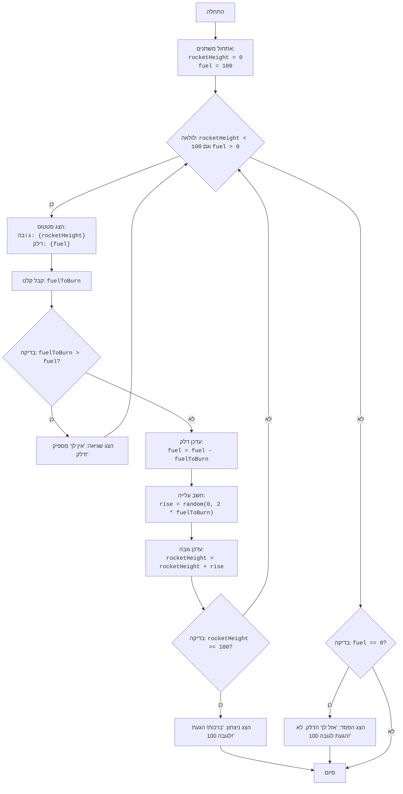

## ניתוח קוד: משחק "רָקֵטָה"

### 1. <algorithm>

**תיאור תהליך העבודה:**

1.  **אתחול:**
    *   הגדר את גובה הרקטה (`rocketHeight`) ל-0.
    *   הגדר את כמות הדלק (`fuel`) ל-100.
    *   *דוגמה:* `rocketHeight = 0`, `fuel = 100`.
2.  **לולאה ראשית:** כל עוד גובה הרקטה קטן מ-100 וגם יש דלק:
    *   הדפס את הגובה הנוכחי של הרקטה ואת כמות הדלק שנותרה.
    *   *דוגמה:* הדפסה: "גובה: 0, דלק: 100".
    *   קבל מהמשתמש כמות דלק לשריפה (`fuelToBurn`).
        *   *דוגמה:* המשתמש מזין "20".
    *   **בדיקה:** האם כמות הדלק לשריפה גדולה מכמות הדלק הזמינה?
        *   אם כן, הדפס הודעת שגיאה "אין לך מספיק דלק!" וחזור לתחילת הלולאה.
        *   *דוגמה:* אם `fuel` הוא 30, ו `fuelToBurn` הוא 50, תודפס הודעת שגיאה.
        *   אם לא:
            *   הפחת את `fuelToBurn` מ-`fuel`.
                *   *דוגמה:* `fuel = 100`, `fuelToBurn = 20` ואז `fuel` יהיה 80.
            *   חשב את הגובה שהרקטה עולה (`rise`) באופן אקראי בין 0 ל-2 * `fuelToBurn`.
                *   *דוגמה:* אם `fuelToBurn` הוא 20, אז `rise` יכול להיות מספר אקראי בין 0 ל-40.
            *   הוסף את `rise` לגובה הרקטה (`rocketHeight`).
                *   *דוגמה:* אם `rocketHeight` היה 0, ו-`rise` הוא 30, אז `rocketHeight` יהיה 30.
3.  **בדיקת סיום:**
    *   אם גובה הרקטה גדול או שווה ל-100:
        *   הדפס הודעת ניצחון: "ברכות! הגעת לגובה 100!"
        *   סיום המשחק.
        *   *דוגמה:* אם `rocketHeight` הוא 100, תודפס הודעת ניצחון.
    *   אחרת:
        *   אם הדלק שווה ל-0:
            *   הדפס הודעת הפסד: "אזל לך הדלק. לא הגעת לגובה 100!"
            *   סיום המשחק.
            *   *דוגמה:* אם `fuel` הוא 0, תודפס הודעת הפסד.

**זרימת נתונים:**

*   משתנה `rocketHeight` מתעדכן בלולאה הראשית על ידי הוספת הערך של `rise`.
*   משתנה `fuel` מתעדכן בלולאה הראשית על ידי הפחתת הערך של `fuelToBurn`.
*   הפונקציה `random.randint()` מייצרת מספר אקראי, המשמש לחישוב `rise`.
*   הפונקציה `input()` קולטת קלט מהמשתמש עבור `fuelToBurn`.

### 2. <mermaid>

**הסבר על התלויות:**

*   **`random`**: המודול `random` מיובא על מנת לאפשר בחירת ערך אקראי לחישוב הגובה שהרקטה עולה בכל סיבוב. במיוחד, משתמשים בפונקציה `random.randint(a, b)` כדי להחזיר מספר שלם אקראי N כך ש- `a <= N <= b`.
*   אין תלות בקובץ `header.py` מכיוון שאין שורת `import header` בקוד.

### 3. <explanation>

**הסברים מפורטים:**

*   **ייבואים (Imports):**
    *   `import random`: ייבוא המודול `random` המאפשר לייצר מספרים אקראיים. השימוש העיקרי הוא בפונקציה `random.randint()` שמשמשת לקביעת הגובה שהרקטה עולה באופן אקראי בכל סיבוב של המשחק.
*   **משתנים (Variables):**
    *   `rocketHeight` (סוג: `int`): משתנה המייצג את הגובה הנוכחי של הרקטה. מאותחל ל-0 בתחילת המשחק וגדל בכל סיבוב.
    *   `fuel` (סוג: `int`): משתנה המייצג את כמות הדלק הזמינה. מאותחל ל-100 בתחילת המשחק ופוחת בכל סיבוב כאשר המשתמש בוחר לשרוף דלק.
    *   `fuelToBurn` (סוג: `int`): משתנה שמקבל מהמשתמש את כמות הדלק שהוא רוצה לשרוף באותו סיבוב.
    *   `rise` (סוג: `int`): משתנה שמייצג את הגובה שהרקטה עולה באותו סיבוב, מחושב באופן אקראי.

*   **פונקציות (Functions):**
    *   אין פונקציות מוגדרות בקוד זה. נעשה שימוש בפונקציות מובנות של פייתון:
        *   `print()`: פונקציה להדפסת הודעות למסך, משמשת להצגת סטטוס המשחק והודעות למשתמש.
        *   `input()`: פונקציה לקבלת קלט מהמשתמש, משמשת לקבלת כמות הדלק לשריפה.
        *   `int()`: פונקציה להמרת מחרוזת למספר שלם, משמשת להמרת הקלט מהמשתמש למספר.
        *   `random.randint(a, b)`: פונקציה מתוך מודול `random`, שמחזירה מספר אקראי שלם בין `a` ל-`b` (כולל). משמשת לחישוב העלייה של הרקטה.

*   **מבני בקרה:**
    *   `while rocketHeight < 100 and fuel > 0:`: לולאת `while` שמתרחשת כל עוד גובה הרקטה קטן מ-100 וגם כמות הדלק גדולה מ-0. זהו המחזור הראשי של המשחק.
    *   `if fuelToBurn > fuel:`: תנאי `if` לבדיקה האם כמות הדלק שהמשתמש רוצה לשרוף גדולה מכמות הדלק הזמינה.
    *   `if rocketHeight >= 100:`: תנאי `if` לבדיקה האם הרקטה הגיעה לגובה 100, במקרה זה המשחק נגמר בניצחון.
    *   `else:`: בשימוש בשני התנאים שלמעלה, כאשר אחד התנאים לא מתקיים. במקרה הראשון, התנאי מתבצע אם המשתמש לא ביקש לשרוף יותר דלק ממה שיש לו, ובמקרה השני אם הרקטה לא הגיעה לגובה 100.
*   `try...except ValueError`: בלוק לטיפול בשגיאות. אם המשתמש מזין קלט שאינו מספר שלם, תתפס שגיאת `ValueError` ותודפס הודעת שגיאה מתאימה.

**שרשרת קשרים עם חלקים אחרים בפרויקט:**

אין קשרים ישירים עם חלקים אחרים בפרויקט, כיוון שקוד זה עומד בפני עצמו. זהו קובץ עצמאי המכיל משחק בסיסי.

**בעיות אפשריות או תחומים לשיפור:**

*   **משוב משתמש:** המשחק מספק משוב בסיסי בלבד. ניתן לשפר את חווית המשתמש על ידי הוספת יותר מידע על הביצועים של השחקן במהלך המשחק (למשל, להציג את המרחק הנותר להגעה לגובה 100, או להציג גרף של הגובה לאורך זמן).
*   **קשיים:** המשחק יכול להיות קשה ולא מתגמל במיוחד מכיוון שהעלייה של הרקטה היא אקראית. ניתן להוסיף אלמנטים שיאפשרו לשחקן להיות יותר אסטרטגי, כגון אפשרות לכוון את עוצמת הדלק כדי לקבל עלייה גבוהה יותר, או שדרוגים שיקנו לו יכולות טובות יותר.
*   **טיפול בשגיאות:** הקוד מטפל רק ב-`ValueError` במקרה של קלט שאינו מספר שלם, אך ניתן להוסיף טיפול בשגיאות נוספות.

הקוד פשוט וקל להבנה, ומיישם את לוגיקת המשחק בצורה ברורה ויעילה. ניתן לשפר את חווית המשתמש והמורכבות של המשחק במידת הצורך.