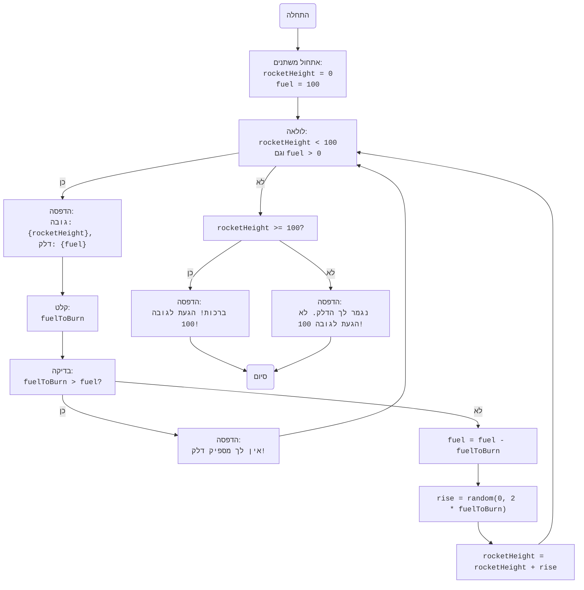

## ניתוח קוד: משחק "רוקט"

### 1. <algorithm>

הקוד מממש משחק פשוט בשם "רוקט", בו שחקן מנסה להגיע לגובה 100 על ידי שימוש בדלק.

**תרשים זרימה:**

1. **התחלה:**
   - אתחול משתנה `rocketHeight` (גובה הרקטה) ל-0.
   - אתחול משתנה `fuel` (דלק) ל-100.
   *דוגמה:*
   ```
   rocketHeight = 0
   fuel = 100
   ```

2. **לולאה ראשית:** כל עוד `rocketHeight` קטן מ-100 ו-`fuel` גדול מ-0:
   - הדפסת מצב נוכחי: הדפסת גובה הרקטה הנוכחי ושארית הדלק.
     *דוגמה:*
     ```
     "גובה: 0, דלק: 100"
     ```
   - קליטת קלט משתמש: בקשת מהמשתמש להזין כמות דלק לשימוש.
      *דוגמה:*
      משתמש מזין "20"
   - בדיקה: האם כמות הדלק שצוינה גדולה יותר מהדלק שזמין?
     - אם כן: הדפסת הודעת שגיאה.
       *דוגמה:*
       ```
       "אין לך מספיק דלק!"
       ```
       וחזרה לתחילת הלולאה.
     - אם לא:
       - הפחתת הדלק: הפחתת כמות הדלק הזמינה בכמות שהמשתמש בחר.
         *דוגמה:*
         ```
         fuel = fuel - fuelToBurn
         ```
         אם `fuel` הוא 100 והמשתמש הזין 20, `fuel` יהפוך ל-80.
       - חישוב עלייה: חישוב אקראי של העלייה בגובה בין 0 ל-2 כפול כמות הדלק שנוצלה.
        *דוגמה:*
         ```
         rise = random.randint(0, 2 * fuelToBurn)
         ```
         אם `fuelToBurn` הוא 20, יתכן ש-`rise` יהיה 35.
       - עדכון גובה: הוספת העלייה לגובה הרקטה הנוכחי.
        *דוגמה:*
         ```
          rocketHeight = rocketHeight + rise
         ```
          אם `rocketHeight` הוא 0 ו-`rise` הוא 35, `rocketHeight` יהפוך ל-35.

3. **בדיקת תנאי סיום:** לאחר סיום הלולאה:
   - אם `rocketHeight` גדול או שווה ל-100: הדפסת הודעת ניצחון.
    *דוגמה:*
    ```
    "ברכות! הגעת לגובה 100!"
    ```
   - אם לא: הדפסת הודעה שהדלק נגמר והמשתמש לא הגיע לגובה 100.
   *דוגמה:*
    ```
    "נגמר לך הדלק. לא הגעת לגובה 100!"
    ```
4.  **סיום:** המשחק מסתיים.

### 2. <mermaid>



**ניתוח תלויות:**
*   `random`: המודול `random` מיובא על מנת ליצור ערך אקראי לצורך חישוב הגובה אליו תגיע הרקטה לאחר שימוש בדלק.
    *   `random.randint(a, b)`: שיטה המשמשת לייצור מספר אקראי שלם בין a ל-b (כולל).

### 3. <explanation>

**ייבואים (Imports):**
*   `import random`: מייבא את מודול `random` של פייתון. המודול מספק פונקציות ליצירת מספרים אקראיים, ובמשחק זה הוא משמש לקביעת גובה הטיפוס של הרקטה בכל תור על בסיס הדלק שנוצל.

**משתנים (Variables):**
*   `rocketHeight`: משתנה מסוג `int` המייצג את גובה הרקטה הנוכחי. מאותחל ל-0 בתחילת המשחק ועולה בהתאם לכמות הדלק שמשתמשים בה.
*   `fuel`: משתנה מסוג `int` המייצג את כמות הדלק הזמינה. מאותחל ל-100 בתחילת המשחק ויורד בכל תור בהתאם להוצאה של המשתמש.
*   `fuelToBurn`: משתנה מסוג `int` המייצג את כמות הדלק שהמשתמש בחר לשרוף בתור הנוכחי. ערכו מתקבל מקלט מהמשתמש.
*   `rise`: משתנה מסוג `int` המייצג את הגובה שהרקטה עלתה בתור הנוכחי. ערכו מחושב באופן אקראי על ידי `random.randint` ומושפע מהדלק שנשרף.

**פונקציות (Functions):**
*   אין פונקציות מוגדרות על ידי המשתמש בקוד זה, נעשה שימוש בפונקציות מובנות של פייתון כמו `print`, `input`, ו-`int`. בנוסף נעשה שימוש בפונקציה `random.randint` מהמודול `random`.
    *   `print()`: משמשת להדפסת הודעות למסך (למשל, מצב המשחק, הודעות שגיאה וכו').
    *   `input()`: מקבלת קלט מהמשתמש.
    *   `int()`: ממירה את הקלט מהמשתמש למספר שלם (integer).
    *   `random.randint(a, b)`: מחזירה מספר שלם אקראי בטווח שבין a ל-b כולל.

**הסברים נוספים:**
*   **מבנה הלולאה:** הקוד משתמש בלולאת `while` כדי להריץ את המשחק עד שהרקטה מגיעה לגובה 100 או עד שנגמר הדלק.
*   **טיפול בשגיאות:** הקוד משתמש בבלוק `try...except` כדי לטפל בשגיאות אפשריות כאשר המשתמש מזין קלט שאינו מספר שלם. אם הקלט אינו מספר, המשתמש יקבל הודעת שגיאה והלולאה תמשיך.
*   **חישוב גובה:** גובה הטיפוס של הרקטה מחושב באופן אקראי, אך הוא תלוי בכמות הדלק שהמשתמש בחר לשרוף.

**בעיות אפשריות ושיפורים:**
*   **משוב למשתמש:** ניתן לשפר את המשחק על ידי הוספת משוב למשתמש במהלך המשחק (למשל, להציג גרף או אנימציה של עליית הרקטה).
*   **רמות קושי:** אפשר להוסיף רמות קושי על ידי שינוי האופן שבו מחושב הגובה שבו הרקטה עולה או על ידי שינוי הכמות ההתחלתית של הדלק.
*   **ממשק משתמש:** ניתן להוסיף ממשק משתמש גרפי במקום ממשק טקסטואלי על מנת להפוך את המשחק ליותר ידידותי.
*   **חוסר באפשרויות שונות:** המשחק מאוד בסיסי, וניתן להוסיף לו אפשרויות שונות, כגון בחירת סוג דלק שונה שמשפיע על גובה הטיפוס, או הוספת מכשולים.