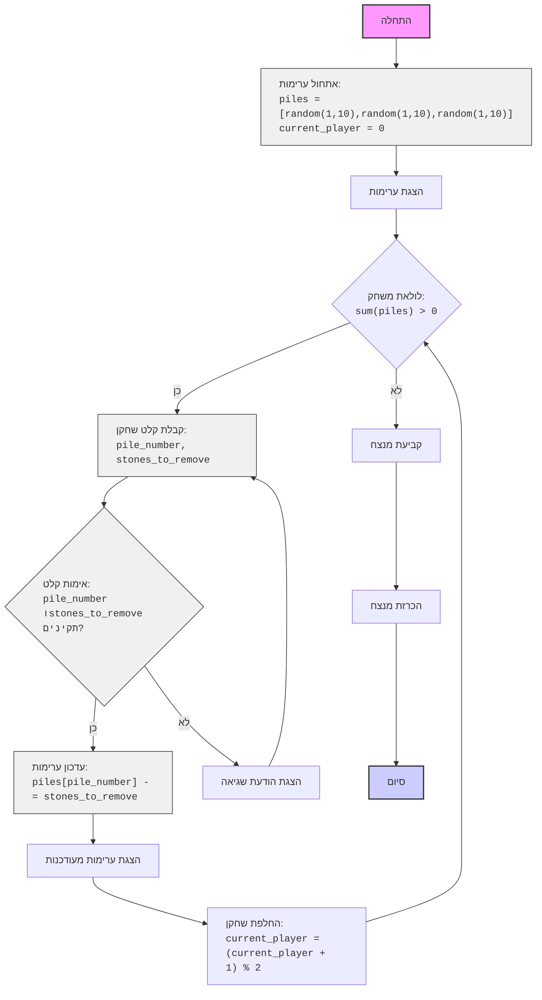

## <algorithm>
1. **התחלה**: המשחק מתחיל.
2. **אתחול ערימות**: נוצרות שלוש ערימות של אבנים, כאשר בכל ערימה יש בין 1 ל-10 אבנים באופן אקראי. כמו כן, מוגדר תור השחקן הראשון (`current_player = 0`).
   - דוגמה: `piles = [3, 7, 2]`, `current_player = 0`
3. **הצגת ערימות**: מוצג מצב הערימות הנוכחי למסך.
   - דוגמה: "ערימה 1: 3 אבנים, ערימה 2: 7 אבנים, ערימה 3: 2 אבנים".
4. **תחילת לולאת משחק**: המשחק נכנס ללולאה, שתימשך כל עוד יש אבנים בערימות (`sum(piles) > 0`).
5. **קבלת קלט שחקן**: השחקן הנוכחי מתבקש להזין מספר ערימה וכמות אבנים להסרה.
   - דוגמה: עבור שחקן 1, קלט: "ערימה 2", "3 אבנים".
6. **אימות קלט**: בדיקה שהקלט תקין: מספר הערימה חוקי (בטווח מספר הערימות) וכמות האבנים חוקית (גדולה מ-0 ואינה עולה על כמות האבנים בערימה שנבחרה).
    - דוגמה: אם הערימה היא [3, 7, 2] ובחרו להסיר 3 אבנים מערימה 2, הבדיקה תהיה תקינה. אם בוחרים להסיר 8 אבנים, או לבחור ערימה 4, הבדיקה תיכשל.
7. **עדכון ערימות**: אם הקלט תקין, כמות האבנים שנבחרה מוסרת מהערימה המתאימה.
   - דוגמה: `piles[1] -= 3` (ערימה 2 פוחתת ב-3 אבנים). ערימה הופכת להיות `[3, 4, 2]`.
8. **הצגת ערימות מעודכנות**: מוצג מצב הערימות המעודכן.
   - דוגמה: "ערימה 1: 3 אבנים, ערימה 2: 4 אבנים, ערימה 3: 2 אבנים".
9. **החלפת שחקן**: התור עובר לשחקן הבא (`current_player = (current_player + 1) % 2`).
   - דוגמה: אם השחקן הנוכחי הוא 0, הוא יעבור להיות 1.
10. **חזרה ללולאה**: הלולאה ממשיכה כל עוד יש אבנים בערימות.
11. **סיום לולאה**: כאשר סכום האבנים בערימות הוא 0, הלולאה מסתיימת.
12. **קביעת מנצח**: השחקן האחרון ששיחק מנצח.
13. **הכרזת מנצח**: מוצגת הודעה עם מספר השחקן המנצח.
14. **סיום המשחק**.

## <mermaid>

## <explanation>
### ייבואים (Imports)
- `import random`: מודול זה משמש ליצירת מספרים אקראיים, ובמקרה הזה, לאתחול כמות האבנים בכל ערימה באופן אקראי בתחילת המשחק.

### פונקציות (Functions)
- **`display_piles(piles)`**:
  - **פרמטרים**: `piles` (רשימה של מספרים שלמים המייצגים את כמות האבנים בכל ערימה).
  - **ערך מוחזר**: אין (None).
  - **מטרה**: פונקציה זו מדפיסה את מצב הערימות הנוכחי למסך, כאשר כל שורה מייצגת ערימה והכמות שלה.
  - **דוגמה לשימוש**: `display_piles([3, 5, 2])` תדפיס "ערימה 1: 3 אבנים, ערימה 2: 5 אבנים, ערימה 3: 2 אבנים".
- **`get_player_move(piles, player)`**:
  - **פרמטרים**: `piles` (רשימה של מספרים שלמים המייצגים את כמות האבנים בכל ערימה), `player` (מספר שלם המייצג את השחקן הנוכחי, 1 או 2).
  - **ערך מוחזר**: טאפל של שני מספרים שלמים: `(pile_number, stones_to_remove)`.
  - **מטרה**: פונקציה זו מבקשת מהשחקן הנוכחי להזין את מספר הערימה וכמות האבנים להסרה. היא גם מבצעת אימות קלט לוודא שהקלט תקין (מספר ערימה קיים, וכמות האבנים להסרה חוקית).
  - **דוגמה לשימוש**: `get_player_move([3, 5, 2], 1)` יכול להחזיר `(1, 2)` אם שחקן 1 בוחר להסיר 2 אבנים מערימה 2.
- **`play_nim()`**:
  - **פרמטרים**: אין.
  - **ערך מוחזר**: אין (None).
  - **מטרה**: פונקציה זו היא הפונקציה הראשית שמנהלת את המשחק. היא יוצרת את ערימות האבנים, מנהלת את תורות השחקנים, ומכריזה על המנצח.
  - **דוגמה לשימוש**: קריאה ל `play_nim()` תתחיל את המשחק.

### משתנים (Variables)
- `piles` (רשימה): רשימה שמכילה את מספר האבנים בכל ערימה.
- `current_player` (מספר שלם): מספר שמייצג את השחקן הנוכחי (0 עבור שחקן 1, 1 עבור שחקן 2).
- `pile_number` (מספר שלם): מספר המייצג את הערימה שהשחקן בחר.
- `stones_to_remove` (מספר שלם): מספר האבנים שהשחקן בחר להסיר מהערימה.

### בעיות אפשריות ושיפורים
- **טיפול בשגיאות**: הקוד מטפל בשגיאות קלט פשוטות (לדוגמה, קלט שאינו מספר). ניתן להוסיף טיפול נוסף בשגיאות אפשריות, כגון קלט שהוא מחרוזת ריקה.
- **ממשק משתמש**: ממשק המשתמש פשוט וטקסטואלי. אפשר לשפר אותו על ידי הוספת ממשק גרפי או שימוש בספריות כמו `curses` ליצירת ממשק קצת יותר אינטראקטיבי.
- **מחשב כשחקן**: כרגע המשחק הוא בין שני שחקנים אנושיים. ניתן להוסיף שחקן מחשב עם אסטרטגיות שונות (למשל, אסטרטגיה מנצחת).
- **הגדרות משחק**: המשחק כרגע מוגדר לשלוש ערימות בלבד. ניתן להוסיף אפשרות להגדיר את מספר הערימות וכמות האבנים ההתחלתית בכל ערימה.

### שרשרת קשרים עם חלקים אחרים בפרויקט
- הקוד עומד בפני עצמו ואינו תלוי בחלקים אחרים בפרויקט, אך אם היה מדובר בגרסה מורכבת יותר של המשחק, אפשר היה לשקול חלוקה למודולים או מחלקות שונות. לדוגמה, מחלקה עבור שחקן, מחלקה עבור לוח המשחק וכן הלאה.