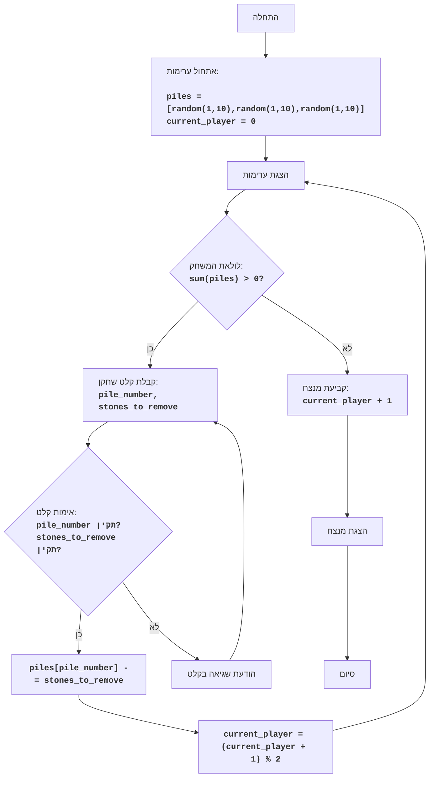

## ניתוח קוד משחק NIM

### 1. <algorithm>

**תרשים זרימה מפורט של קוד המשחק NIM:**

1. **התחלה:** תחילת ריצת התוכנית.
    * דוגמה: `if __name__ == "__main__":` - קוד מתחיל לפעול רק כאשר קובץ זה מורץ ישירות.

2. **אתחול ערימות:** יצירת רשימה של ערימות, כאשר כל ערימה מכילה מספר אקראי של אבנים (בין 1 ל-10). הגדרת השחקן הנוכחי כשחקן הראשון (0).
    * דוגמה: `piles = [random.randint(1, 10), random.randint(1, 10), random.randint(1, 10)]`, `current_player = 0`.

3. **הצגת ערימות:** הדפסת מצב הערימות הנוכחי למשתמש.
    * דוגמה: `display_piles(piles)` - יציג "ערימה 1: 5 אבנים", "ערימה 2: 3 אבנים", "ערימה 3: 7 אבנים".

4. **לולאת המשחק:** כל עוד יש אבנים בערימות (סכום האבנים בכל הערימות > 0), המשחק נמשך.
    * דוגמה: `while sum(piles) > 0:`

5. **קבלת קלט שחקן:** קבלת מספר ערימה ומספר אבנים להסרה מהשחקן הנוכחי.
    * דוגמה: `pile_number, stones_to_remove = get_player_move(piles, current_player + 1)` - שחקן 1 בוחר ערימה 2 ולוקח 2 אבנים.

6. **אימות קלט:** בדיקת שהקלט תקין: מספר הערימה תקין (בתוך גבולות הערימות) ומספר האבנים להסרה חוקי (בין 1 למספר האבנים בערימה).
    * דוגמה: אם השחקן בחר ערימה 4 כאשר יש רק 3 ערימות או ביקש לקחת 6 אבנים מערימה עם 5 אבנים, זה לא תקין.

7. **עדכון ערימות:** אם הקלט תקין, הסרת מספר האבנים שנבחרו מהערימה שנבחרה.
    * דוגמה: `piles[pile_number] -= stones_to_remove` - אם שחקן 1 לקח 2 אבנים מערימה 2, מספר האבנים בערימה 2 יקטן ב-2.

8. **מעבר בין שחקנים:** שינוי התור לשחקן הבא (בין שחקן 1 לשחקן 2).
    * דוגמה: `current_player = (current_player + 1) % 2` - שחקן 1 הופך לשחקן 2, שחקן 2 הופך לשחקן 1.

9. **חזרה ללולאה:** חזרה לתחילת הלולאה לבדיקה האם יש עוד אבנים בערימות.
    * אם סכום האבנים בערימות > 0, חזור לצעד 3.
    * אחרת, המשחק הסתיים.

10. **קביעת מנצח:** השחקן האחרון ששיחק הוא המנצח.
    * דוגמה: `print(f"Игрок {current_player + 1} победил!")` - השחקן האחרון ששיחק (לפני שהערימות התרוקנו) ניצח.

11. **הצגת מנצח:** הצגת הודעת ניצחון למשתמש.
    * דוגמה: "שחקן 2 ניצח!".

12. **סיום:** סיום ריצת התוכנית.

**זרימת נתונים:**

*   **`piles`**: רשימת הערימות משותפת בין `play_nim`, `display_piles` ו-`get_player_move`.
*   **`current_player`**: משתנה שמעביר מידע בין `play_nim` ו-`get_player_move` ומעודכן ב-`play_nim`.
*   **`pile_number`, `stones_to_remove`**: ערכים המוחזרים מ-`get_player_move` ומשמשים לעדכון `piles` ב-`play_nim`.

### 2. <mermaid>

**הסבר תלויות:**

*   הקוד משתמש ב-`random` לייצור ערכים אקראיים.

### 3. <explanation>

**ייבוא (Imports):**
*   `import random`: מייבא את מודול `random` של פייתון. מודול זה מספק פונקציות ליצירת מספרים אקראיים, המשמשים לאתחול מספר האבנים בכל ערימה בתחילת המשחק.

**פונקציות (Functions):**
*   `display_piles(piles)`:
    *   פרמטרים: `piles` - רשימה המייצגת את ערימות האבנים.
    *   ערך מוחזר: אין (None).
    *   מטרה: מדפיסה את מצב ערימות האבנים הנוכחי לקונסול, לצורך תצוגה ויזואלית של המשחק.
    *   דוגמה: אם `piles` היא `[3, 5, 2]`, הפונקציה תדפיס "ערימה 1: 3 אבנים", "ערימה 2: 5 אבנים", "ערימה 3: 2 אבנים".
*   `get_player_move(piles, player)`:
    *   פרמטרים: `piles` - רשימה המייצגת את ערימות האבנים, `player` - מספר השחקן הנוכחי (1 או 2).
    *   ערך מוחזר: `(pile_number, stones_to_remove)` - טאפל המכיל את מספר הערימה (אינדקס מתחיל מ-0) ואת מספר האבנים שהשחקן בחר להסיר.
    *   מטרה: מקבלת קלט מהשחקן - מספר הערימה ומספר האבנים להסרה, ומבצעת בדיקת תקינות לקלט. מבטיחה שהקלט שהתקבל מהשחקן חוקי וניתן להשתמש בו להמשך המשחק.
    *   דוגמה: אם השחקן בוחר להסיר 2 אבנים מערימה 1, הפונקציה תחזיר `(0, 2)`.
*   `play_nim()`:
    *   פרמטרים: אין.
    *   ערך מוחזר: אין (None).
    *   מטרה: פונקציית הליבה של המשחק. מאתחלת את מצב המשחק, מנהלת את לולאת המשחק בין שחקנים, ומכריזה על המנצח.
    *   דוגמה: קוראת ל `display_piles` להדפיס את הערימות בהתחלה, קוראת ל `get_player_move` כדי לקבל קלט מהשחקן, מעדכנת את הערימות ומחליפה תורות, ואז מדפיסה את המנצח.

**משתנים (Variables):**
*   `piles`: רשימה המכילה את מספר האבנים בכל ערימה. סוג: רשימה (list). משמשת לאחסון נתוני המשחק ולעדכון מצב המשחק.
*   `current_player`: מספר השחקן הנוכחי (0 או 1). סוג: מספר שלם (int). משמש למעקב אחר השחקן הפעיל כרגע, ומאפשר מעבר תור בין השחקנים.
*   `pile_number`: מספר הערימה שהשחקן בוחר. סוג: מספר שלם (int). משמש לקביעת הערימה ממנה ייקחו אבנים.
*   `stones_to_remove`: מספר האבנים שהשחקן בוחר להסיר מהערימה. סוג: מספר שלם (int). משמש לעדכון מספר האבנים בערימה שנבחרה.

**בעיות אפשריות ותחומים לשיפור:**

1. **אימות קלט נוסף:** יש מקום להוסיף בדיקות יותר ספציפיות לקלט, כגון בדיקה שהמספרים הם אכן מספרים חוקיים.
2. **ממשק משתמש:** משחק טקסטואלי בקונסול, ניתן לשפר את חוויית המשתמש באמצעות ממשק משתמש גרפי.
3. **AI:** ניתן להוסיף שחקן AI (מחשב) כדי לאפשר משחק נגד המחשב.
4. **אפשרויות משחק:** ניתן לאפשר למשתמש להגדיר את מספר הערימות ואת מספר האבנים ההתחלתי בכל ערימה.
5. **תגובות שגיאה:** ניתן להפוך את תגובות השגיאה ליותר ידידותיות ואינפורמטיביות.

**שרשרת קשרים עם חלקים אחרים בפרויקט:**
*   הקוד הנוכחי עומד בפני עצמו ואין לו קשר עם חלקים אחרים בפרויקט, כיוון שהוא משחק קטן עצמאי.

בסיכום, הקוד מייצג משחק NIM פשוט ופונקציונלי עם לוגיקה ברורה ומובנית. יש מקום לשיפורים נוספים, אבל הקוד הנוכחי מספק חוויית משחק בסיסית טובה.