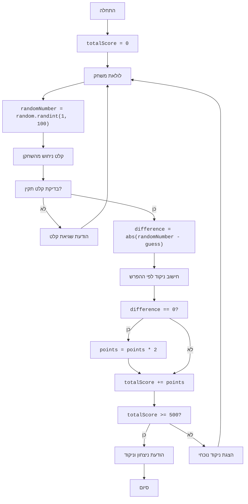

## <algorithm>

1. **התחלה:**
   - המשחק מתחיל עם `totalScore` (הניקוד הכולל) המוגדר ל-0.

   _דוגמה: `totalScore = 0`_

2. **לולאת משחק:**
   - המשחק נכנס ללולאה אינסופית `while True`, שתמשיך עד שהשחקן ינצח או יסיים את המשחק.

3. **יצירת מספר אקראי:**
   - בכל סיבוב, נוצר מספר אקראי בין 1 ל-100 באמצעות `random.randint(1, 100)`. המספר הזה נשמר בתוך המשתנה `randomNumber`.

   _דוגמה: `randomNumber = 42`_

4. **קבלת ניחוש מהשחקן:**
   - המשחק מבקש מהשחקן לנחש מספר באמצעות `input("Enter your guess: ")`.
   - נעשה ניסיון להמיר את הקלט למספר שלם באמצעות `int()`.
   - אם הקלט אינו מספר שלם, תודפס הודעת שגיאה, והלולאה תמשיך לסיבוב הבא עם `continue`.
   _דוגמה: השחקן מזין "50", `guess = 50`_

5. **חישוב ההפרש:**
   - ההפרש בין המספר האקראי לניחוש של השחקן מחושב באמצעות `abs(randomNumber - guess)`, והתוצאה נשמרת בתוך `difference`.

   _דוגמה: `difference = abs(42 - 50) = 8`_

6. **חישוב ניקוד:**
    - נעשה שימוש בשרשרת של תנאי `if-elif-else` כדי לקבוע את הניקוד בהתבסס על ההפרש:
        - אם `difference == 0`, `points = 100`.
        - אם `difference <= 5`, `points = 50`.
        - אם `difference <= 10`, `points = 25`.
        - אם `difference <= 20`, `points = -25`.
        - אחרת, `points = -50`.

   _דוגמה: עבור `difference = 8`, `points = 25`_

7. **בדיקת ג'קפוט:**
    - אם `difference == 0`, הניקוד מוכפל ב-2.

    _דוגמה: אם `difference = 0`, `points = 100 * 2 = 200`_

8. **עדכון הניקוד הכולל:**
   - הניקוד הנוכחי מתווסף לניקוד הכולל באמצעות `totalScore += points`.

   _דוגמה: אם `totalScore = 100`, ו-`points = 25`, אז `totalScore = 125`_

9. **בדיקת ניצחון:**
   - המשחק בודק אם `totalScore >= 500`.
   - אם כן, מוצגת הודעת ניצחון עם הניקוד הכולל, והלולאה מסתיימת באמצעות `break`.

   _דוגמה: אם `totalScore = 550`, תוצג הודעה "You Win! Total Score: 550"_

10. **הצגת הניקוד הנוכחי:**
    - אם השחקן לא ניצח, מוצג הניקוד הנוכחי באמצעות `print(f"Current Score: {totalScore}")`.

    _דוגמה: אם `totalScore = 125`, תוצג הודעה "Current Score: 125"_

11. **חזרה ללולאת המשחק:**
    - המשחק חוזר לשלב 2 עד שהשחקן מנצח.
   
## <mermaid>

## <explanation>

**ייבואים (Imports):**
- `import random`: מייבא את מודול `random`, המשמש ליצירת מספרים אקראיים. מודול זה הוא חלק מהספריה הסטנדרטית של פייתון, ולא מגיע מחבילות `src.`.

**משתנים (Variables):**
- `totalScore`: משתנה מסוג `int` המייצג את הניקוד הכולל של השחקן. הוא מאותחל ל-0 בתחילת המשחק.
- `randomNumber`: משתנה מסוג `int` שמייצג את המספר האקראי שנוצר על ידי המחשב.
- `guess`: משתנה מסוג `int` המייצג את הניחוש של השחקן.
- `difference`: משתנה מסוג `int` המייצג את הערך המוחלט של ההפרש בין המספר האקראי לניחוש של השחקן.
- `points`: משתנה מסוג `int` המייצג את הניקוד שצבר או איבד השחקן בסיבוב הנוכחי.

**פונקציות (Functions):**
- `random.randint(a, b)`: פונקציה מהמודול `random` שמקבלת שני מספרים שלמים `a` ו-`b`, ומחזירה מספר אקראי שלם בין `a` ל-`b` (כולל).
- `abs(x)`: פונקציה מובנית בפייתון שמחזירה את הערך המוחלט של `x`.
- `int(input(prompt))`: פונקציה מובנית בפייתון שמציגה הודעה למשתמש ומחכה לקלט ממנו, ולאחר מכן ממירה את הקלט למספר שלם.
- `print(f"...")`: פונקציה מובנית בפייתון שמציגה הודעה למשתמש. התבנית `f""` מאפשרת להכניס ערכים של משתנים לתוך המחרוזת.

**הסברים נוספים:**
- הקוד מדגים משחק ניחושים פשוט.
- נעשה שימוש בלולאה אינסופית `while True` שתפעל עד שהשחקן ינצח.
- נעשה שימוש בטיפול בשגיאות באמצעות `try... except` על מנת למנוע קריסה של התוכנית אם המשתמש מזין קלט לא חוקי.
- המשתנה `totalScore` משמש לצבירת ניקוד לאורך כל המשחק.
- הניקוד מחושב על פי מרחק הניחוש מהמספר האקראי ומוכפל אם הניחוש היה מדויק.
- המשחק מסתיים כאשר הניקוד הכולל מגיע ל-500 או יותר.

**בעיות אפשריות או תחומים לשיפור:**
- המשחק מסתיים רק כשהשחקן מגיע לניקוד מסוים ואין הגבלה למספר ניסיונות או סיבובים.
- אין אפשרות לשחקן לעצור את המשחק לפני שהגיע לניקוד המטרה.
- ממשק המשתמש פשוט מאוד, ניתן להוסיף לו עיצוב גרפי.
- ניתן להוסיף רמות קושי שונות על ידי שינוי טווח המספרים האקראיים.

**שרשרת קשרים עם חלקים אחרים בפרויקט:**
- קוד זה הוא משחק עצמאי ואינו תלוי בחלקים אחרים של הפרויקט.