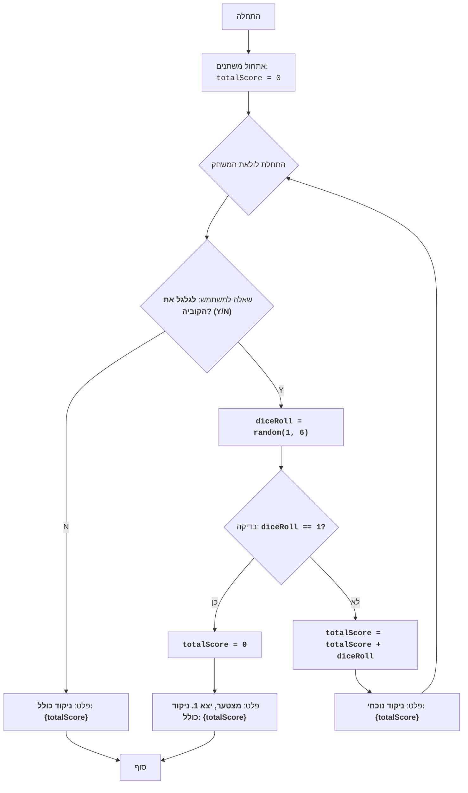

## ניתוח קוד: משחק קוביות "ACE"

### 1. <algorithm>

הקוד מדמה משחק קוביות בו השחקן מנסה לצבור כמה שיותר נקודות בלי להפיל 1.
להלן תרשים הזרימה של הקוד:

1. **אתחול**:
   - אתחול משתנה `totalScore` ל-0.
   *דוגמה:* `totalScore = 0`

2. **לולאת משחק**:
   - בקשה מהמשתמש האם לגלגל את הקוביה (Y/N).
   *דוגמה:* `roll_again = input("Roll the dice? (Y/N): ").upper()`
   - **אם המשתמש בוחר לא לגלגל (N)**:
       - הדפס את הניקוד הכולל (`totalScore`).
       *דוגמה:* אם `totalScore = 15`, אז המערכת תדפיס: "Total Score: 15".
       - סיום המשחק.
   - **אם המשתמש בוחר לגלגל (Y)**:
     - יצירת מספר רנדומלי בין 1 ל-6, שמדמה הטלת קוביה.
     *דוגמה:* `diceRoll = random.randint(1, 6)`. אם הקוביה הראתה 3, אז `diceRoll` יהיה 3.
     - **בדיקה אם יצא 1**:
       - **אם יצא 1**:
           - איפוס הניקוד הכולל (`totalScore` ל-0).
           *דוגמה:* `totalScore` משתנה מ-15 ל-0.
           - הדפס הודעת "סליחה, קיבלת 1. סה"כ ניקוד: 0".
           - סיום המשחק.
       - **אם לא יצא 1**:
           - הוסף את ערך הקוביה לניקוד הכולל (`totalScore`).
           *דוגמה:* אם `totalScore` הוא 15 ו`diceRoll` הוא 4, אז `totalScore` יהיה 19.
           - הדפס את הניקוד הנוכחי.
           *דוגמה:* אם `totalScore` הוא 19, אז המערכת תדפיס: "Current Score: 19".
           - המשך לולאת המשחק (חזור לשלב הבקשה מהמשתמש האם לגלגל).

### 2. <mermaid>

**הסבר תרשים `mermaid`:**

-   `Start`: מציין את תחילת ביצוע הקוד.
-   `InitializeScore`: מאתחל את משתנה `totalScore` לאפס, שיהווה את הניקוד הכולל של השחקן.
-   `GameLoopStart`: מציין את תחילת הלולאה של המשחק.
-  `AskToRoll`: מציג הודעה לשחקן ומבקש ממנו האם הוא רוצה לגלגל את הקוביה.
    - אם התשובה היא "N" (לא), הזרימה עוברת ל`OutputScore`.
    - אם התשובה היא "Y" (כן), הזרימה עוברת ל`RollDice`.
-   `OutputScore`: מציג את הניקוד הכולל של השחקן לאחר שהשחקן בחר לא לגלגל את הקוביה.
-   `End`: מציין את סיום ביצוע הקוד.
-   `RollDice`: מייצר מספר אקראי בין 1 ל-6 (דימוי גלגול קובייה) ומאחסן אותו במשתנה `diceRoll`.
-   `CheckDice`: בודק אם ערך הקובייה שווה ל-1.
    - אם התשובה היא "כן", הזרימה עוברת ל`ResetScore`.
    - אם התשובה היא "לא", הזרימה עוברת ל`AddScore`.
-   `ResetScore`: מאפס את הניקוד הכולל של השחקן לאפס לאחר שהתקבל 1 בגלגול הקוביה.
-   `OutputLost`: מציג הודעה שהשחקן הפסיד ואת הניקוד שלו לאחר איפוס הניקוד.
-   `AddScore`: מוסיף את ערך הקובייה לניקוד הכולל של השחקן.
-   `OutputCurrentScore`: מציג את הניקוד הנוכחי לאחר גלגול הקוביה והוספת הערך לניקוד.
    
**ייבוא תלויות:**

אין תלויות נוספות מלבד `random`, שמשמש לייצור מספרים אקראיים, כמו סימולציית הטלת קוביה.

### 3. <explanation>

**ייבואים (Imports):**
- `import random`: מייבא את מודול `random` של פייתון, שמשמש ליצירת מספרים אקראיים. המודול מספק פונקציות שונות ליצירת מספרים אקראיים, כמו `randint` (שמשמשת במשחק ליצירת מספר אקראי בין 1 ל-6, שמדמה את גלגול הקובייה). אין תלות בתוך חבילת `src.`.

**משתנים (Variables):**
- `totalScore`: משתנה מסוג `integer` המשמש לאחסון הניקוד הכולל של השחקן במהלך המשחק. הוא מתחיל ב-0 ומתווסף אליו ערך הקוביה בכל סיבוב שלא יוצא בו 1. כאשר יוצא 1 הניקוד מתאפס ל-0.
-   `roll_again`: משתנה מסוג `string`, שקולט את תשובת המשתמש ("Y" או "N") לגבי הרצון לגלגל את הקובייה. התשובה תמיד מומרת לאותיות גדולות (upper case) על מנת להקל על הבדיקה.
-   `diceRoll`: משתנה מסוג `integer` המכיל את תוצאת הטלת הקובייה (מספר אקראי בין 1 ל-6).

**פונקציות (Functions):**
- אין פונקציות מוגדרות מלבד הפונקציות המובנות בפייתון כמו `print`, `input`, ושימוש ב `random.randint`.
    -   `input(prompt)`: פונקציה מובנית שמקבלת הודעה ("prompt") ומציגה אותה למשתמש, ואז מחכה לקלט מהמשתמש. הקלט מוחזר כמחרוזת.
    -   `upper()`: פונקציה של מחרוזות בפייתון, שהופכת את כל האותיות במחרוזת לאותיות רישיות.
    -   `print(...)`: פונקציה מובנית בפייתון המדפיסה פלט לקונסולה.
    -  `random.randint(a, b)`: פונקציה מהמודול `random` שמחזירה מספר שלם אקראי בין `a` ל-`b`, כולל שניהם.

**הסברים נוספים:**

*   הקוד משתמש בלולאת `while True` ליצירת לולאה אינסופית, שממשיכה עד שהשחקן בוחר לא להטיל קובייה או שהוא מפיל 1.
*  הקוד מדמה משחק קוביות פשוט מאוד.
*   הקוד לא מטפל בשגיאות קלט (לדוגמה, אם המשתמש יזין משהו שאינו Y או N).

**בעיות אפשריות ושיפורים:**

1. **טיפול בשגיאות קלט:** הקוד לא מטפל במצבים בהם המשתמש מזין קלט שגוי כאשר נשאל האם להטיל את הקובייה (לדוגמה, אם יזין "A"). כדי לתקן את זה, יש להוסיף לולאה שתבדוק שהקלט תקין, כלומר, שהוא שווה ל-"Y" או ל-"N".
2.  **ממשק משתמש:** הממשק של המשחק פשוט מאוד, וניתן לשפר אותו על ידי הוספת תצוגה טובה יותר (למשל, להציג את תוצאות הטלת הקובייה בצורה גרפית יותר).
3.  **חוקים נוספים:** ניתן להרחיב את המשחק ולהוסיף חוקים נוספים, כמו מספר מקסימלי של סיבובים, או הוספת אפשרות לקבוע יעד ניקוד מראש.

**שרשרת קשרים עם חלקים אחרים בפרויקט:**
*   בגלל שהקוד אינו משתמש בקבצים אחרים בתוך הפרוייקט, אין שרשרת קשרים לחלקים אחרים בפרוייקט. הוא עצמאי ופועל רק עם היבוא מהספרייה הסטנדרטית של פייתון.