# ניתוח קוד: משחק ORBIT

## 1. <algorithm>

הקוד מממש משחק טקסט פשוט בו השחקן מנסה להכניס חללית למסלול סביב כוכב לכת על ידי הזנת מהירות התחלתית וזווית התחלתית. המשחק מדמה את תנועת החללית בהשפעת כוח הכבידה.

**תרשים זרימה צעד-אחר-צעד:**

1.  **אתחול משתנים:**
    *   `numberOfTries = 0` -  מאפס את מספר הניסיונות.
    *   `maxTries = 10` - קובע את מספר הניסיונות המקסימלי.
    *   `INITIAL_X = 100`, `INITIAL_Y = 0` - מגדיר מיקום התחלתי של החללית.
    *   `TIME_STEP = 0.1` - מגדיר את קצב הזמן בסימולציה.
    *   `ORBIT_TOLERANCE = 10` - מגדיר סטייה מותרת בין מרחקי החללית לכוכב על מנת שייחשב כמסלול.
    *   `MAX_STEPS = 1000` - מגדיר את מספר הצעדים המקסימלי בסימולציה.
2.  **לולאת משחק:**
    *   הלולאה רצה כל עוד `numberOfTries < maxTries` .
    *   `number_of_tries += 1` - מגדיל את מספר הניסיונות.
    *   **קבלת קלט מהמשתמש:**
        *   מבקש מהמשתמש להזין מהירות התחלתית (`initial_velocity`).
        *   מבקש מהמשתמש להזין זווית התחלתית (`initial_angle`).
    *   **חישוב רכיבי מהירות:**
        *   `angle_in_radians = math.radians(initial_angle)` - ממיר את הזווית ממעלות לרדיאנים.
        *   `velocityX = initialVelocity * math.cos(angleInRadians)` - מחשב את רכיב ה-X של המהירות.
        *   `velocityY = initialVelocity * math.sin(angleInRadians)` - מחשב את רכיב ה-Y של המהירות.
    *   **אתחול מיקום:**
        *   `x = INITIAL_X` - מגדיר את קואורדינטת X ההתחלתית.
        *   `y = INITIAL_Y` - מגדיר את קואורדינטת Y ההתחלתית.
    *   **לולאת סימולציה:**
        *   הלולאה רצה עד `MAX_STEPS` צעדים.
        *   **חישוב מרחק:** `distance = math.sqrt(x * x + y * y)` - מחשב את מרחק החללית מכוכב הלכת.
        *   **חישוב תאוצה:**
            *   `accelerationX = -x / (distance ** 3)` - מחשב את התאוצה על ציר X.
            *   `accelerationY = -y / (distance ** 3)` - מחשב את התאוצה על ציר Y.
        *   **עדכון מהירות:**
            *   `velocityX += accelerationX * TIME_STEP` - מעדכן את המהירות בציר X.
            *   `velocityY += accelerationY * TIME_STEP` - מעדכן את המהירות בציר Y.
        *   **עדכון מיקום:**
            *   `x += velocityX * TIME_STEP` - מעדכן את קואורדינטת X.
            *   `y += velocityY * TIME_STEP` - מעדכן את קואורדינטת Y.
        *   **בדיקת מסלול:**
            *    בודק אם ההבדל בין המרחק הנוכחי למרחק הקודם קטן מ-`ORBIT_TOLERANCE` . אם זה קורה 50 פעמים ברצף החללית נחשבת כמסלול.
            *   `return True` - אם החללית במסלול, יוצא מהסימולציה.
        *   **בדיקת יציאה מהמסגרת:**
            *   `if abs(x) > 500 or abs(y) > 500`: בודק האם החללית יצאה מגבולות הסימולציה.
            *   `return False` - אם החללית יצאה מהגבולות, יוצא מהסימולציה.
     *  אם הסימולציה הסתיימה ו-`orbit_established` הוא `True` - מדפיס "ORBIT ESTABLISHED" ומסיים את המשחק.
     *  אחרת, מדפיס "FAILED" וחוזר על הלולאה.
3.  אם כל הניסיונות כשלו - מדפיס "GAME OVER" ומסיים את המשחק.

```mermaid
flowchart TD
    Start["התחלה"] --> InitializeVariables["<p align='left'>אתחול משתנים:\n    <code><b>\n    numberOfTries = 0<br>\n    maxTries = 10<br>\n     INITIAL_X = 100<br>\n     INITIAL_Y = 0<br>\n     TIME_STEP = 0.1<br>\n     ORBIT_TOLERANCE = 10<br>\n     MAX_STEPS = 1000\n    </b></code></p>"]
    InitializeVariables --> LoopStart{"תחילת לולאה: <code><b>numberOfTries < maxTries</b></code>"}
    LoopStart -- כן --> IncreaseTries["<code><b>numberOfTries = numberOfTries + 1</b></code>"]
    IncreaseTries --> InputVelocity["קלט: <code><b>initialVelocity</b></code>"]
    InputVelocity --> InputAngle["קלט: <code><b>initialAngle</b></code>"]
    InputAngle --> CalculateVelocityComponents["<p align='left'>חישוב:\n    <code><b>\n    angleInRadians = initialAngle * PI / 180<br>\n    velocityX = initialVelocity * cos(angleInRadians)<br>\n    velocityY = initialVelocity * sin(angleInRadians)\n    </b></code></p>"]
    CalculateVelocityComponents --> InitializePosition["<p align='left'>אתחול מיקום:\n    <code><b>\n    x = INITIAL_X<br>\n    y = INITIAL_Y\n    </b></code></p>"]
    InitializePosition --> SimulationLoopStart{"תחילת סימולציה: <code><b>step < MAX_STEPS</b></code>"}
     SimulationLoopStart --> CalculateDistance["<p align='left'>חישוב מרחק:\n        <code><b>distance = sqrt(x^2 + y^2)</b></code></p>"]
    CalculateDistance --> CalculateAcceleration["<p align='left'>חישוב תאוצה:\n        <code><b>\n        accelerationX = -x / distance^3<br>\n        accelerationY = -y / distance^3\n        </b></code></p>"]
    CalculateAcceleration --> UpdateVelocity["<p align='left'>עדכון מהירות:\n        <code><b>\n        velocityX = velocityX + accelerationX * TIME_STEP<br>\n        velocityY = velocityY + accelerationY * TIME_STEP\n        </b></code></p>"]
    UpdateVelocity --> UpdatePosition["<p align='left'>עדכון מיקום:\n        <code><b>\n        x = x + velocityX * TIME_STEP<br>\n        y = y + velocityY * TIME_STEP\n        </b></code></p>"]
    UpdatePosition --> CheckOrbit{"בדיקה: <code><b>האם במסלול?</b></code>"}
    CheckOrbit -- כן --> OutputOrbitEstablished["פלט: <b>ORBIT ESTABLISHED</b>"]
    OutputOrbitEstablished --> End["סוף"]
     CheckOrbit -- לא --> CheckOutOfBound{"בדיקה: <code><b>יצא מהמסגרת?</b></code>"}
    CheckOutOfBound -- כן --> SimulationLoopEnd["סוף סימולציה"]
     CheckOutOfBound -- לא --> SimulationLoopStart
    SimulationLoopEnd --> CheckTries{"בדיקה: <code><b>numberOfTries < maxTries?</b></code>"}
    CheckTries -- כן --> LoopStart
    CheckTries -- לא --> OutputFailed["פלט: <b>GAME OVER</b>"]
    OutputFailed --> End
    LoopStart -- לא --> End
    
```

## 2. <mermaid>

**הסבר על התלויות:**
*   **`import math`**: המודול `math` מספק פונקציות מתמטיות כמו `sqrt` (שורש ריבועי), `cos` (קוסינוס), `sin` (סינוס), ו-`radians` (המרת זוויות מרדיאנים למעלות). פונקציות אלה חיוניות לחישובי הסימולציה.

**הסבר על שמות המשתנים:**

*   `Start`: התחלת התוכנית.
*   `InitializeVariables`: אתחול משתנים כמו מספרי ניסיונות, קבועי סימולציה וכו.
*   `LoopStart`: התחלת לולאת המשחק, כל עוד מספר הניסיונות קטן ממקסימום הניסיונות.
*   `IncreaseTries`: הגדלת מספר הניסיונות.
*   `InputVelocity`: קבלת מהירות התחלתית מהמשתמש.
*   `InputAngle`: קבלת זווית התחלתית מהמשתמש.
*   `CalculateVelocityComponents`: חישוב רכיבי המהירות ההתחלתית.
*  `InitializePosition`: אתחול מיקום התחלתי של החללית.
*  `SimulationLoopStart`: תחילת לולאת הסימולציה, כל עוד מספר הצעדים קטן ממקסימום הצעדים.
*   `CalculateDistance`: חישוב המרחק בין החללית לכוכב הלכת.
*   `CalculateAcceleration`: חישוב התאוצה על החללית עקב כוח הכבידה.
*   `UpdateVelocity`: עדכון המהירות של החללית בהתבסס על התאוצה.
*   `UpdatePosition`: עדכון מיקום החללית בהתבסס על מהירותה.
*   `CheckOrbit`: בדיקה האם החללית במסלול יציב.
*   `OutputOrbitEstablished`: פלט כאשר החללית במסלול יציב.
*   `CheckOutOfBound`: בדיקה האם החללית יצאה מגבולות הסימולציה.
*   `SimulationLoopEnd`: סוף לולאת הסימולציה.
*   `CheckTries`: בדיקה האם מספר הניסיונות קטן ממקסימום הניסיונות.
*   `OutputFailed`: פלט כאשר כל הניסיונות הסתיימו.
*   `End`: סיום התוכנית.

## 3. <explanation>

**ייבוא (Imports):**

*   `import math`: מייבא את המודול `math`, המכיל פונקציות מתמטיות. המודול נדרש לביצוע חישובים כמו מעבר מרדיאנים למעלות (math.radians), חישוב קוסינוס (math.cos), סינוס (math.sin) ושורש ריבועי (math.sqrt), הנדרשים לחישוב מסלול החללית. אין תלות ספציפית בחבילות אחרות ב-`src.`.

**פונקציות (Functions):**

*   `simulate_orbit(initial_velocity, initial_angle)`:
    *   **פרמטרים**:
        *   `initial_velocity` (float): מהירות התחלתית של החללית.
        *   `initial_angle` (float): זווית התחלתית של החללית במעלות.
    *   **ערך מוחזר**: `True` אם החללית נכנסה למסלול יציב, אחרת `False`.
    *   **מטרה**: מדמה את תנועת החללית בהשפעת כוח הכבידה של כוכב הלכת, על בסיס המהירות והזווית ההתחלתיות.
    *   **דוגמאות שימוש**: `simulate_orbit(5, 45)` או `simulate_orbit(7.2, 60.5)`.
*   `play_orbit_game()`:
    *   **פרמטרים**: אין.
    *   **ערך מוחזר**: אין.
    *   **מטרה**: מנהלת את לולאת המשחק הראשית. היא מבקשת מהמשתמש להזין מהירות וזווית, קוראת לפונקציה `simulate_orbit`, ומדפיסה הודעה אם המסלול הושלם בהצלחה או אם המשחק נגמר לאחר מספר ניסיונות מקסימלי.
    *   **דוגמאות שימוש**: `play_orbit_game()` - מפעיל את המשחק.

**משתנים (Variables):**

*   `INITIAL_X`, `INITIAL_Y`: קבועים המגדירים את מיקום ההתחלה של החללית. הם מסוג int.
*   `TIME_STEP`: קבוע המייצג את גודל צעד הזמן בסימולציה. הוא מסוג float.
*   `ORBIT_TOLERANCE`: קבוע המגדיר את הסטייה המותרת בין המרחקים לזיהוי מסלול יציב. הוא מסוג int.
*   `MAX_STEPS`: קבוע המגדיר את מספר הצעדים המקסימלי בסימולציה. הוא מסוג int.
*   `MAX_TRIES`: קבוע המגדיר את מספר הניסיונות המקסימלי למשתמש. הוא מסוג int.
*   `number_of_tries`: משתנה המשמש לספירת מספר הניסיונות של המשתמש. הוא מסוג int.
*   `initial_velocity`: משתנה המכיל את המהירות ההתחלתית שהזין המשתמש. הוא מסוג float.
*   `initial_angle`: משתנה המכיל את הזווית ההתחלתית שהזין המשתמש. הוא מסוג float.
*   `x`, `y`: משתנים המייצגים את מיקום החללית במהלך הסימולציה. הם מסוג float.
*  `velocity_x`, `velocity_y`: משתנים המייצגים את מהירות החללית בציר X ובציר Y. הם מסוג float.
*   `distance`: משתנה המייצג את המרחק בין החללית לכוכב הלכת. הוא מסוג float.
*   `acceleration_x`, `acceleration_y`: משתנים המייצגים את התאוצה של החללית בציר X ובציר Y. הם מסוג float.
*   `last_distance`: משתנה המייצג את המרחק האחרון של החללית לכוכב הלכת. הוא מסוג float.
* `orbit_count` - משתנה המייצג את מספר הפעמים ברצף שהמרחק בין החללית לכוכב הלכת כמעט ולא השתנה. הוא מסוג int.

**בעיות אפשריות ותחומים לשיפור:**
1.  **קלט משתמש**: הקוד כרגע מטפל רק בשגיאות מסוג `ValueError`. ייתכן ויהיה צורך לטפל בסוגי שגיאות נוספים, כמו למשל,  קלט ריק.
2.  **סימולציה**:
    *   הסימולציה פשוטה יחסית ואינה לוקחת בחשבון גורמים כמו חיכוך, שינויים בכוח הכבידה וכו'.
    *   השימוש במספר קבוע של צעדי סימולציה `MAX_STEPS` עלול לגרום לכך שהמשחק לא יסתיים אם החללית תנוע מחוץ למסגרת הסימולציה או בתוך מסלול שאינו יציב. יש לשקול שימוש בסימולציה דינמית שתסתיים כאשר החללית מגיעה למצב יציב או יוצאת מהגבולות, או להוסיף תנאי עצירה נוספים.
    *   יש לשקול להוסיף ויזואליזציה כלשהי לסימולציה על מנת לשפר את חווית המשתמש.
3.  **בדיקת מסלול**: הבדיקה שמבוצעת כרגע לא מספיק מדויקת. יש לשקול אלגוריתם מורכב יותר.
4.  **הגבלת ניסיונות**: המשתמש מוגבל למספר ניסיונות מסוים, מה שיכול להיות מתסכל עבור חלק מהמשתמשים. אפשר לשקול לתת למשתמש אפשרות לבחור את מספר הניסיונות.
5.  **תיעוד**: כדאי להוסיף הערות קוד מפורטות יותר וגם docstrings לכל הפונקציות על מנת להקל על ההבנה והתחזוקה של הקוד.

**שרשרת קשרים:**

*   הקוד הוא עצמאי ואינו תלוי בחלקים אחרים בפרויקט. הוא משתמש רק במודול `math` של שפת פייתון.