# ניתוח קוד: משחק סימולציית מסלול (Orbit)

## 1. <algorithm>

### תיאור תהליך העבודה:

1.  **התחלה**:
    *   אתחול משתנים:
        *   `number_of_tries` = 0 (מספר הניסיונות)
        *   `max_tries` = 10 (מקסימום ניסיונות)
    *   **דוגמה:** מתחילים את המשחק עם 0 ניסיונות ומקסימום 10 ניסיונות.

2.  **לולאת המשחק (while number_of_tries < max_tries)**:
    *   הגדלת מספר הניסיונות: `number_of_tries = number_of_tries + 1`.
        *   **דוגמה:** בניסיון הראשון, `number_of_tries` יהפוך מ-0 ל-1.
    *   קליטת קלט מהמשתמש:
        *   קליטת מהירות התחלתית (initial_velocity).
        *   קליטת זווית התחלתית (initial_angle).
        *   **דוגמה:** המשתמש מכניס מהירות 5 וזווית 45.
    *   חישוב רכיבי המהירות:
        *   המרת הזווית לרדיאנים: `angle_in_radians = initial_angle * PI / 180`
        *   חישוב רכיב המהירות בציר ה-X: `velocity_x = initial_velocity * cos(angle_in_radians)`
        *   חישוב רכיב המהירות בציר ה-Y: `velocity_y = initial_velocity * sin(angle_in_radians)`
        *   **דוגמה:** אם initial_velocity=5, initial_angle=45, אז velocity_x ו-velocity_y יהיו בערך 3.54.
    *   אתחול מיקום:
        *   `x = INITIAL_X`, `y = INITIAL_Y`
        *   **דוגמה:** `x` מקבל את ערך 100 ו-`y` מקבל את ערך 0.
    *   **לולאת הסימולציה**
        *   חישוב מרחק:
            *   `distance = sqrt(x*x + y*y)`
            *   **דוגמה:** אם x=100, y=0 אז distance = 100.
        *   חישוב תאוצה:
            *   `acceleration_x = -x / distance^3`
            *   `acceleration_y = -y / distance^3`
            *   **דוגמה:** אם x=100, y=0 ומרחק=100 אז `acceleration_x` יהיה שווה ל- -0.000001, ו-`acceleration_y` יהיה 0.
        *   עדכון מהירות:
            *   `velocity_x = velocity_x + acceleration_x * TIME_STEP`
            *   `velocity_y = velocity_y + acceleration_y * TIME_STEP`
            *   **דוגמה:** אם `velocity_x` = 3.54, `acceleration_x` = -0.000001 ו-`TIME_STEP` = 0.1, אז `velocity_x` יהיה בערך 3.54.
        *   עדכון מיקום:
            *   `x = x + velocity_x * TIME_STEP`
            *   `y = y + velocity_y * TIME_STEP`
            *   **דוגמה:** אם `velocity_x` = 3.54 ו-`TIME_STEP` = 0.1, אז `x` יהיה בערך 100.354.
        *   בדיקת יציבות מסלול (orbit check):
            *   בדיקה אם המרחק מהכוכב השתנה פחות מ-`ORBIT_TOLERANCE`.
            *   אם כן, `orbit_count` גדל. אם לא, `orbit_count` מאופס.
            *   אם `orbit_count` גדול מ-50, המסלול נחשב ליציב והסימולציה מסתיימת.
            *   **דוגמה:** אם המרחק לא משתנה משמעותית במהלך 50 איטרציות רצופות, המסלול נחשב ליציב.
        *   בדיקה אם היצאה מהגבולות (out of bounds check):
            *   בדיקה אם `abs(x)` או `abs(y)` גדולים מ-500.
            *   אם כן, הסימולציה מסתיימת.
            *   **דוגמה:** אם אחד מהערכים של x או y עובר את הערך 500 הסימולציה מסתיימת.
    *   בדיקה האם המסלול יציב:
        *   אם כן, הדפסת ההודעה "ORBIT ESTABLISHED" והמשחק מסתיים.
        *   אם לא, הדפסת ההודעה "FAILED" והלולאה חוזרת לנקודה 2.

3.  **סיום המשחק**:
    *   אם הלולאה הסתיימה עקב מספר ניסיונות מקסימלי, הדפסת ההודעה "GAME OVER" והמשחק מסתיים.

### זרימת הנתונים:

*   המשתמש מספק קלט (`initial_velocity`, `initial_angle`).
*   הקלט מעובד על ידי הפונקציה `simulate_orbit`.
*   הפונקציה `simulate_orbit` מחשבת את המיקום והמהירות החדשים של החללית.
*   התוצאה של `simulate_orbit` (האם המסלול יציב) משמשת לקביעת התקדמות המשחק.

```mermaid
flowchart TD
    Start["התחלה"] --> InitializeVariables["<p align='left'>איניציאליזציה של משתנים:<br><code><b>numberOfTries = 0<br>maxTries = 10</b></code></p>"]
    InitializeVariables --> LoopStart{"התחלת לולאה: <code><b>numberOfTries < maxTries</b></code>"}
    LoopStart -- כן --> IncreaseTries["<code><b>numberOfTries = numberOfTries + 1</b></code>"]
    IncreaseTries --> InputVelocity["קבלת מהירות התחלתית: <code><b>initialVelocity</b></code>"]
    InputVelocity --> InputAngle["קבלת זווית התחלתית: <code><b>initialAngle</b></code>"]
    InputAngle --> CalculateVelocityComponents["<p align='left'>חישוב:<br><code><b>angleInRadians = initialAngle * PI / 180<br>velocityX = initialVelocity * cos(angleInRadians)<br>velocityY = initialVelocity * sin(angleInRadians)</b></code></p>"]
    CalculateVelocityComponents --> InitializePosition["<p align='left'>איניציאליזציה:<br><code><b>x = INITIAL_X<br>y = INITIAL_Y</b></code></p>"]
    InitializePosition --> SimulationLoopStart{"התחלת סימולציה: כל עוד לא הושגה אורביטה או יצאו מגבולות"}
    SimulationLoopStart --> CalculateDistance["<p align='left'>חישוב מרחק:<br><code><b>distance = sqrt(x^2 + y^2)</b></code></p>"]
    CalculateDistance --> CalculateAcceleration["<p align='left'>חישוב תאוצה:<br><code><b>accelerationX = -x / distance^3<br>accelerationY = -y / distance^3</b></code></p>"]
    CalculateAcceleration --> UpdateVelocity["<p align='left'>עדכון מהירות:<br><code><b>velocityX = velocityX + accelerationX * TIME_STEP<br>velocityY = velocityY + accelerationY * TIME_STEP</b></code></p>"]
    UpdateVelocity --> UpdatePosition["<p align='left'>עדכון מיקום:<br><code><b>x = x + velocityX * TIME_STEP<br>y = y + velocityY * TIME_STEP</b></code></p>"]
    UpdatePosition --> CheckOrbit{"בדיקה: <code><b>האם באורביטה?</b></code>"}
    CheckOrbit -- כן --> OutputOrbitEstablished["פלט: <b>ORBIT ESTABLISHED</b>"]
    OutputOrbitEstablished --> End["סוף"]
    CheckOrbit -- לא --> CheckOutOfBound{"בדיקה: <code><b>האם יצא מגבולות?</b></code>"}
    CheckOutOfBound -- כן --> SimulationLoopEnd["סוף סימולציה"]
    CheckOutOfBound -- לא --> SimulationLoopStart
    SimulationLoopEnd --> CheckTries{"בדיקה: <code><b>numberOfTries < maxTries?</b></code>"}
    CheckTries -- כן --> LoopStart
    CheckTries -- לא --> OutputFailed["פלט: <b>FAILED</b>"]
    OutputFailed --> End
    LoopStart -- לא --> End
```

## 2. <mermaid>

### הסבר על התלויות:

*   **לא קיימות תלויות יבוא ישירות בין הקובץ הזה לבין קבצים אחרים בתוך הפרויקט**
*   **הקוד משתמש בספריית `math` של פייתון** כדי לבצע פעולות מתמטיות כמו `cos`, `sin`, `sqrt`, ו-`radians`.

## 3. <explanation>

### ייבוא (Imports):

*   `import math`: מייבא את מודול `math` לביצוע פעולות מתמטיות.

### משתנים גלובליים:

*   `INITIAL_X` (int): המיקום ההתחלתי של החללית על ציר X.
*   `INITIAL_Y` (int): המיקום ההתחלתי של החללית על ציר Y.
*   `TIME_STEP` (float): גודל הצעד הזמני בסימולציה.
*   `ORBIT_TOLERANCE` (int): מרחק הסף בין שני מרחקים מהכוכב כדי להגדיר את המסלול כיציב.
*   `MAX_STEPS` (int): מספר הצעדים המקסימלי בסימולציה, למניעת לולאה אינסופית.
*    `MAX_TRIES` (int): מספר הנסיונות המקסימלי שהמשתמש יכול לנסות כדי לשגר את החללית לאורביטה.

### פונקציות (Functions):

1.  `simulate_orbit(initial_velocity, initial_angle)`:
    *   **פרמטרים**:
        *   `initial_velocity` (float): המהירות ההתחלתית של החללית.
        *   `initial_angle` (float): הזווית ההתחלתית של החללית (במעלות).
    *   **ערך מוחזר**:
        *   `True` אם המסלול יציב, `False` אם לא.
    *   **תפקיד**: הפונקציה מדמה את תנועת החללית בהשפעת כוח המשיכה. היא מחשבת את המיקום והמהירות החדשים של החללית בכל צעד זמן, ובודקת אם החללית נכנסה למסלול יציב.
    *   **דוגמה**: `simulate_orbit(5, 45)` תדמה את תנועת החללית עם מהירות התחלתית 5 וזווית 45.

2.  `play_orbit_game()`:
    *   **פרמטרים**: אין.
    *   **ערך מוחזר**: אין.
    *   **תפקיד**: הפונקציה מנהלת את לולאת המשחק. היא מקבלת את מהירות וזווית השיגור מהמשתמש, קוראת ל-`simulate_orbit`, ומדפיסה הודעה מתאימה (האם החללית הגיעה למסלול או לא).
    *   **דוגמה**: `play_orbit_game()` מתחילה את המשחק ומאפשרת למשתמש לנסות עד 10 פעמים לשגר את החללית לאורביטה.

### משתנים (Variables):

*   **בתוך `simulate_orbit`:**
    *   `angle_in_radians` (float): הזווית ההתחלתית ברדיאנים.
    *   `velocity_x` (float): מהירות התחלתית בציר X.
    *   `velocity_y` (float): מהירות התחלתית בציר Y.
    *   `x` (float): המיקום הנוכחי של החללית על ציר X.
    *   `y` (float): המיקום הנוכחי של החללית על ציר Y.
    *    `last_distance` (float): המרחק מהכוכב בצעד הסימולציה הקודם.
    *    `orbit_count` (int): סופר את מספר הצעדים בהם המרחק לא השתנה משמעותית.
    *   `distance` (float): המרחק הנוכחי של החללית מהכוכב.
    *   `acceleration_x` (float): התאוצה של החללית על ציר X.
    *   `acceleration_y` (float): התאוצה של החללית על ציר Y.
    *   `step` (int): אינדקס של הצעד הנוכחי בסימולציה.
*    **בתוך `play_orbit_game`:**
    *   `number_of_tries` (int): מספר הניסיונות הנוכחי.
    *   `initial_velocity` (float): המהירות ההתחלתית של החללית שהוכנסה על ידי המשתמש.
    *   `initial_angle` (float): הזווית ההתחלתית של החללית שהוכנסה על ידי המשתמש.
    *   `orbit_established` (bool): מציין אם החללית נכנסה למסלול.

### בעיות אפשריות ותחומים לשיפור:

*   **יכולת שיפור בדיוק הסימולציה**: הסימולציה משתמשת בשלב זמן קבוע. יכול להיות מעניין להוסיף מנגנון לחישוב צעד זמן דינמי.
*    **תנאי עצירת סימולציה**: במקרה והאובייקט פוגע בכוכב הסימולציה ממשיכה לרוץ עד שמגיעים למספר הצעדים המקסימלי או שהאובייקט יוצא מגבולות המודל.

### קשרים עם חלקים אחרים בפרויקט:

*   הקוד עצמאי ואינו תלוי בקוד אחר בתוך הפרויקט `hypotez`.