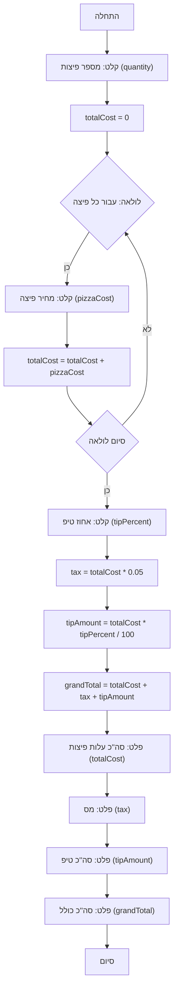

## ניתוח קוד: משחק פיצה

### 1. <algorithm>

**תיאור תהליך העבודה של הקוד:**

1.  **קבלת קלט מספר פיצות:**
    *   המשתמש מתבקש להזין את מספר הפיצות שהוא רוצה להזמין.
    *   לדוגמה: המשתמש מזין `3`.
2.  **אתחול סכום כולל:**
    *   משתנה `totalCost` מאותחל ל-`0`.
3.  **לולאה עבור כל פיצה:**
    *   לולאה רצה מספר פעמים ששווה למספר הפיצות.
        *   לדוגמה: לולאה תרוץ 3 פעמים אם המשתמש הזמין 3 פיצות.
        *   בתוך הלולאה:
            1.  **קבלת עלות פיצה:**
                *   המשתמש מתבקש להזין את עלות הפיצה הנוכחית.
                *   לדוגמה: המשתמש מזין `25.5`.
            2.  **עדכון הסכום הכולל:**
                *   העלות של הפיצה הנוכחית מתווספת ל-`totalCost`.
                *   לדוגמה: אם `totalCost` היה `0`, עכשיו הוא יהיה `25.5`. אם המחיר של הפיצה הבאה יהיה 30, אז totalCost יהיה 55.5.
4.  **קבלת אחוז טיפ:**
    *   המשתמש מתבקש להזין את אחוז הטיפ שהוא רוצה להשאיר.
    *    לדוגמה: המשתמש מזין `10`.
5.  **חישוב מס:**
    *   המס מחושב כ-`5%` מהסכום הכולל של הפיצות (`totalCost`).
    *   לדוגמה: אם `totalCost` הוא `100`, המס יהיה `5`.
6.  **חישוב סכום טיפ:**
    *   סכום הטיפ מחושב כאחוז הטיפ מהסכום הכולל של הפיצות.
    *   לדוגמה: אם `totalCost` הוא `100` ואחוז הטיפ הוא `10`, סכום הטיפ יהיה `10`.
7.  **חישוב סכום סופי:**
    *   הסכום הסופי מחושב כסכום הכולל של הפיצות + מס + סכום טיפ.
    *   לדוגמה: אם `totalCost` הוא `100`, המס הוא `5` וסכום הטיפ הוא `10`, הסכום הסופי יהיה `115`.
8.  **הדפסת תוצאות:**
    *   הסכום הכולל של הפיצות, המס, סכום הטיפ והסכום הסופי מודפסים למסך.
        *   לדוגמה:
            *   `Общая стоимость пицц: 100.00`
            *   `Налог: 5.00`
            *   `Чаевые: 10.00`
            *   `Полная стоимость заказа: 115.00`

### 2. <mermaid>

**ניתוח התלויות:**

*   אין תלויות חיצוניות (ייבוא של מודולים אחרים) בקוד הזה. כל הקוד מבוסס על פונקציות בסיסיות של פייתון, כמו קלט מהמשתמש, לולאות ופעולות חשבוניות.

### 3. <explanation>

**ייבואים (Imports):**
*   אין ייבוא של חבילות או מודולים אחרים בקוד הזה. הקוד משתמש בפונקציות בסיסיות של פייתון.

**מחלקות (Classes):**
*   אין שימוש במחלקות בקוד הזה.

**פונקציות (Functions):**
*   אין שימוש בפונקציות שמוגדרות על ידי המשתמש בקוד הזה. כל הקוד מבוצע ברמה הגלובלית. הפונקציות המובנות `int()`, `float()`, `input()`, `print()` משמשות לקבלת קלט מהמשתמש, המרת סוגי נתונים והצגת פלט למסך.

**משתנים (Variables):**

*   `quantity` (int): מספר הפיצות שהמשתמש רוצה להזמין.
*   `totalCost` (float): הסכום הכולל של כל הפיצות.
*   `pizzaCost` (float): המחיר של פיצה בודדת.
*   `tipPercent` (float): אחוז הטיפ שהמשתמש רוצה להשאיר.
*   `tax` (float): סכום המע"מ, 5% מסה"כ העלות.
*   `tipAmount` (float): הסכום הכולל של הטיפ.
*   `grandTotal` (float): הסכום הכולל של ההזמנה, כולל עלות הפיצות, המע"מ והטיפ.

**הסברים מפורטים:**

*   **קלט מהמשתמש:** הקוד משתמש בלולאות `while True` עם טיפול בשגיאות כדי לוודא שהמשתמש מזין נתונים מספריים תקינים (כמו מספר פיצות, עלות פיצה ואחוז טיפ).
*   **חישובים:** הקוד מבצע חישובים פשוטים כמו חיבור, כפל וחילוק כדי לחשב את המע"מ, הטיפ והסכום הסופי.
*   **הדפסה:** הקוד מדפיס את התוצאות בצורה מפורטת ומעוצבת, כולל עיגול לשני מקומות אחרי הנקודה.
*   **שיפורים אפשריים:**
    *   ניתן להוסיף אימות קלט נוסף, כמו לוודא שהמחיר של פיצה בודדת לא גדול מדי או קטן מדי.
    *   אפשר להפוך את הקוד לפונקציה, מה שהופך אותו ליותר מודולרי וקריא.
    *   אפשר להוסיף תפריט פיצה או אפשרויות שונות להזמנה, מה שיהפוך את המשחק למעניין יותר.

**שרשרת קשרים עם חלקים אחרים בפרויקט:**

*   הקוד הזה הוא משחק עצמאי ואין לו קשרים ישירים לחלקים אחרים בפרויקט. הוא יכול לשמש כמודול נפרד במשחקים אחרים בפרויקט.