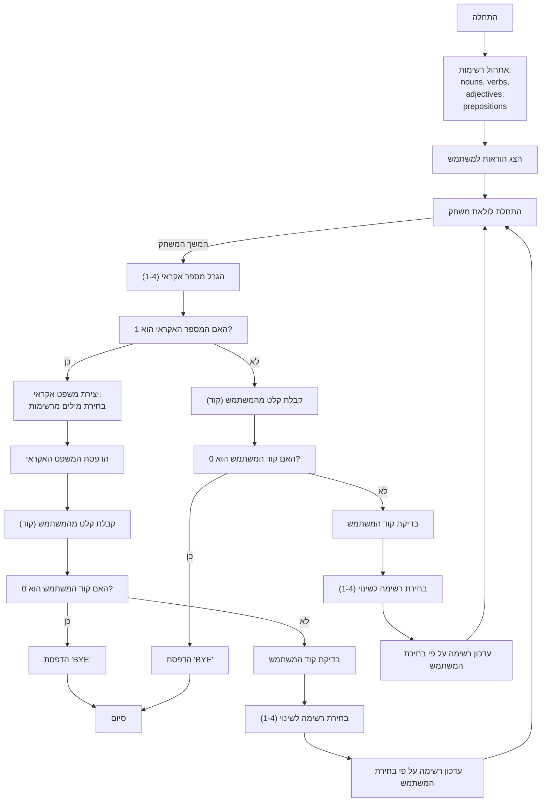

## <algorithm>
הקוד מיישם משחק פשוט שבו המחשב יוצר משפטים אקראיים באמצעות בחירה של מילים מרשימות מוגדרות מראש. השחקן יכול להשפיע על יצירת המשפטים על ידי שינוי הרשימות הללו.

1. **אתחול רשימות מילים:**
   - הגדרת ארבע רשימות: `nouns`, `verbs`, `adjectives`, ו- `prepositions`, עם ערכים התחלתיים.
   - לדוגמה: `nouns = ["BIRDS", "CATS", ...]`

2. **הצגת הוראות למשתמש:**
   - פלט הודעת פתיחה והוראות למשתמש כיצד לשחק: שינוי רשימות מילים או סיום המשחק.

3. **לולאה ראשית של המשחק:**
   - המשחק רץ בלולאה אינסופית `while True:`, עד שהמשתמש בוחר לסיים.

4. **בחירת פעולה אקראית:**
   - המחשב מגריל מספר אקראי בין 1 ל-4 (`randomNumber`).
   - אם המספר הוא 1, המחשב ייצור משפט אקראי.
   - אם המספר אינו 1, המשתמש יתבקש להזין קוד לשינוי רשימות מילים.

5. **יצירת משפט אקראי (אם `randomNumber` שווה ל-1):**
    -  המחשב בוחר מילה אקראית מכל אחת מהרשימות:
       - `random_noun = random.choice(nouns)`
       - `random_verb = random.choice(verbs)`
       - `random_adjective = random.choice(adjectives)`
       - `random_preposition = random.choice(prepositions)`
    -  המשפט נוצר: `phrase = f"THE {random_adjective} {random_noun} {random_verb} {random_preposition} THE FOREST"`
    - המשפט מודפס למסך.
    - המשתמש מתבקש להזין קוד. אם הקוד הוא 0, הלולאה מסתיימת.

6. **קבלת קלט מהמשתמש (אם `randomNumber` שונה מ-1):**
   - המשתמש מתבקש להזין קוד (0-4).
   - אם הקוד הוא 0, הלולאה מסתיימת.
   - אם הקוד אינו 0, הקוד יעבור לבדיקה איזו רשימה לשנות.
  
7.  **בדיקת קלט המשתמש:**
    - המשתמש מתבקש להזין קוד לשינוי רשימה.
    - אם הקוד הוא 1, רשימת `nouns` תשתנה.
    - אם הקוד הוא 2, רשימת `verbs` תשתנה.
    - אם הקוד הוא 3, רשימת `adjectives` תשתנה.
    - אם הקוד הוא 4, רשימת `prepositions` תשתנה.
   - אם הקוד לא אחד מהנ"ל, תחזור ללולאה ותבקש קוד שוב.

8.  **שינוי רשימת מילים:**
    - אם הקוד הוא 1-4, הפונקציה `change_list()` נקראת עם שם הרשימה המתאימה.
       - הפונקציה מבקשת מהמשתמש להזין מילים חדשות המופרדות בפסיקים, ומחזירה רשימה חדשה.
       - הרשימה הישנה מוחלפת ברשימה החדשה.

9. **סיום המשחק:**
    - כאשר המשתמש מזין 0, הלולאה מסתיימת וההודעה "BYE" מודפסת.

## <mermaid>

**הסבר תרשים Mermaid:**

- **Start**: תחילת המשחק.
- **InitializeLists**: אתחול רשימות המילים (שמות עצם, פעלים, תארים, מילות יחס) עם ערכי ברירת מחדל.
- **OutputInstructions**: הצגת הוראות המשחק למשתמש.
- **GameLoopStart**: תחילת הלולאה הראשית של המשחק, שתמשיך עד שהמשתמש יבחר לסיים.
- **GenerateRandomNumber**: הגרלת מספר אקראי בין 1 ל-4.
- **CheckRandomNumber**: בדיקה האם המספר האקראי שהוגרל הוא 1, כדי להחליט אם לייצר משפט אקראי או לא.
- **GenerateRandomPhrase**: יצירת משפט אקראי על ידי בחירת מילים אקראיות מתוך רשימות המילים.
- **OutputPhrase**: הדפסת המשפט האקראי למשתמש.
- **GetUserInput1 & GetUserInput2**: קבלת קלט מהמשתמש (קוד לשינוי רשימה או סיום משחק).
- **CheckUserCode1 & CheckUserCode2**: בדיקה האם הקוד שהוזן על ידי המשתמש הוא 0, אשר מסמל סיום משחק.
- **OutputBye & OutputBye2**: הדפסת הודעת הסיום "BYE" לאחר שהמשתמש בחר לסיים את המשחק.
- **ValidateUserCode1 & ValidateUserCode2**: בדיקה האם קוד המשתמש תקין, במידה ולא, המשתמש יתבקש להזין קוד תקין שוב.
-  **ChangeListSelection1 & ChangeListSelection2**: בחירת הרשימה לשינוי בהתאם לקוד המשתמש.
- **UpdateList1 & UpdateList2**: עדכון רשימת המילים על פי הקלט מהמשתמש.
- **End**: סיום המשחק.

## <explanation>

**ייבוא (Imports):**

- `import random`: מייבא את מודול ה-`random` של פייתון, שמשמש ליצירת מספרים אקראיים ולבחירת איברים אקראיים מרשימות. המודול חיוני למשחק זה לצורך יצירת משפטים אקראיים ובחירת אפשרות הפעולה של המחשב.

**משתנים (Variables):**

- `nouns`, `verbs`, `adjectives`, `prepositions`: אלו רשימות (lists) המכילות מחרוזות (strings) של מילים מסוגים שונים. רשימות אלו משמשות כמאגר המילים מהן המשפטים נוצרים. הן מאותחלות עם ערכים ברירת מחדל בתחילת התוכנית.
- `randomNumber`: משתנה שלם (integer) המכיל מספר אקראי בין 1 ל-4, המשמש להחליט אם המחשב יגריל משפט או יבקש קלט מהמשתמש.
-  `phrase`: משתנה מחרוזת (string) המכיל את המשפט האקראי שנוצר.
- `user_code`: משתנה מחרוזת (string) שאליו נקלט הקלט של המשתמש. לאחר מכן, המשתנה מומר למספר שלם (integer).
- `new_list`: משתנה רשימה (list) המכיל את רשימת המילים החדשה שהמשתמש הזין.

**פונקציות (Functions):**

- `change_list(list_name)`:
    - **פרמטרים:** `list_name` - מחרוזת (string) המייצגת את שם הרשימה שרוצים לשנות.
    - **ערך מוחזר:** רשימה (list) חדשה של מילים שהמשתמש הזין.
    - **מטרה:** מאפשרת למשתמש לשנות את רשימת המילים (שמות עצם, פעלים, תארים או מילות יחס) על ידי קבלת קלט מהמשתמש, פיצולו לרשימה והחזרתה.
    - **דוגמאות:**
        - קריאה: `nouns = change_list("שמות עצם")`
        - אם המשתמש מזין "חתולים,כלבים,ציפורים", הפונקציה תחזיר את הרשימה `["חתולים", "כלבים", "ציפורים"]`

**מבנה התוכנית:**

1. **אתחול:** הגדרת רשימות המילים והצגת הוראות למשתמש.
2. **לולאה ראשית:** לולאה אינסופית המאפשרת למשתמש לשחק עד שהוא בוחר לצאת.
    - **הגרלת מספר אקראי:** בחירת פעולה אקראית: יצירת משפט או בקשת קלט מהמשתמש.
    - **יצירת משפט אקראי:** אם המספר האקראי הוא 1, המחשב יוצר משפט אקראי ומדפיס אותו.
    - **קבלת קלט מהמשתמש:** קבלת קוד מהמשתמש לשינוי רשימות או לסיום המשחק.
    - **שינוי רשימות:** אם הקוד מתאים לאחת הרשימות, קריאה לפונקציה `change_list` כדי לשנות את הרשימה המתאימה.
3. **סיום המשחק:** הודעה "BYE" והסיום.

**בעיות אפשריות ותחומים לשיפור:**

-   **קלט משתמש:** הקוד לא מטפל בצורה חלקה במקרים בהם המשתמש מכניס קלט לא תקין (למשל, אותיות במקום מספרים). יש צורך להוסיף בדיקת קלט וטיפול בשגיאות כדי לשפר את חווית המשתמש.
-   **מבנה המשפט:** המבנה של המשפט שנוצר תמיד קבוע ("THE {adjective} {noun} {verb} {preposition} THE FOREST"). כדאי להוסיף רנדומיזציה גם למבנה המשפט כדי לגוון את הפלט.
-   **אימות קלט ברשימות:** הקוד לא מוודא שהמילים שהמשתמש מכניס הן תקינות או מתאימות לסוג הרשימה (למשל, שהמשתמש לא מכניס פועל לרשימת שמות העצם).
-   **שימוש במחלקות:** הקוד יכול להיות יותר מאורגן על ידי שימוש במחלקות (classes) לייצוג רכיבי המשחק (למשל, מחלקה ל"רשימת מילים" ומחלקה ל"משחק").
-   **הודעות למשתמש:** ניתן להוסיף הודעות משמעותיות יותר למשתמש, למשל, כאשר הרשימות משתנות.

**שרשרת קשרים עם חלקים אחרים בפרויקט:**
  
  -  הקוד הזה לא משתמש בחלקים אחרים בפרויקט, זהו קוד עצמאי.