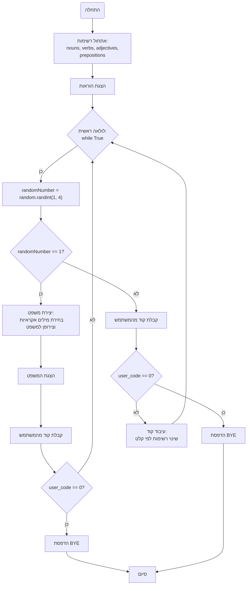

## ניתוח קוד: משחק שירה

### <algorithm>

1. **אתחול רשימות:**
   - אתחול רשימות של שמות עצם (`nouns`), פעלים (`verbs`), שמות תואר (`adjectives`) ומילות יחס (`prepositions`) עם ערכים התחלתיים.
   - לדוגמה: `nouns = ["BIRDS", "CATS", ...]`
   - לדוגמה: `verbs = ["FLY", "RUN", ...]`

2. **הצגת הוראות:**
   - הצגת הודעת פתיחה ורשימת פקודות למשתמש.
   - לדוגמה: "ברוכים הבאים למשחק POETRY! לחצו 1 כדי לשנות שמות עצם, 2 עבור פעלים וכו'".

3. **לולאה ראשית:**
   - מתחיל לולאה אינסופית (`while True`) שרצה עד שהמשתמש יבחר לסיים.

4. **הגרלת מספר אקראי:**
    - מגריל מספר אקראי בין 1 ל-4 (כולל) - `randomNumber = random.randint(1, 4)`
    - אם המשתנה שווה ל 1 - עובר לשלב יצירת המשפט, אחרת עובר לשלב הבקשת הקוד

5. **יצירת משפט:**
   - אם `randomNumber` שווה ל-1:
     - בוחר באופן אקראי מילה מכל רשימה: שם עצם, פועל, שם תואר ומילת יחס.
       - לדוגמה: `random_noun = random.choice(nouns)`
     - יוצר משפט באמצעות המילים שנבחרו: `phrase = f"THE {random_adjective} {random_noun} {random_verb} {random_preposition} THE FOREST"`
     - מציג את המשפט למשתמש.
     - מבקש מהמשתמש להזין קוד.
     - אם הקוד הוא "0", יוצא מהלולאה.

6. **קבלת קלט מהמשתמש (לשינוי רשימות):**
    - אם `randomNumber` לא שווה ל-1:
      -  מבקש מהמשתמש להזין קוד.
      - אם הקוד הוא "0", יוצא מהלולאה.
       - בודק תקינות הקלט, אם הקלט אינו מספרי, מדפיס הודעת שגיאה ועובר לאיטרציה הבאה של הלולאה.

7. **עיבוד קוד משתמש:**
   - בודק את הקוד שהזין המשתמש:
     - אם הקוד הוא `1`, קורא לפונקציה `change_list` כדי לשנות את רשימת שמות העצם.
     - אם הקוד הוא `2`, קורא לפונקציה `change_list` כדי לשנות את רשימת הפעלים.
     - אם הקוד הוא `3`, קורא לפונקציה `change_list` כדי לשנות את רשימת שמות התואר.
     - אם הקוד הוא `4`, קורא לפונקציה `change_list` כדי לשנות את רשימת מילות היחס.

8. **סיום המשחק:**
   - אם המשתמש הזין `0` בשלב 5 או 6, הלולאה מסתיימת והתוכנית מדפיסה "BYE".
   - התוכנית מסתיימת.

### <mermaid>

### <explanation>

**ייבוא (Imports):**
- `import random`: מייבא את מודול ה-`random`, המשמש ליצירת מספרים אקראיים ובחירת איברים אקראיים מרשימות.

**משתנים (Variables):**
- `nouns`: רשימה של שמות עצם (מחרוזות).
- `verbs`: רשימה של פעלים (מחרוזות).
- `adjectives`: רשימה של שמות תואר (מחרוזות).
- `prepositions`: רשימה של מילות יחס (מחרוזות).
- `randomNumber`: משתנה מספרי המכיל מספר אקראי בין 1 ל-4.
- `user_code`: משתנה המכיל את הקוד שהזין המשתמש (מחרוזת או מספר שלם).
- `phrase`: משתנה מחרוזתי המכיל את המשפט האקראי שנוצר.
- `new_list`: רשימה חדשה המכילה מילים שהמשתמש הכניס, כאשר הוא משנה רשימה קיימת.

**פונקציות (Functions):**
- `change_list(list_name)`:
  - **פרמטרים:** `list_name` (מחרוזת) - שם הרשימה לשינוי.
  - **ערך מוחזר:** `new_list` - רשימה חדשה של מילים.
  - **מטרה:** מקבלת קלט מהמשתמש של מילים חדשות לרשימה, מחלקת אותן לפריטים ברשימה ומחזירה את הרשימה החדשה.
    - לדוגמה: אם נקרא לפונקציה עם `list_name="שמות עצם"` והמשתמש יזין "חתולים,כלבים,ציפורים", אז הפונקציה תחזיר את הרשימה `["חתולים", "כלבים", "ציפורים"]`.

**פונקציונליות:**
- המשחק מייצר משפטים אקראיים על ידי בחירת מילים מרשימות קיימות.
- המשתמש יכול לשנות את הרשימות על ידי הזנת קודים.
- המשחק ממשיך עד שהמשתמש בוחר לסיים על ידי הזנת קוד `0`.
- קיימת בדיקת תקינות לקלט המשתמש. אם המשתמש מזין ערך שאינו מספר בשלב בקשת הקוד, תודפס הודעת שגיאה ותתבצע איטרציה נוספת של הלולאה.

**בעיות אפשריות:**
- חוסר טיפול שגיאות מפורט יותר. למשל, אפשר לבדוק אם הקלט של המשתמש מכיל רק מילים ולא מספרים או תווים אחרים.
- שימוש ברשימות גלובליות, אשר יכולות להיות בעייתיות בפרויקטים גדולים יותר. מומלץ להשתמש במחלקות או מבני נתונים אחרים כדי לנהל את הרשימות.
- אין שימוש בפונקציות נוספות לקידוד המשחק, ניתן ליצור פונקציה נפרדת ליצירת משפט, על מנת לפשט את הלולאה הראשית.

**שרשרת קשרים עם חלקים אחרים בפרויקט:**
- קוד זה אינו תלוי בחלקים אחרים של הפרויקט. הוא מכיל רק לוגיקה פשוטה של בחירת מילים וקבלת קלט.
- עם זאת, ניתן להרחיב אותו ולחבר אותו עם חלקים אחרים של הפרויקט על ידי יצירת מחלקות ושימוש במנגנון ניהול רשימות טוב יותר.