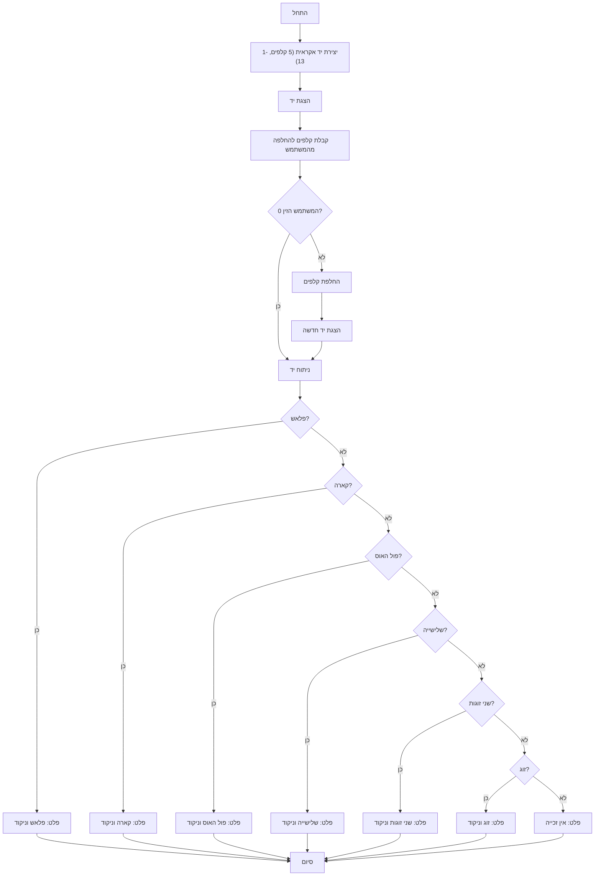

## ניתוח קוד המשחק "פוקר"

### 1. <algorithm>

הקוד מממש משחק פוקר פשוט לשחקן יחיד. להלן תיאור התהליך צעד אחר צעד:

1.  **אתחול (Initialization):**
    *   הפונקציה `create_hand()` יוצרת רשימה של 5 מספרים אקראיים בין 1 ל-13, המייצגים את הקלפים.
        *   דוגמה: `hand` = `[3, 7, 1, 12, 5]`
2.  **הצגת הקלפים (Display Cards):**
    *   הפונקציה `display_hand(hand)` מציגה את הקלפים למשתמש, כאשר כל קלף ממוספר מה-1 עד 5.
        *   פלט לדוגמה:
            ```
            Your cards:
            1: 3  2: 7  3: 1  4: 12  5: 5
            ```
3.  **קבלת קלפים להחלפה (Input Replace Cards):**
    *   הפונקציה `get_cards_to_replace()` מבקשת מהמשתמש להזין את מספרי הקלפים שהוא רוצה להחליף, מופרדים ברווחים, או 0 כדי להשאיר את הקלפים כמו שהם.
        *   דוגמה: המשתמש מזין "1 3 5"
        *   הפונקציה מחזירה את האינדקסים `[0, 2, 4]`
4.  **בדיקה אם אין החלפה (Check No Replace):**
    *   אם המשתמש הזין '0', המשחק עובר ישירות לשלב ניתוח היד.
5.  **החלפת קלפים (Replace Cards):**
    *   הפונקציה `replace_cards(hand, replace_indices)` מחליפה את הקלפים שבחר המשתמש בקלפים חדשים אקראיים.
        *   לדוגמה, אם `replace_indices` הם `[0, 2, 4]`, הקלפים במקומות האלה מוחלפים בערכים אקראיים חדשים.
        *   `hand` יכול להפוך ל- `[10, 7, 9, 12, 2]`
6.  **הצגת קלפים חדשים (Display New Cards):**
    *   הפונקציה `display_hand(hand)` מציגה את הקלפים החדשים לאחר החלפה.
7.  **ניתוח יד (Analyze Hand):**
    *   הפונקציה `analyze_hand(hand)` מנתחת את הקלפים וקובעת אם יש זכייה. הפונקציה בודקת לפי סדר עדיפויות:
        *   **פלאש (Flush):** חמישה קלפים עוקבים (ללא התייחסות לסוג).
             *   דוגמה: `[1, 2, 3, 4, 5]`
        *   **קארה (Four of a kind):** ארבעה קלפים מאותו ערך.
             *   דוגמה: `[2, 2, 2, 2, 8]`
        *   **פול האוס (Full House):** שלושה קלפים מאותו ערך וזוג.
             *   דוגמה: `[3, 3, 3, 7, 7]`
        *   **שלישייה (Three of a kind):** שלושה קלפים מאותו ערך.
             *   דוגמה: `[4, 4, 4, 9, 12]`
        *   **שתי זוגות (Two Pairs):** שני זוגות שונים.
             *   דוגמה: `[5, 5, 8, 8, 1]`
        *   **זוג (Pair):** שני קלפים מאותו ערך.
             *   דוגמה: `[6, 6, 3, 9, 11]`
    *   אם נמצאה זכייה, מוצגת הודעה מתאימה והניקוד.
    *   אם לא נמצאה זכייה, מוצגת הודעה "אין זכייה".
8.  **סיום המשחק (End):** המשחק מסתיים לאחר ניתוח היד והצגת התוצאות.

### 2. <mermaid>


**הסבר תלות ייבוא (Imports):**

*   `import random`: מודול זה משמש ליצירת מספרים אקראיים, המשמשים ליצירת הקלפים בתחילת המשחק ולהחלפת קלפים במהלך המשחק. אין תלות בחבילות `src` אחרות.

### 3. <explanation>

**ייבוא (Imports):**

*   `import random`:  המודול random משמש ליצירת מספרים אקראיים, המשמשים ליצירת הקלפים בתחילת המשחק ולהחלפת קלפים במהלך המשחק. אין תלות בחבילות `src` אחרות.

**פונקציות (Functions):**

*   `create_hand()`:
    *   **פרמטרים:** אין.
    *   **ערך מוחזר:** רשימה של 5 מספרים אקראיים (מ-1 עד 13), המייצגים את יד הקלפים.
    *   **מטרה:** יוצרת יד התחלתית של 5 קלפים אקראיים.
    *   **דוגמה:** `create_hand()` מחזירה לדוגמה `[5, 1, 12, 9, 2]`.

*   `display_hand(hand)`:
    *   **פרמטרים:** `hand` - רשימת קלפים.
    *   **ערך מוחזר:** אין.
    *   **מטרה:** מציגה את הקלפים למשתמש, ממוספרים מ-1 עד 5.
    *   **דוגמה:** אם `hand` שווה ל `[5, 1, 12, 9, 2]`, יוצג הפלט:
        ```
        Your cards:
        1: 5  2: 1  3: 12  4: 9  5: 2
        ```

*   `get_cards_to_replace()`:
    *   **פרמטרים:** אין.
    *   **ערך מוחזר:** רשימה של אינדקסים (מספרים בין 0 ל-4) של הקלפים שהמשתמש רוצה להחליף, או רשימה ריקה אם המשתמש הזין 0.
    *   **מטרה:** מקבלת קלט מהמשתמש לגבי איזה קלפים להחליף. מבצעת ולידציה של הקלט ומחזירה אינדקסים.
    *   **דוגמה:** אם המשתמש מזין "1 3 5", הפונקציה תחזיר `[0, 2, 4]`. אם המשתמש מזין "0", הפונקציה תחזיר `[]`.

*   `replace_cards(hand, replace_indices)`:
    *   **פרמטרים:** `hand` - רשימת הקלפים הנוכחית, `replace_indices` - רשימת אינדקסים של קלפים להחלפה.
    *   **ערך מוחזר:** רשימת קלפים מעודכנת לאחר החלפה.
    *   **מטרה:** מחליפה את הקלפים במקומות שצוינו בקלפים אקראיים חדשים.
    *   **דוגמה:** אם `hand` הוא `[5, 1, 12, 9, 2]` ו- `replace_indices` הוא `[0, 2]`, הפונקציה יכולה להחזיר `[10, 1, 4, 9, 2]`.

*   `analyze_hand(hand)`:
    *   **פרמטרים:** `hand` - רשימת הקלפים.
    *   **ערך מוחזר:** אין.
    *   **מטרה:** מנתחת את יד הקלפים וקובעת אם יש זכייה. מדפיסה הודעה על סוג הזכייה והניקוד, או הודעה שאין זכייה.
    *   **דוגמה:** אם `hand` הוא `[2, 2, 3, 4, 5]`, הפלט יהיה "זוג! ניקוד 2 נקודות". אם `hand` הוא `[1, 2, 3, 4, 5]`, הפלט יהיה "פלאש! ניקוד 20 נקודות". אם `hand` הוא `[2, 4, 6, 8, 10]`, הפלט יהיה "אין זכייה".

*  `play_poker()`:
    * **פרמטרים**: אין
    * **ערך מוחזר**: אין
    * **מטרה**: מריצה את המשחק: יוצרת יד, מציגה, מקבלת קלפים להחלפה, מחליפה, מנתחת יד.

**משתנים (Variables):**

*   `hand`: רשימה המכילה את הקלפים של השחקן (מספרים בין 1 ל-13).
*   `replace_indices`: רשימה של אינדקסים של קלפים שהשחקן רוצה להחליף.
*   `counts`: מילון המשמש לספירת מספר המופעים של כל ערך קלף.
*   `values`: רשימה של ספירות הערכים של כל קלף.

**בעיות אפשריות ותחומים לשיפור:**

*   **ממשק משתמש:** ממשק המשתמש פשוט וטקסטואלי בלבד. ניתן לשפר על ידי הוספת ממשק גרפי.
*   **כללי משחק:** המשחק פשוט ולא כולל התייחסות לסוגי הקלפים. ניתן להוסיף התייחסות לסוגי הקלפים (לב, יהלום, תלתן, עלה).
*   **ניקוד:**  הניקוד קבוע ולא תלוי בכוח היד הספציפית. ניתן לשפר על ידי הוספת ניקוד משתנה.
*   **שמירת משחק:** אין אפשרות לשמור את המשחק. ניתן להוסיף אפשרות לשמירת התקדמות.
*   **אימות קלט:** יש אימות בסיסי לקלט משתמש, אך ניתן להוסיף בדיקות ואימותים נוספים.
*   **עיצוב קוד:** ניתן לעשות רפקטורינג על הקוד לפונקציות קטנות יותר, לשפר את קריאות הקוד.

**שרשרת קשרים עם חלקים אחרים בפרויקט:**

*   הקוד עצמאי ולא תלוי בחלקים אחרים בפרויקט. ניתן להשתמש בו כחלק מובנה או כמשחק עצמאי.

**הערות נוספות:**

*   הקוד כתוב בשפה הפשוטה והקריאה, מה שמקל על הבנה.
*   הפונקציות מוגדרות בצורה ברורה וכל אחת אחראית על פעולה ספציפית.

זהו ניתוח מקיף של הקוד, כולל תיאור האלגוריתם, תרשים זרימה, הסבר מפורט של הפונקציות, המשתנים, הבעיות האפשריות והקשרים עם חלקים אחרים בפרויקט (אם רלוונטי).