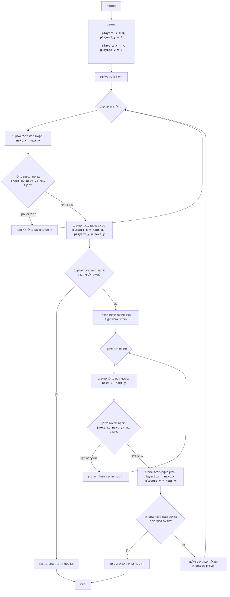

## ניתוח קוד: משחק המלכה

### 1. <algorithm>

תיאור תהליך העבודה של הקוד בתרשים זרימה צעד-אחר-צעד:

1.  **אתחול**:
    *   אתחול מיקומי התחלתיים של המלכות של שני השחקנים: `player1_x = 0, player1_y = 3` ו-`player2_x = 7, player2_y = 3`.
    *   לדוגמה, מלכה 1 מתחילה בטור 0 ושורה 3, ומלכה 2 מתחילה בטור 7 ושורה 3.

2.  **הדפסת לוח**:
    *   הצגת לוח המשחק עם מיקומי המלכות הנוכחיים.
    *   הלוח הוא מטריצה בגודל 8x8, כאשר '.' מסמן משבצות ריקות, '1' מסמן את מיקום המלכה של שחקן 1, ו-'2' מסמן את מיקום המלכה של שחקן 2.
    *   לדוגמה:
        ```
           0  1  2  3  4  5  6  7
        0  .  .  .  .  .  .  .  .
        1  .  .  .  .  .  .  .  .
        2  .  .  .  .  .  .  .  .
        3  1  .  .  .  .  .  .  2
        4  .  .  .  .  .  .  .  .
        5  .  .  .  .  .  .  .  .
        6  .  .  .  .  .  .  .  .
        7  .  .  .  .  .  .  .  .
        ```

3.  **לולאת משחק**:
    *   המשחק ממשיך כל עוד אף אחת מהמלכות לא הגיעה לצד הנגדי של הלוח.

    *   **תור שחקן 1**:
        *   בקשת קלט מהשחקן: הנחיות הזנה של קואורדינטות חדשות (x, y) עבור מלכה 1, למשל: `1,4`.
        *   בדיקה אם המהלך חוקי באמצעות `is_valid_move`:
            *   אם המהלך לא חוקי (למשל, מחוץ ללוח או לא מהלך קווי), מוצגת הודעת שגיאה ומבקשים קלט חדש.
            *   אם המהלך חוקי, מיקום המלכה מעודכן למיקום החדש: `player1_x = next_x, player1_y = next_y`.
        *   בדיקת ניצחון: אם המלכה של שחקן 1 הגיעה לצד השני של הלוח (עמודה 7), שחקן 1 מנצח והמשחק מסתיים.
        *   הדפסת לוח המשחק המעודכן לאחר תור שחקן 1.

    *   **תור שחקן 2**:
        *   בקשת קלט מהשחקן: הנחיות הזנה של קואורדינטות חדשות (x, y) עבור מלכה 2, למשל: `6,4`.
        *   בדיקה אם המהלך חוקי באמצעות `is_valid_move`:
            *   אם המהלך לא חוקי (למשל, מחוץ ללוח או לא מהלך קווי), מוצגת הודעת שגיאה ומבקשים קלט חדש.
            *   אם המהלך חוקי, מיקום המלכה מעודכן למיקום החדש: `player2_x = next_x, player2_y = next_y`.
        *   בדיקת ניצחון: אם המלכה של שחקן 2 הגיעה לצד השני של הלוח (עמודה 0), שחקן 2 מנצח והמשחק מסתיים.
        *   הדפסת לוח המשחק המעודכן לאחר תור שחקן 2.

4.  **סיום**:
    *   המשחק מסתיים כאשר אחד מהשחקנים מנצח.

### 2. <mermaid>



**ניתוח תלויות יבוא:**
אין תלויות חיצוניות, כלומר לא נעשה שימוש בספריות חיצוניות, הקוד משתמש רק ביכולות הבסיסיות של פייתון.

### 3. <explanation>

**ייבוא (Imports):**

*   `import sys`: ייבוא מודול `sys` לצורך גישה לפונקציות ספציפיות של מערכת ההפעלה, למרות שהוא לא בשימוש בקוד זה. מודול זה יכול לשמש למשל ליציאה מהתוכנית עם קוד שגיאה, למרות שזה לא מיושם כאן.

**משתנים (Variables):**

*   `player1_x`, `player1_y`: משתנים שלמים המייצגים את קואורדינטות ה-x וה-y של מלכת שחקן 1 על לוח המשחק.
*   `player2_x`, `player2_y`: משתנים שלמים המייצגים את קואורדינטות ה-x וה-y של מלכת שחקן 2 על לוח המשחק.
*   `row`, `col`, `row_str`: משתנים המשמשים בלולאות ליצירת המחרוזת של לוח המשחק בתוך הפונקציה `print_board`.
*   `next_x`, `next_y`: משתנים המשמשים לאחסון הקואורדינטות של המהלך הבא של השחקן.
*   `move_str`: משתנה מחרוזת המשמש לאחסון הקלט של השחקן.

**פונקציות (Functions):**

*   `print_board(player1_x, player1_y, player2_x, player2_y)`:
    *   פרמטרים: קואורדינטות ה-x וה-y של מלכות שני השחקנים.
    *   הדפסה: מדפיסה את לוח המשחק למסך, עם סימונים של '1' עבור מלכת שחקן 1, '2' עבור מלכת שחקן 2 ו'.' עבור משבצות ריקות.
    *   מטרה: הצגת מצב המשחק הנוכחי לשחקנים.
    *   דוגמה:
        ```
           0  1  2  3  4  5  6  7
        0  .  .  .  .  .  .  .  .
        1  .  .  .  .  .  .  .  .
        2  .  .  .  .  .  .  .  .
        3  1  .  .  .  .  .  .  2
        4  .  .  .  .  .  .  .  .
        5  .  .  .  .  .  .  .  .
        6  .  .  .  .  .  .  .  .
        7  .  .  .  .  .  .  .  .
        ```
*   `is_valid_move(current_x, current_y, next_x, next_y)`:
    *   פרמטרים: קואורדינטות x ו-y נוכחיות וקואורדינטות x ו-y הבאות.
    *   ערך מוחזר: `True` אם המהלך חוקי (אופקי, אנכי או אלכסוני), ו-`False` אם לא חוקי.
    *   מטרה: בדיקת תקינות מהלך מלכה.
    *   דוגמאות:
        *   `is_valid_move(0, 3, 4, 3)` תחזיר `True` (מהלך אופקי).
        *   `is_valid_move(0, 3, 0, 7)` תחזיר `True` (מהלך אנכי).
        *   `is_valid_move(0, 3, 4, 7)` תחזיר `True` (מהלך אלכסוני).
        *   `is_valid_move(0, 3, 2, 4)` תחזיר `False` (מהלך לא חוקי).
        *   `is_valid_move(0, 3, -1, 3)` תחזיר `False` (מהלך מחוץ ללוח).
*   `get_player_move(player_number, current_x, current_y)`:
    *   פרמטרים: מספר השחקן (1 או 2), קואורדינטות x ו-y נוכחיות.
    *   ערך מוחזר: קואורדינטות x ו-y הבאות של המלכה לאחר מהלך חוקי.
    *   מטרה: קבלת קלט מהמשתמש, בדיקת תקינותו, והחזרת המהלך החוקי.
    *   דוגמה: לאחר קבלת קלט מהמשתמש '4,3' ומהלך זה תקין, הפונקציה תחזיר `(4, 3)`.

**שרשרת קשרים:**

הקוד הזה עצמאי, אין תלות בקבצים או מודולים אחרים בפרויקט.

**בעיות אפשריות ותחומים לשיפור:**

*   **בדיקת מהלכים מלאה**: הקוד בודק רק את הכיוון של המהלך (אופקי, אנכי, אלכסוני) אך לא בודק אם המלכה יכולה לעבור דרך משבצות אחרות בדרך, כלומר אין חסימה בדרך.
*   **ממשק משתמש**: הממשק טקסטואלי פשוט. ניתן לשפר את חווית המשתמש על ידי שימוש בממשק גרפי.
*   **אימות קלט**: קיימת בדיקת פורמט בסיסית של הקלט (צמד מספרים מופרד בפסיק), אך ניתן להוסיף עוד אימותים, למשל לבדוק אם הקלט הוא מספר שלם חוקי בתוך גבולות לוח המשחק.
*   **תקשורת בין שחקנים**: כרגע המשחק הוא על אותו מסך, ניתן לשפר זאת כדי לאפשר משחק מקוון.
*   **ריווח קוד**: ייתכן שניתן לשפר את הריווח של הקוד לקריאות טובה יותר.
*   **פונקציה `get_player_move`**: הפונקציה משלבת קלט משתמש, בדיקת תקינות וקריאה לפונקציה אחרת, ניתן לשקול לפצל את זה למספר פונקציות קטנות יותר כדי לשפר קריאות.