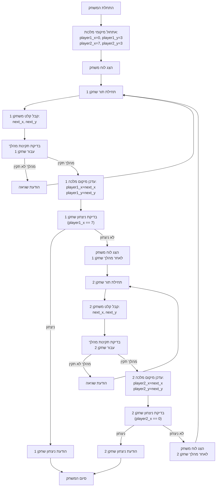

## ניתוח קוד: משחק המלכה

### 1. <algorithm>

1.  **אתחול משתנים**:
    *   `player1_x = 0`, `player1_y = 3`: מיקום התחלתי של מלכה 1 (שורה 0, עמודה 3).
    *   `player2_x = 7`, `player2_y = 3`: מיקום התחלתי של מלכה 2 (שורה 7, עמודה 3).

2.  **הדפסת לוח המשחק**:
    *   הפונקציה `print_board(player1_x, player1_y, player2_x, player2_y)` מדפיסה את לוח השחמט.
    *   דוגמה:
        ```
        0  1  2  3  4  5  6  7
      0  .  .  .  1  .  .  .  .
      1  .  .  .  .  .  .  .  .
      2  .  .  .  .  .  .  .  .
      3  .  .  .  .  2  .  .  .
      4  .  .  .  .  .  .  .  .
      5  .  .  .  .  .  .  .  .
      6  .  .  .  .  .  .  .  .
      7  .  .  .  .  .  .  .  .
        ```

3.  **לולאת משחק ראשית**:
    *   הלולאה `while True:` ממשיכה עד שאחד השחקנים מנצח.

    *   **תור שחקן 1**:
        1.  מוצג לוח המשחק.
        2.  הפונקציה `get_player_move(1, player1_x, player1_y)` מבקשת משחקן 1 להזין קואורדינטות חדשות.
            *   לדוגמה, שחקן 1 מזין "1,4".
        3.  הקואורדינטות מתעדכנות: `player1_x = 1`, `player1_y = 4`.
        4.  התנאי `if player1_x == 7:` בודק אם שחקן 1 הגיע לקצה הלוח, אם כן - השחקן ניצח והמשחק מסתיים.

    *   **תור שחקן 2**:
        1.  מוצג לוח המשחק.
        2.  הפונקציה `get_player_move(2, player2_x, player2_y)` מבקשת משחקן 2 להזין קואורדינטות חדשות.
            *   לדוגמה, שחקן 2 מזין "6,4".
        3.  הקואורדינטות מתעדכנות: `player2_x = 6`, `player2_y = 4`.
        4.  התנאי `if player2_x == 0:` בודק אם שחקן 2 הגיע לקצה הלוח, אם כן - השחקן ניצח והמשחק מסתיים.

4.  **סיום המשחק**:
    *   הלולאה מסתיימת כאשר אחד השחקנים מנצח, ומוצגת הודעת ניצחון.

5. **זרימת נתונים**:
   * `player1_x`, `player1_y`, `player2_x`, `player2_y` מועברים בין הפונקציות: `print_board`, `is_valid_move`, `get_player_move`.
   * `get_player_move` מחזירה קואורדינטות חדשות ומעדכנת את מיקומי המלכות של השחקנים.

### 2. <mermaid>



**הסבר תרשים mermaid**:

התרשים מתאר את זרימת המשחק, החל מאתחול מיקומי המלכות ועד סיום המשחק:

*   **Start**: תחילת המשחק.
*   **InitializePositions**: אתחול המיקומים ההתחלתיים של המלכות של שני השחקנים.
*   **DisplayBoard**: הצגת לוח המשחק למשתמש.
*   **Player1TurnStart**: תחילת תור השחקן הראשון.
*   **Player1Input**: קבלת קלט מהשחקן הראשון (קואורדינטות המהלך הבא).
*   **ValidatePlayer1Move**: בדיקת תקינות המהלך של השחקן הראשון.
*   **InvalidMovePlayer1**: הודעת שגיאה אם המהלך אינו תקין, וחזרה לבקשת קלט.
*   **UpdatePlayer1Position**: עדכון מיקום המלכה של השחקן הראשון.
*   **CheckPlayer1Win**: בדיקה האם שחקן 1 ניצח (הגיע לקצה הלוח).
*   **Player1Wins**: הצגת הודעת ניצחון לשחקן הראשון וסיום המשחק.
*   **DisplayBoardAfterPlayer1**: הצגת הלוח לאחר המהלך של השחקן הראשון.
*   **Player2TurnStart**: תחילת תור השחקן השני.
*   **Player2Input**: קבלת קלט מהשחקן השני (קואורדינטות המהלך הבא).
*    **ValidatePlayer2Move**: בדיקת תקינות המהלך של השחקן השני.
*   **InvalidMovePlayer2**: הודעת שגיאה אם המהלך אינו תקין, וחזרה לבקשת קלט.
*   **UpdatePlayer2Position**: עדכון מיקום המלכה של השחקן השני.
*   **CheckPlayer2Win**: בדיקה האם שחקן 2 ניצח (הגיע לקצה הלוח).
*   **Player2Wins**: הצגת הודעת ניצחון לשחקן השני וסיום המשחק.
*   **DisplayBoardAfterPlayer2**: הצגת הלוח לאחר המהלך של השחקן השני.
*   **End**: סיום המשחק.

התרשים מציג את הזרימה הלוגית של המשחק בצורה ויזואלית וברורה.

### 3. <explanation>

**ייבוא (Imports)**:
*  `import sys`: משמש לייבא מודול המאפשר אינטראקציה עם הסביבה. לא נעשה שימוש במודול זה בקוד הנוכחי, אך ייתכן שנעשה בו שימוש במסגרת פרויקט גדול יותר.

**משתנים (Variables)**:
* `player1_x`, `player1_y`: משתנים המייצגים את הקואורדינטות של המלכה של שחקן 1 על גבי לוח המשחק. הם מאותחלים ל-(0, 3) בתחילת המשחק.
* `player2_x`, `player2_y`: משתנים המייצגים את הקואורדינטות של המלכה של שחקן 2 על גבי לוח המשחק. הם מאותחלים ל-(7, 3) בתחילת המשחק.
  
**פונקציות (Functions)**:

*   **`print_board(player1_x, player1_y, player2_x, player2_y)`**:
    *   **פרמטרים**: מקבלת את הקואורדינטות הנוכחיות של המלכות של שני השחקנים.
    *   **ערך מוחזר**: הפונקציה לא מחזירה ערך.
    *   **מטרה**: מדפיסה את לוח השחמט למסך, ומציינת את מיקומי המלכות של שני השחקנים.
    *   **דוגמא לשימוש**: `print_board(2, 2, 5, 5)` תציג לוח משחק עם מלכה 1 במיקום (2,2) ומלכה 2 במיקום (5,5).

*   **`is_valid_move(current_x, current_y, next_x, next_y)`**:
    *   **פרמטרים**: מקבלת את הקואורדינטות הנוכחיות והקואורדינטות המוצעות עבור מהלך המלכה.
    *   **ערך מוחזר**: מחזירה `True` אם המהלך תקין ו`False` אם לא.
    *   **מטרה**: בודקת האם המהלך המוצע תקין עבור המלכה, כלומר האם המלכה זזה באלכסון, אופקית או אנכית.
    *   **דוגמה לשימוש**: `is_valid_move(2, 2, 4, 4)` תחזיר `True` (מהלך אלכסוני), `is_valid_move(2, 2, 2, 5)` תחזיר `True` (מהלך אנכי), `is_valid_move(2, 2, 1, 5)` תחזיר `False` (מהלך לא חוקי).

*   **`get_player_move(player_number, current_x, current_y)`**:
    *   **פרמטרים**: מקבלת את מספר השחקן ואת הקואורדינטות הנוכחיות של המלכה של השחקן.
    *   **ערך מוחזר**: מחזירה את הקואורדינטות החדשות שהוזנו ע"י השחקן.
    *   **מטרה**: מבקשת מהמשתמש להזין קואורדינטות חדשות עבור המלכה שלו, בודקת תקינות קלט ומוודאת שהמהלך חוקי.
    *   **דוגמה לשימוש**: `next_x, next_y = get_player_move(1, 2, 2)` תחזיר קואורדינטות שהוזנו ע"י שחקן 1.

**לולאה ראשית (while loop)**:

הלולאה `while True` היא לולאת משחק אינסופית, אשר תרוץ עד שאחד השחקנים ינצח. בתוך הלולאה:
*   מוצג לוח המשחק
*   מתבצע תור של שחקן 1, אשר כולל קבלת קלט, עדכון מיקום ובדיקת ניצחון.
*   מוצג לוח המשחק פעם נוספת
*   מתבצע תור של שחקן 2, אשר כולל קבלת קלט, עדכון מיקום ובדיקת ניצחון.

**בעיות אפשריות או תחומים לשיפור:**

*   **בדיקת חוקיות מלאה**: הקוד בודק רק שהמלכה זזה בצורה חוקית, אך לא בודק אם המהלך חוסם את המלכה של השחקן השני או שאין מלכה אחרת על המשבצת.
*   **ממשק משתמש**: הממשק פשוט מאוד, ניתן לשפר את תצוגת לוח המשחק.
*   **תקשורת עם שחקנים**: הקוד מתקשר עם השחקנים באמצעות קלט ופלט פשוטים. ניתן לשפר זאת בעזרת ממשק משתמש גרפי.
*   **הוספת הגבלות נוספות**: ניתן להוסיף הגבלות נוספות למהלכי המלכה (כגון הגבלת מספר הצעדים שהיא יכולה לבצע).
*   **מצב ללא ניצחון**: לא קיים תנאי להכרזת תיקו במצב בו המשחק לא מגיע להכרעה (לדוגמא במצב בו המלכות לא יכולות להתקדם).

**שרשרת קשרים עם חלקים אחרים בפרויקט (אם רלוונטי)**:
    *  הקוד הוא עצמאי במידה רבה ואינו תלוי ישירות בחלקים אחרים בפרויקט, אך הוא יכול להיות חלק מתיקיית `ai_games` או חלק ממערכת משחקים גדולה יותר.