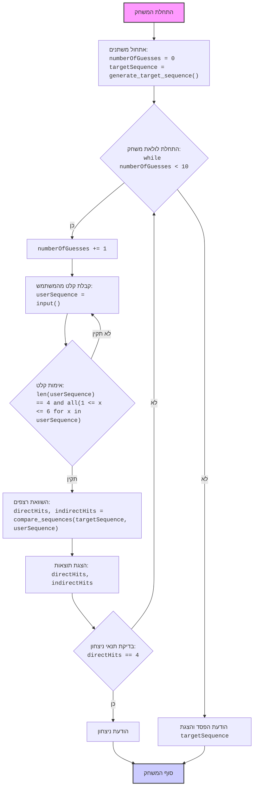

## <algorithm>

1. **התחלה**:
   - המשחק מתחיל.
   - `numberOfGuesses` מאותחל ל-0.
   - `targetSequence` נוצרת רנדומלית על ידי הפונקציה `generate_target_sequence`.
   - דוגמה: `targetSequence` יכול להיות `[1, 2, 3, 4]`.

2. **לולאת משחק**:
   - מתחילים לולאה שרצה כל עוד `numberOfGuesses` קטן מ-10.
   - דוגמה: `numberOfGuesses` מתחיל מ-0.
3. **הגדלת מספר הניסיונות**:
   - `numberOfGuesses` גדל ב-1.
   - דוגמה: `numberOfGuesses` משתנה מ-0 ל-1.
4. **קבלת קלט מהמשתמש**:
   - המשתמש מתבקש להזין 4 מספרים מופרדים ברווח.
   - המערכת ממירה את הקלט למערך של מספרים שלמים, `userSequence`.
   - אם הקלט לא תקין (לא 4 מספרים או מספרים מחוץ לטווח 1-6), מוצגת הודעת שגיאה וחוזרים לתחילת הלולאה.
   - דוגמה: המשתמש מזין "1 2 4 3", אז `userSequence` יהיה `[1, 2, 4, 3]`.
   - דוגמה לא תקינה: המשתמש מזין "1 2 3", תוצג הודעת שגיאה.

5. **השוואת רצפים**:
   - הפונקציה `compare_sequences` מקבלת את `targetSequence` ו- `userSequence` ומחזירה `directHits` ו-`indirectHits`.
   - `directHits`: מספר המספרים במקומות הנכונים.
   - `indirectHits`: מספר המספרים שנמצאים ברצף המטרה אך לא במקומות הנכונים.
   - דוגמה: אם `targetSequence` הוא `[1, 2, 3, 4]` ו-`userSequence` הוא `[1, 3, 2, 4]`, אז `directHits` יהיה 2 ו-`indirectHits` יהיה 2.
   -   -   `target_copy = list(target)`:  יוצר עותק של הרצף המטרה כדי לא לשנות את המקורי.
        -   הלולאה הראשונה (`for i in range(4)`) מחשבת את הפגיעות הישירות. אם המספר במיקום `i` ברצף של המשתמש שווה למספר באותו מיקום ברצף המטרה, המונה של הפגיעות הישירות עולה והמספרים במיקום זה מסומנים כ `None` כדי שלא יחשבו שוב.
        -   הלולאה השנייה (`for i in range(4)`) מחשבת את הפגיעות הלא ישירות. אם המספר במיקום `i` ברצף של המשתמש שווה למספר במיקום כלשהו ברצף המטרה, המונה של הפגיעות הלא ישירות עולה, המספר במיקום זה מסומן כ `None` ויוצאים מהלולאה הפנימית על מנת שלא לספור אותו שוב.
6. **פלט תוצאות**:
   -  מוצגות למשתמש תוצאות השוואת הרצפים: כמות הפגיעות הישירות והפגיעות הלא ישירות.
   - דוגמה: "פגיעות ישירות: 2, פגיעות לא ישירות: 2"
7. **בדיקת ניצחון**:
   - אם `directHits` שווה ל-4, המשתמש ניצח, מוצגת הודעה מתאימה והמשחק מסתיים.
   - דוגמה: אם `directHits` הוא 4, המשחק נגמר בהצלחה.
8. **חזרה ללולאה או סיום**:
   - אם המשתמש לא ניצח ו `numberOfGuesses` קטן מ-10, חוזרים לשלב 3.
   - אם `numberOfGuesses` שווה ל-10, המשתמש הפסיד, מוצגת הודעה מתאימה והרצף הנכון מוצג למשתמש והמשחק מסתיים.
   - דוגמה: אם מספר הניסיונות הגיע ל-10, המשחק מסתיים בהפסד.
9. **סיום**:
   - המשחק מסתיים.

## <mermaid>

## <explanation>

**ייבואים (Imports):**

*   `import random`: מייבא את מודול ה-`random` של פייתון, שמשמש לייצור מספרים אקראיים. במקרה זה, הוא משמש ליצירת רצף היעד של המשחק (`targetSequence`).

**פונקציות (Functions):**

1.  **`generate_target_sequence()`**:
    *   **פרמטרים:** אין.
    *   **ערך מוחזר:** רשימה של 4 מספרים אקראיים שלמים בין 1 ל-6.
    *   **מטרה:** יוצרת רצף מטרה אקראי עבור המשחק.
    *   **דוגמה:** `generate_target_sequence()` עשויה להחזיר `[3, 1, 5, 2]`.
2.  **`compare_sequences(target, user)`**:
    *   **פרמטרים:** `target` (רשימת מספרים, רצף היעד) ו-`user` (רשימת מספרים, רצף המשתמש).
    *   **ערך מוחזר:** טאפל המכיל שני ערכים, `direct_hits` (מספר הפגיעות הישירות) ו-`indirect_hits` (מספר הפגיעות הלא ישירות).
    *   **מטרה:** משווה את הרצף של המשתמש לרצף היעד ומחשבת כמה מספרים ממוקמים נכון וכמה מספרים קיימים ברצף אך לא במיקום הנכון.
    *   **דוגמה:** אם `target` הוא `[1, 2, 3, 4]` ו-`user` הוא `[1, 3, 2, 5]`, הפונקציה תחזיר `(1, 2)`.
3.  **`play_reverse_game()`**:
    *   **פרמטרים:** אין.
    *   **ערך מוחזר:** אין (הפונקציה מחזירה `None` או מסיימת את התוכנית בעזרת `return`).
    *   **מטרה:** מכילה את הלוגיקה הראשית של המשחק, כולל אינטראקציה עם המשתמש, בדיקת ניצחון/הפסד והצגת תוצאות.
    *   **דוגמה:** הפונקציה מנהלת את כל שלבי המשחק, מההתחלה ועד הסוף, ומדפיסה הודעות למשתמש.

**משתנים (Variables):**

*   `numberOfGuesses`: משתנה שלם ששומר את מספר הניסיונות שהמשתמש ביצע, מאותחל ל-0.
*   `targetSequence`: רשימה של 4 מספרים שלמים אקראיים בין 1 ל-6, שנוצרה על ידי `generate_target_sequence()`, מייצגת את רצף המטרה של המשחק.
*   `userSequence`: רשימה של 4 מספרים שלמים שהמשתמש הכניס, נוצרה מהקלט של המשתמש, מייצגת את ניסיון הניחוש של המשתמש.
*   `directHits`: משתנה שלם ששומר את מספר הפגיעות הישירות (מספרים במקומות הנכונים) שהתגלו ב-`compare_sequences`.
*   `indirectHits`: משתנה שלם ששומר את מספר הפגיעות הלא ישירות (מספרים קיימים אך לא במיקומם הנכון) שהתגלו ב-`compare_sequences`.

**בעיות אפשריות או תחומים לשיפור:**

1.  **קלט משתמש**: הקוד מטפל רק במקרה של קלט לא תקין, אבל ניתן להוסיף בדיקות נוספות כמו למשל אימות שהמשתמש לא הכניס תווים שאינם מספרים.
2.  **תגובת משתמש:** הקוד מספק הודעות ניצחון/הפסד בסיסיות, אך ניתן לשפר את החוויה עם הודעות ואינטראקציה מותאמת אישית יותר.
3.  **הגדרת משחק:** כרגע המשחק מקובע ל-4 מספרים בין 1 ל-6. אפשר לאפשר לשנות את ההגדרות האלו (למשל על ידי הוספת קבועים גלובליים או קלט מהמשתמש).
4.  **הערות קוד:** הקוד מובן אבל ניתן להוסיף עוד הערות קוד כדי להקל על הקריאות וההבנה.
5. **בדיקת יחידות:** אין בדיקות יחידות לפונקציות. מומלץ להוסיף בדיקות כדי להבטיח שהפונקציות עובדות כצפוי.

**שרשרת קשרים עם חלקים אחרים בפרויקט:**

*   במסגרת פרויקט מורכב יותר, קוד זה יכול להשתלב כמודול עצמאי בתוך חבילה רחבה יותר של משחקים.
*  לא מוגדרות תלויות עם חלקים אחרים בפרויקט (אין import של חבילות `src` אחרות), ולכן הקוד עומד בפני עצמו.

בסה"כ, הקוד מספק משחק קלאסי פשוט אך פונקציונלי. הוא כתוב בצורה קריאה ומובנת, ועם כמה שיפורים קטנים הוא יהיה עוד יותר טוב.