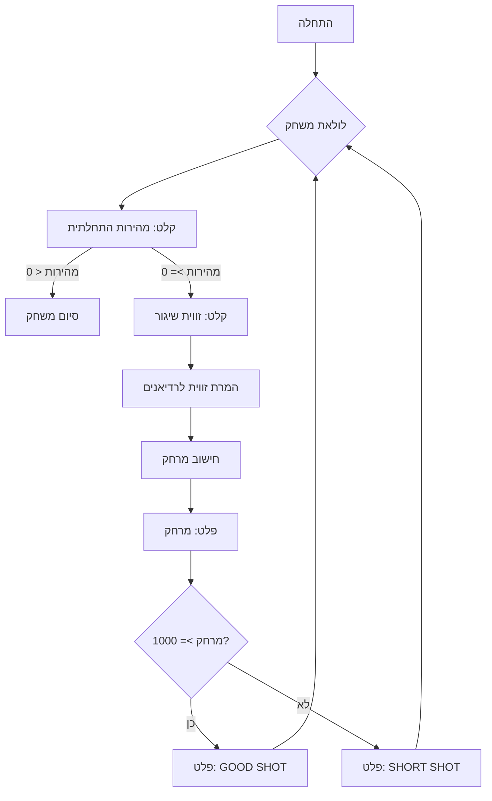

## ניתוח קוד: משחק "טיל"

### 1. <algorithm>
הקוד מיישם משחק טקסטואלי פשוט בשם "טיל". המשחק מאפשר למשתמש להזין מהירות התחלתית וזווית שיגור לטיל, והקוד מחשב את מרחק הנסיעה של הטיל. המטרה היא להשיג מרחק של 1000 רגל או יותר.
האלגוריתם הבסיסי הוא כדלקמן:

1. **אתחול:** המשחק נכנס ללולאה אינסופית המאפשרת למשתמש לשחק שוב ושוב.

2. **קלט משתמש:**
   - המשתמש מתבקש להזין מהירות התחלתית של הטיל.
   - דוגמה: `velocity = 150.0` (150 רגל לשנייה).
   - הקוד בודק האם המהירות שהוכנסה קטנה מ-0. אם כן, המשחק מסתיים.

   - המשתמש מתבקש להזין זווית שיגור של הטיל במעלות.
    - דוגמה: `angle = 45.0` (45 מעלות).

3. **חישובים:**
   - הקוד ממיר את זווית השיגור ממעלות לרדיאנים.
   - דוגמה: `angle_radians = 0.785`
   - הקוד מחשב את מרחק הנסיעה של הטיל על ידי שימוש בנוסחה פיזיקלית.
   - דוגמה: `distance = 700.0`
   
4. **פלט:**
   - הקוד מדפיס את מרחק הנסיעה של הטיל.
   - אם המרחק שהתקבל גדול מ-1000, הקוד מדפיס "GOOD SHOT".
   - אם המרחק קטן מ-1000, הקוד מדפיס "SHORT SHOT".

5. **חזרה:**
  - הלולאה חוזרת לנקודה 2 כדי לאפשר למשתמש לשחק שוב עד שהמשתמש מכניס מהירות שלילית.

זרימת נתונים:

- המשתמש מספק קלט (מהירות וזווית) כקלט לפונקציה הראשית.
- ערכי הקלט מעובדים וממירים זווית מרדיאנים למעלות.
- מרחק הנסיעה מחושב באמצעות הנוסחה.
- המרחק המחושב, ביחד עם הודעה מתאימה (GOOD SHOT או SHORT SHOT), מודפסים כפלט למשתמש.

### 2. <mermaid>

**תלות מיובאת:**

המודול היחיד שמיובא הוא `math`:
- `import math`: מודול זה מספק פונקציות מתמטיות כמו `math.sin()` ו-`math.radians()`, שהכרחיות לחישוב מרחק הנסיעה של הטיל.

### 3. <explanation>
**ייבוא (Imports):**
- `import math`: מייבא את מודול math. זהו מודול ספריית סטנדרטית של פייתון, המספק פונקציות מתמטיות שימושיות.
    - שימוש: המודול מספק פונקציות לחישובים טריגונומטריים (`math.sin`), המרת זוויות (`math.radians`).
    - קשר לחבילות אחרות: אין קשר ישיר לחבילות אחרות בפרויקט.

**משתנים (Variables):**

- `GRAVITY`: קבוע המייצג את תאוצת הכובד (32.2 רגל לשנייה בריבוע).
  - סוג: float
  - שימוש: משמש בנוסחה לחישוב מרחק הנסיעה של הטיל.
- `velocity`: משתנה המייצג את המהירות ההתחלתית של הטיל שהוכנסה על ידי המשתמש.
  - סוג: float
  - שימוש: משמש כקלט מהמשתמש ומשמש לחישוב מרחק.
- `angle`: משתנה המייצג את זווית השיגור של הטיל במעלות שהוכנסה על ידי המשתמש.
  - סוג: float
  - שימוש: משמש כקלט מהמשתמש ומומר לרדיאנים.
- `angle_radians`: משתנה המייצג את זווית השיגור של הטיל ברדיאנים.
  - סוג: float
  - שימוש: משמש בנוסחה לחישוב מרחק הנסיעה של הטיל.
- `distance`: משתנה המייצג את מרחק הנסיעה של הטיל.
  - סוג: float
  - שימוש: תוצאת החישוב של מרחק הנסיעה, ומשמש להשוואה עם המטרה.

**פונקציות (Functions):**
- אין פונקציות מוגדרות, אך מובנים הם:
    - `input()`: קורא קלט מהמשתמש.
    - `float()`: ממיר קלט מחרוזתי למספר ממשי.
    - `math.radians()`: ממיר זוויות ממעלות לרדיאנים.
    - `math.sin()`: מחשב את סינוס של זווית ברדיאנים.
    - `print()`: מדפיס פלט לקונסולה.

**הסברים מפורטים:**

1. **לולאת המשחק `while True`**: יוצרת לולאה אינסופית כדי לאפשר למשתמש לשחק שוב ושוב עד שמכניסים מהירות שלילית.

2.  **קלט מהמשתמש:**
   - הקוד משתמש בפונקציה `input()` כדי לקבל קלט מהמשתמש.
   - הפונקציה `float()` מבטיחה שהקלט יומר למספר ממשי.

3. **המרת זוויות:**
   - הפונקציה `math.radians()` ממירה את זווית השיגור ממעלות לרדיאנים, מכיוון שפונקציית `sin()` במודול `math` מקבלת רדיאנים כקלט.

4. **חישוב המרחק:**
   - המרחק מחושב על ידי שימוש בנוסחה פיזיקלית בסיסית.
   - הנוסחה: `(velocity**2 * math.sin(2 * angle_radians)) / GRAVITY`.

5. **פלט ומשוב למשתמש:**
   - מרחק הנסיעה של הטיל מודפס לקונסולה, מעוצב לשני ספרות אחרי הנקודה העשרונית.
    - המשחק מודיע למשתמש אם הטיל השיג את היעד (מרחק מעל 1000) או לא.

6. **טיפול בשגיאות:**
    - הבלוק `try...except ValueError` מטפל בשגיאות שעלולות להתרחש אם המשתמש מזין קלט שאינו מספר.

**בעיות אפשריות ושיפורים:**

- הקוד תלוי בהנחה שמשתמש יכניס נתונים מספריים.
- הדרך היחידה לצאת מהמשחק היא להזין מהירות שלילית.
- ניתן להוסיף שיפורים גרפיים (אם כי המשחק מיועד לקונסולה).

**שרשרת קשרים עם חלקים אחרים בפרויקט:**

- הקוד עצמאי ואינו תלוי בחלקים אחרים של הפרויקט.
- למעשה, זהו משחק עצמאי שניתן להרצה בלי חלקים אחרים.