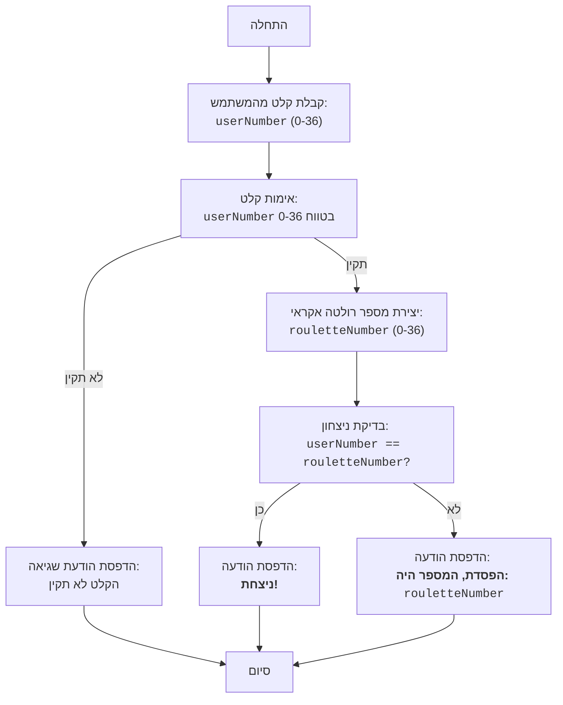

## <algorithm>

1. **התחלה:**
   - תחילת ריצת התוכנית.

2. **קבלת קלט מהמשתמש:**
   - התוכנית מבקשת מהמשתמש להזין מספר בין 0 ל-36.
   - לדוגמה: המשתמש מזין את המספר `25`.
   - אם הקלט אינו מספר שלם, תודפס הודעת שגיאה והתוכנית תסתיים.
   - לדוגמה: אם המשתמש יזין `abc`, התוכנית תסתיים.
   - אם המספר שהוכנס אינו בטווח 0-36, תודפס הודעת שגיאה והתוכנית תסתיים.
   - לדוגמה: אם המשתמש יזין `-5` או `40`, התוכנית תסתיים.

3. **יצירת מספר רולטה אקראי:**
   - התוכנית מייצרת מספר אקראי שלם בין 0 ל-36, המדמה את תוצאת הרולטה.
   - לדוגמה: המספר האקראי שנוצר הוא `12`.

4. **בדיקת ניצחון:**
   - התוכנית משווה את המספר שהזין המשתמש למספר הרולטה שנוצר.
   - לדוגמה: אם המשתמש הזין `25` והמספר האקראי הוא `12`, הם לא שווים.
   - לדוגמה: אם המשתמש הזין `12` והמספר האקראי הוא `12`, הם שווים.

5. **פלט תוצאה:**
   - אם המספרים שווים, התוכנית מדפיסה הודעה שהמשתמש ניצח.
   - לדוגמה: "ברכות! ניצחת!"
   - אם המספרים לא שווים, התוכנית מדפיסה הודעה שהמשתמש הפסיד ומציגה את המספר האקראי שנוצר.
   - לדוגמה: "הפסדת. המספר היה 12."

6. **סיום:**
   - סיום ריצת התוכנית.

## <mermaid>

**הסבר התלויות:**

- אין תלויות חיצוניות מלבד `random`, שהוא חלק מהספרייה הסטנדרטית של פייתון.
- הספרייה `random` משמשת ליצירת מספר אקראי שלם בטווח שבין 0 ל-36.

## <explanation>

**ייבואים (Imports):**

- `import random`: מייבא את המודול `random`, המאפשר ליצור מספרים אקראיים. הוא נחוץ כדי לדמות את תוצאת הרולטה. אין תלות ספציפית בחבילות `src.` אחרות.

**פונקציות (Functions):**

- אין פונקציות מוגדרות בקוד. הקוד כתוב ברמה הגלובלית, מה שהופך אותו לפשוט מאוד.

**משתנים (Variables):**

- `userNumber`:
    - סוג: `int` (מספר שלם).
    - שימוש: מאחסן את המספר שהמשתמש הזין כהימור.
    - הערך שלו מתקבל כקלט מהמשתמש.
- `rouletteNumber`:
    - סוג: `int` (מספר שלם).
    - שימוש: מאחסן את המספר האקראי שנוצר על ידי הסימולציה של הרולטה.
    - הערך שלו מוגרל על ידי `random.randint(0, 36)`.

**הסברים מפורטים:**

1. **קלט משתמש:** הקוד מתחיל בקבלת קלט מהמשתמש, כאשר הוא מתבקש להזין מספר בין 0 ל-36. הקלט נקרא `userNumber`. הקוד משתמש ב-`try-except` כדי לטפל במקרים בהם המשתמש מזין קלט שאינו מספר שלם. אם מתגלה שגיאת קלט, התוכנית מסיימת את הריצה.
2.  **בדיקת טווח:** לאחר קבלת הקלט, הקוד מוודא שהמספר שהוזן על ידי המשתמש נמצא בטווח המותר (בין 0 ל-36). אם המספר אינו בטווח, תודפס הודעת שגיאה, והתוכנית תסיים את ריצתה.
3. **יצירת מספר אקראי:** הקוד משתמש בפונקציה `random.randint(0, 36)` כדי לייצר מספר אקראי בטווח שבין 0 ל-36. מספר זה מדמה את המספר שנופל בהגרלה על הרולטה והוא נשמר במשתנה `rouletteNumber`.
4.  **בדיקת התאמה:** הקוד משווה את `userNumber` עם `rouletteNumber`. אם שני המספרים שווים, המשתמש ניצח, ומוצגת הודעת ניצחון. אם הם לא שווים, המשתמש הפסיד, ומוצגת הודעת הפסד עם המספר שיצא ברולטה.
5. **פלט:** הקוד מדפיס הודעה מתאימה בהתאם לתוצאת ההשוואה.

**בעיות אפשריות או תחומים לשיפור:**

- **אימות קלט משופר:** אפשר לשפר את אימות הקלט על ידי שימוש בלולאה שחוזרת על עצמה עד שהמשתמש מזין קלט תקין, במקום לסיים את התוכנית באופן מיידי.
- **משחקיות:** המשחק פשוט מאוד. אפשר להוסיף אפשרויות הימור נוספות, כמו הימור על מספרים זוגיים/אי-זוגיים או על טווח מספרים, כדי להפוך אותו ליותר מעניין.
- **הודעות משתמש:** ניתן לנסח את ההודעות בצורה יותר ידידותית למשתמש.
- **מבנה קוד:** הקוד כתוב בסגנון פרוצדורלי פשוט. ייתכן ששימוש בפונקציות היה הופך אותו לקריא יותר.

**שרשרת קשרים עם חלקים אחרים בפרויקט:**

- אין קשר ישיר בין הקוד הזה לחלקים אחרים בפרויקט, מכיוון שהוא משחק עצמאי ופשוט.
- הקוד מהווה חלק מהמשחקים הבסיסיים בתוך הפרויקט.
- ניתן לחבר קוד זה למערכת ניקוד/דירוג משחקים אם היה קיים בפרויקט.