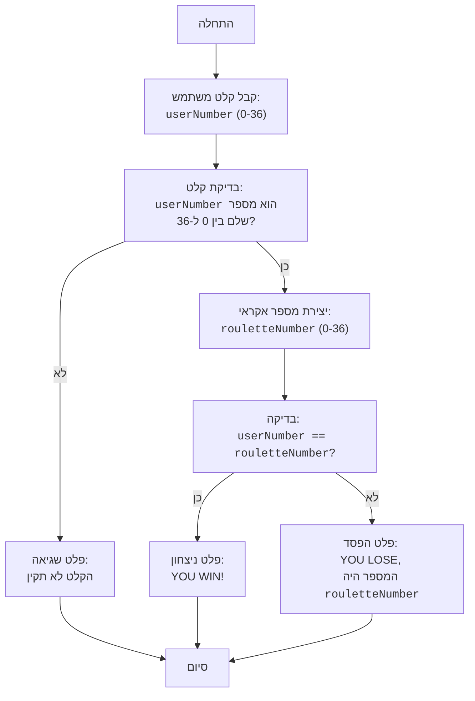

## <algorithm>

1. **התחלה:** תחילת ריצת התוכנית.
   *   דוגמה: התחלת ביצוע קובץ `roulet.py`.
2. **קבלת קלט מהמשתמש:** התוכנית מבקשת מהמשתמש להזין מספר בין 0 ל-36.
   *   דוגמה: המשתמש מזין את המספר `25`.
3. **בדיקת קלט:** התוכנית מוודאת שהקלט הוא מספר שלם ובטווח שבין 0 ל-36.
   *   דוגמה: אם המשתמש מזין `"abc"` או `40`, התוכנית תדפיס הודעת שגיאה ותסתיים. אם המשתמש מזין `15`, הבדיקה עוברת.
4.  **יצירת מספר רנדומלי:** התוכנית מגרילה מספר אקראי בין 0 ל-36.
     * דוגמה: המחשב מגריל את המספר `12`.
5. **בדיקת ניצחון:** התוכנית משווה את המספר שהמשתמש הזין למספר האקראי שהוגרל.
    *   דוגמה: אם המשתמש הזין `15` והמחשב הגריל `12`, הבדיקה תיכשל.
    *   דוגמה: אם המשתמש הזין `12` והמחשב הגריל `12`, הבדיקה תעבור.
6.  **פלט ניצחון:** אם המספרים שווים, התוכנית מדפיסה הודעת ניצחון.
     * דוגמה: אם הבדיקה עברה, הפלט יהיה "ברכות! ניצחת!".
7.  **פלט הפסד:** אם המספרים לא שווים, התוכנית מדפיסה הודעת הפסד ואת המספר האקראי שהוגרל.
     * דוגמה: אם הבדיקה נכשלה, הפלט יהיה "הפסדת. המספר היה 12".
8. **סיום:** סיום ריצת התוכנית.

## <mermaid>

**הסבר התלויות:**

*   **`random`**: המודול `random` מיובא כדי ליצור את המספר האקראי של הגלגל רולטה. `random.randint(0, 36)` משמש לייצור מספר אקראי בטווח שבין 0 ל-36.
    *   במילים אחרות, הקוד לא היה יכול להגריל מספר אקראי בלי ייבוא `random`.

## <explanation>

**ייבוא (Imports):**
*   `import random`: מייבא את המודול `random`, אשר משמש ליצירת מספרים אקראיים.  המודול `random` אינו חלק מחבילות `src.` אחרות.

**פונקציות (Functions):**
*   אין פונקציות מוגדרות בקוד הזה, אבל יש שימוש בפונקציות מובנות של פייתון:
    *   `input()`: מקבל קלט מהמשתמש.
        *   פרמטר: מחרוזת המייצגת את ההודעה שמוצגת למשתמש.
        *   ערך מוחזר: מחרוזת שהמשתמש הזין.
        *   מטרה: לאפשר למשתמש להזין את המספר שלו.
        *   דוגמה: `input("הכנס מספר מ-0 עד 36: ")`
    *   `int()`: ממיר מחרוזת למספר שלם.
        *   פרמטר: מחרוזת לייצוג מספר.
        *   ערך מוחזר: מספר שלם.
        *   מטרה: המרת קלט המחרוזת של המשתמש למספר שלם כדי לבצע השוואה.
        *   דוגמה: `int("25")` מחזיר את המספר השלם 25.
    *   `random.randint(a, b)`: יוצר מספר שלם אקראי בטווח שבין `a` ל-`b`.
        *   פרמטרים: `a` - המספר הנמוך ביותר, `b` - המספר הגבוה ביותר (כולל).
        *   ערך מוחזר: מספר שלם אקראי בטווח.
        *   מטרה: הגרלת מספר אקראי עבור גלגל הרולטה.
        *   דוגמה: `random.randint(0, 36)` מחזיר מספר אקראי בין 0 ל-36.
    *   `print()`: מדפיס הודעה לקונסולה.
        *   פרמטר: המחרוזת או הערך להדפסה.
        *   ערך מוחזר: אין.
        *   מטרה: להציג למשתמש את תוצאות המשחק.
        *   דוגמה: `print("ניצחת!")` מדפיס את ההודעה "ניצחת!".
    * `exit()`: יוצא מן התוכנית
      *  פרמטר: אופציונלי, קוד יציאה.
      *  ערך מוחזר: אין.
      *  מטרה: לעצור את התוכנית במידה והקלט לא תקין.

**משתנים (Variables):**
*   `userNumber`: משתנה מסוג `int`, המכיל את המספר שהמשתמש הזין.
*   `rouletteNumber`: משתנה מסוג `int`, המכיל את המספר האקראי שנוצר על ידי `random.randint()`.

**בעיות אפשריות ותחומים לשיפור:**
*   **טיפול שגיאות:** הקוד מטפל בשגיאת `ValueError` אם המשתמש מזין קלט שאינו מספר, אך לא מטפל בשגיאות אחרות (למשל, שגיאות קלט נוספות).
*   **אימות קלט:** הקוד בודק שהמספר הוא בין 0 ל-36, אך אפשר לייעל את הבדיקה ללולאה עד שהקלט יהיה תקין.
*   **ממשק משתמש:** הממשק הוא בסיסי מאוד. ניתן לשפר אותו על ידי שימוש בספרייה ליצירת ממשק משתמש גרפי.
*   **שימוש בפונקציות:** אפשר לפצל את הקוד לפונקציות קטנות יותר כדי להגביר את הקריאות והאחזקה.

**שרשרת קשרים עם חלקים אחרים בפרויקט:**
*   לקוד אין תלות בחלקים אחרים של הפרויקט (מעבר לשימוש ב-`random` שהיא ספריה סטנדרטית). זה משחק עצמאי שאינו מתקשר עם קבצים אחרים בתוך המבנה של `hypotez`.

בסך הכל, הקוד פשוט, קריא ומבצע את מטרתו. אפשר לשפר אותו על ידי הוספת טיפול שגיאות, שיפור הממשק ופיצול הקוד לפונקציות קטנות יותר.