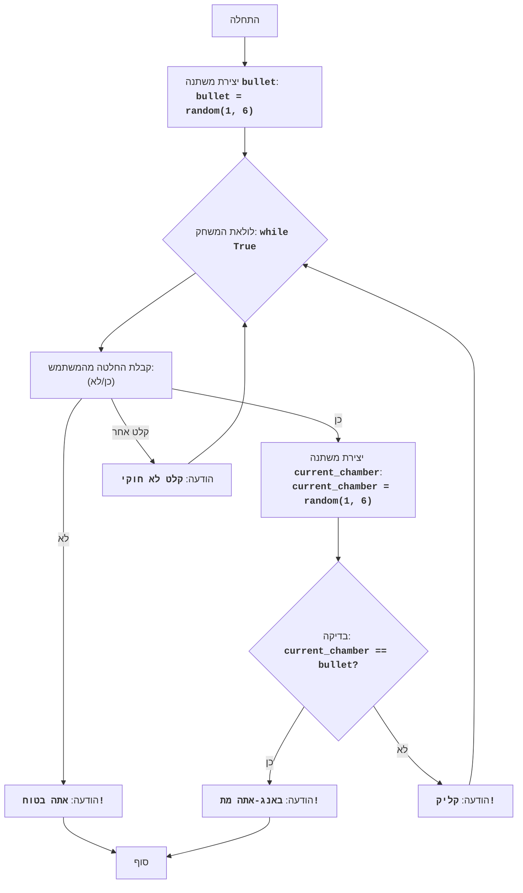

## <algorithm>
1. **התחלה:**
   - המשחק מתחיל.
   
2. **יצירת כדור:**
   - המשתנה `bullet` מקבל ערך אקראי בין 1 ל-6 (כולל), המייצג את מספר התא בו נמצא הכדור בתוך התוף של האקדח.
   - דוגמה: `bullet = 3`.
   
3. **לולאה ראשית של המשחק:**
   - המשחק נכנס ללולאה אינסופית `while True`, שתימשך עד שהמשחק יסתיים (או על ידי ניצחון או על ידי הפסד).
    
4. **קבלת החלטה מהמשתמש:**
   - המשתמש מתבקש לבחור האם ללחוץ על ההדק ("כן") או לעצור ("לא").
   - דוגמה: המשתמש מזין "כן".
   
5. **בדיקת החלטה - עצירה:**
   - אם המשתמש בחר "לא", המשחק מסתיים, המשתמש מנצח ומודפסת הודעה: "אתה בטוח!".
   - לדוגמה: אם המשתמש הזין "לא", הפלט יהיה "אתה בטוח!", והמשחק מסתיים.
   
6. **בדיקת החלטה - המשך:**
   - אם המשתמש בחר "כן", המשחק ממשיך.

7.  **בחירת תא אקראי:**
    - המשתנה `current_chamber` מקבל ערך אקראי בין 1 ל-6 (כולל), המייצג את מספר התא הנוכחי של האקדח.
    - דוגמה: `current_chamber = 5`.

8.  **בדיקת התא הנוכחי:**
    - אם המשתנה `current_chamber` שווה למשתנה `bullet`, המשחק מסתיים, המשתמש מפסיד ומודפסת הודעה: "באנג-אתה מת!".
    - דוגמה: אם `current_chamber` היה `3` וגם `bullet` היה `3`, הפלט יהיה "באנג-אתה מת!", והמשחק מסתיים.

9. **המשך המשחק:**
    - אם המשתנה `current_chamber` שונה מהמשתנה `bullet`, המשחק ממשיך ומודפסת ההודעה "קליק!".
    - לדוגמה: אם `current_chamber` היה `5` וגם `bullet` היה `3`, הפלט יהיה "קליק!". המשחק ממשיך ללולאה הראשית.

10. **קלט לא חוקי:**
     - אם המשתמש הזין משהו שהוא לא "כן" או "לא", ההודעה "קלט לא חוקי. אנא הזן 'כן' או 'לא'." מודפסת והלולאה ממשיכה.
     
11. **חזרה לשלב 4:**
     - המשחק חוזר לשלב 4, וחוזר על התהליך עד לסיום המשחק.

## <mermaid>

## <explanation>
### ייבואים (Imports)
*   `import random`: מודול זה מספק פונקציות ליצירת מספרים אקראיים, אשר משמשים לקביעת מיקום הכדור בתחילת המשחק ולקביעת התא הנוכחי בכל סיבוב. הוא נחוץ לפונקציונליות הליבה של המשחק, אשר נסמכת על אקראיות.
   
### משתנים (Variables)
*   `bullet`: משתנה זה הוא מספר שלם בין 1 ל-6 שנוצר באופן אקראי בתחילת המשחק, והוא מייצג את מספר התא בו נמצא הכדור.
*   `choice`: משתנה מחרוזת שמכיל את בחירת המשתמש ("כן" או "לא"). הערך נקלט מהקלט של המשתמש ומומר לאותיות קטנות.
*   `current_chamber`: משתנה זה הוא מספר שלם בין 1 ל-6 שנוצר באופן אקראי בכל סיבוב, והוא מייצג את מספר התא הנוכחי של האקדח.
   
### פונקציות (Functions)
*   אין פונקציות מוגדרות על ידי המשתמש. הקוד משתמש בפונקציות מובנות של פייתון ובפונקציות של מודול `random`.
    * `random.randint(a, b)`: מחזירה מספר שלם אקראי N כאשר a <= N <= b.
    * `input(prompt)`: מציג את ההודעה `prompt` ומחזיר את הקלט של המשתמש כמחרוזת.
    * `lower()`: מחזירה את המחרוזת המקורית כשהיא מומרת לאותיות קטנות.
    * `print(...)`: מדפיסה הודעה לקונסולה.

### הסבר כללי
הקוד מדמה משחק רולטה רוסית עם שישה תאים. בתחילת המשחק, תא אחד נבחר באופן אקראי כמכיל את הכדור. בכל סיבוב, המשתמש מחליט אם ללחוץ על ההדק או לעצור. אם המשתמש לוחץ על ההדק והתא הנוכחי תואם לתא המכיל את הכדור, המשתמש מפסיד. אם המשתמש בוחר לעצור בכל שלב, הוא מנצח.

### בעיות אפשריות ותחומים לשיפור
*   **אימות קלט:** הקוד מטפל רק בשני מקרים של קלט תקין ("כן" ו"לא"), ובקלט לא תקין הוא פשוט חוזר ומבקש מהמשתמש להזין קלט שוב. שיפור יכול להיות הוספת בדיקה נוספת לווידוא קלט תקין ומניעת תקלות אפשריות, לדוגמה, על ידי שימוש בלולאה נוספת שמוודאת קלט תקין מהמשתמש.
*   **ממשק משתמש:** ממשק המשתמש פשוט מאוד, ניתן לשפר אותו על ידי הוספת גרפיקה או שימוש בספריית GUI.
*   **שילוב בפרויקט:** קוד זה הוא עצמאי ואינו משתמש בקבצים אחרים בפרויקט. אם הקוד ישולב בפרויקט גדול יותר, יש לבדוק את ההתאמה והיכולת לשימוש חוזר.
*   **שגיאות וטיפול בהן:** אין טיפול בשגיאות בזמן הריצה, כגון שגיאות קלט לא צפויות.
*  **הודעות למשתמש**: הודעות למשתמש יכולות להיות יותר אינפורמטיביות וידידותיות.

### קשרים עם חלקים אחרים בפרויקט
*   לקוד זה אין קשר ישיר לקבצים אחרים בפרויקט, והוא פועל באופן עצמאי.
*   אם ישולב בפרויקט גדול יותר, הוא יצטרך להיות מותאם למבנה ולמערכת הכללית של הפרויקט.