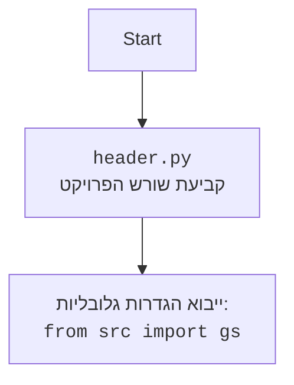

## <algorithm>

1. **אתחול משתנה `bullet`:**
   - מגרילים מספר אקראי בין 1 ל-6 (כולל) ומאחסנים אותו במשתנה `bullet`. זה מייצג את מספר התא בתוף האקדח שמכיל את הכדור.
   - לדוגמה: `bullet = 3` (הכדור בתא השלישי).

2. **תחילת לולאה ראשית (while True):**
   - הלולאה הזו תרוץ עד שהמשחק יסתיים (השחקן ינצח או יפסיד).
   - היא מאפשרת למשחק להמשיך עד שהשחקן בוחר להפסיק או עד שנופל על הכדור.

3. **קבלת החלטה מהמשתמש:**
   - שואלים את המשתמש אם הוא רוצה ללחוץ על ההדק (כן/לא).
   - הקלט משוחזר לאותיות קטנות כדי להקל על ההשוואה.
   - לדוגמה: `choice = "yes"` או `choice = "no"`.

4. **בדיקת בחירה - "לא":**
   - אם המשתמש בוחר "לא":
     - מדפיסים הודעה שהשחקן ניצח.
     - יוצאים מהלולאה (המשחק נגמר).

5. **בדיקת בחירה - "כן":**
   - אם המשתמש בוחר "כן":
      -  מגרילים מספר אקראי בין 1 ל-6 (כולל) ומאחסנים אותו במשתנה `current_chamber`. זה מייצג את מספר התא הנוכחי שעליו נלחץ ההדק.
      - לדוגמה: `current_chamber = 5`.
      - בודקים אם `current_chamber` שווה ל`bullet`.
        - אם כן:
          - מדפיסים הודעה שהשחקן הפסיד (נורה הכדור).
          - יוצאים מהלולאה (המשחק נגמר).
        - אם לא:
          - מדפיסים הודעה שאין כדור בתא הנוכחי (הקליק נשמע).
          - ממשיכים לסיבוב הבא (חוזרים לתחילת הלולאה הראשית).

6. **בדיקת קלט שגוי:**
   - אם המשתמש הכניס קלט שאינו "כן" או "לא".
   - מדפיסים הודעת שגיאה שהקלט לא תקין.
   - הלולאה ממשיכה ומאפשרת לשחקן להזין קלט שוב.

## <mermaid>

```mermaid
flowchart TD
    Start["התחלה"] --> InitializeBullet["אתחול <code>bullet</code>: <br><code>bullet = random(1, 6)</code>"]
    InitializeBullet --> LoopStart["תחילת לולאה"]
    LoopStart --> InputChoice["קלט: <br><code>choice = input(\"ללחוץ? (כן/לא)\")</code>"]
    InputChoice -- "choice == 'לא'" --> OutputWin["הודעה: <br><code>\"אתה בטוח!\"</code>"]
    OutputWin --> End["סיום"]
    InputChoice -- "choice == 'כן'" --> GenerateChamber["<code>current_chamber = random(1, 6)</code>"]
    GenerateChamber --> CheckChamber["<code>current_chamber == bullet?</code>"]
    CheckChamber -- "כן" --> OutputLose["הודעה: <br><code>\"באנג - אתה מת!\"</code>"]
    OutputLose --> End
    CheckChamber -- "לא" --> OutputClick["הודעה: <br><code>\"קליק\"</code>"]
    OutputClick --> LoopStart
     InputChoice -- "אחר" --> OutputError["הודעה: <br><code>\"קלט שגוי\"</code>"]
    OutputError --> LoopStart
```



## <explanation>

**ייבוא (Imports):**

*   `import random`: מייבא את מודול `random`, אשר מספק פונקציות ליצירת מספרים אקראיים. פונקציה זו חיונית למשחק, מכיוון שהיא מאפשרת ליצור את המיקום האקראי של הכדור בתוף האקדח וגם לבחור אקראית את התא שעליו נלחץ ההדק בכל סיבוב. אין תלות בחבילות `src`.

**משתנים (Variables):**

*   `bullet` (int): משתנה שמייצג את מיקום הכדור בתוף האקדח. הערך הוא מספר שלם אקראי בין 1 ל-6.
*   `choice` (str): משתנה שמקבל את הקלט מהמשתמש (האם הוא רוצה ללחוץ על ההדק או לא). הערך יכול להיות "כן" או "לא" (בקטנות).
*   `current_chamber` (int): משתנה שמייצג את התא הנוכחי שנבחר על ידי המשתמש. הערך הוא מספר שלם אקראי בין 1 ל-6.

**פונקציות (Functions):**

*   `random.randint(a, b)`: פונקציה מובנית במודול `random` שמייצרת מספר שלם אקראי בין `a` ל-`b` (כולל). הפונקציה משמשת כאן כדי ליצור את מיקום הכדור ואת בחירת התא הנוכחי.

**קוד:**

1.  הקוד מתחיל עם ייבוא מודול `random` ליצירת מספרים אקראיים.
2.  משתנה בשם `bullet` מקבל ערך של מספר אקראי בין 1 ל-6 (כולל). זהו המיקום של הכדור באקדח.
3.  מתחיל לולאה אינסופית שמאפשרת למשחק להמשיך עד שהשחקן ינצח או יפסיד.
4.  בתוך הלולאה, התוכנה מבקשת מהשחקן להזין אם הוא רוצה ללחוץ על ההדק או לא.
5.  אם השחקן מזין "לא", התוכנה מדפיסה הודעה שהשחקן ניצח ויוצאת מהלולאה.
6.  אם השחקן מזין "כן", התוכנה מגרילה מספר אקראי בין 1 ל-6 שזהו המיקום של התא הנוכחי.
7.  בודקים אם התא הנוכחי הוא התא עם הכדור. אם כן, מדפיסים שהשחקן הפסיד ויוצאים מהלולאה. אם לא, מדפיסים "קליק" וממשיכים בלולאה.
8.  אם הקלט אינו "כן" או "לא", התוכנית מדפיסה הודעה שהקלט שגוי ומבקשת קלט חדש.

**בעיות אפשריות או תחומים לשיפור:**

1. **קלט משתמש:** הקוד מטפל רק בקלט "כן" או "לא". אם המשתמש יכניס קלט אחר, הקוד ידפיס הודעה על קלט לא תקין, אך ימשיך לבקש קלט. אפשר לשפר את זה על ידי הוספת לולאה שתמשיך לבקש קלט עד שהמשתמש יזין "כן" או "לא".
2. **ממשק משתמש:** הממשק מאוד בסיסי. ניתן להוסיף ממשק משתמש יותר אינטראקטיבי בעזרת ספרייה כגון `curses` או `tkinter`.
3. **אימות נתונים:** הקוד לא בודק אם הקלט מהמשתמש ריק או שהוא קלט לא חוקי אחר. כדאי להוסיף אימות קלט כדי למנוע קריסה של התוכנית.
4.  **אפשרות משחק חוזר**: חסרה אפשרות לשחק שוב מבלי להפעיל את התוכנה מחדש.
5.  **הודעות משחק:** ניתן להפוך את הודעות המשחק לברורות יותר.

**שרשרת קשרים עם חלקים אחרים בפרויקט:**
   
  הקוד הוא חלק מתוך קובץ עצמאי ואינו מתקשר עם קבצים אחרים בפרויקט, למעט ייבוא סטנדרטי של `random`.