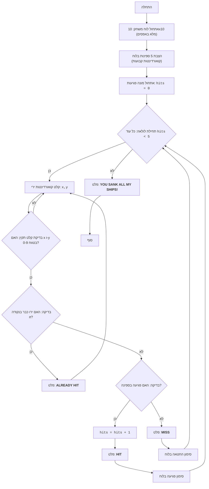

## ניתוח קוד: SALVO I

### <algorithm>

1. **אתחול לוח המשחק**:
   - נוצר לוח משחק דו-ממדי בגודל 10x10, המיוצג על ידי רשימה של רשימות.
   - כל תא בלוח מאותחל ל-0, שמייצג ים ריק.
   ```python
   board = [[0 for _ in range(10)] for _ in range(10)]
   ```
   דוגמה: `board` יהיה רשימה של רשימות, כגון `[[0, 0, 0, ...], [0, 0, 0, ...], ...]`.

2. **הצבת ספינות**:
   - מוגדרות קואורדינטות קבועות של ספינות.
   - כל קואורדינטה בלוח המשחק מסומנת ב-3, שמייצג ספינה.
   ```python
   ships = [(2, 2), (2, 4), (2, 6), (4, 2), (4, 8)]
   for ship_x, ship_y in ships:
       board[ship_x][ship_y] = 3
   ```
   דוגמה: אם אחת מהקואורדינטות היא (2, 2), אז `board[2][2]` יהיה שווה ל-3.

3. **אתחול מונה פגיעות**:
   - משתנה `hits` מאותחל ל-0, שסופר את מספר הפגיעות בספינות.
   ```python
   hits = 0
   ```

4. **לולאת משחק ראשית**:
   - הלולאה ממשיכה עד ש-`hits` שווה ל-5 (כל הספינות טובעו).
   ```python
   while hits < 5:
   ```

5. **קלט קואורדינטות מהמשתמש**:
   - המשתמש מתבקש להכניס קואורדינטות של ירי (x, y).
   - הקואורדינטות מופרדות ומומרות למספרים שלמים.
   ```python
   coordinates_input = input("Введите координаты выстрела (x,y): ")
   x, y = map(int, coordinates_input.split(','))
   ```
   דוגמה: קלט "2,5" יומר ל-`x=2` ו-`y=5`.

6. **בדיקת קלט תקין**:
    - בדיקה אם הקואורדינטות שהוכנסו נמצאות בטווח לוח המשחק (0 עד 9).
   ```python
    if not (0 <= x < 10 and 0 <= y < 10):
        print("Некорректные координаты. Пожалуйста, введите значения от 0 до 9.")
        continue
   ```

7. **בדיקת ירי קודם**:
   - בודק אם התא בלוח המשחק כבר סומן כפגיעה (1) או החטאה (2).
   - אם זה המקרה, מוצג למשתמש "ALREADY HIT" והמשחק ממשיך לאיטרציה הבאה.
   ```python
    if board[x][y] == 1 or board[x][y] == 2:
       print("ALREADY HIT")
       continue
   ```

8. **בדיקת פגיעה בספינה**:
   - אם התא בלוח המשחק הוא 3, זה מציין פגיעה בספינה.
   - מונה הפגיעות גדל, מוצג "HIT", והתא בלוח המשחק מסומן כפגיעה (1).
   ```python
   if board[x][y] == 3:
       hits += 1
       print("HIT")
       board[x][y] = 1
   ```

9. **החטאה**:
   - אם התא בלוח המשחק אינו 3, זה מציין החטאה.
   - מוצג "MISS", והתא בלוח המשחק מסומן כהחטאה (2).
   ```python
    else:
        print("MISS")
        board[x][y] = 2
   ```

10. **טיפול בשגיאות**:
     - **ValueError**: במידה והקלט לא תקין (לא מספרים), תודפס הודעת שגיאה.
      ```python
      except ValueError:
         print("Неверный формат ввода. Введите координаты в формате x,y")
      ```
     - **KeyboardInterrupt**: במידה והמשתמש עוצר את המשחק ידנית (Ctrl+C), המשחק יעצר.
      ```python
      except KeyboardInterrupt:
        print("\\nИгра прервана пользователем.")
        sys.exit()
      ```

11. **סוף משחק**:
    - לאחר שכל הספינות טובעו, מוצגת הודעת ניצחון.
   ```python
   print("YOU SANK ALL MY SHIPS!")
   ```

### <mermaid>



**הסבר על תלויות (ייבוא):**
- `import sys`: מודול `sys` משמש לצורך יציאה מהתוכנית במקרה של הפרעה מהמשתמש (`KeyboardInterrupt`), ואין לו קשר לחבילת `src`.

### <explanation>

**ייבואים (Imports):**
- `import sys`: המודול הזה מספק גישה למשתנים ופונקציות שקשורות למערכת ההפעלה ולמפרש הפייתון. במקרה זה, הוא משמש לפונקציה `sys.exit()`, שמאפשרת לסגור את התוכנית כאשר המשתמש מפריע לה.

**משתנים (Variables):**
- `board`: משתנה זה הוא רשימה דו-ממדית (רשימה של רשימות) שמאחסנת את מצב לוח המשחק. היא מאותחלת עם אפסים ומייצגת את הים. הספרה 3 מייצגת ספינה, 1 מייצגת פגיעה בספינה ו-2 מייצגת החטאה.
- `ships`: משתנה זה הוא רשימה של קואורדינטות (x, y) של מיקומי הספינות בלוח.
- `hits`: משתנה זה הוא מונה של כמות הפגיעות בספינות.
- `x`, `y`: משתנים אלה הם קואורדינטות של ירי שנקלטות מהמשתמש, והן משמשות לבדיקה אם יש פגיעה או החטאה.

**פונקציות (Functions):**
- אין פונקציות מוגדרות, כל הקוד נמצא בתוך הבלוק הראשי של הסקריפט.

**הסברים נוספים:**
- הקוד מיישם משחק פשוט של "צי הספינות" (Salvo I) בטקסט.
- הקוד משתמש בקואורדינטות קבועות עבור הספינות, כלומר המיקומים של הספינות אינם אקראיים.
- הקוד כולל בדיקות בסיסיות לקלט המשתמש, אך אין אימות קלט מתקדם.
- הקוד משתמש בלולאת while פשוטה כדי לשלוט בזרימת המשחק.
- הקוד מטפל ב `ValueError` במקרה של קלט שגוי מהמשתמש וב `KeyboardInterrupt` במקרה של עצירה ידנית.

**בעיות אפשריות:**
- הקוד לא מאפשר לשנות את מיקום הספינות בכל משחק.
- הקוד לא כולל רמה גבוהה של אימות קלט, מה שיכול להוביל לקריסת התוכנית במקרה של קלט שאינו צפוי.
- קוד המשחק לא מפוצל לפונקציות או מחלקות.

**שיפורים אפשריים:**
- לאפשר מיקום ספינות אקראי.
- ליצור פונקציות נפרדות לכל חלק של המשחק (לדוגמה, פונקציה ליצירת הלוח, פונקציה לקלט משתמש, פונקציה לבדיקת פגיעה).
- להוסיף אימות קלט מתקדם.
- להציג את הלוח למשתמש באופן ויזואלי (בטקסט).

**שרשרת קשרים עם חלקים אחרים בפרויקט:**
- לקובץ זה אין תלות בקבצים אחרים בפרויקט `hypotez`.

בסך הכל, הקוד מספק מימוש פשוט של המשחק "צי הספינות" בטקסט, אך ישנם תחומים שניתן לשפר כדי להפוך את הקוד ליעיל, גמיש וידידותי יותר למשתמש.