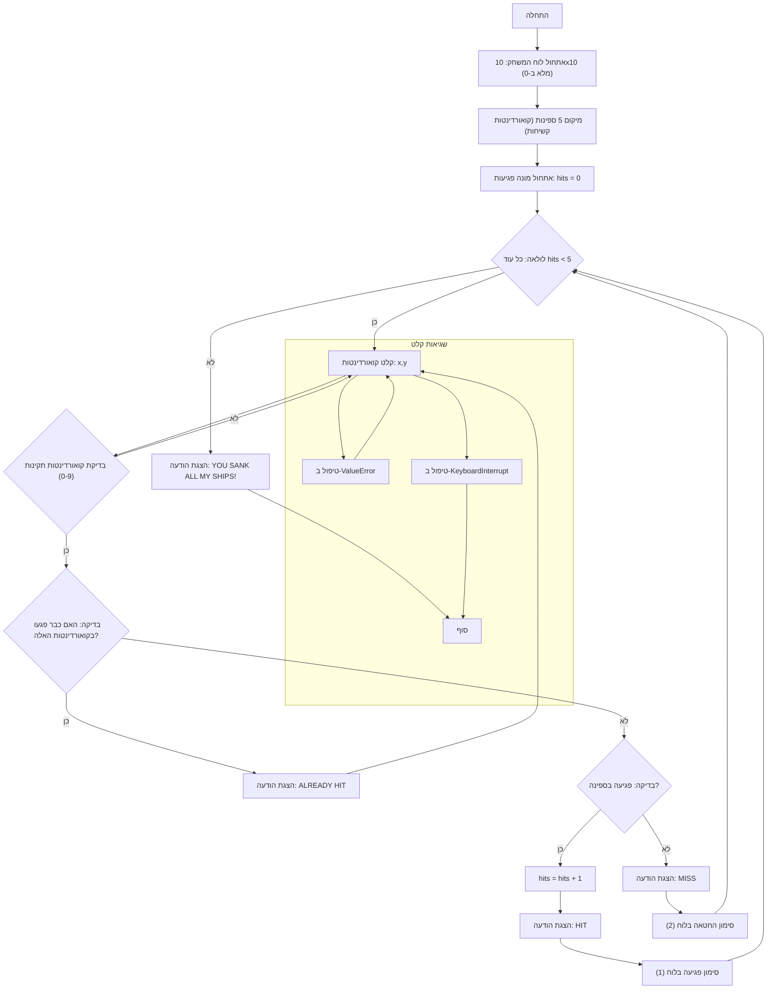

## <algorithm>
1. **התחלה:**
   - המשחק מתחיל.
   - דוגמה: אין נתונים ראשוניים, רק הכנה להתחיל.

2. **אתחול לוח המשחק:**
   - לוח המשחק בגודל 10x10 מאותחל במטריצה, כאשר כל התאים מכילים 0 (ים ריק).
   - דוגמה: `board = [[0, 0, 0, ..., 0], [0, 0, 0, ..., 0], ..., [0, 0, 0, ..., 0]]`.

3. **מיקום ספינות:**
   - חמש ספינות ממוקמות על לוח המשחק במיקומים קבועים מראש, כל מיקום מסומן בערך 3.
   - דוגמה: `ships = [(2, 2), (2, 4), (2, 6), (4, 2), (4, 8)]`; התאים `board[2][2]`, `board[2][4]`, `board[2][6]`, `board[4][2]` ו- `board[4][8]` מקבלים ערך 3.

4. **אתחול מונה פגיעות:**
   - מונה הפגיעות מאותחל ל-0.
   - דוגמה: `hits = 0`.

5. **לולאה ראשית (כל עוד מונה הפגיעות < 5):**
    - **קלט קואורדינטות:** המשתמש מתבקש להזין קואורדינטות של ירייה בפורמט "x,y".
      - דוגמה: קלט משתמש: "2,5".
    - **בדיקת קואורדינטות לא חוקיות:**
      - אם הקואורדינטות שהוזנו אינן בטווח 0-9, תוצג הודעת שגיאה והמשחק יחזור לבקש קלט.
        - דוגמה: קלט משתמש "12,3" יגרום לשגיאה.
    - **בדיקת פגיעה קודמת:**
        - אם התא בלוח כבר סומן כפגיעה (1) או החטאה (2), תוצג ההודעה "ALREADY HIT", והמשחק יחזור לבקש קלט.
        - דוגמה: אם `board[2][5]` הוא 1 או 2, יוצג "ALREADY HIT".
    - **בדיקת פגיעה בספינה:**
      - אם בתא בלוח יש ספינה (3):
         - מונה הפגיעות גדל ב-1.
         - מוצגת ההודעה "HIT".
         - התא בלוח מסומן כפגיעה (1).
        - דוגמה: אם `board[2][5]` הוא 3: `hits` הופך ל-1, מוצג "HIT", ו-`board[2][5]` הופך ל-1.
      - אם לא (החטאה):
         - מוצגת ההודעה "MISS".
         - התא בלוח מסומן כהחטאה (2).
        - דוגמה: אם `board[2][5]` הוא 0: מוצג "MISS", ו-`board[2][5]` הופך ל-2.
    - **טיפול בשגיאות קלט:**
        - אם הקלט שגוי ולא ניתן להמיר אותו למספרים שלמים, מוצגת הודעת שגיאה, והמשחק חוזר לבקש קלט.
        - דוגמה: קלט משתמש "a,b" יגרום לשגיאה.
    - **טיפול בביטול על ידי המשתמש:**
        - אם המשתמש מבטל את המשחק (למשל על ידי Ctrl+C), מוצגת הודעה והמשחק מסתיים.

6. **סוף המשחק:**
   - אם מונה הפגיעות הגיע ל-5, מוצגת ההודעה "YOU SANK ALL MY SHIPS!" והמשחק מסתיים.
   - דוגמה: מוצג "YOU SANK ALL MY SHIPS!" כאשר `hits` הוא 5.

## <mermaid>

**הסבר על התלויות:**
אין תלויות מיובאות בקוד זה, הוא משתמש רק בפונקציות בסיסיות של פייתון.
הבלוק של `שגיאות קלט` מתאר את הטיפול בשגיאות אפשריות בזמן ריצת הקוד.

## <explanation>
**ייבואים (Imports):**

-   `import sys`: מודול זה מאפשר אינטראקציה עם מערכת ההפעלה, ומשמש כאן בעיקר כדי לסיים את התוכנית במקרה של פקודת ביטול מהמשתמש (KeyboardInterrupt).

**מחלקות (Classes):**
אין מחלקות בקוד הזה.

**פונקציות (Functions):**
אין פונקציות מוגדרות בקוד הזה.

**משתנים (Variables):**

-   `board`: משתנה זה הוא רשימה דו-ממדית (מטריצה) בגודל 10x10 המייצגת את לוח המשחק. כל תא מכיל אחד מהערכים הבאים:
    -   0: ים ריק.
    -   1: פגיעה בספינה.
    -   2: החטאה.
    -   3: ספינה לא פגועה.
-   `ships`: רשימה של קואורדינטות (x,y) המייצגות את מיקומי הספינות על הלוח.
    -   דוגמה: `ships = [(2, 2), (2, 4), (2, 6), (4, 2), (4, 8)]`.
-   `hits`: משתנה שלם הסופר את מספר הפגיעות בספינות. מאותחל ל-0.
    -   דוגמה: `hits` גדל ב-1 בכל פעם שפוגעים בספינה, עד ל-5.

**הסברים מפורטים:**
- הקוד מדמה משחק "צוללות" (Salvo I) פשוט בטקסט.
- המשתמש מזין קואורדינטות, והתוכנית מגיבה בהתאם:
  - "HIT" - אם הקואורדינטות פגעו בספינה.
  - "MISS" - אם הקואורדינטות לא פגעו בספינה.
  - "ALREADY HIT" - אם המשתמש כבר ניסה את אותן קואורדינטות.
- המשחק ממשיך עד שהמשתמש פוגע בכל הספינות (5 פגיעות).
- הקוד מטפל בשגיאות קלט נפוצות:
  - שגיאת `ValueError` במקרה של קלט לא תקין (לא מספרים)
  - שגיאת `KeyboardInterrupt` במקרה של ביטול המשחק על ידי המשתמש (Ctrl+C).

**בעיות אפשריות ותחומים לשיפור:**
-   **מיקום קבוע של ספינות:** הספינות ממוקמות במיקומים קבועים מראש. רצוי ליצור מיקום ספינות רנדומלי עבור כל משחק.
-   **ממשק משתמש:** הממשק פשוט וטקסטואלי. ניתן לשפר אותו עם תצוגה גרפית או ממשק משתמש יותר אינטראקטיבי.
-   **בדיקת קלט:** הקוד בודק אם הקואורדינטות הן בתוך הלוח, אך לא בודק פורמט קלט נוסף. לדוגמה, אם המשתמש מזין אותיות במקום מספרים.
-   **הרחבה:** המשחק יכול להיות מורחב עם סוגי ספינות שונים, גדלים שונים ללוח המשחק או קשיים שונים.

**שרשרת קשרים עם חלקים אחרים בפרויקט:**
בתוך הפרוייקט המלא, משחק זה עומד בפני עצמו, ואינו תלוי ישירות בחלקים אחרים בקוד. הוא יכול לשמש כדוגמה למשחק טקסט פשוט, אבל אין אינטראקציה ישירה עם מודולים אחרים של הפרויקט.