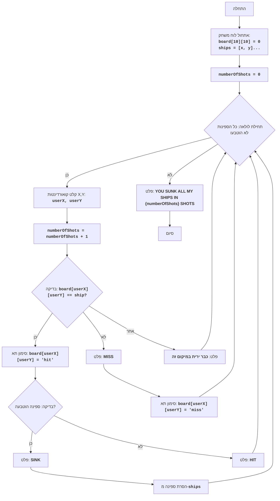

# ניתוח קוד: משחק סלבו

## 1. <algorithm>

הקוד מיישם משחק ימי קלאסי בשם "סלבו" (Salvo), בו השחקן מנסה להטביע את ספינות היריב הממוקמות על גבי רשת. להלן תהליך העבודה צעד אחר צעד:

1.  **אתחול לוח המשחק:**
    *   נוצר לוח משחק בגודל 10x10 המיוצג על ידי רשימה דו-ממדית. כל תא מאותחל לערך 0, המייצג תא ריק.
    *   דוגמה: `board = [[0, 0, 0, ...], [0, 0, 0, ...], ...]`.
    *   דוגמה לשימוש בפונקציה `create_board(10)` יוצרת לוח חדש 10x10.
2.  **מיקום ספינות:**
    *   הספינות ממוקמות באופן אקראי על הלוח (אורך הספינות נקבע מראש). מיקום הספינות נשמר ברשימה, כולל מיקום (שורה ועמודה), כיוון (אופקי או אנכי) ואורך.
    *   דוגמה: `ships = [(row1, col1, "horizontal", 2), (row2, col2, "vertical", 3), ...]`.
    *   דוגמה לשימוש: `place_ships(board, [2, 3, 4, 5])` ממקם ספינות באורכים 2, 3, 4 ו-5.
3.  **אתחול מונה יריות:**
    *   מונה יריות מאותחל ל-0.
    *   דוגמה: `numberOfShots = 0`.
4.  **לולאת המשחק:**
    *   המשחק נמשך עד שכל הספינות טובעות.
        *   **קלט קואורדינטות:** השחקן מתבקש להזין קואורדינטות (X, Y) עבור היריה.
        *   **עדכון מונה יריות:** מונה היריות מוגדל ב-1.
        *   **בדיקת פגיעה:**
            *   אם הקואורדינטות פוגעות בספינה (ערך 1 בלוח המשחק):
                *   התא בלוח המשחק מסומן כ-"hit".
                *   בודקים האם הספינה טבעה (כל חלקיה סומנו כ-"hit").
                    *   אם הספינה טבעה, מוצגת ההודעה "SINK" ומוסרת מרשימת הספינות.
                    *   אם הספינה לא טבעה, מוצגת ההודעה "HIT".
            *   אם הקואורדינטות לא פוגעות בספינה (ערך 0 בלוח המשחק):
                *   התא בלוח המשחק מסומן כ-"miss".
                *   מוצגת ההודעה "MISS".
            *   אם השחקן ירה כבר בנקודה זו, תופיע הודעה מתאימה.
        *   **הדפסת הלוח:** לוח המשחק מעודכן ומודפס.
5.  **סיום המשחק:**
    *   כאשר כל הספינות טובעות, מוצגת הודעת ניצחון וכמות היריות.
    *   המשחק מסתיים.

## 2. <mermaid>

**ניתוח תלויות:**
*   אין תלויות חיצוניות מלבד מודול `random` המובנה של פייתון, שמשמש ליצירת מספרים אקראיים לצורך מיקום הספינות על הלוח.

## 3. <explanation>

### ייבוא (Imports):
*   `import random`: מייבא את המודול `random` שמשמש להגרלת מספרים אקראיים לצורך מיקום אקראי של ספינות על הלוח, ובחירת כיוון אקראי (אופקי או אנכי).

### פונקציות (Functions):

1.  **`create_board(size)`**:
    *   **פרמטרים:** `size` - גודל הלוח הרצוי (מספר השורות והעמודות).
    *   **ערך מוחזר:** רשימה דו-ממדית המייצגת את לוח המשחק, כאשר כל תא מאותחל ל-0.
    *   **מטרה:** יוצרת לוח משחק ריק.
    *   **דוגמה לשימוש:** `create_board(10)` יוצר לוח 10x10.

2.  **`place_ships(board, ships_lengths)`**:
    *   **פרמטרים:**
        *   `board` - רשימה דו-ממדית המייצגת את לוח המשחק.
        *   `ships_lengths` - רשימה של אורכי הספינות למיקום.
    *   **ערך מוחזר:** רשימה של מיקומי הספינות שמוקמו, כאשר כל איבר הוא טאפל עם מידע על הספינה: שורה, עמודה, כיוון ואורך.
    *   **מטרה:** ממקמת ספינות באופן אקראי על הלוח, כאשר כל ספינה מיוצגת על ידי התאמה בלוח לערך 1.
    *   **דוגמה לשימוש:** `place_ships(board, [2, 3, 4, 5])` ממקם ספינות באורכים 2, 3, 4 ו-5 באופן אקראי.

3.  **`is_sunk(board, ship)`**:
    *   **פרמטרים:**
        *   `board` - רשימה דו-ממדית המייצגת את לוח המשחק.
        *   `ship` - טאפל המייצג את הספינה (שורה, עמודה, כיוון ואורך).
    *   **ערך מוחזר:** `True` אם הספינה טבעה (כל חלקיה סומנו כ-"hit"), `False` אחרת.
    *   **מטרה:** בודקת האם כל חלקי הספינה נפגעו.
    *   **דוגמה לשימוש:** `is_sunk(board, ship)` בודקת האם הספינה `ship` טבעה.

4.  **`print_board(board)`**:
    *   **פרמטרים:** `board` - רשימה דו-ממדית המייצגת את לוח המשחק.
    *   **ערך מוחזר:** אין (מדפיסה ללוח).
    *   **מטרה:** מדפיסה את לוח המשחק לקונסולה, כאשר ספינות לא פגועות (ערך 0 או 1) מוסתרות ומודפסות כ "~". תאים שנפגעו או שנורו אליהם מודפסים כערכם ('hit' או 'miss').
    *   **דוגמה לשימוש:** `print_board(board)` מדפיסה את לוח המשחק.

5. **`play_salvo()`**:
     *   **פרמטרים**: אין.
     *   **ערך מוחזר**: אין.
     *   **מטרה**: משמשת כפונקציה הראשית של המשחק, מאתחלת את המשתנים, מנהלת את הלולאה הראשית של המשחק, קולטת את הקלט של המשתמש, מעדכנת את הלוח ומציגה הודעות למשתמש.

### משתנים (Variables):

*   `board_size`: גודל הלוח (10).
*  `ships_lengths`: רשימה של אורכי הספינות ([2, 3, 4, 5]).
*   `board`: רשימה דו-ממדית המייצגת את לוח המשחק.
*   `ships`: רשימה של מיקומי הספינות.
*   `numberOfShots`: מונה היריות.
*   `sunk_ships_count`: מונה הספינות הטבועות.
*   `x`, `y`: קואורדינטות היריה שהמשתמש מזין.
*    `ship_sunk`: משתנה בוליאני שמסמן האם ספינה טבעה.

### בעיות אפשריות ושיפורים:

1.  **מיקום ספינות:** האלגוריתם למיקום ספינות הוא פשוט ועלול להוביל למצבים בהם ספינות ממוקמות קרוב מדי אחת לשנייה, מה שמקשה על המשחק. ניתן לשפר את האלגוריתם כך שיבדוק גם סביבת ספינה קיימת כדי להבטיח ריחוק מספיק.
2. **עיצוב המשחק**: המשחק מיוצג באמצעות הדפסת לוח הטקסט לקונסולה, ניתן לשפר את ממשק המשתמש בעזרת שימוש בספריות גרפיות כמו Pygame.
3.  **בדיקת תקינות קלט:** כרגע, הקוד מטפל רק בשגיאת `ValueError`, אם המשתמש מזין קלט שאינו מספר, אך לא בודק קלט תקין של מספרים בתוך טווח הגודל של הלוח. כדאי להוסיף טיפול שגיאות נוסף כדי למנוע קריסות.
4.  **משחק מול מחשב:** כרגע המשחק מיועד לשחקן יחיד. ניתן להרחיב את המשחק כך שיהיה ניתן לשחק מול מחשב.
5.  **הפרדת לוגיקה:** ניתן להפריד את לוגיקת המשחק למודולים נפרדים, לדוגמא מחלקת `Board`, מחלקת `Ship`, מחלקת `Game` וכך הלאה, מה שיגביר את קריאות ואיכות הקוד.

### שרשרת קשרים:
*   אין תלות ישירה בקבצים אחרים בפרויקט `hypotez/src/endpoints/ai_games/101_basic_computer_games/ru/GAMES/SALVO/`.
*   הקוד פועל כמשחק עצמאי.

בסיכום, הקוד מספק יישום פשוט אך פונקציונלי של משחק סלבו. ניתן לשפר את הקוד במספר היבטים, כגון אלגוריתם מיקום הספינות, ממשק משתמש, בדיקת תקינות קלט וארגון הקוד.