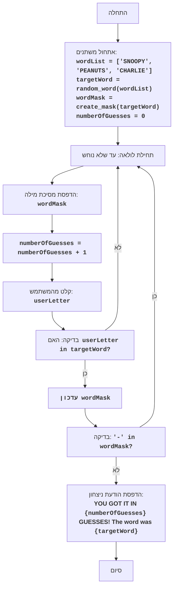

## <algorithm>
1. **הגדרת משתנים**:
   - `wordList`: רשימה של מילים אפשריות: `["SNOOPY", "PEANUTS", "CHARLIE"]`.
   - `targetWord`: בחירה אקראית של מילה מתוך `wordList`, לדוגמה, "SNOOPY".
   - `wordMask`: יצירת מסיכה למילה הנבחרת, למשל "------" עבור "SNOOPY".
   - `numberOfGuesses`: אתחול מונה ניסיונות לאפס.

2. **לולאת משחק**:
   - כל עוד לא כל האותיות נוחשו (`'-'` עדיין קיים ב-`wordMask`):
      - הדפסת המסיכה הנוכחית, למשל: "S - - O - Y".
      - הגדלת `numberOfGuesses` ב-1.
      - קבלת קלט מהמשתמש: ניחוש של אות אחת, לדוגמה, "O".
      - בדיקה האם האות שהוזנה קיימת במילה הנבחרת.
         - אם כן:
            - עדכון המסיכה: החלפת כל המופעים של מקף באות המנוחשת. אם נניח שהאות המנוחשת היא 'O' המסיכה תעודכן ל: S - O O - Y .
         - אם לא:
             - מעבר לאיטרציה הבאה של הלולאה.

3. **סיום משחק**:
    - אם כל האותיות נוחשו (אין יותר מקפים ב-`wordMask`):
        - הדפסת הודעת ניצחון: "POZDRAVLYAYU! Vy ugadali slovo za {numberOfGuesses} popytok! Slovo bylo: {targetWord}". למשל: "POZDRAVLYAYU! Vy ugadali slovo za 5 popytok! Slovo bylo: SNOOPY".
        - סיום המשחק.

## <mermaid>

הקוד מייבא את ספריית `random` כדי לבחור מילה באופן אקראי מהרשימה.

## <explanation>
**ייבוא (Imports):**
- `import random`: מודול זה משמש ליצירת מספרים אקראיים, בשימוש בפונקציה `random.choice` לבחירת מילה אקראית מתוך רשימה.

**פונקציות (Functions):**
- `choose_word(word_list)`:
  - **פרמטרים**: `word_list` - רשימה של מילים.
  - **ערך מוחזר**: מחזירה מילה אקראית אחת מהרשימה.
  - **מטרה**: בוחרת מילה באופן אקראי מרשימת מילים, באמצעות `random.choice()`.
  - **דוגמה**: `choose_word(["SNOOPY", "PEANUTS", "CHARLIE"])` עשויה להחזיר "SNOOPY" או "PEANUTS" או "CHARLIE".

- `create_mask(word)`:
  - **פרמטרים**: `word` - מילה.
  - **ערך מוחזר**: מחזירה רשימה של מקפים באורך המילה הנתונה.
  - **מטרה**: יוצרת מסיכה של מקפים באורך המילה, המשמשת להצגת התקדמות הניחוש.
  - **דוגמה**: `create_mask("SNOOPY")` תחזיר `["-", "-", "-", "-", "-", "-"]`.

- `update_mask(mask, word, letter)`:
  - **פרמטרים**: `mask` - רשימת תווים (מסיכה), `word` - המילה הנכונה, `letter` - האות שהוזנה ע"י המשתמש.
  - **ערך מוחזר**: מחזירה את המסיכה המעודכנת עם האותיות שנוחשו.
  - **מטרה**: מעדכנת את המסיכה על ידי החלפת המקפים באות שהוזנה, אם היא קיימת במילה.
  - **דוגמה**: אם `mask` היא `["-", "-", "O", "-", "-", "-"]`, `word` היא "SNOOPY" ו-`letter` היא "O", תחזיר `["-", "-", "O", "O", "-", "-"]`.

- `play_snoopy_game()`:
  - **פרמטרים**: אין.
  - **ערך מוחזר**: אין.
  - **מטרה**: מכילה את כל הלוגיקה של המשחק, כולל בחירת מילה, יצירת מסיכה, לולאת ניחוש, בדיקה האם המילה נוחשה והדפסת תוצאה.
  - **דוגמה**: מפעילה את המשחק, ומאפשרת למשתמש לנחש את המילה.

**משתנים (Variables):**
- `word_list`: רשימה של מילים ("SNOOPY", "PEANUTS", "CHARLIE").
- `target_word`: המילה הנבחרת באקראי מהרשימה, מומרת לאותיות גדולות.
- `word_mask`: רשימה של מקפים, המשמשת כמסיכה של המילה. מתעדכנת ככל שנוחשות אותיות.
- `number_of_guesses`: מונה את מספר הניסיונות של המשתמש.
- `user_letter`: האות שהוזנה על ידי המשתמש, מומרת לאותיות גדולות.

**בעיות אפשריות ושיפורים:**
- הקוד לא מטפל בקלט לא חוקי, למשל, כאשר המשתמש מזין יותר מאות אחת.
- המשחק לא מאפשר לשחק שוב, לאחר שהמילה נוחשה. ניתן להוסיף אפשרות זו.
- המשחק מוגבל למילים קבועות מראש. ניתן להוסיף קובץ חיצוני או אפשרות להזין מילים.
- ניתן להוסיף ממשק משתמש גרפי (GUI) במקום טקסטואלי.
- אין טיפול בשגיאות, למשל שגיאות קלט.

**שרשרת קשרים:**
- הקוד עומד בפני עצמו, אין לו תלות בקבצים חיצוניים, מלבד הספריה `random`.
- הפונקציה `play_snoopy_game` היא המנוע המרכזי, המשתמשת בפונקציות `choose_word`, `create_mask`, ו-`update_mask` כדי ליישם את הלוגיקה של המשחק.