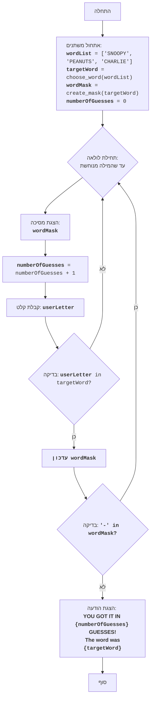

## ניתוח קוד: משחק "סנופי"

### <algorithm>

1.  **אתחול משחק**:
    *   הגדרת רשימת מילים `word_list` (לדוגמה: `["SNOOPY", "PEANUTS", "CHARLIE"]`).
    *   בחירת מילה רנדומלית `target_word` מתוך הרשימה (לדוגמה: "SNOOPY").
    *   יצירת מסכה `word_mask` למילה הנבחרת (לדוגמה: `["-", "-", "-", "-", "-", "-"]`).
    *   הגדרת מונה ניסיונות `number_of_guesses` ל-0.

2.  **לולאת משחק (עד שהמילה תנוחש)**:
    *   הצגת המסיכה הנוכחית `word_mask` למשתמש (לדוגמה: "- - - - - -").
    *   הגדלת `number_of_guesses` ב-1.
    *   קבלת קלט מהמשתמש, אות ניחוש `user_letter`.
    *   בדיקה האם `user_letter` נמצאת ב-`target_word`:
        *   אם כן, עדכון המסיכה `word_mask` באותיות שהתגלו במיקומים הנכונים (לדוגמה: אם `user_letter` היא "O" המסיכה תהפוך ל `["-", "O", "O", "-", "-", "-"]`).
    *   בדיקה האם יש עוד מקפים בתוך `word_mask`.
        *   אם כן, חוזרים לתחילת הלולאה.
        *   אם לא, עוברים לסוף המשחק.

3.  **סוף משחק**:
    *   הצגת הודעה למשתמש שהמילה פוענחה, כולל מספר הניסיונות והמילה הנכונה.
    *   סיום המשחק.

**זרימת נתונים:**

*   `word_list` -> `choose_word()` -> `target_word`.
*   `target_word` -> `create_mask()` -> `word_mask`.
*   `word_mask`, `target_word`, `user_letter` -> `update_mask()` -> `word_mask`.
*   `number_of_guesses` גדל בכל ניחוש, ומוצג בסוף המשחק.

### <mermaid>

**הסבר תלויות ייבוא:**

*   `import random`: מודול `random` משמש ליצירת מספרים אקראיים, ובמקרה זה, לבחירת מילה אקראית מתוך רשימת המילים.

### <explanation>

**ייבואים (Imports):**

*   `import random`: מייבא את המודול `random`, המכיל פונקציות ליצירת ערכים אקראיים. בשימוש בפונקציה `random.choice()` לבחירת מילה אקראית מרשימה.

**פונקציות (Functions):**

*   `choose_word(word_list)`:
    *   **פרמטרים**: `word_list` (רשימת מילים).
    *   **ערך מוחזר**: מילה שנבחרה באקראי מתוך `word_list`.
    *   **מטרה**: בוחרת מילה אקראית מרשימת מילים נתונה.
    *   **דוגמה**: `choose_word(["CAT", "DOG", "BIRD"])` יכול להחזיר `"CAT"`, `"DOG"` או `"BIRD"` באופן אקראי.
*   `create_mask(word)`:
    *   **פרמטרים**: `word` (מילה).
    *   **ערך מוחזר**: רשימה של מקפים ("-"), באורך המילה.
    *   **מטרה**: יוצרת מסיכה למילה, כאשר כל אות מוחלפת במקף.
    *   **דוגמה**: `create_mask("HELLO")` תחזיר `["-", "-", "-", "-", "-"]`.
*   `update_mask(mask, word, letter)`:
    *   **פרמטרים**: `mask` (מסיכה), `word` (מילה), `letter` (אות).
    *   **ערך מוחזר**: המסיכה המעודכנת, בה מופיעות האותיות שהתגלו.
    *   **מטרה**: מעדכנת את המסיכה עם המיקומים הנכונים של האות המנוחשת.
    *   **דוגמה**: אם `mask` היא `["-", "-", "-", "-", "-"]`, `word` היא `"HELLO"` ו`letter` היא `"L"`, הפונקציה תחזיר `["-", "-", "L", "L", "-"]`.
*   `play_snoopy_game()`:
    *   **פרמטרים**: ללא פרמטרים.
    *   **ערך מוחזר**: ללא ערך מוחזר.
    *   **מטרה**: מריצה את המשחק.
        *   מאתחלת את רשימת המילים, בוחרת מילה רנדומלית, יוצרת את המסיכה, ומאפסת את מונה הניסיונות.
        *   מנהלת את הלולאה הראשית של המשחק: מקבלת ניחוש מהמשתמש, מעדכנת את המסיכה, ובודקת האם המילה פוענחה.

**משתנים (Variables):**

*   `word_list`: רשימת מילים מהן נבחרת המילה להנחשה.
*   `target_word`: המילה הנבחרת.
*   `word_mask`: המסיכה הנוכחית של המילה.
*   `number_of_guesses`: מונה ניסיונות הנחושים.
*   `user_letter`: האות שהמשתמש מנחש.

**בעיות אפשריות ותחומים לשיפור:**

*   **קלט לא תקין**: הקוד לא מטפל במקרים בהם המשתמש מכניס קלט שאינו אות בודדת. יש להוסיף בדיקה לכך.
*   **אותיות כפולות**: המשחק לא מציג מיקומים של אותיות כפולות, רק הראשונה שפוגשים (תוקן בגרסה העדכנית).
*   **בחירת מילים**: ניתן להרחיב את רשימת המילים או לאפשר למשתמש להוסיף מילים.
*   **ממשק משתמש**: ממשק המשחק בסיסי. ניתן להוסיף ממשק משתמש גרפי לשיפור החוויה.

**שרשרת קשרים עם חלקים אחרים בפרויקט:**

*   הקוד עצמאי ואינו תלוי בחלקים אחרים בפרויקט. ניתן לשלב אותו כחלק ממערכת משחקים רחבה יותר.