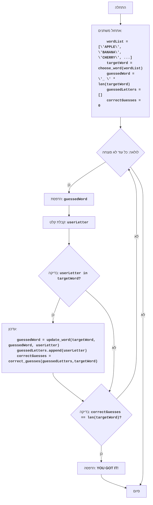

# ניתוח קוד: משחק "מילת חלל"

## 1. <algorithm>

### תרשים זרימה:
1.  **התחלה:**
    -   המשחק מתחיל.
2.  **אתחול משתנים:**
    -   `word_list`: רשימת מילים אפשריות (`["APPLE", "BANANA", "CHERRY", ... ]`).
    -   `target_word`: מילה שנבחרה באקראי מתוך `word_list` (למשל, "APPLE").
    -   `guessed_word`: מילה המורכבת מתווים "_" כמספר האותיות ב-`target_word` (למשל, "_ _ _ _ _").
    -   `guessed_letters`: רשימה ריקה לשמירת האותיות שנוחשו (למשל, `[]`).
    -   `correct_guesses`: מונה המאותחל ל-0 לספירת מספר האותיות שאותרו.
3.  **לולאה ראשית (כל עוד המילה לא פוצחה):**
    -   הדפסת המצב הנוכחי של `guessed_word` (למשל, "_ _ _ _ _").
    -   קבלת קלט מהמשתמש - אות אחת (למשל, "A").
    -   בדיקה אם האות שהוזנה נמצאת ב-`target_word`.
        -   **אם כן:**
            -   עדכון `guessed_word` עם האות במקומות הרלוונטיים (למשל, "A _ _ _ _").
            -   הוספת האות ל-`guessed_letters` (למשל, `["A"]`).
            -   עדכון מספר הניחושים הנכונים (`correct_guesses`).
        -   **אם לא:**
            -   המשך ללולאה הבאה.
    -   בדיקה אם `correct_guesses` שווה לאורך ה-`target_word`.
        -   **אם כן:**
            -   הודעת ניצחון "YOU GOT IT!".
            -   יציאה מהלולאה.
        -   **אם לא:**
            -   חזרה לתחילת הלולאה.
4.  **סיום:**
    -   סיום המשחק.

### זרימת נתונים:
-   `choose_word` מקבלת `word_list` ומחזירה `target_word`.
-   `display_word` מקבלת `word` ו-`guessed_letters` ומחזירה מחרוזת תצוגה.
-   `update_word` מקבלת `target_word`, `guessed_word` ו-`user_letter` ומחזירה את `updated_word`.
-   `correct_guesses` מקבלת `guessed_letters` ו-`target_word` ומחזירה את מספר הניחושים הנכונים (`count`).
-   `play_spaceword_game` משתמשת בכל הפונקציות הללו על מנת להריץ את המשחק.

## 2. <mermaid>

**הסבר:**
-   **Start**: תחילת המשחק.
-   **InitializeVariables**: אתחול משתני המשחק, כולל רשימת המילים, המילה הנבחרת, מצב הניחוש, רשימת הניחושים ומונה הניחושים הנכונים.
-   **LoopStart**: תחילת הלולאה הראשית של המשחק, המתבצעת כל עוד המילה לא פוצחה.
-   **OutputWord**: הדפסת מצב הניחוש הנוכחי של המילה.
-   **InputLetter**: קבלת קלט מהמשתמש - ניחוש אות.
-   **CheckLetter**: בדיקה אם האות המנוחשת נמצאת במילה הנבחרת.
-   **UpdateWord**: עדכון מצב הניחוש עם האות המנוחשת, הוספת האות לרשימת הניחושים ועדכון מונה הניחושים הנכונים.
-  **CheckWin**: בדיקה אם כל אותיות המילה נוחשו.
-   **OutputWin**: הדפסת הודעת ניצחון.
-   **End**: סיום המשחק.

**ניתוח תלויות:**
-   הקוד משתמש במודול `random` לצורך בחירת מילה אקראית מהרשימה.

## 3. <explanation>

### ייבוא (Imports):
-   `import random`: מייבא את המודול random, המשמש ליצירת אקראיות, לצורך בחירת מילה אקראית מרשימה.

### פונקציות (Functions):
-   `choose_word(word_list)`:
    -   **פרמטרים**: `word_list` - רשימת מילים.
    -   **ערך מוחזר**: מילה אקראית מתוך רשימת המילים.
    -   **מטרה**: בחירת מילה אקראית מהרשימה לשימוש במשחק.
    -   **דוגמה**: `choose_word(["APPLE", "BANANA"])` עשויה להחזיר "APPLE" או "BANANA".
-   `display_word(word, guessed_letters)`:
     -  **פרמטרים**: `word` - המילה לניחוש, `guessed_letters` - רשימת אותיות שניחשו.
     -  **ערך מוחזר**: מחרוזת המציגה את המילה, עם אותיות מנוחשות וסימני מקום לאותיות שלא נוחשו.
     -  **מטרה**: הצגת מצב המילה עם האותיות המנוחשות.
     -  **דוגמה**: `display_word("APPLE", ["A", "E"])` תחזיר "A _ _ _ E".
-   `update_word(word, guessed_word, user_letter)`:
    -   **פרמטרים**: `word` - המילה לניחוש, `guessed_word` - מצב המילה הנוכחי, `user_letter` - האות שנוחשה.
    -   **ערך מוחזר**: מחרוזת המציגה את המילה, עם האותיות המנוחשות במקומן.
    -   **מטרה**: עדכון מצב המילה כאשר אות נוחשה.
    -   **דוגמה**: `update_word("APPLE", "_ _ _ _ _", "P")` תחזיר "_ P P _ _".
-   `correct_guesses(guessed_letters, target_word)`:
    -   **פרמטרים**: `guessed_letters` - רשימת האותיות שניחשו, `target_word` - המילה לניחוש.
    -   **ערך מוחזר**: מספר האותיות הנכונות.
    -   **מטרה**: חישוב מספר האותיות הנכונות שנוחשו.
    -   **דוגמה**: `correct_guesses(["A", "P"], "APPLE")` תחזיר 2.
-   `play_spaceword_game()`:
    -   **פרמטרים**: אין.
    -   **ערך מוחזר**: אין.
    -   **מטרה**: מנהל את הלוגיקה של משחק "מילת חלל".
    -   **דוגמה**: מריץ את המשחק, כולל בחירת מילה, קבלת ניחושים מהמשתמש, עדכון מצב המילה, בדיקת ניצחון והדפסת תוצאות.

### משתנים (Variables):
-   `word_list`: רשימת מילים למשחק (סוג: list).
-   `target_word`: המילה האקראית שנבחרה למשחק (סוג: str).
-  `guessed_word`: מילה המוצגת למשתמש עם מקומות ריקים במקום האותיות (סוג: str).
-   `guessed_letters`: רשימה של אותיות שנוחשו (סוג: list).
-   `correct_guesses_count`: מספר האותיות שנוחשו נכון (סוג: int).
-   `user_letter`: האות שמשתמש מזין (סוג: str).

### בעיות אפשריות ותחומים לשיפור:
1.  **טיפול בקלט שגוי:** הקוד לא בודק אם הקלט הוא אות בודדת, או אם המשתמש הזין קלט שהוא לא אות.
2.  **ממשק משתמש:** ממשק המשתמש בסיסי מאוד. ניתן לשפר את התצוגה ולספק מידע נוסף למשתמש.
3.  **מספר נסיונות:** אין הגבלה למספר הננסיונות של השחקן, ואין לו מידע על ניסיונות קודמים.
4.  **קושי:** אין אפשרות בחירת קושי משחק (כגון בחירת אורך המילה או בחירת קטגוריית מילים).

### קשרי שרשרת עם חלקים אחרים בפרויקט:
-   אין תלות ישירה בקבצים אחרים, הוא קובץ עצמאי.