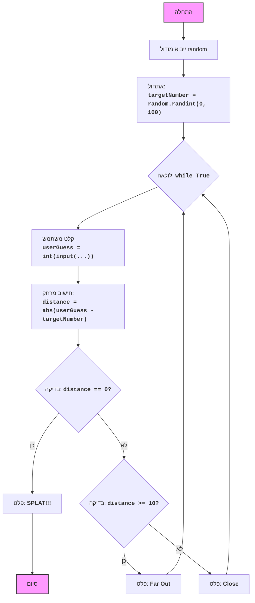

## ניתוח קוד: משחק SPLAT

### 1. <algorithm>

1. **התחלה**:
   - המשחק מתחיל בייבוא הספרייה `random`.
   - דוגמה: `import random`

2. **אתחול**:
   - המחשב בוחר באופן אקראי מספר שלם בין 0 ל-100 (כולל) ושומר אותו במשתנה `targetNumber`. זהו המיקום הסודי שאותו השחקן צריך לנחש.
   - דוגמה: `targetNumber = random.randint(0, 100)` (לדוגמה, `targetNumber` יהיה 42).

3. **לולאה ראשית**:
   - מתחיל לולאה אין-סופית (`while True`) שרצה עד שהשחקן מנצח.

4. **קלט משתמש**:
   - השחקן מתבקש להזין ניחוש (מספר שלם בין 0 ל-100).
   - הקלט נקלט כטקסט ואז מומר למספר שלם ושומר אותו במשתנה `userGuess`.
   - דוגמה: המשתמש מזין "50", אז `userGuess` יהיה 50.
   - לוכד שגיאות עבור קלט לא תקין.

5. **חישוב מרחק**:
   - מחשב את הערך המוחלט של ההפרש בין ניחוש השחקן (`userGuess`) למיקום הסודי (`targetNumber`) ושומר את התוצאה במשתנה `distance`.
   - דוגמה: אם `targetNumber` הוא 42 ו-`userGuess` הוא 50, אז `distance` יהיה `abs(50 - 42) = 8`.

6. **בדיקת ניצחון**:
   - בודק אם `distance` שווה ל-0.
     - אם כן, מדפיס "SPLAT!!!" ומסיים את הלולאה (המשחק נגמר).
     - אם לא, ממשיך לשלב הבא.
   - דוגמה: אם `distance` הוא 0, המשחק מסתיים.

7. **בדיקת מרחק רחוק**:
   - אם המרחק (`distance`) גדול או שווה ל-10, מדפיס "Far Out".
   - דוגמה: אם `distance` הוא 15, מדפיס "Far Out".

8. **בדיקת מרחק קרוב**:
   - אם המרחק (`distance`) קטן מ-10, מדפיס "Close".
   - דוגמה: אם `distance` הוא 5, מדפיס "Close".

9. **חזרה ללולאה**:
   - חוזר לשלב 3 (לולאה ראשית) ומבקש מהמשתמש ניחוש חדש.

### 2. <mermaid>

 
#### הסבר על התרשים:
*   **flowchart TD**: מציין שאנו משתמשים בתרשים זרימה מלמעלה למטה.
*   **Start**: מציין את תחילת התוכנית.
*   **ImportRandom**: מייצג את ייבוא המודול random, הנדרש ליצירת המספר האקראי.
*   **InitializeTarget**: מייצג אתחול משתנה `targetNumber` עם מספר אקראי בין 0 ל-100.
*   **LoopStart**: מציין את תחילת לולאת המשחק האינסופית.
*   **InputGuess**: מייצג קבלת קלט מהמשתמש (ניחוש) והמרתו למספר שלם (`userGuess`).
*   **CalculateDistance**: מייצג חישוב המרחק בין הניחוש למספר המטרה (`distance`).
*   **CheckSplat**: מייצג בדיקה האם `distance` שווה ל-0 (ניצחון).
*   **OutputSplat**: מייצג את הפלט "SPLAT!!!" במקרה של ניצחון והסיום.
*   **End**: מייצג את סיום התוכנית.
*   **CheckFarOut**: מייצג בדיקה האם `distance` גדול או שווה ל-10.
*   **OutputFarOut**: מייצג את הפלט "Far Out" אם המרחק גדול או שווה ל-10.
*   **OutputClose**: מייצג את הפלט "Close" אם המרחק קטן מ-10.
*    **classDef varfill**: סוג עיצוב שצבע רקע משתנה של קצוות התרשים.
*   **class Start,End varfill**: מציין שהסוג `varfill` ישמש לקצוות הדיאגרמה.
*   החצים מציינים את זרימת הביצוע של התוכנית.

### 3. <explanation>

*   **ייבוא (Imports):**
    *   `import random`: מייבא את מודול `random` של פייתון, שמאפשר לייצר מספרים פסאודו-אקראיים. הוא הכרחי למימוש המשחק כדי ליצור את המספר הסודי.
*   **משתנים (Variables):**
    *   `targetNumber` (int): משתנה שלם שמחזיק את המספר האקראי שנוצר על ידי המחשב (המקום הסודי של ה"טיפה"). הוא מאותחל פעם אחת בתחילת המשחק.
    *   `userGuess` (int): משתנה שלם שמחזיק את הניחוש של השחקן. הוא משתנה בכל איטרציה של הלולאה.
    *   `distance` (int): משתנה שלם שמחזיק את הערך המוחלט של המרחק בין הניחוש של השחקן למספר הסודי. הוא מחושב בכל איטרציה של הלולאה.
*   **פונקציות (Functions):**
    *   `random.randint(0, 100)`: פונקציה מהמודול `random` שמייצרת מספר שלם אקראי בין 0 ל-100 (כולל). היא משמשת לאתחול המשתנה `targetNumber`.
    *   `abs(x)`: פונקציה מובנית בפייתון שמחזירה את הערך המוחלט של המספר `x`. משמשת לחישוב המרחק בין הניחוש למספר הסודי.
    *   `input("...")`: פונקציה מובנית בפייתון שמציגה הודעה למשתמש ומחכה לקלט מהמשתמש. הקלט מוחזר כטקסט.
    *   `int(x)`: פונקציה מובנית בפייתון שממירה את המחרוזת `x` למספר שלם.
    *   `print("...")`: פונקציה מובנית בפייתון שמדפיסה את המחרוזת המצוינת לפלט.
*   **בעיות אפשריות ושיפורים:**
    *   **קלט לא תקין**: הקוד מטפל רק במקרה של קלט שאינו מספר שלם. ניתן להוסיף טיפול נוסף כדי למנוע קריסות אם השחקן מזין טווח לא הגיוני.
    *   **הודעות משחק**: ניתן לשפר את הודעות המשחק כדי להפוך אותן לידידותיות יותר.
    *   **משחקיות**: ניתן להוסיף יותר פיצ'רים כדי להפוך את המשחק למעניין יותר, כגון הגבלת מספר הניסיונות או מתן רמזים.
    *   **העברת קוד לפונקציות**: ניתן לפצל את הקוד לפונקציות קטנות יותר להקלה על הבנה ושימוש חוזר.

*   **שרשרת קשרים עם חלקים אחרים בפרויקט:**
    *   אין קשרים ישירים עם חלקים אחרים בפרויקט בהתבסס על קטע הקוד שסופק. הקוד מהווה משחק עצמאי.