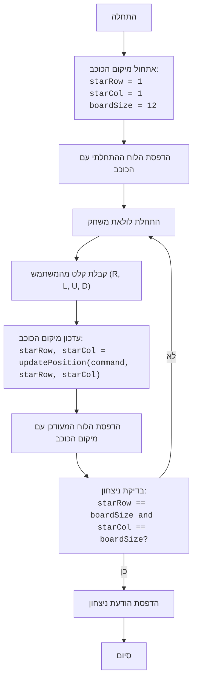

## ניתוח קוד: משחק הכוכבים

### <algorithm>

1. **אתחול**:
   - הגדר את מיקום הכוכב ההתחלתי בפינה השמאלית העליונה של הלוח (row=1, col=1).
   - הגדר את גודל הלוח ל-12x12.
   - דוגמה: `starRow = 1`, `starCol = 1`, `boardSize = 12`

2. **הדפסת הלוח הראשוני**:
   - קרא לפונקציה `printBoard` כדי להציג את לוח המשחק עם הכוכב במיקומו ההתחלתי.
   - דוגמה: אם המשתנים הם `starRow = 1`, `starCol = 1`, הפלט יהיה לוח עם כוכב בפינה השמאלית העליונה.

3. **לולאה ראשית**:
   - התחל לולאה אינסופית שתמשיך עד שהמשחק יסתיים.

4. **קבלת קלט מהמשתמש**:
   - בקש מהמשתמש להזין פקודת תזוזה (R, L, U, D) והפוך את הקלט לאותיות גדולות.
   - דוגמה: אם המשתמש מזין "r", הקלט יהפוך ל-"R".

5. **עדכון מיקום הכוכב**:
   - קרא לפונקציה `updatePosition` עם פקודת התזוזה הנוכחית ומיקום הכוכב הנוכחי כדי לקבל את מיקום הכוכב החדש.
   - דוגמה: אם הפקודה היא "R", והמיקום הנוכחי הוא (1,1), המיקום החדש יהיה (1,2).

6. **הדפסת הלוח המעודכן**:
   - קרא לפונקציה `printBoard` כדי להציג את הלוח עם מיקום הכוכב החדש.

7. **בדיקת ניצחון**:
   - בדוק אם מיקום הכוכב הנוכחי הוא בפינה הימנית התחתונה של הלוח (row=12, col=12).
   - אם כן, הדפס הודעת ניצחון וצא מהלולאה.
   - אם לא, חזור ללולאה הראשית (שלב 3).

8. **סיום המשחק**:
   - המשחק מסתיים כאשר השחקן הגיע לפינה הימנית התחתונה.

### <mermaid>

### <explanation>

**ייבואים (Imports)**:

*   אין ייבוא בסקריפט זה. כל הפונקציות והמשתנים מוגדרים באופן מקומי.

**מחלקות (Classes)**:

*   אין מחלקות בקוד זה.

**פונקציות (Functions)**:

*   **`printBoard(starRow, starCol)`**:
    *   **פרמטרים**:
        *   `starRow` (int): השורה בה ממוקם הכוכב.
        *   `starCol` (int): העמודה בה ממוקם הכוכב.
    *   **ערך מוחזר**: אין.
    *   **מטרה**: להדפיס את לוח המשחק עם הכוכב במיקומו הנוכחי. לוח המשחק מורכב מתווים `.` עבור משבצות ריקות ו`*` עבור מיקום הכוכב.
    *   **דוגמה**: אם `starRow = 2`, `starCol = 3`, לוח המשחק יציג כוכב בשורה 2 ועמודה 3.

*   **`updatePosition(command, starRow, starCol)`**:
    *   **פרמטרים**:
        *   `command` (str): פקודת התזוזה (`R`, `L`, `U`, `D`).
        *   `starRow` (int): השורה הנוכחית של הכוכב.
        *   `starCol` (int): העמודה הנוכחית של הכוכב.
    *   **ערך מוחזר**: `tuple (int, int)`: השורה והעמודה החדשות של הכוכב.
    *   **מטרה**: לעדכן את מיקום הכוכב על סמך הפקודה שניתנה. הפונקציה מוודאת שהכוכב לא יזוז מחוץ לגבולות הלוח.
    *   **דוגמה**:
        *   אם `command = 'R'`, `starRow = 1`, `starCol = 1`, התוצאה תהיה `(1, 2)`.
        *   אם `command = 'L'`, `starRow = 1`, `starCol = 1`, התוצאה תהיה `(1, 1)` (כי אין אפשרות לזוז שמאלה).

**משתנים (Variables)**:

*   **`starRow` (int)**: שומר את השורה הנוכחית של הכוכב. מאותחל ל-1.
*   **`starCol` (int)**: שומר את העמודה הנוכחית של הכוכב. מאותחל ל-1.
*   **`boardSize` (int)**: שומר את גודל הלוח. מוגדר ל-12.
*   **`command` (str)**: שומר את הקלט מהמשתמש (פקודת התזוזה).

**בעיות אפשריות ותחומים לשיפור**:

*   **קלט שגוי**: הקוד אינו מטפל במקרה בו המשתמש מזין קלט שאינו אחד מהפקודות המותרות (R, L, U, D). ניתן להוסיף בדיקה של הקלט ולבקש מהמשתמש להזין קלט תקין במידה והקלט אינו תקין.
*   **הודעה מפורטת**: הודעת הניצחון פשוטה יחסית. ניתן לשפר אותה ולהוסיף אפקטים חזותיים קטנים כדי לשפר את חווית המשתמש.
*   **הצגה גרפית**: המשחק כרגע מוצג כטקסט בלבד. ניתן להוסיף גרפיקה פשוטה כדי להפוך אותו ליותר ויזואלי ומושך.

**שרשרת קשרים עם חלקים אחרים בפרויקט**:
*   אין קשר ישיר עם חלקים אחרים בפרויקט מכיוון שזהו משחק עצמאי. עם זאת, ניתן לשלב אותו בהמשך במערכת משחקים גדולה יותר כחלק ממשחק קטן.